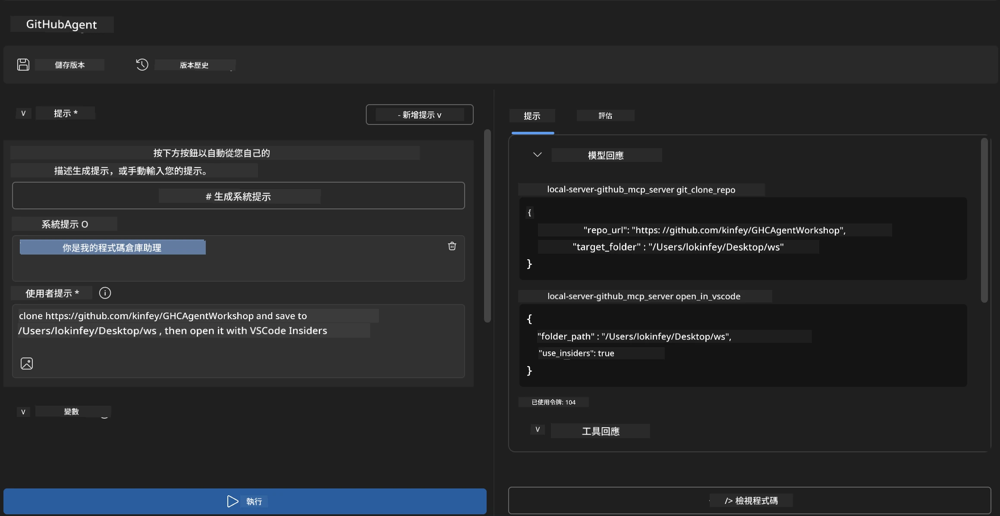
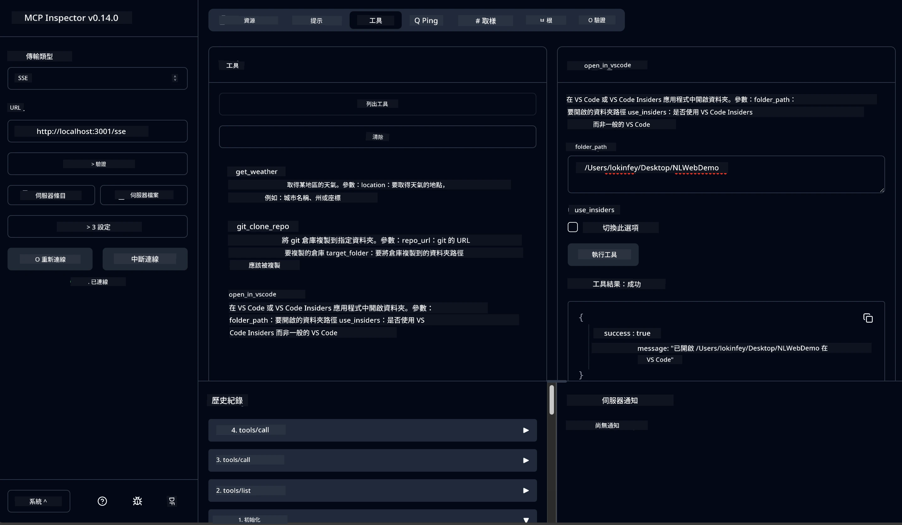

# 🐙 模組 4：實踐 MCP 開發 - 自訂 GitHub 複製伺服器


> **⚡ 快速開始：** 在短短 30 分鐘內，建置一個生產-ready MCP 伺服器，自動化 GitHub 儲存庫的複製及 VS Code 整合！

## 🎯 學習目標

完成此實驗後，您將能夠：

- ✅ 建立適用於真實開發流程的自訂 MCP 伺服器
- ✅ 透過 MCP 實作 GitHub 儲存庫的複製功能
- ✅ 將自訂 MCP 伺服器與 VS Code 及 Agent Builder 整合
- ✅ 在自訂 MCP 工具中使用 GitHub Copilot Agent 模式
- ✅ 在生產環境中測試與部署自訂 MCP 伺服器

## 📋 預備知識

- 完成實驗 1-3（MCP 基礎與進階開發）
- GitHub Copilot 訂閱（[可免費註冊](https://github.com/github-copilot/signup)）
- 安裝有 Microsoft Foundry Toolkit 和 GitHub Copilot 擴充功能的 VS Code
- 安裝並配置 Git CLI

## 🏗️ 專案概覽

### <strong>真實世界開發挑戰</strong>
作為開發人員，我們經常使用 GitHub 來複製儲存庫並在 VS Code 或 VS Code Insiders 打開。這個手動過程包含：
1. 開啟終端機 / 命令提示字元
2. 移動到目標目錄
3. 執行 `git clone` 指令
4. 在複製的目錄中開啟 VS Code

**我們的 MCP 解決方案將這流程簡化為一條智慧指令！**

### <strong>您將建置的內容</strong>
一個 **GitHub 複製 MCP 伺服器** (`git_mcp_server`)，提供：

| 功能 | 說明 | 好處 |
|---------|-------------|---------|
| 🔄 <strong>智慧型儲存庫複製</strong> | 驗證後複製 GitHub 儲存庫 | 自動錯誤檢查 |
| 📁 <strong>智慧目錄管理</strong> | 安全檢查並建立目錄 | 防止覆寫 |
| 🚀 **跨平台 VS Code 整合** | 在 VS Code/Insiders 開啟專案 | 流程無縫銜接 |
| 🛡️ <strong>強健錯誤處理</strong> | 處理網路、權限與路徑問題 | 生產環境可靠性 |

---

## 📖 實作步驟詳解

### 步驟 1：在 Agent Builder 建立 GitHub Agent

1. **透過 Microsoft Foundry Toolkit 擴充功能啟動 Agent Builder**
2. **以以下設定建立新 agent：**
   ```
   Agent Name: GitHubAgent
   ```

3. **初始化自訂 MCP 伺服器：**
   - 導覽至 **工具 → 新增工具 → MCP 伺服器**
   - 選擇 **“建立新 MCP 伺服器”**
   - 選擇 **Python 範本** 以獲得最大彈性
   - **伺服器名稱：** `git_mcp_server`

### 步驟 2：設定 GitHub Copilot Agent 模式

1. **在 VS Code 開啟 GitHub Copilot（Ctrl/Cmd + Shift + P → “GitHub Copilot: Open”）**
2. **於 Copilot 介面中選擇 Agent 模型**
3. **挑選 Claude 3.7 模型以增強推理能力**
4. **啟用 MCP 整合以使用工具**

> **💡 專家提示：** Claude 3.7 對開發流程與錯誤處理模式有卓越理解能力。

### 步驟 3：實作 MCP 伺服器核心功能

**請使用以下詳細提示搭配 GitHub Copilot Agent 模式：**

```
Create two MCP tools with the following comprehensive requirements:

🔧 TOOL A: clone_repository
Requirements:
- Clone any GitHub repository to a specified local folder
- Return the absolute path of the successfully cloned project
- Implement comprehensive validation:
  ✓ Check if target directory already exists (return error if exists)
  ✓ Validate GitHub URL format (https://github.com/user/repo)
  ✓ Verify git command availability (prompt installation if missing)
  ✓ Handle network connectivity issues
  ✓ Provide clear error messages for all failure scenarios

🚀 TOOL B: open_in_vscode
Requirements:
- Open specified folder in VS Code or VS Code Insiders
- Cross-platform compatibility (Windows/Linux/macOS)
- Use direct application launch (not terminal commands)
- Auto-detect available VS Code installations
- Handle cases where VS Code is not installed
- Provide user-friendly error messages

Additional Requirements:
- Follow MCP 1.9.3 best practices
- Include proper type hints and documentation
- Implement logging for debugging purposes
- Add input validation for all parameters
- Include comprehensive error handling
```

### 步驟 4：測試您的 MCP 伺服器

#### 4a. 在 Agent Builder 中測試

1. **啟動 Agent Builder 的偵錯設定**
2. **使用以下系統提示設定您的 agent：**

```
SYSTEM_PROMPT:
You are my intelligent coding repository assistant. You help developers efficiently clone GitHub repositories and set up their development environment. Always provide clear feedback about operations and handle errors gracefully.
```

3. **以真實用戶場景進行測試：**

```
USER_PROMPT EXAMPLES:

Scenario : Basic Clone and Open
"Clone {Your GitHub Repo link such as https://github.com/kinfey/GHCAgentWorkshop
 } and save to {The global path you specify}, then open it with VS Code Insiders"
```



**預期結果：**
- ✅ 成功複製並回報路徑
- ✅ 自動啟動 VS Code
- ✅ 無效場景顯示清楚錯誤資訊
- ✅ 正確處理邊緣狀況

#### 4b. 在 MCP Inspector 測試




---


**🎉 恭喜！** 您已成功建置出實用且具生產準備度的 MCP 伺服器，解決了真實開發流程中的挑戰。您的自訂 GitHub 複製伺服器展示了 MCP 在自動化與提升開發者生產力的強大能力。

### 🏆 成就解鎖：
- ✅ **MCP 開發者** - 建立自訂 MCP 伺服器
- ✅ <strong>流程自動化專家</strong> - 流程優化
- ✅ <strong>整合高手</strong> - 連接多種開發工具
- ✅ <strong>生產準備</strong> - 建置可部署解決方案

---

## 🎓 實驗課程完成：您的 Model Context Protocol 之旅

**親愛的實驗課程學員，**

恭喜您完成 Model Context Protocol 實驗課程的全部四個模組！從理解 Microsoft Foundry Toolkit 基本概念，到建立能解決真實開發挑戰的生產-ready MCP 伺服器，您一路走來相當紮實。

### 🚀 您的學習路徑回顧：

**[模組 1](../lab1/README.md)**：您開始探索 Microsoft Foundry Toolkit 的基礎、模型測試與建立首個 AI agent。

**[模組 2](../lab2/README.md)**：您學習了 MCP 架構，整合 Playwright MCP，並建立首個瀏覽器自動化 agent。

**[模組 3](../lab3/README.md)**：您進階至自訂 MCP 伺服器開發，打造氣象 MCP 伺服器並掌握偵錯工具。

**[模組 4](../lab4/README.md)**：您將所學運用於建置實務的 GitHub 儲存庫流程自動化工具。

### 🌟 您的精通技能：

- ✅ **Microsoft Foundry Toolkit 生態系統**：模型、agent 與整合範例
- ✅ **MCP 架構**：客戶端-伺服器設計、傳輸協定與安全性
- ✅ <strong>開發者工具</strong>：從 Playground、Inspector 到生產部署
- ✅ <strong>自訂開發</strong>：建置、測試與部署自主的 MCP 伺服器
- ✅ <strong>實務應用</strong>：利用 AI 解決真實工作流程挑戰

### 🔮 您的下一步：

1. **建立您自己的 MCP 伺服器**：應用這些技術自動化您的獨特流程
2. **加入 MCP 社群**：分享您的作品並向他人學習
3. <strong>探索進階整合</strong>：將 MCP 伺服器連接至企業系統
4. <strong>參與開源貢獻</strong>：協助完善 MCP 工具與文件

別忘了，這個實驗課程只是起點。Model Context Protocol 生態系統正迅速演進，您已具備站在 AI 驅動開發工具前沿的能力。

**感謝您的參與與學習熱忱！**

希望這次體驗能激發您未來打造與互動 AI 工具的更多靈感。

**祝編碼愉快！**

---

## 接下來的步驟

恭喜您完成模組 10 的所有實驗！

- 返回：[模組 10 總覽](../README.md)
- 繼續前往：[模組 11：MCP 伺服器動手實驗](../../11-MCPServerHandsOnLabs/README.md)

---

<!-- CO-OP TRANSLATOR DISCLAIMER START -->
**免責聲明**：
本文件由 AI 翻譯服務 [Co-op Translator](https://github.com/Azure/co-op-translator) 翻譯而成。雖然我們致力於確保準確性，但請注意，機器自動翻譯可能包含錯誤或不準確之處。原始文件的母語版本應被視為權威來源。對於重要資訊，建議進行專業人工翻譯。我們不對因使用本翻譯而產生的任何誤解或誤釋承擔責任。
<!-- CO-OP TRANSLATOR DISCLAIMER END -->