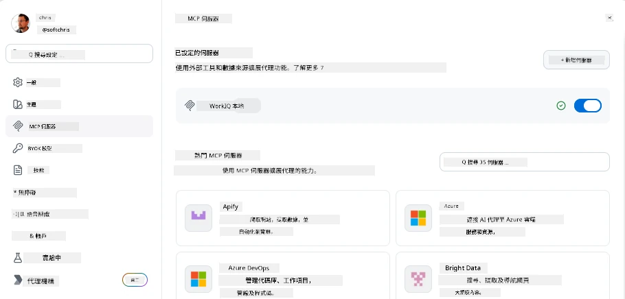
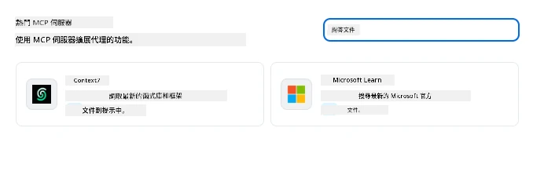
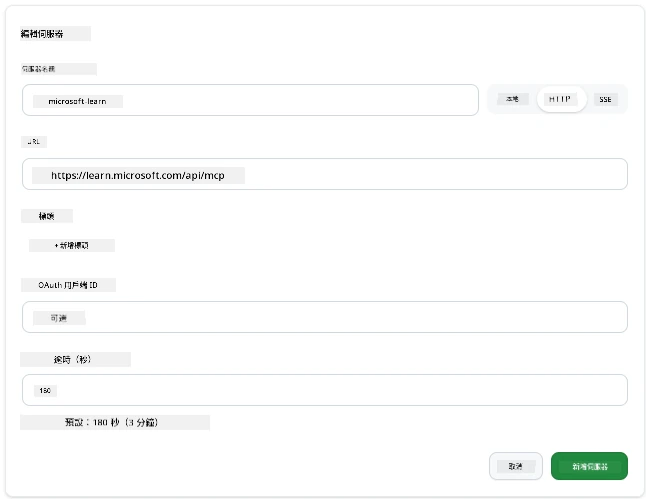
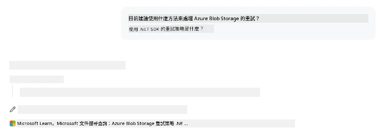
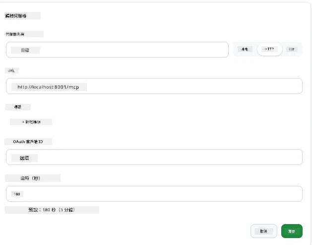
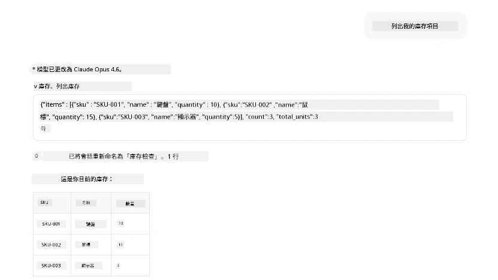
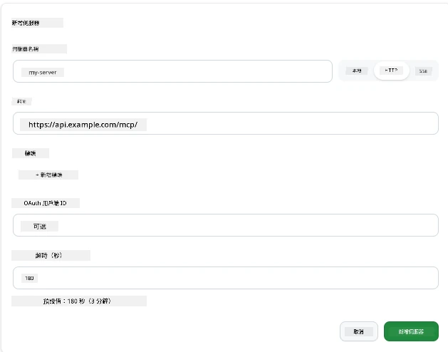
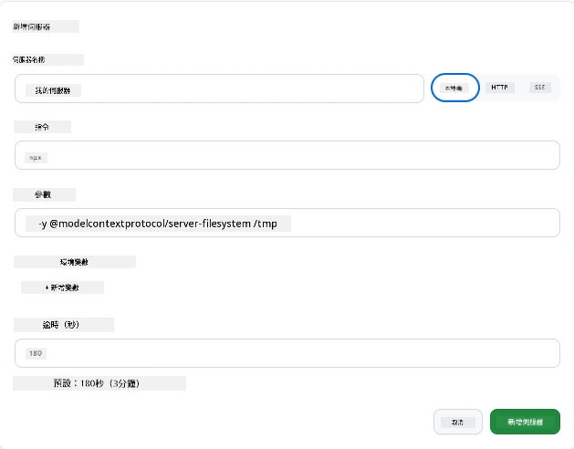

# 在 GitHub Copilot App 使用 MCP 伺服器

你現在已經了解 MCP 的運作方式。你已建構伺服器、定義工具和資源，並連接客戶端。我們還未嘗試換個角度：你是 AI 驅動應用程式的用戶，支援 MCP 的應用程式中 <em>使用</em> MCP 會是什麼樣子？

[GitHub Copilot App](https://github.com/github/app) 是一個桌面應用程式，可以使用 MCP 伺服器。透過連接 MCP 伺服器，你就能解鎖一個新層次：Copilot 現在可以存取你的文件、呼叫你的內部 API、查詢你的資料庫，或與你包裝成伺服器的任意服務通訊。這個應用程式成為主機；你的 MCP 伺服器成為它的工具。

本課程將帶你體驗這整個過程——從找到 MCP 設定面板，到連接真實的文件伺服器，然後再自行連接一個自訂伺服器。

## 學習目標

課程結束時，你將能夠：

- 在 Copilot App 設定中找到並使用 MCP 伺服器面板。
- 連接托管的文件伺服器並在會話中使用它。
- 註冊自訂伺服器並驗證 Copilot 可以調用其工具。
- 透過提供環境變數或自訂標頭（如果是 HTTP 方式）配置伺服器的呼叫方式。

## Copilot App 作為 MCP 主機

核心理念是：**Copilot 的代理很聰明，但它們只知道你告訴它們的事情。** 預設下，代理可以讀取工作區的檔案與執行終端機指令，但它無法查詢你的資料庫、瀏覽你的行事曆，或呼叫自訂 API，除非有協助。MCP 伺服器就是這個協助的橋樑，它們連結 Copilot 與你的系統——資料庫、版本控制、API、設計工具——讓代理取得完成工作的資訊與行動能力。

我們先從找到設定來管理你應用程式的 MCP 伺服器開始。

## 步驟 1：找到 MCP 設定面板

打開 Copilot App，找到左下角的齒輪圖示並點擊。


確定你選取了「MCP Servers」，你就會看到上方列出已配置的伺服器，下方是熱門伺服器市場，以及上方的「Add Server」按鈕，如下所示：



這是你的控制中心。可以在這新增、移除、啟用或停用伺服器。更改會在新的會話生效；如果已有會話開啟，變更此列表後需重新開啟新會話。

## 步驟 2：連接文件伺服器

讓我們立即做些有用的事。Microsoft Docs MCP 伺服器可讓 Copilot 存取官方 Microsoft 文件，包括 Azure、.NET、TypeScript 等。代理不用仰賴其截止訓練資料，而是在查詢時拉取最新文件。

新增方法：

1. 在熱門伺服器網格中，輸入 **learn**，然後選擇名為「Microsoft Learn」的伺服器。

   

   點擊後會顯示一個表單，名稱、傳輸類型和 URL 已預填，點擊「Add Server」即可。

2. 點擊「Add Server」，連線伺服器需數秒鐘。

   

   新增後，會在上方顯示為已配置伺服器。接下來試用看看。

3. 關閉對話框，選擇快速聊天（Quick chat）。

4. 輸入以下提示，觸發 Microsoft Learn 伺服器的工具。

   ```text
   What's the current recommended approach for handling Azure Blob Storage 
   retries using the .NET SDK?
   ```

   

你應該會看到它引用了剛加入的 MCP 伺服器。

## 步驟 3：連接自訂 stdio 伺服器

預設伺服器方便，但真正強大的是連接自己的伺服器。假設你建立了或拿到一個伺服器，提供你的內部 API 或公司知識庫。在這個例子，我們會使用一個處理公司庫存管理的 MCP 伺服器。

1. 點擊齒輪，再次選擇「MCP servers」。

2. 點「Add Server」並選擇「+ Add Custom server」，填入以下內容：

   - 名稱：`Inventory Server`
   - 右側選擇傳輸類型：**http**

   選「Add Server」，它會出現在配置的伺服器清單中。

   

4. 測試用提示文字如下：

    ```
    list inventory
    ```

   

   此時會看到你的自訂伺服器回傳的庫存項目清單。

太棒了，你現在應該對於在 Copilot App 中新增外部及自訂 MCP 伺服器已有相當理解。接著談談如何處理秘密與環境變數。

## 步驟 4：進階設定

到目前為止，你已見識如何只提供名稱和 URL 來新增 MCP 伺服器。但如果伺服器需要 API 金鑰或其他資訊怎麼辦？根據傳輸方式，我們可以提供所需的東西。

- **http 或 SSE 傳輸**：可設定標頭。

   身份驗證可透過指定 Authorization 標頭，值可以是靜態字串。如果使用 OAuth，也可以提供 OAuth 用戶端 ID。

   

- **stdio 傳輸**：可設定環境變數。

   你可以設定任意數量的環境變數，這些會在啟動伺服器時傳給它。

   

## 總結

Copilot App 將 MCP 伺服器視為代理能力的第一級擴充。本課程帶你完整體驗從新增 MCP 伺服器到在會話中使用它們。你現在可連接公共伺服器、內部 API 和自訂工具，讓代理具備取得必要資訊和行動以自主完成任務的能力。

## 📚 額外資源

### 官方文件

- [GitHub Copilot App](https://github.com/github/app)
- [MCP Specification](https://modelcontextprotocol.io/specification/2025-03-26) - Model Context Protocol 規範

### 社群
- [MCP Community Discord](https://discord.com/invite/ByRwuEEgH4) - 即時討論
- [GitHub Discussions](https://github.com/microsoft/MCP-Server-and-PostgreSQL-Sample-Retail/discussions) - 問答與分享
- [Stack Overflow](https://stackoverflow.com/questions/tagged/model-context-protocol) - 技術問題

---

<!-- CO-OP TRANSLATOR DISCLAIMER START -->
**免責聲明**：
本文件由 AI 翻譯服務 [Co-op Translator](https://github.com/Azure/co-op-translator) 翻譯而成。雖然我們致力於確保準確性，但請注意，機器自動翻譯可能包含錯誤或不準確之處。原始文件的母語版本應被視為權威來源。對於重要資訊，建議進行專業人工翻譯。我們不對因使用本翻譯而產生的任何誤解或誤釋承擔責任。
<!-- CO-OP TRANSLATOR DISCLAIMER END -->