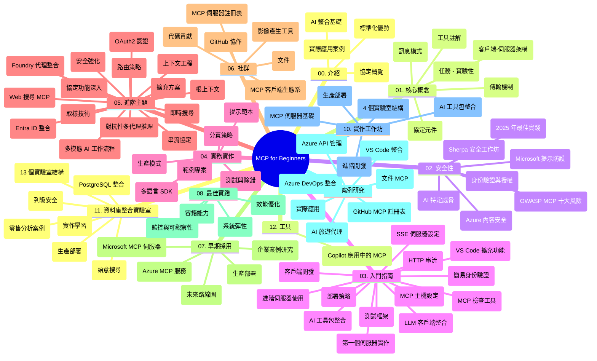

# Model Context Protocol (MCP) 入門指南 - 學習指南

本學習指南提供「Model Context Protocol (MCP) 入門」課程的倉庫結構和內容概覽。請使用本指南有效地瀏覽倉庫並充分利用可用資源。

## 倉庫概覽

Model Context Protocol (MCP) 是 AI 模型與客戶端應用程式間互動的標準化框架。最初由 Anthropic 創建，現由更廣泛的 MCP 社群透過官方 GitHub 組織維護。本倉庫提供包括 C#、Java、JavaScript、Python 和 TypeScript 的實作範例課程，適合 AI 開發者、系統架構師和軟件工程師。

## 視覺課程地圖

## 倉庫結構

本倉庫分為十二個主要部分，分別聚焦於 MCP 的不同面向：

1. **介紹 (00-Introduction/)**
   - Model Context Protocol 概述
   - AI 流程中標準化的重要性
   - 實際應用案例與優勢

2. **核心概念 (01-CoreConcepts/)**
   - 客戶端-伺服器架構
   - 協議主要組件
   - MCP 中的訊息模式

3. **安全性 (02-Security/)**
   - MCP 系統中的安全威脅
   - 實作安全的最佳實踐
   - 認證與授權策略
   - <strong>全面安全文件</strong>：
     - MCP 2025 年安全最佳實踐
     - Azure 內容安全實作指南
     - MCP 安全控制與技術
     - MCP 最佳實踐速查表
   - <strong>關鍵安全議題</strong>：
     - 提示注入與工具中毒攻擊
     - 會話劫持與代理困惑問題
     - 令牌透傳漏洞
     - 過度權限與存取控制
     - AI 組件的供應鏈安全
     - Microsoft Prompt Shields 整合

4. **快速入門 (03-GettingStarted/)**
   - 環境設定與配置
   - 創建基本 MCP 伺服器與客戶端
   - 與現有應用整合
   - 包含以下主題：
     - 首個伺服器實作
     - 客戶端開發
     - LLM 客戶端整合
     - VS Code 整合
     - 服務器推送事件 (SSE) 伺服器
     - 進階伺服器用法
     - HTTP 串流
     - AI 工具箱整合
     - 測試策略
     - 部署指南

5. **實務實作 (04-PracticalImplementation/)**
   - 跨多語言 SDK 使用
   - 除錯、測試與驗證技術
   - 製作可重用的提示範本與工作流
   - 範例實作專案

6. **進階主題 (05-AdvancedTopics/)**
   - 上下文工程技術
   - Foundry 代理整合
   - 多模態 AI 工作流
   - OAuth2 認證示範
   - 即時搜尋功能
   - 即時串流
   - Root Contexts 實作
   - 路由策略
   - 抽樣技術
   - 擴展方法
   - 安全考量
   - Entra ID 安全整合
   - 網頁搜尋整合
   - 對抗性多代理推理（辯論模式）

7. **社群貢獻 (06-CommunityContributions/)**
   - 如何貢獻程式碼與文件
   - 透過 GitHub 合作
   - 社群驅動的改進與反饋
   - 使用多種 MCP 客戶端（Claude Desktop、Cline、VSCode）
   - 使用熱門 MCP 伺服器及圖像生成功能

8. **早期採用經驗 (07-LessonsfromEarlyAdoption/)**
   - 實務案例與成功故事
   - 建構與部署 MCP 解決方案
   - 趨勢與未來路線圖
   - **微軟 MCP 伺服器指南**：全面介紹 10 個生產就緒的微軟 MCP 伺服器，包括：
     - Microsoft Learn Docs MCP 伺服器
     - Azure MCP 伺服器（超過 15 種專用連接器）
     - GitHub MCP 伺服器
     - Azure DevOps MCP 伺服器
     - MarkItDown MCP 伺服器
     - SQL Server MCP 伺服器
     - Playwright MCP 伺服器
     - Dev Box MCP 伺服器
     - Microsoft Foundry MCP 伺服器
     - Microsoft 365 Agents Toolkit MCP 伺服器

9. **最佳實務 (08-BestPractices/)**
   - 效能調校與優化
   - 設計容錯 MCP 系統
   - 測試與韌性策略

10. **案例研究 (09-CaseStudy/)**
    - <strong>七個完整案例研究</strong>示範 MCP 在多樣場景的靈活性：
    - **Azure AI 旅遊代理**：多代理協作使用 Azure OpenAI 與 AI 搜尋
    - **Azure DevOps 整合**：利用 YouTube 資料更新自動化工作流
    - <strong>即時文件擷取</strong>：Python 控制台客戶端搭配串流 HTTP
    - <strong>互動學習計劃生成器</strong>：Chainlit 網頁應用與會話式 AI
    - <strong>編輯器內文件</strong>：VS Code 整合 GitHub Copilot 工作流
    - **Azure API 管理**：企業 API 整合與 MCP 伺服器建置
    - **GitHub MCP 註冊表**：生態系統開發與代理整合平台
    - 覆蓋企業整合、開發者效率與生態系統開發的實作範例

11. **實作工作坊 (10-StreamliningAIWorkflowsBuildingAnMCPServerWithAIToolkit/)**
    - 結合 MCP 與 AI 工具包的實作工作坊
    - 構建結合 AI 模型與實際工具的智慧應用
    - 實務模塊涵蓋基礎、客製伺服器開發及生產部署策略
    - <strong>實驗室結構</strong>：
      - Lab 1：MCP 伺服器基礎
      - Lab 2：進階 MCP 伺服器開發
      - Lab 3：AI 工具包整合
      - Lab 4：生產部署與擴展
    - 實驗室學習方式，逐步指導

12. **MCP 伺服器資料庫整合實驗室 (11-MCPServerHandsOnLabs/)**
    - **全面 13 個實驗室學習路徑**，建構生產級 MCP 伺服器並整合 PostgreSQL
    - <strong>實務零售分析應用</strong>：使用 Zava Retail 案例
    - <strong>企業級模式</strong>：行級安全（RLS）、語義搜尋及多租戶資料存取
    - <strong>完整實驗室結構</strong>：
      - **Lab 00-03：基礎** - 介紹、架構、安全、環境設定
      - **Lab 04-06：建構 MCP 伺服器** - 資料庫設計、MCP 伺服器實作、工具開發
      - **Lab 07-09：進階功能** - 語義搜尋、測試與除錯、VS Code 整合
      - **Lab 10-12：生產與最佳實務** - 部署、監控、優化
    - <strong>涵蓋技術</strong>：FastMCP 框架、PostgreSQL、Azure OpenAI、Azure Container Apps、Application Insights
    - <strong>學習成果</strong>：生產可用 MCP 伺服器、資料庫整合模式、AI 驅動分析、企業安全

13. **工具 (12-tooling/)**
    - 學習如何在 Copilot 應用和其他工具中使用 MCP

## 附加資源

本倉庫包含支援資源：

- <strong>圖片資料夾</strong>：課程中使用的圖表與示意圖
- <strong>翻譯</strong>：文件的多語言與自動翻譯支持
- **官方 MCP 資源**：
  - [MCP 文件](https://modelcontextprotocol.io/)
  - [MCP 規範](https://spec.modelcontextprotocol.io/)
  - [MCP GitHub 倉庫](https://github.com/modelcontextprotocol)

## 如何使用本倉庫

1. <strong>依序學習</strong>：按照章節順序（00 至 11）進行結構化學習。
2. <strong>語言專攻</strong>：如對特定編程語言感興趣，探索對應語言的範例資料夾。
3. <strong>實務起步</strong>：先從「快速入門」開始，建立環境並製作第一個 MCP 伺服器與客戶端。
4. <strong>進階探索</strong>：熟悉基礎後，深入研究進階主題擴展知識。
5. <strong>社群互動</strong>：加入 MCP GitHub 討論及 Discord 頻道，與專家及開發者交流。

## MCP 客戶端與工具

課程囊括多種 MCP 客戶端與工具：

1. <strong>官方客戶端</strong>：
   - Visual Studio Code
   - MCP Visual Studio Code 擴充套件
   - Claude Desktop
   - Claude VSCode 外掛
   - Claude API

2. <strong>社群客戶端</strong>：
   - Cline（終端機版）
   - Cursor（程式碼編輯器）
   - ChatMCP
   - Windsurf

3. **MCP 管理工具**：
   - MCP CLI
   - MCP Manager
   - MCP Linker
   - MCP Router

## 熱門 MCP 伺服器

本倉庫介紹多款 MCP 伺服器，包括：

1. **微軟官方 MCP 伺服器**：
   - Microsoft Learn Docs MCP 伺服器
   - Azure MCP 伺服器（超過 15 種專用連接器）
   - GitHub MCP 伺服器
   - Azure DevOps MCP 伺服器
   - MarkItDown MCP 伺服器
   - SQL Server MCP 伺服器
   - Playwright MCP 伺服器
   - Dev Box MCP 伺服器
   - Microsoft Foundry MCP 伺服器
   - Microsoft 365 Agents Toolkit MCP 伺服器

2. <strong>官方參考伺服器</strong>：
   - 文件系統
   - Fetch
   - 記憶體
   - 順序思考

3. <strong>圖像生成</strong>：
   - Azure OpenAI DALL-E 3
   - Stable Diffusion WebUI
   - Replicate

4. <strong>開發工具</strong>：
   - Git MCP
   - 終端機控制
   - 程式碼助理

5. <strong>專用伺服器</strong>：
   - Salesforce
   - Microsoft Teams
   - Jira 與 Confluence

## 貢獻

本倉庫歡迎社群貢獻。請參見社群貢獻章節，了解如何有效地參與 MCP 生態系統。

----

*本學習指南最後更新於 2026 年 2 月 5 日，反映最新 MCP 規範 2025-11-25，並提供當時倉庫內容概覽。倉庫內容可能於該日期後更新。*

---

<!-- CO-OP TRANSLATOR DISCLAIMER START -->
**免責聲明**：
本文件由 AI 翻譯服務 [Co-op Translator](https://github.com/Azure/co-op-translator) 翻譯而成。雖然我們致力於確保準確性，但請注意，機器自動翻譯可能包含錯誤或不準確之處。原始文件的母語版本應被視為權威來源。對於重要資訊，建議進行專業人工翻譯。我們不對因使用本翻譯而產生的任何誤解或誤釋承擔責任。
<!-- CO-OP TRANSLATOR DISCLAIMER END -->