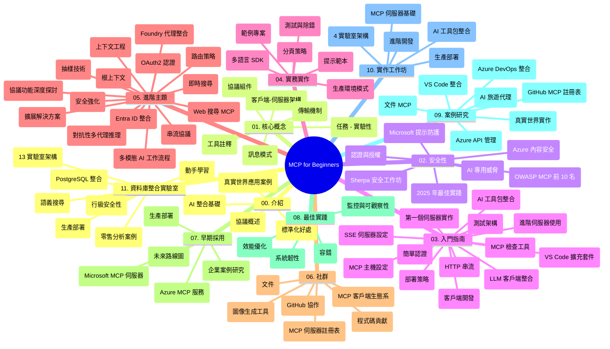

# Model Context Protocol (MCP) 初學者學習指南

本學習指南概述了「Model Context Protocol (MCP) 初學者」課程的倉庫結構和內容。請利用本指南有效瀏覽倉庫並充分利用可用資源。

## 倉庫概覽

Model Context Protocol (MCP) 是一個 AI 模型與客戶端應用程序之間互動的標準化架構。最初由 Anthropic 創建，現由更廣泛的 MCP 社區通過官方 GitHub 組織維護。本倉庫提供全面課程，並附有 C#、Java、JavaScript、Python 和 TypeScript 的實作範例，專為 AI 開發者、系統架構師及軟件工程師設計。

## 視覺課程地圖

## 倉庫結構

倉庫組織為十一個主要部分，分別聚焦 MCP 的不同面向：

1. **簡介 (00-Introduction/)**
   - Model Context Protocol 概覽
   - AI 流程標準化的重要性
   - 實務使用案例與效益

2. **核心概念 (01-CoreConcepts/)**
   - 客戶端-伺服器架構
   - 協議核心組件
   - MCP 的訊息模式

3. **安全性 (02-Security/)**
   - MCP 系統中的安全威脅
   - 安全實作最佳實務
   - 認證與授權策略
   - <strong>完整安全文件</strong>：
     - MCP 2025 年安全最佳實務
     - Azure 內容安全實作指南
     - MCP 安全控管與技術
     - MCP 快速安全最佳實務參考
   - <strong>重要安全議題</strong>：
     - 提示注入與工具中毒攻擊
     - 會話劫持及混淆代理問題
     - Token 直通漏洞
     - 過度權限與存取控制
     - AI 元件供應鏈安全
     - Microsoft 提示保護整合

4. **入門指南 (03-GettingStarted/)**
   - 環境設置與配置
   - 建立基本 MCP 伺服器與客戶端
   - 與現有應用整合
   - 包含章節：
     - 第一個伺服器實作
     - 客戶端開發
     - LLM 客戶端整合
     - VS Code 整合
     - Server-Sent Events (SSE) 伺服器
     - 進階伺服器使用
     - HTTP 串流
     - AI 工具包整合
     - 測試策略
     - 部署指南

5. **實務實作 (04-PracticalImplementation/)**
   - 各語言 SDK 使用
   - 除錯、測試與驗證技巧
   - 製作可重用提示模板與工作流程
   - 實作範例專案

6. **進階主題 (05-AdvancedTopics/)**
   - 上下文工程技術
   - Foundry 代理整合
   - 多模態 AI 工作流程
   - OAuth2 認證示範
   - 實時搜尋功能
   - 實時串流
   - Root contexts 實作
   - 路由策略
   - 取樣技術
   - 擴充方案
   - 安全性考量
   - Entra ID 安全整合
   - 網頁搜尋整合
   - 對抗式多代理推理（辯論模式）

7. **社區貢獻 (06-CommunityContributions/)**
   - 如何貢獻程式碼與文件
   - 透過 GitHub 協作
   - 社區驅動改進與回饋
   - 使用各種 MCP 客戶端（Claude Desktop、Cline、VSCode）
   - 使用流行 MCP 伺服器包括圖像生成

8. **早期採用經驗 (07-LessonsfromEarlyAdoption/)**
   - 實務部署與成功案例
   - 建置與部署 MCP 解決方案
   - 趨勢與未來規劃
   - **Microsoft MCP 伺服器指南**：詳細介紹十個生產就緒的 Microsoft MCP 伺服器，包括：
     - Microsoft Learn Docs MCP 伺服器
     - Azure MCP 伺服器（15+ 專用連接器）
     - GitHub MCP 伺服器
     - Azure DevOps MCP 伺服器
     - MarkItDown MCP 伺服器
     - SQL Server MCP 伺服器
     - Playwright MCP 伺服器
     - Dev Box MCP 伺服器
     - Microsoft Foundry MCP 伺服器
     - Microsoft 365 Agents Toolkit MCP 伺服器

9. **最佳實務 (08-BestPractices/)**
   - 性能調校與優化
   - 設計容錯 MCP 系統
   - 測試與韌性策略

10. **案例研究 (09-CaseStudy/)**
    - <strong>七個完整案例研究</strong> 展示 MCP 在不同場景的多樣性：
    - **Azure AI 旅遊代理**：Azure OpenAI 與 AI 搜尋的多代理協同
    - **Azure DevOps 整合**：使用 YouTube 資料更新自動化工作流程
    - <strong>即時文件檢索</strong>：Python 控制台客戶端與串流 HTTP
    - <strong>互動式學習計劃生成器</strong>：Chainlit 網頁應用與對話式 AI
    - <strong>編輯器內文件</strong>：VS Code 與 GitHub Copilot 工作流程整合
    - **Azure API 管理**：企業 API 整合與 MCP 伺服器建立
    - **GitHub MCP 登錄**：生態系開發與智慧代理平台
    - 跨企業整合、開發者生產力與生態系發展的實作範例

11. **實務工作坊 (10-StreamliningAIWorkflowsBuildingAnMCPServerWithAIToolkit/)**
    - 將 MCP 與 AI 工具包結合的完整實務工作坊
    - 建構智慧應用，橋接 AI 模型與真實工具
    - 覆蓋基礎、客製伺服器開發與生產部署策略的實務模組
    - <strong>實驗室結構</strong>：
      - Lab 1：MCP 伺服器基礎
      - Lab 2：進階 MCP 伺服器開發
      - Lab 3：AI 工具包整合
      - Lab 4：生產部署與擴充
    - 以實驗室為主的逐步教學

12. **MCP 伺服器資料庫整合實驗室 (11-MCPServerHandsOnLabs/)**
    - **涵蓋 13 個實驗室的完整學習路徑**，用以建置生產就緒的 MCP 伺服器並整合 PostgreSQL
    - <strong>真實零售分析實作</strong>：採用 Zava Retail 範例
    - <strong>企業級模式</strong>：包含行級安全 (RLS)、語意搜尋與多租戶資料存取
    - <strong>完整實驗室結構</strong>：
      - **Labs 00-03：基礎** - 簡介、架構、安全、環境設置
      - **Labs 04-06：建置 MCP 伺服器** - 資料庫設計、MCP 伺服器實作、工具開發
      - **Labs 07-09：進階特性** - 語意搜尋、測試與除錯、VS Code 整合
      - **Labs 10-12：生產及最佳實務** - 部署、監控、優化
    - <strong>涵蓋技術</strong>：FastMCP 框架、PostgreSQL、Azure OpenAI、Azure Container Apps、Application Insights
    - <strong>學習成果</strong>：生產就緒 MCP 伺服器、資料庫整合模式、AI 驅動分析、企業安全

## 附加資源

倉庫包含輔助資源：

- **Images 資料夾**：包含整個課程使用的圖表與示意圖
- <strong>翻譯</strong>：多語言支援與自動化文件翻譯
- **官方 MCP 資源**：
  - [MCP 文件](https://modelcontextprotocol.io/)
  - [MCP 規範](https://spec.modelcontextprotocol.io/)
  - [MCP GitHub 倉庫](https://github.com/modelcontextprotocol)

## 如何使用本倉庫

1. <strong>依序學習</strong>：依照章節順序（00 到 11）進行系統化學習。
2. <strong>專注語言</strong>：若偏好特定程式語言，探索相應的 samples 目錄中的實作。
3. <strong>實務入門</strong>：從「入門指南」開始，設置環境並建立第一個 MCP 伺服器與客戶端。
4. <strong>進階探索</strong>：掌握基礎後，深入進階主題擴展知識。
5. <strong>社群參與</strong>：透過 GitHub 討論及 Discord 頻道加入 MCP 社群，與專家及開發者交流。

## MCP 客戶端與工具

課程涵蓋各種 MCP 客戶端與工具：

1. <strong>官方客戶端</strong>：
   - Visual Studio Code
   - MCP Visual Studio Code 插件
   - Claude Desktop
   - Claude VSCode 插件
   - Claude API

2. <strong>社群客戶端</strong>：
   - Cline（終端機）
   - Cursor（程式編輯器）
   - ChatMCP
   - Windsurf

3. **MCP 管理工具**：
   - MCP CLI
   - MCP Manager
   - MCP Linker
   - MCP Router

## 熱門 MCP 伺服器

倉庫介紹多種 MCP 伺服器，包括：

1. **官方 Microsoft MCP 伺服器**：
   - Microsoft Learn Docs MCP 伺服器
   - Azure MCP 伺服器（15+ 專用連接器）
   - GitHub MCP 伺服器
   - Azure DevOps MCP 伺服器
   - MarkItDown MCP 伺服器
   - SQL Server MCP 伺服器
   - Playwright MCP 伺服器
   - Dev Box MCP 伺服器
   - Microsoft Foundry MCP 伺服器
   - Microsoft 365 Agents Toolkit MCP 伺服器

2. <strong>官方參考伺服器</strong>：
   - 檔案系統
   - Fetch
   - Memory
   - Sequential Thinking

3. <strong>圖像生成</strong>：
   - Azure OpenAI DALL-E 3
   - Stable Diffusion WebUI
   - Replicate

4. <strong>開發工具</strong>：
   - Git MCP
   - 終端機控制
   - 程式助手

5. <strong>專用伺服器</strong>：
   - Salesforce
   - Microsoft Teams
   - Jira 與 Confluence

## 貢獻方式

本倉庫歡迎社群貢獻。請參閱社群貢獻章節，了解如何有效參與 MCP 生態系統。

----

*本學習指南最後更新於 2026 年 2 月 5 日，反映 MCP 規範 2025-11-25 的最新版本，並提供該日期時倉庫的概覽。倉庫內容可能於該日期後更新。*

---

<!-- CO-OP TRANSLATOR DISCLAIMER START -->
**免責聲明**：
本文件由 AI 翻譯服務 [Co-op Translator](https://github.com/Azure/co-op-translator) 翻譯而成。雖然我們致力於確保準確性，但請注意，機器自動翻譯可能包含錯誤或不準確之處。原始文件的母語版本應被視為權威來源。對於重要資訊，建議進行專業人工翻譯。我們不對因使用本翻譯而產生的任何誤解或誤釋承擔責任。
<!-- CO-OP TRANSLATOR DISCLAIMER END -->