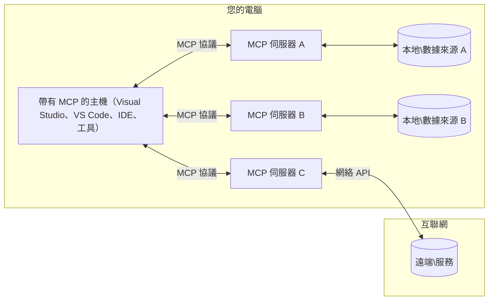

# MCP 核心概念：掌握 AI 整合的模型上下文協議

[](https://youtu.be/earDzWGtE84)

_(點擊上方圖片觀看本課程影片)_

[模型上下文協議 (Model Context Protocol, MCP)](https://github.com/modelcontextprotocol) 是一個強大且標準化的框架，用於優化大型語言模型 (LLMs) 與外部工具、應用程式及資料來源之間的通訊。  
本指南將帶您了解 MCP 的核心概念。您將學習其用戶端-伺服器架構、核心組件、通訊機制及實作最佳實務。

- **明確的用戶同意**：所有的資料存取與操作必須在執行前取得用戶明確批准。用戶須清楚了解將存取哪些資料及執行哪些動作，並可對權限與授權進行細緻控制。
- **資料隱私保護**：用戶資料僅在明確同意下被揭露，並必須透過嚴密的存取控制保護整個互動生命週期。實作須防止未授權資料傳輸，並維持嚴格的隱私界限。
- **工具執行安全**：每次工具調用皆需用戶明確同意，明確了解工具功能、參數及潛在影響。需嚴謹安全邊界防止意外、不安全或惡意的工具執行。
- **傳輸層安全**：所有通訊渠道應使用適當的加密及驗證機制。遠端連線需實作安全傳輸協定及憑證管理。

#### 實作指引：

- **權限管理**：實作細粒度的權限系統，允許用戶控制哪些伺服器、工具及資源可被訪問
- **驗證與授權**：使用安全的驗證方法（OAuth、API 密鑰）並妥善管理及設定有效期  
- **輸入驗證**：依照定義的架構驗證所有參數與輸入資料，以防注入攻擊
- **稽核日誌**：維護全面的操作紀錄以利安全監控及合規性檢查

## 概述

本課程探討組成模型上下文協議 (MCP) 生態系統的基本架構與組件。您將了解用戶端-伺服器架構、關鍵組件及推動 MCP 互動的通訊機制。

## 主要學習目標

學習完畢後，您將能：

- 理解 MCP 的用戶端-伺服器架構
- 辨識 Hosts、Clients 與 Servers 的角色與職責
- 分析使 MCP 成為彈性整合層的核心特性
- 了解 MCP 生態系統內資訊流動方式
- 透過 .NET、Java、Python 與 JavaScript 的範例程式碼得到實務見解

## MCP 架構深入解析

MCP 生態系統建立於用戶端-伺服器模型。此模組化結構使 AI 應用能高效地與工具、資料庫、API 及上下文資源互動。以下將此架構拆解為核心組件。

MCP 核心採用用戶端-伺服器架構，主機應用可連線至多個伺服器：


- **MCP Hosts**：如 VSCode、Claude Desktop、整合開發環境 (IDEs) 或可透過 MCP 存取資料的 AI 工具
- **MCP Clients**：協議用戶端，與伺服器保持一對一連線
- **MCP Servers**：輕量程序，以標準化的模型上下文協議對外提供特定能力
- **本地資料來源**：您的電腦內的檔案、資料庫及 MCP 伺服器可安全存取的服務
- **遠端服務**：網際網路上的外部系統，MCP 伺服器可透過 API 連線訪問

MCP 協議屬於持續演進的標準，採用日期版本格式 (YYYY-MM-DD)。目前協議版本為 **2025-11-25**。您可瀏覽最新的[協議規範](https://modelcontextprotocol.io/specification/2025-11-25/)

### 1. Hosts

在模型上下文協議 (MCP) 中，**Hosts** 是 AI 應用程式，是使用者與協議互動的主要介面。Hosts 負責協調與多個 MCP 伺服器的連線，並為每個連線建立專屬的 MCP 用戶端。Hosts 範例包括：

- **AI 應用程式**：Claude Desktop、Visual Studio Code、Claude Code
- **開發環境**：具 MCP 整合的整合開發環境與編輯器  
- **客製化應用**：專用的 AI 代理及工具

**Hosts** 是協調 AI 模型互動的應用，它們：

- **調度 AI 模型**：執行或與 LLM 互動以產生回應並協調 AI 工作流程
- **管理用戶端連線**：為每個 MCP 伺服器連線建立並維護一個 MCP 用戶端
- **控制用戶介面**：處理對話流程、用戶互動及回應呈現  
- **執行安全控管**：控制權限、安全限制及驗證
- **處理用戶同意**：管理用戶對資料共享及工具執行的批准


### 2. Clients

**Clients** 是用於保持 Hosts 與 MCP 伺服器之間專屬一對一連線的重要組件。每個 MCP 用戶端由 Host 實例化，連結特定 MCP 伺服器，確保通訊渠道有序且安全。多個用戶端讓 Host 可同時連接多個伺服器。

**Clients** 是宿主應用程式內的連線元件。它們負責：

- **協議通訊**：傳送結構為 JSON-RPC 2.0 的請求，包含提示詞與指令給伺服器
- **能力協商**：初始化時與伺服器協商支援的功能及協議版本
- **工具執行**：管理模型的工具執行請求並處理回應
- **即時更新**：處理來自伺服器的通知及即時更新
- **回應處理**：處理並格式化伺服器回應以供用戶顯示

### 3. Servers

**Servers** 提供上下文、工具及能力給 MCP 用戶端。可本地（與 Host 相同機器）或遠端（外部平台）執行，負責處理用戶端請求並提供結構化回應。伺服器透過標準化模型上下文協議對外曝露特定功能。

**Servers** 是提供上下文與功能的服務。它們：

- **功能註冊**：向用戶端註冊並暴露可用原語（資源、提示詞、工具）
- **請求處理**：接收並執行用戶端的工具調用、資源請求及提示詞請求
- **上下文提供**：提供上下文資訊及資料以增強模型回應
- **狀態管理**：維持會話狀態並應需要處理有狀態互動
- **即時通知**：對已連接用戶端發送能⼒變更及更新通知

伺服器可由任意開發者建立，用以拓展模型能力並增添專業功能，支持本地及遠程部署場景。

### 4. 伺服器原語

模型上下文協議 (MCP) 中的伺服器提供三種核心**原語**，這些原語定義了用戶端、Hosts 與語言模型之間豐富互動的基礎建構單元。這些原語指定協議可用的上下文資訊及行動類型。

MCP 伺服器可曝露下列三種核心原語的任意組合：

#### 資源

**資源**是為 AI 應用提供上下文資訊的資料來源。它們代表靜態或動態內容，以強化模型的理解力及決策能力：

- **上下文資料**：為 AI 模型消費的結構化資訊及上下文
- **知識庫**：文件庫、文章、手冊及研究論文
- **本地資料來源**：檔案、資料庫及本地系統資訊  
- **外部資料**：API 回應、網路服務及遠端系統資料
- **動態內容**：依外部條件實時更新的資料

資源由 URI 識別，並透過 `resources/list` 方法進行發現，透過 `resources/read` 方法檢索：

```text
file://documents/project-spec.md
database://production/users/schema
api://weather/current
```

#### 提示詞

**提示詞**是可重用的模板，有助於結構化與語言模型的互動。它們提供標準化的互動模式與模板化工作流程：

- **基於模板的互動**：預先結構化的訊息與對話起始內容
- **工作流程模板**：常見任務及互動的標準化序列
- **少量示例**：基於範例的模型指令模板
- **系統提示**：定義模型行為及上下文的基礎提示詞
- **動態模板**：可依特定上下文調整的參數化提示詞

提示詞支援變數替換，可透過 `prompts/list` 發現，並用 `prompts/get` 取得：

```markdown
Generate a {{task_type}} for {{product}} targeting {{audience}} with the following requirements: {{requirements}}
```

#### 工具

**工具**是可被 AI 模型調用以執行特定操作的函式。它們是 MCP 生態系「動詞」，使模型能與外部系統互動：

- **可執行函式**：模型可帶特定參數調用的離散操作
- **外部系統整合**：API 調用、資料庫查詢、檔案操作、計算
- **唯一身份**：每個工具擁有獨特名稱、描述及參數架構
- **結構化輸入輸出**：工具接受驗證過的參數，返回結構化且類型定義的回應
- **行動能力**：允許模型執行實際操作並取得即時資料

工具以 JSON Schema 定義參數驗證，透過 `tools/list` 發現，並透過 `tools/call` 執行。工具亦可包含**圖示**作為 UI 表示的附加資料。

**工具註解**：工具支援行為註解（如 `readOnlyHint`、`destructiveHint`），說明工具是否為唯讀或破壞性，有助用戶端判斷是否執行該工具。

工具定義範例：

```typescript
server.tool(
  "search_products", 
  {
    query: z.string().describe("Search query for products"),
    category: z.string().optional().describe("Product category filter"),
    max_results: z.number().default(10).describe("Maximum results to return")
  }, 
  async (params) => {
    // 執行搜尋並返回結構化結果
    return await productService.search(params);
  }
);
```

## 用戶端原語

在模型上下文協議 (MCP) 中，**用戶端**可曝露原語，讓伺服器能向宿主應用請求額外能力。此用戶端原語允許更豐富、更具互動性的伺服器實作，能存取 AI 模型能力與用戶互動。

### 取樣

**取樣**允許伺服器向用戶端的 AI 應用請求語言模型完成。此原語使伺服器無需嵌入自身模型依賴即可使用 LLM 能力：

- **模型獨立存取**：伺服器可請求生成結果，無需包含 LLM SDK 或管理模型存取
- **伺服器驅動 AI**：允許伺服器以用戶端模型自主產生內容
- **遞迴 LLM 互動**：支持複雜場景，伺服器需 AI 協助進行處理
- **動態內容產生**：伺服器可利用宿主模型製造上下文回應
- **工具呼叫支援**：伺服器可包含 `tools` 及 `toolChoice` 參數，啟用用戶端模型於取樣時呼叫工具

取樣透過 `sampling/complete` 方法啟動，伺服器送出完成請求給用戶端。

### 根目錄 (Roots)

**根目錄**為用戶端向伺服器提供檔案系統邊界的標準化方式，幫助伺服器了解可存取的目錄與檔案：

- **檔案系統邊界**：定義伺服器可操作的檔案系統限制範圍
- **存取控制**：協助伺服器明確其具有權限訪問的目錄及檔案
- **動態更新**：用戶端可在根目錄改變時通知伺服器
- **URI 識別**：根目錄以 `file://` URI 識別可訪問的目錄與檔案

根目錄可透過 `roots/list` 方法發現，用戶端於根目錄變更時會送出 `notifications/roots/list_changed` 通知。

### 資訊引導 (Elicitation)

**資訊引導**使伺服器能透過用戶端介面向用戶請求額外資訊或確認：

- **用戶輸入請求**：伺服器可在工具執行時詢問額外資訊
- **確認對話框**：請求用戶批准敏感或具影響性的操作
- **互動工作流**：允許伺服器創造逐步的用戶互動流程
- **動態參數收集**：在工具執行時收集遺失或可選參數

資訊引導請求使用 `elicitation/request` 方法透過用戶端介面收集用戶輸入。

**URL 模式引導**：伺服器亦可請求基於 URL 的用戶互動，讓用戶被引導至外部網頁進行驗證、確認或資料填寫。

### 紀錄 (Logging)

**紀錄**允許伺服器向用戶端傳送結構化日誌訊息，用於除錯、監控及操作透明性：

- **除錯支援**：能提供詳細執行日誌以協助除錯
- **操作監控**：向用戶端傳送狀態更新與效能指標
- **錯誤回報**：提供詳細錯誤背景及診斷資訊
- **稽核追蹤**：製作全面的伺服器操作與決策紀錄

紀錄訊息送達用戶端，以增加伺服器操作透明度並便於除錯。

## MCP 中的信息流動

模型上下文協議 (MCP) 定義了 Hosts、Clients、Servers 與模型之間的結構化資訊流。理解此流程有助釐清用戶請求如何被處理，以及外部工具與資料如何被整合進模型回應。
- **主機啟動連線**  
  主機應用程式（例如 IDE 或聊天介面）透過 STDIO、WebSocket 或其他支援的傳輸方式，與 MCP 伺服器建立連線。

- **功能協商**  
  客戶端（嵌入於主機中）與伺服器交換彼此支援的功能、工具、資源及協議版本資訊，確保雙方了解本次會話可用的能力。

- **使用者請求**  
  使用者與主機互動（例如輸入提示或指令）。主機收集輸入並傳送給客戶端處理。

- **資源或工具使用**  
  - 客戶端可能從伺服器請求額外的上下文或資源（如檔案、資料庫條目或知識庫文章），增強模型理解。  
  - 若模型判斷需要使用工具（例如抓取資料、執行計算或呼叫 API），客戶端將向伺服器發送工具調用請求，指定工具名稱及參數。

- **伺服器執行**  
  伺服器接收資源或工具請求，執行必要操作（例如執行函式、查詢資料庫或檔案），並以結構化格式將結果返回客戶端。

- **回應產生**  
  客戶端將伺服器的回應（資源資料、工具輸出等）整合進持續的模型互動中。模型利用這些資訊生成完整且符合上下文的回應。

- **結果呈現**  
  主機接收客戶端的最終輸出，並向使用者顯示，通常包括模型產生的文字以及工具執行或資源查詢的結果。

此流程使 MCP 能無縫連接模型與外部工具及資料來源，支援先進、互動且具上下文感知的 AI 應用。

## 協議架構與層級

MCP 由兩個不同的架構層級組成，協同提供完整的通訊框架：

### 資料層

**資料層**採用**JSON-RPC 2.0**作為核心 MCP 協議基礎。此層定義訊息結構、語意和互動模式：

#### 核心元件：

- **JSON-RPC 2.0 協議**：所有通訊使用標準化的 JSON-RPC 2.0 訊息格式，涵蓋方法呼叫、回應及通知
- **生命週期管理**：處理客戶端與伺服器間的連線初始化、功能協商與會話終止
- **伺服器基本功能**：透過工具、資源、提示，讓伺服器提供核心能力
- **客戶端基本功能**：容許伺服器從大型語言模型（LLM）執行抽樣、引發使用者輸入及傳送日誌訊息
- **即時通知**：支援非同步通知，提供無需輪詢的動態更新

#### 主要特點：

- **協議版本協商**：採用基於日期的版本號（YYYY-MM-DD）確保相容性
- **功能發現**：客戶端與伺服器於初始化期間交換支援的功能資訊
- **有狀態會話**：維持多次互動的連線狀態以保持上下文連續性

### 傳輸層

**傳輸層**管理 MCP 參與者間的通訊通道、訊息封包以及身份驗證：

#### 支援的傳輸機制：

1. **STDIO 傳輸**：
   - 使用標準輸入/輸出串流進行直接的程序間通訊
   - 適合同機上的本地進程，無網路開銷
   - 常用於本地 MCP 伺服器實作

2. **可串流 HTTP 傳輸**：
   - 使用 HTTP POST 傳送客戶端到伺服器訊息  
   - 可選擇使用 Server-Sent Events (SSE) 讓伺服器到客戶端串流
   - 支援跨網路的遠端伺服器通信
   - 支援標準 HTTP 認證（承載權杖、API 金鑰、自訂標頭）
   - MCP 建議使用 OAuth 提供安全的權杖式認證

#### 傳輸抽象層：

傳輸層將通訊細節抽象化，讓資料層得以使用相同 JSON-RPC 2.0 訊息格式於所有傳輸機制。這種抽象可讓應用程式無縫切換本地與遠端伺服器。

### 安全考量

MCP 實作必須遵守若干關鍵安全原則，確保所有協議操作中安全、可信賴且受保護的互動：

- **使用者同意與控制**：須取得使用者明確同意，才能存取資料或執行操作。使用者應清楚控制分享的資料範圍及授權的行為，並透過直覺化使用者介面審核與批准活動。

- **資料隱私**：使用者資料僅在明確同意下披露，並須以適當存取控管保護。MCP 實作必須防止未授權資料傳輸，確保全程隱私維護。

- **工具安全**：調用任何工具前必須取得明確使用者同意。使用者應了解每個工具的功能，且應強化安全邊界防止非預期或不安全的工具執行。

透過遵循這些安全原則，MCP 確保使用者信任、隱私與安全在所有協議互動中獲得維護，同時支援強大的 AI 整合功能。

## 程式碼範例：關鍵元件

以下為多種流行程式語言的程式碼範例，說明如何實作 MCP 伺服器關鍵元件及工具。

### .NET 範例：建立簡單 MCP 伺服器與工具

以下為實務 .NET 範例，展示如何實作簡單 MCP 伺服器及自訂工具。範例示範如何定義並註冊工具、處理請求，及利用模型上下文協議進行伺服器連接。

```csharp
using System;
using System.Threading.Tasks;
using ModelContextProtocol.Server;
using ModelContextProtocol.Server.Transport;
using ModelContextProtocol.Server.Tools;

public class WeatherServer
{
    public static async Task Main(string[] args)
    {
        // Create an MCP server
        var server = new McpServer(
            name: "Weather MCP Server",
            version: "1.0.0"
        );
        
        // Register our custom weather tool
        server.AddTool<string, WeatherData>("weatherTool", 
            description: "Gets current weather for a location",
            execute: async (location) => {
                // Call weather API (simplified)
                var weatherData = await GetWeatherDataAsync(location);
                return weatherData;
            });
        
        // Connect the server using stdio transport
        var transport = new StdioServerTransport();
        await server.ConnectAsync(transport);
        
        Console.WriteLine("Weather MCP Server started");
        
        // Keep the server running until process is terminated
        await Task.Delay(-1);
    }
    
    private static async Task<WeatherData> GetWeatherDataAsync(string location)
    {
        // This would normally call a weather API
        // Simplified for demonstration
        await Task.Delay(100); // Simulate API call
        return new WeatherData { 
            Temperature = 72.5,
            Conditions = "Sunny",
            Location = location
        };
    }
}

public class WeatherData
{
    public double Temperature { get; set; }
    public string Conditions { get; set; }
    public string Location { get; set; }
}
```

### Java 範例：MCP 伺服器元件

此範例與前述 .NET 範例示範相同 MCP 伺服器與工具註冊，但以 Java 實作。

```java
import io.modelcontextprotocol.server.McpServer;
import io.modelcontextprotocol.server.McpToolDefinition;
import io.modelcontextprotocol.server.transport.StdioServerTransport;
import io.modelcontextprotocol.server.tool.ToolExecutionContext;
import io.modelcontextprotocol.server.tool.ToolResponse;

public class WeatherMcpServer {
    public static void main(String[] args) throws Exception {
        // 創建一個MCP服務器
        McpServer server = McpServer.builder()
            .name("Weather MCP Server")
            .version("1.0.0")
            .build();
            
        // 註冊一個天氣工具
        server.registerTool(McpToolDefinition.builder("weatherTool")
            .description("Gets current weather for a location")
            .parameter("location", String.class)
            .execute((ToolExecutionContext ctx) -> {
                String location = ctx.getParameter("location", String.class);
                
                // 獲取天氣數據（簡化版）
                WeatherData data = getWeatherData(location);
                
                // 返回格式化的回應
                return ToolResponse.content(
                    String.format("Temperature: %.1f°F, Conditions: %s, Location: %s", 
                    data.getTemperature(), 
                    data.getConditions(), 
                    data.getLocation())
                );
            })
            .build());
        
        // 使用stdio傳輸連接服務器
        try (StdioServerTransport transport = new StdioServerTransport()) {
            server.connect(transport);
            System.out.println("Weather MCP Server started");
            // 保持服務器運行直到進程終止
            Thread.currentThread().join();
        }
    }
    
    private static WeatherData getWeatherData(String location) {
        // 實作會調用天氣API
        // 為示範目的而簡化
        return new WeatherData(72.5, "Sunny", location);
    }
}

class WeatherData {
    private double temperature;
    private String conditions;
    private String location;
    
    public WeatherData(double temperature, String conditions, String location) {
        this.temperature = temperature;
        this.conditions = conditions;
        this.location = location;
    }
    
    public double getTemperature() {
        return temperature;
    }
    
    public String getConditions() {
        return conditions;
    }
    
    public String getLocation() {
        return location;
    }
}
```

### Python 範例：構建 MCP 伺服器

此範例使用 fastmcp，請先確保已安裝：

```python
pip install fastmcp
```
程式碼範例：

```python
#!/usr/bin/env python3
import asyncio
from fastmcp import FastMCP
from fastmcp.transports.stdio import serve_stdio

# 建立一個 FastMCP 伺服器
mcp = FastMCP(
    name="Weather MCP Server",
    version="1.0.0"
)

@mcp.tool()
def get_weather(location: str) -> dict:
    """Gets current weather for a location."""
    return {
        "temperature": 72.5,
        "conditions": "Sunny",
        "location": location
    }

# 使用類別的替代方法
class WeatherTools:
    @mcp.tool()
    def forecast(self, location: str, days: int = 1) -> dict:
        """Gets weather forecast for a location for the specified number of days."""
        return {
            "location": location,
            "forecast": [
                {"day": i+1, "temperature": 70 + i, "conditions": "Partly Cloudy"}
                for i in range(days)
            ]
        }

# 註冊類別工具
weather_tools = WeatherTools()

# 啟動伺服器
if __name__ == "__main__":
    asyncio.run(serve_stdio(mcp))
```

### JavaScript 範例：建立 MCP 伺服器

此範例展示在 JavaScript 中如何建立 MCP 伺服器，並註冊兩個與天氣相關的工具。

```javascript
// 使用官方的模型上下文協議 SDK
import { McpServer } from "@modelcontextprotocol/sdk/server/mcp.js";
import { StdioServerTransport } from "@modelcontextprotocol/sdk/server/stdio.js";
import { z } from "zod"; // 用於參數驗證

// 創建 MCP 伺服器
const server = new McpServer({
  name: "Weather MCP Server",
  version: "1.0.0"
});

// 定義一個天氣工具
server.tool(
  "weatherTool",
  {
    location: z.string().describe("The location to get weather for")
  },
  async ({ location }) => {
    // 通常會呼叫天氣 API
    // 為示範而簡化
    const weatherData = await getWeatherData(location);
    
    return {
      content: [
        { 
          type: "text", 
          text: `Temperature: ${weatherData.temperature}°F, Conditions: ${weatherData.conditions}, Location: ${weatherData.location}` 
        }
      ]
    };
  }
);

// 定義一個預報工具
server.tool(
  "forecastTool",
  {
    location: z.string(),
    days: z.number().default(3).describe("Number of days for forecast")
  },
  async ({ location, days }) => {
    // 通常會呼叫天氣 API
    // 為示範而簡化
    const forecast = await getForecastData(location, days);
    
    return {
      content: [
        { 
          type: "text", 
          text: `${days}-day forecast for ${location}: ${JSON.stringify(forecast)}` 
        }
      ]
    };
  }
);

// 輔助函數
async function getWeatherData(location) {
  // 模擬 API 呼叫
  return {
    temperature: 72.5,
    conditions: "Sunny",
    location: location
  };
}

async function getForecastData(location, days) {
  // 模擬 API 呼叫
  return Array.from({ length: days }, (_, i) => ({
    day: i + 1,
    temperature: 70 + Math.floor(Math.random() * 10),
    conditions: i % 2 === 0 ? "Sunny" : "Partly Cloudy"
  }));
}

// 使用 stdio 傳輸連接伺服器
const transport = new StdioServerTransport();
server.connect(transport).catch(console.error);

console.log("Weather MCP Server started");
```

此 JavaScript 範例示範如何使用模型上下文協議 SDK 創建 MCP 伺服器。展示如何註冊名為 `weatherTool` 和 `forecastTool` 的兩個工具，並透過 `StdioServerTransport` 讓 MCP 客戶端使用。

## 安全與授權

MCP 包含多個內建概念和機制，用於管理協議過程中的安全與授權：

1. **工具權限控制**：  
  客戶端可指定模型在會話中可使用的工具，確保只有明確授權的工具能被存取，降低非預期及不安全操作風險。權限可根據使用者偏好、組織政策或互動上下文動態設定。

2. **身份驗證**：  
  伺服器可要求身份驗證後，才允許存取工具、資源或敏感操作。可使用 API 金鑰、OAuth 權杖或其他驗證方式。妥善驗證確保只有信任的客戶端和使用者能呼叫伺服器端功能。

3. **驗證**：  
  對所有工具呼叫執行參數驗證。每個工具定義其參數期望的型別、格式及限制，伺服器會依此驗證請求。防止不正當或惡意輸入到達工具實作，維護操作完整性。

4. **速率限制**：  
  MCP 伺服器可針對工具呼叫及資源存取實施速率限制，以防止濫用並保障伺服器資源公平分配。速率限制可依使用者、會話或全域範圍設定，有助避免阻斷服務攻擊或過度資源消耗。

結合這些機制，MCP 為語言模型與外部工具及資料來源整合提供安全基礎，並給予使用者與開發者細緻的存取及使用控制。

## 協議訊息與通訊流程

MCP 通訊使用結構化的 **JSON-RPC 2.0** 訊息，促進主機、客戶端與伺服器間清晰可靠互動。協議定義多種操作的特定訊息模式：

### 核心訊息類型：

#### **初始化訊息**
- **`initialize` 請求**：建立連線並協商協議版本及功能
- **`initialize` 回應**：確認支援功能與伺服器資訊  
- **`notifications/initialized`**：表示初始化完成，會話已準備就緒

#### **發現訊息**
- **`tools/list` 請求**：探索伺服器可用工具
- **`resources/list` 請求**：列出可用資源（資料來源）
- **`prompts/list` 請求**：取得可用提示模板

#### **執行訊息**  
- **`tools/call` 請求**：執行指定工具及參數
- **`resources/read` 請求**：取得特定資源內容
- **`prompts/get` 請求**：抓取帶參數的提示模板

#### **客戶端端訊息**
- **`sampling/complete` 請求**：伺服器請求 LLM 從客戶端完成抽樣
- **`elicitation/request`**：伺服器透過客戶端介面請求使用者輸入
- **日誌訊息**：伺服器向客戶端傳送結構化日誌訊息

#### **通知訊息**
- **`notifications/tools/list_changed`**：伺服器通知工具清單變更
- **`notifications/resources/list_changed`**：伺服器通知資源清單變更  
- **`notifications/prompts/list_changed`**：伺服器通知提示模板清單變更

### 訊息結構：

所有 MCP 訊息遵循 JSON-RPC 2.0 格式：

- **請求訊息**：包含 `id`、`method` 及可選 `params`
- **回應訊息**：包含 `id` 及 `result` 或 `error`  
- **通知訊息**：包含 `method` 及可選 `params`（無 `id` 或回應）

此結構化通訊確保可靠、可追蹤且可擴充的互動，支援即時更新、工具串接及嚴謹錯誤處理等進階場景。

### 工作項目（實驗性）

**工作項目**是一項實驗性功能，提供持久執行包裝器，以實現 MCP 請求的延遲結果取用及狀態追蹤：

- **長時間運行操作**：追蹤高耗時計算、工作流自動化與批次處理
- **延遲結果**：輪詢工作狀態，於操作完成後取得結果
- **狀態追蹤**：透過定義的生命週期狀態監控工作進度
- **多步驟操作**：支援跨多次交互的複雜工作流

工作項目將標準 MCP 請求包裝，實現無法立即完成操作的非同步執行模式。

## 重要結論

- **架構**：MCP 採用客戶端-伺服器架構，主機管理多個客戶端連線至伺服器
- **參與者**：生態系含主機（AI 應用）、客戶端（協議連接器）及伺服器（能力提供者）
- **傳輸機制**：支援 STDIO（本地）及可串流 HTTP 含可選 SSE（遠端）
- **核心基本元件**：伺服器提供工具（可執行函式）、資源（資料來源）及提示（模板）
- **客戶端基本元件**：伺服器可自客戶端請求抽樣（含工具呼叫支援）、引導（使用者輸入及 URL 模式）、根目錄（檔案系統範圍）與日誌
- **實驗性功能**：工作項目提供長時間運行操作的持久封裝
- **協議基礎**：建構於 JSON-RPC 2.0 使用基於日期版本化（目前：2025-11-25）
- **即時能力**：支援用於動態更新和即時同步的通知
- **安全優先**：明確使用者同意、資料隱私保護及安全傳輸為核心要求

## 練習

設計一個對您領域有用的 MCP 工具。定義：
1. 工具名稱
2. 所接受的參數
3. 回傳的輸出
4. 模型可能如何使用此工具解決使用者問題


---

## 接下來

下一章節：[第 2 章：安全](../02-Security/README.md)

---

<!-- CO-OP TRANSLATOR DISCLAIMER START -->
**免責聲明**：
本文件使用 AI 翻譯服務 [Co-op Translator](https://github.com/Azure/co-op-translator) 進行翻譯。盡管我們致力於追求準確性，但請注意，自動翻譯可能包含錯誤或不準確之處。文件的原始語言版本應被視為權威來源。對於重要資訊，建議採用專業人工翻譯。我們對因使用本翻譯而產生的任何誤解或誤譯概不負責。
<!-- CO-OP TRANSLATOR DISCLAIMER END -->