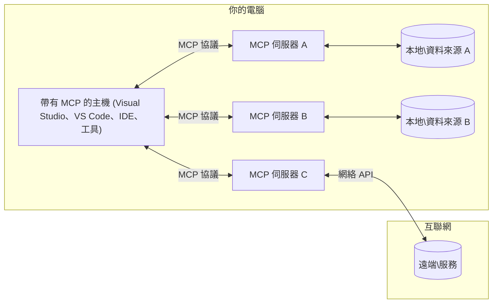

# MCP 核心概念：掌握 AI 整合的模型上下文協議

[](https://youtu.be/earDzWGtE84)

_(點擊以上圖片觀看本課程影片)_

[模型上下文協議（Model Context Protocol, MCP）](https://github.com/modelcontextprotocol) 是一個強大且標準化的框架，用以優化大型語言模型（LLMs）與外部工具、應用程式及資料來源之間的通訊。  
本指南將引領您了解 MCP 的核心概念，您將學習其客戶端－伺服器結構、基本組件、通訊機制以及實作最佳實踐。

- **明確用戶同意**：所有資料存取與操作皆需事先取得用戶明確同意。用戶必須清楚瞭解將存取何種資料與執行何種動作，並擁有細緻的權限與授權控制。
- **資料隱私保護**：用戶資料僅在明確同意下公開，並需於整個交互生命週期中透過強健的存取控制予以保護。實作必須防止未授權資料傳輸並維護嚴格的隱私界限。
- **工具執行安全**：每次工具呼叫均須用戶明確同意，並清楚了解工具功能、參數及潛在影響。必須有強固的安全界限避免非預期、不安全或惡意的工具執行。
- **傳輸層安全**：所有通訊通道應使用適當加密與身分驗證機制。遠端連線須採用安全的傳輸協議並妥善管理憑證。

#### 實作準則：

- **權限管理**：實作細粒度權限系統，使用戶能控制可存取哪些伺服器、工具和資源
- **認證與授權**：使用安全認證方法（OAuth、API 金鑰）並妥善管理及過期令牌  
- **輸入驗證**：根據定義的結構驗證所有參數與資料輸入，防止注入攻擊
- **稽核日誌**：維持完整操作記錄以利安全監控與合規

## 概觀

本課將探討構成模型上下文協議（MCP）生態系的基本架構與元件。您將認識 MCP 的客戶端－伺服器架構、主要元件及推動 MCP 交互的通訊機制。

## 主要學習目標

完成本課後，您將能：

- 理解 MCP 的客戶端－伺服器架構。
- 辨識主機、客戶端與伺服器的角色與職責。
- 分析使 MCP 成為靈活整合層的核心特性。
- 瞭解 MCP 生態系內資訊流動方式。
- 透過 .NET、Java、Python 及 JavaScript 範例，獲得實務見解。

## MCP 架構：深入剖析

MCP 生態系建立在客戶端－伺服器模型上，此模組化結構允許 AI 應用有效地與工具、資料庫、API 及上下文資源互動。以下為該架構的核心元件解析。

MCP 架構本質為客戶端－伺服器結構，其中主機應用程式可連接至多個伺服器：


- **MCP 主機**：如 VSCode、Claude Desktop、IDE 或希望透過 MCP 存取資料的 AI 工具
- **MCP 客戶端**：協定客戶端，維持與伺服器的 1:1 連線
- **MCP 伺服器**：輕量程式，透過標準化的模型上下文協議公開特定功能
- **本地資料來源**：您的電腦檔案、資料庫及 MCP 伺服器可安全存取的服務
- **遠端服務**：透過 API 讓 MCP 伺服器可連接的網際網路外部系統

MCP 協定是一個持續發展的標準，採用基於日期的版本管理（YYYY-MM-DD 格式）。目前協定版本為 **2025-11-25**。您可以查看最新的[協定規範](https://modelcontextprotocol.io/specification/2025-11-25/)

### 1. 主機（Hosts）

在模型上下文協議（MCP）中，**主機**是作為用戶與協定互動主要介面的 AI 應用程式。主機負責協調並管理與多個 MCP 伺服器的連線，為每個伺服器連線建立專屬的 MCP 客戶端。主機範例如下：

- **AI 應用**：Claude Desktop、Visual Studio Code、Claude Code
- **開發環境**：支援 MCP 整合的 IDE 及程式碼編輯器  
- **自訂應用**：專用建置的 AI 代理與工具

**主機**是協調 AI 模型互動的應用。其職責包括：

- **協調 AI 模型**：執行或互動大型語言模型以生成回應並協調 AI 工作流程
- **管理客戶端連線**：為每個 MCP 伺服器連線建立並維護獨立的 MCP 客戶端
- **控制使用者介面**：處理對話流程、用戶互動及回應呈現  
- **執行安全控管**：管理權限、安全限制及認證
- **處理用戶同意**：管理用戶對資料分享及工具執行的同意

### 2. 客戶端（Clients）

**客戶端**是關鍵元件，維持主機和 MCP 伺服器間一對一專屬連線。每個 MCP 客戶端皆由主機實例化連接特定 MCP 伺服器，確保通訊管道有序且安全。多個客戶端讓主機能同時連接多個伺服器。

**客戶端**為主機應用中的連接器元件。其職能包括：

- **協定通訊**：向伺服器傳送 JSON-RPC 2.0 請求，包含提示與指令
- **能力協商**：於初始化時與伺服器協議支援的功能與協定版本
- **工具執行**：管理模型的工具執行請求並處理回應
- **即時更新**：處理來自伺服器的通知與即時更新
- **回應處理**：處理並格式化伺服器回應以呈現給用戶

### 3. 伺服器（Servers）

**伺服器**提供上下文、工具及能力給 MCP 客戶端。伺服器可在本機（與主機相同機器）執行，或部署於遠端（外部平台），負責處理客戶端請求並提供結構化回應。伺服器透過標準化的模型上下文協議公開特定功能。

**伺服器**為提供上下文與能力的服務。具體職能如下：

- **功能註冊**：註冊並公開可用的原始元件（資源、提示、工具）給客戶端
- **請求處理**：接收並執行來自客戶端的工具呼叫、資源請求及提示請求
- **上下文提供**：提供上下文資訊與資料以強化模型回應
- **狀態管理**：維護會話狀態並處理狀態式互動（如有需要）
- **即時通知**：對連線客戶端發送能力變更與更新通知

任何人皆可開發伺服器，以專門功能擴展模型能力，且支援本地與遠端部署。

### 4. 伺服器原始元件（Server Primitives）

模型上下文協議（MCP）中的伺服器提供三種核心**原始元件**，定義了客戶端、主機與語言模型間豐富互動的基石。這些元件指定透過協定可用的上下文資訊與行為類型。

MCP 伺服器可以公開以下三種類型的原始元件任意組合：

#### 資源（Resources）

**資源**為提供上下文資訊給 AI 應用的資料來源。它們代表可增進模型理解與決策的靜態或動態內容：

- **上下文資料**：結構化資訊與模型消費的上下文
- **知識庫**：文件庫、文章、手冊與研究論文
- **本地資料來源**：檔案、資料庫與本地系統資訊  
- **外部資料**：API 回應、網路服務與遠端系統資料
- **動態內容**：根據外部狀況即時更新的資料

資源以 URI 識別，並支援透過 `resources/list` 方法發現及透過 `resources/read` 方法檢索：

```text
file://documents/project-spec.md
database://production/users/schema
api://weather/current
```

#### 提示（Prompts）

**提示**是可重複使用的模板，幫助結構化與語言模型的互動。它們提供標準化的互動模式與範本工作流程：

- **基於模板的互動**：預先結構化的訊息與對話開端
- **工作流程模板**：常見任務與互動的標準化序列
- **少量學習範例**：用於模型指令的範例模板
- **系統提示**：定義模型行為與上下文的基礎提示
- **動態模板**：依特定上下文調整的參數化提示

提示支援變量替換，並可透過 `prompts/list` 發現，使用 `prompts/get` 取得：

```markdown
Generate a {{task_type}} for {{product}} targeting {{audience}} with the following requirements: {{requirements}}
```

#### 工具（Tools）

**工具**是可由 AI 模型調用以執行特定操作的可執行功能。它們代表 MCP 生態系的「動詞」，讓模型得以與外部系統互動：

- **可執行功能**：模型可帶參數調用的離散操作
- **外部系統整合**：API 呼叫、資料庫查詢、檔案操作、計算
- **獨特識別**：每個工具皆有獨特名稱、描述與參數架構
- **結構化輸入輸出**：工具接受經驗證的參數並回傳結構化且型別明確的結果
- **行動能力**：使模型可執行真實世界操作及取得即時資料

工具以 JSON Schema 定義參數驗證，支援透過 `tools/list` 發現並透過 `tools/call` 執行。工具亦可包含**圖示**作為額外元資料，以呈現更佳 UI。

**工具註解**：工具支援行為性註解（如 `readOnlyHint`、`destructiveHint`），說明工具是否為唯讀或具有破壞性，有助客戶端決策是否執行。

工具定義範例：

```typescript
server.tool(
  "search_products", 
  {
    query: z.string().describe("Search query for products"),
    category: z.string().optional().describe("Product category filter"),
    max_results: z.number().default(10).describe("Maximum results to return")
  }, 
  async (params) => {
    // 執行搜尋並返回結構化結果
    return await productService.search(params);
  }
);
```

## 客戶端原始元件（Client Primitives）

在模型上下文協議（MCP）中，**客戶端**可公開原始元件，讓伺服器向主機應用程式請求額外能力。這些客戶端原始元件允許實現更豐富、更具互動性的伺服器功能，能訪問 AI 模型能力及用戶互動。

### 取樣（Sampling）

**取樣**允許伺服器請求由客戶端 AI 應用提供的語言模型補完。此原始元件使伺服器在不內嵌自身模型依賴的情況下，依然可使用大型語言模型能力：

- **模型獨立存取**：伺服器可請求補完而無需包含 LLM SDK 或管理模型存取
- **伺服器主動 AI**：讓伺服器自行使用客戶端 AI 模型生成內容
- **遞迴 LLM 互動**：支援伺服器在複雜情境下尋求 AI 幫助
- **動態內容生成**：允許伺服器利用主機模型創建上下文回應
- **支援工具呼叫**：伺服器可帶 `tools` 和 `toolChoice` 參數，讓客戶端模型在取樣時可調用工具

取樣透過 `sampling/complete` 方法啟動，伺服器傳送補完請求給客戶端。

### 根目錄（Roots）

**根目錄**為客戶端向伺服器公開檔案系統邊界的標準化方式，協助伺服器瞭解可操作的目錄和檔案範圍：

- **檔案系統邊界**：定義伺服器可於檔案系統操作的範圍
- **存取控制**：協助伺服器理解可存取的目錄與檔案權限
- **動態更新**：客戶端可於根目錄變更時通知伺服器
- **以 URI 識別**：根目錄使用 `file://` URI 來識別可存取目錄與檔案

根目錄可透過 `roots/list` 發現，變動時客戶端發送 `notifications/roots/list_changed`。

### 誘導（Elicitation）

**誘導**讓伺服器能透過客戶端介面向用戶請求額外資訊或確認：

- **用戶輸入請求**：伺服器可於工具執行需要時詢問額外資料
- **確認對話**：請求用戶核准敏感或有影響的操作
- **互動式工作流程**：讓伺服器建立逐步互動的用戶流程
- **動態參數收集**：於工具執行期間收集缺少或選用參數

誘導請求利用 `elicitation/request` 方法，透過客戶端介面收集用戶輸入。

**URL 模式誘導**：伺服器也可請求基於 URL 的用戶互動，將用戶導向外部網頁進行認證、確認或資料輸入。

### 日誌（Logging）

**日誌**允許伺服器發送結構化日誌訊息給客戶端，用於除錯、監控及運營透明度：

- **除錯支援**：讓伺服器提供詳細執行記錄以利問題排查
- **運營監控**：向客戶端傳送狀態更新及效能指標
- **錯誤報告**：提供詳細錯誤背景與診斷資訊
- **審計追蹤**：建立伺服器操作與決策的完整記錄

日誌訊息傳送給客戶端，以增進伺服器運作透明度並促進除錯。

## MCP 中資訊流動

模型上下文協議（MCP）定義了主機、客戶端、伺服器與模型間結構化的資訊流。理解此流程有助於釐清用戶請求如何被處理，以及外部工具與資料如何整合進模型回應。
- **主機發起連接**  
  主機應用程式（例如 IDE 或聊天介面）與 MCP 伺服器建立連接，通常透過 STDIO、WebSocket 或其他支援的傳輸方式。

- **功能協商**  
  客戶端（嵌入於主機中）與伺服器交換其支援的功能、工具、資源及協議版本的資訊。這確保雙方了解本次會話可用的功能。

- **使用者請求**  
  使用者與主機互動（例如輸入提示或指令）。主機收集此輸入並傳送給客戶端進行處理。

- **資源或工具使用**  
  - 客戶端可能會向伺服器請求額外上下文或資源（例如檔案、資料庫條目或知識庫文章），以提升模型理解能力。  
  - 若模型判定需要工具（例如查詢資料、執行運算或呼叫 API），客戶端會傳送工具調用請求給伺服器，指定工具名稱及參數。

- **伺服器執行**  
  伺服器接收資源或工具請求，執行必要操作（例如執行函數、查詢資料庫或取得檔案），並以結構化格式將結果返回給客戶端。

- **回應產生**  
  客戶端將伺服器回應（資源資料、工具輸出等）整合至持續的模型互動中，模型利用這些資訊產生全面且具語境關聯的回應。

- **結果呈現**  
  主機接收來自客戶端的最終輸出，並展示給使用者，通常包括模型產生的文字及任何工具執行或資源查詢的結果。

此流程使 MCP 能透過順暢連接模型與外部工具及資料來源，支援高階、互動式及具上下文感知的 AI 應用。

## 協議架構與層級

MCP 由兩個獨立但協同運作的架構層級組成，提供完整的通訊框架：

### 資料層

**資料層** 使用 **JSON-RPC 2.0** 作為基礎實現 MCP 核心協議。此層定義訊息結構、語義及互動模式：

#### 核心元件：

- **JSON-RPC 2.0 協議**：所有通訊均使用標準化 JSON-RPC 2.0 訊息格式進行方法呼叫、回應與通知  
- **生命週期管理**：處理客戶端與伺服器間的連接初始化、功能協商及會話終止  
- **伺服器原語**：使伺服器能透過工具、資源及提示提供核心功能  
- **客戶端原語**：使伺服器能請求大型語言模型抽樣、引導使用者輸入及發送日誌訊息  
- **即時通知**：支援非同步通知，可動態更新而無需輪詢

#### 主要特色：

- **協議版本協商**：使用基於日期的版本號（YYYY-MM-DD）以確保相容性  
- **功能發現**：客戶端和伺服器於初始化階段交換支援功能資訊  
- **有狀態會話**：維持多次互動的連接狀態以保持上下文連貫性

### 傳輸層

**傳輸層** 管理 MCP 參與者之間的通訊通道、訊息框架及身份驗證：

#### 支援的傳輸機制：

1. **STDIO 傳輸**：  
   - 使用標準輸入/輸出流進行直接進程通訊  
   - 適用於同機本地進程，無網路負擔  
   - 常用於本地 MCP 伺服器實作

2. **可串流 HTTP 傳輸**：  
   - 使用 HTTP POST 傳送客戶端至伺服器的訊息  
   - 可選擇伺服器端事件（Server-Sent Events, SSE）進行伺服器至客戶端的串流  
   - 支援跨網路的遠端伺服器通訊  
   - 支持標準 HTTP 認證（Bearer Token、API 金鑰、自訂標頭）  
   - MCP 推薦使用 OAuth 進行安全憑證驗證

#### 傳輸抽象：

傳輸層將通訊細節從資料層抽象化，使所有傳輸機制下均可使用相同的 JSON-RPC 2.0 訊息格式。此抽象允許應用無縫切換本地與遠端伺服器。

### 安全性考量

MCP 實作必須遵守多項關鍵安全原則，確保協議操作中之安全、可信及保護：

- **使用者同意與控制**：使用者必須明確同意後才能存取資料或執行操作。使用者需明確掌握分享的資料與授權的行為，並配有直覺式介面供審查及批准活動。  
- **資料隱私**：使用者資料僅能在明確同意下被揭露，且必須以適當存取控制保護。MCP 實作需防範未經授權資料傳輸，並確保互動全程保護隱私。  
- **工具安全**：呼叫任何工具前需獲得使用者明確同意。使用者應清楚理解每個工具的功能，並須強制執行嚴密安全邊界以防止非預期或不安全的工具執行。

遵循這些安全原則，MCP 在全協議互動中維持使用者信任、隱私及安全，同時賦能強大 AI 整合。

## 程式碼範例：關鍵元件

以下為數種流行程式語言中的程式碼範例，展示如何實作 MCP 伺服器核心元件與工具。

### .NET 範例：建立簡單 MCP 伺服器並附加工具

此範例展示如何使用 .NET 實作簡單 MCP 伺服器並註冊自訂工具。範例展示工具定義、註冊，以及使用 Model Context Protocol 連接伺服器。

```csharp
using System;
using System.Threading.Tasks;
using ModelContextProtocol.Server;
using ModelContextProtocol.Server.Transport;
using ModelContextProtocol.Server.Tools;

public class WeatherServer
{
    public static async Task Main(string[] args)
    {
        // Create an MCP server
        var server = new McpServer(
            name: "Weather MCP Server",
            version: "1.0.0"
        );
        
        // Register our custom weather tool
        server.AddTool<string, WeatherData>("weatherTool", 
            description: "Gets current weather for a location",
            execute: async (location) => {
                // Call weather API (simplified)
                var weatherData = await GetWeatherDataAsync(location);
                return weatherData;
            });
        
        // Connect the server using stdio transport
        var transport = new StdioServerTransport();
        await server.ConnectAsync(transport);
        
        Console.WriteLine("Weather MCP Server started");
        
        // Keep the server running until process is terminated
        await Task.Delay(-1);
    }
    
    private static async Task<WeatherData> GetWeatherDataAsync(string location)
    {
        // This would normally call a weather API
        // Simplified for demonstration
        await Task.Delay(100); // Simulate API call
        return new WeatherData { 
            Temperature = 72.5,
            Conditions = "Sunny",
            Location = location
        };
    }
}

public class WeatherData
{
    public double Temperature { get; set; }
    public string Conditions { get; set; }
    public string Location { get; set; }
}
```

### Java 範例：MCP 伺服器元件

此範例展示與上述 .NET 範例相同的 MCP 伺服器與工具註冊，但使用 Java 實作。

```java
import io.modelcontextprotocol.server.McpServer;
import io.modelcontextprotocol.server.McpToolDefinition;
import io.modelcontextprotocol.server.transport.StdioServerTransport;
import io.modelcontextprotocol.server.tool.ToolExecutionContext;
import io.modelcontextprotocol.server.tool.ToolResponse;

public class WeatherMcpServer {
    public static void main(String[] args) throws Exception {
        // 建立一個MCP伺服器
        McpServer server = McpServer.builder()
            .name("Weather MCP Server")
            .version("1.0.0")
            .build();
            
        // 註冊一個天氣工具
        server.registerTool(McpToolDefinition.builder("weatherTool")
            .description("Gets current weather for a location")
            .parameter("location", String.class)
            .execute((ToolExecutionContext ctx) -> {
                String location = ctx.getParameter("location", String.class);
                
                // 獲取天氣數據（簡化版）
                WeatherData data = getWeatherData(location);
                
                // 回傳格式化的回應
                return ToolResponse.content(
                    String.format("Temperature: %.1f°F, Conditions: %s, Location: %s", 
                    data.getTemperature(), 
                    data.getConditions(), 
                    data.getLocation())
                );
            })
            .build());
        
        // 使用stdio傳輸連接伺服器
        try (StdioServerTransport transport = new StdioServerTransport()) {
            server.connect(transport);
            System.out.println("Weather MCP Server started");
            // 保持伺服器運行直到進程終止
            Thread.currentThread().join();
        }
    }
    
    private static WeatherData getWeatherData(String location) {
        // 實作會調用天氣API
        // 簡化用於示例目的
        return new WeatherData(72.5, "Sunny", location);
    }
}

class WeatherData {
    private double temperature;
    private String conditions;
    private String location;
    
    public WeatherData(double temperature, String conditions, String location) {
        this.temperature = temperature;
        this.conditions = conditions;
        this.location = location;
    }
    
    public double getTemperature() {
        return temperature;
    }
    
    public String getConditions() {
        return conditions;
    }
    
    public String getLocation() {
        return location;
    }
}
```

### Python 範例：建立 MCP 伺服器

此範例使用 fastmcp，因此請先安裝該套件：

```python
pip install fastmcp
```
 範例程式碼：

```python
#!/usr/bin/env python3
import asyncio
from fastmcp import FastMCP
from fastmcp.transports.stdio import serve_stdio

# 建立一個 FastMCP 伺服器
mcp = FastMCP(
    name="Weather MCP Server",
    version="1.0.0"
)

@mcp.tool()
def get_weather(location: str) -> dict:
    """Gets current weather for a location."""
    return {
        "temperature": 72.5,
        "conditions": "Sunny",
        "location": location
    }

# 使用類別的替代方法
class WeatherTools:
    @mcp.tool()
    def forecast(self, location: str, days: int = 1) -> dict:
        """Gets weather forecast for a location for the specified number of days."""
        return {
            "location": location,
            "forecast": [
                {"day": i+1, "temperature": 70 + i, "conditions": "Partly Cloudy"}
                for i in range(days)
            ]
        }

# 註冊類別工具
weather_tools = WeatherTools()

# 啟動伺服器
if __name__ == "__main__":
    asyncio.run(serve_stdio(mcp))
```

### JavaScript 範例：建立 MCP 伺服器

此範例示範 JavaScript 中的 MCP 伺服器建立，以及如何註冊兩個與天氣相關的工具。

```javascript
// 使用官方 Model Context Protocol SDK
import { McpServer } from "@modelcontextprotocol/sdk/server/mcp.js";
import { StdioServerTransport } from "@modelcontextprotocol/sdk/server/stdio.js";
import { z } from "zod"; // 用於參數驗證

// 建立 MCP 伺服器
const server = new McpServer({
  name: "Weather MCP Server",
  version: "1.0.0"
});

// 定義天氣工具
server.tool(
  "weatherTool",
  {
    location: z.string().describe("The location to get weather for")
  },
  async ({ location }) => {
    // 通常會調用天氣 API
    // 為示範而簡化
    const weatherData = await getWeatherData(location);
    
    return {
      content: [
        { 
          type: "text", 
          text: `Temperature: ${weatherData.temperature}°F, Conditions: ${weatherData.conditions}, Location: ${weatherData.location}` 
        }
      ]
    };
  }
);

// 定義預報工具
server.tool(
  "forecastTool",
  {
    location: z.string(),
    days: z.number().default(3).describe("Number of days for forecast")
  },
  async ({ location, days }) => {
    // 通常會調用天氣 API
    // 為示範而簡化
    const forecast = await getForecastData(location, days);
    
    return {
      content: [
        { 
          type: "text", 
          text: `${days}-day forecast for ${location}: ${JSON.stringify(forecast)}` 
        }
      ]
    };
  }
);

// 輔助函數
async function getWeatherData(location) {
  // 模擬 API 調用
  return {
    temperature: 72.5,
    conditions: "Sunny",
    location: location
  };
}

async function getForecastData(location, days) {
  // 模擬 API 調用
  return Array.from({ length: days }, (_, i) => ({
    day: i + 1,
    temperature: 70 + Math.floor(Math.random() * 10),
    conditions: i % 2 === 0 ? "Sunny" : "Partly Cloudy"
  }));
}

// 使用 stdio 傳輸連接伺服器
const transport = new StdioServerTransport();
server.connect(transport).catch(console.error);

console.log("Weather MCP Server started");
```

此 JavaScript 範例示範如何建立 MCP 伺服器，註冊天氣相關工具，並使用 stdio 傳輸處理傳入的客戶端請求。

## 安全與授權

MCP 包含多項內建概念及機制，管理協議整體的安全與授權：

1. **工具權限控制**：  
  客戶端可指定模型於會話期間可使用的工具。確保只有明確授權的工具可被存取，降低非預期或不安全操作風險。權限可依使用者偏好、組織政策或互動上下文動態設定。

2. **身份驗證**：  
  伺服器可要求身份驗證後方可存取工具、資源或敏感功能。可能涉及 API 金鑰、OAuth 憑證或其他驗證機制。適當身份驗證確保僅受信任的客戶端與使用者可呼叫伺服器能力。

3. **驗證機制**：  
  所有工具調用需執行參數驗證。每項工具定義其參數的期望類型、格式及限制，伺服器據此驗證傳入請求。避免格式錯誤或惡意輸入影響工具實作，維護操作完整性。

4. **速率限制**：  
  為防止濫用與確保伺服器資源公平使用，MCP 伺服器可實施工具呼叫及資源存取的速率限制。限制可依使用者、會話或全域設定，有助防範拒絕服務攻擊或過度資源消耗。

結合上述機制，MCP 為語言模型與外部工具及資料來源整合，提供安全基礎，同時賦予使用者與開發者細緻的存取與使用控制。

## 協議訊息與通訊流程

MCP 通訊使用結構化 **JSON-RPC 2.0** 訊息，促進主機、客戶端與伺服器間清晰且可靠的互動。協議定義多種操作對應的訊息模式：

### 核心訊息類型：

#### **初始化訊息**
- **`initialize` 請求**：建立連接並協商協議版本與功能  
- **`initialize` 回應**：確認支援功能及伺服器資訊  
- **`notifications/initialized`**：通知初始化完成，會話準備就緒

#### **發現訊息**
- **`tools/list` 請求**：取得伺服器可用工具列表  
- **`resources/list` 請求**：列出可用資源（資料來源）  
- **`prompts/list` 請求**：取回可用提示範本

#### **執行訊息**  
- **`tools/call` 請求**：以指定參數執行特定工具  
- **`resources/read` 請求**：擷取特定資源內容  
- **`prompts/get` 請求**：取得提示範本並可使用可選參數

#### **客戶端端訊息**
- **`sampling/complete` 請求**：伺服器向客戶端請求大型語言模型完成結果  
- **`elicitation/request`**：伺服器透過客戶端介面請求使用者輸入  
- **日誌訊息**：伺服器向客戶端發送結構化日誌訊息

#### **通知訊息**
- **`notifications/tools/list_changed`**：伺服器通知工具列表變更  
- **`notifications/resources/list_changed`**：伺服器通知資源列表變更  
- **`notifications/prompts/list_changed`**：伺服器通知提示列表變更

### 訊息結構：

所有 MCP 訊息均遵循 JSON-RPC 2.0 格式，包含：
- **請求訊息**：包含 `id`、`method`，以及選用的 `params`  
- **回應訊息**：包含 `id` 及 `result` 或 `error`  
- **通知訊息**：包含 `method` 及選用的 `params`（無 `id`，且不期望回應）

此結構化通訊保證互動可靠、可追蹤、且具可擴充性，支援即時更新、工具串接及健壯的錯誤處理。

### 任務（實驗性）

**任務** 為實驗功能，提供可持久的執行封裝，支援延後結果取得及狀態追蹤：

- **長時間運算**：追蹤高成本計算、工作流程自動化及批次處理  
- **延後結果**：查詢任務狀態，完成後取得結果  
- **狀態追蹤**：透過定義的生命週期狀態監控任務進度  
- **多步驟操作**：支援跨多次互動的複雜工作流程

任務封裝標準 MCP 請求，啟用無法立即完成之操作的非同步執行模式。

## 重要重點

- **架構**：MCP 採用客戶端-伺服器架構，主機管理多個用戶端連接至伺服器  
- **參與者**：生態系包含主機（AI 應用）、客戶端（協議連接器）及伺服器（功能提供者）  
- **傳輸機制**：通訊支援 STDIO（本地）及可串流 HTTP（遠端，含選用 SSE）  
- **核心原語**：伺服器公開工具（可執行功能）、資源（資料來源）、提示（範本）  
- **客戶端原語**：伺服器可請求抽樣（含工具呼叫支持）、引導（包含 URL 模式的使用者輸入）、根目錄（檔案系統邊界）及日誌功能  
- **實驗性功能**：任務為長時間操作提供持久執行封裝  
- **協議基礎**：以 JSON-RPC 2.0 為核心，使用基於日期的版本號（目前為 2025-11-25）  
- **即時功能**：支援動態更新及即時同步的通知  
- **安全優先**：明確使用者同意、資料隱私保護及安全傳輸為核心要求

## 練習

設計一個在您的領域中會有用的簡單 MCP 工具。定義：
1. 該工具名稱  
2. 接受的參數  
3. 回傳的輸出  
4. 模型如何使用此工具解決使用者問題


---

## 下一步

下一章節：[第二章：安全](../02-Security/README.md)

---

<!-- CO-OP TRANSLATOR DISCLAIMER START -->
**免責聲明**：
本文件乃使用人工智能翻譯服務 [Co-op Translator](https://github.com/Azure/co-op-translator) 進行翻譯。儘管我們力求準確，請注意自動翻譯可能包含錯誤或不準確之處。原始文件之母語版本應被視為權威來源。對於重要資訊，建議採用專業人工翻譯。我們不對因使用本翻譯而導致之任何誤解或誤釋承擔責任。
<!-- CO-OP TRANSLATOR DISCLAIMER END -->