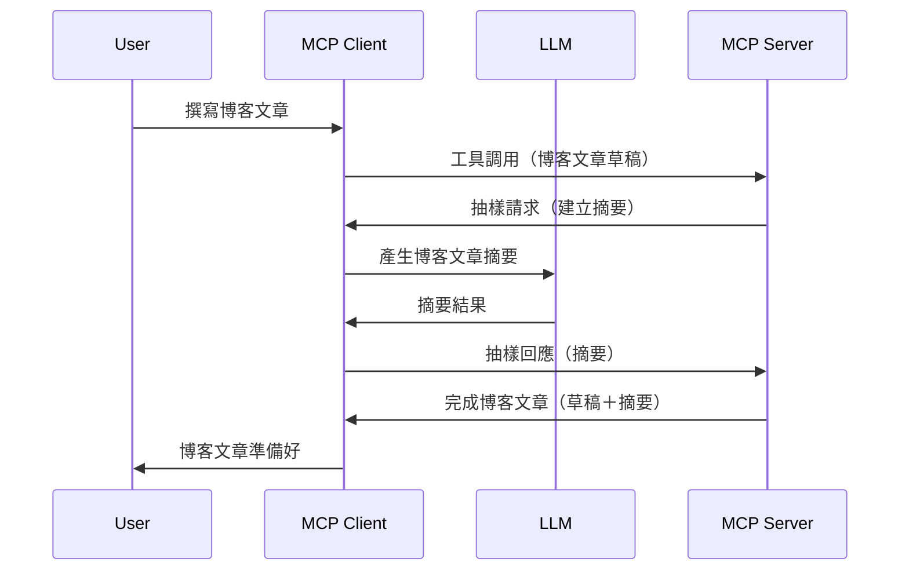

# 取樣 - 將功能委派給用戶端

有時候，你需要 MCP 用戶端與 MCP 伺服器協作以達成共同目標。你可能會遇到伺服器需要在用戶端運行的大型語言模型 (LLM) 協助的情況。針對這種情況，應該使用取樣功能。

讓我們探索一些使用案例，以及如何構建包含取樣的解決方案。

## 概覽

本課程重點解釋何時以及在哪裡使用取樣，以及如何配置它。

## 學習目標

在本章中，我們將：

- 解釋什麼是取樣以及何時使用。
- 展示如何在 MCP 中配置取樣。
- 提供取樣應用的範例。

## 什麼是取樣及為何使用它？

取樣是一項高級功能，運作方式如下：



### 取樣請求

好的，現在我們有一個可信場景的高層次視角，讓我們來談談伺服器傳回給用戶端的取樣請求。以下是此類請求在 JSON-RPC 格式中的範例：

```json
{
  "jsonrpc": "2.0",
  "id": 1,
  "method": "sampling/createMessage",
  "params": {
    "messages": [
      {
        "role": "user",
        "content": {
          "type": "text",
          "text": "Create a blog post summary of the following blog post: <BLOG POST>"
        }
      }
    ],
    "modelPreferences": {
      "hints": [
        {
          "name": "claude-3-sonnet"
        }
      ],
      "intelligencePriority": 0.8,
      "speedPriority": 0.5
    },
    "systemPrompt": "You are a helpful assistant.",
    "maxTokens": 100
  }
}
```

這裡有幾點值得注意：

- 提示（Prompt）位於 content -> text 下，是我們給大型語言模型的指示，目的是讓它摘要博客文章內容。

- **modelPreferences**。此部分就是偏好設置，建議使用哪種配置來搭配大型語言模型。使用者可以選擇是否接受這些建議或做出改變。此例中有關使用哪款模型、速度和智慧優先級的建議。
- **systemPrompt**，這是你正常的系統提示，賦予大型語言模型一個個性，以及包含指導說明。
- **maxTokens**，這是另一項屬性，用於說明推薦此任務使用多少 token。

### 取樣回應

此回應是 MCP 用戶端在呼叫大型語言模型，等待回應後再構建的訊息，會傳回 MCP 伺服器。以下是它在 JSON-RPC 裡可能的樣貌：

```json
{
  "jsonrpc": "2.0",
  "id": 1,
  "result": {
    "role": "assistant",
    "content": {
      "type": "text",
      "text": "Here's your abstract <ABSTRACT>"
    },
    "model": "gpt-5",
    "stopReason": "endTurn"
  }
}
```

注意回應是文章摘要，正如我們所要求的。同時也注意回應中使用的 `model` 並非我們原本要求的，而是用 "gpt-5" 取代 "claude-3-sonnet"。這是為了示範使用者可改變已用的模型，而你的取樣請求只是建議。

好，既然我們了解主要流程以及適用於「部落格文章創作 + 摘要」的實用任務，接著來看看要怎麼實現此功能。

### 訊息類型

取樣訊息不僅限於文字，亦可傳送圖片與音訊。以下展示 JSON-RPC 不同的格式：

<strong>文字</strong>

```json
{
  "type": "text",
  "text": "The message content"
}
```

<strong>圖片內容</strong>

```json
{
  "type": "image",
  "data": "base64-encoded-image-data",
  "mimeType": "image/jpeg"
}
```

<strong>音訊內容</strong>

```json
{
  "type": "audio",
  "data": "base64-encoded-audio-data",
  "mimeType": "audio/wav"
}
```

> NOTE: 欲瞭解更詳細取樣資訊，請參閱[官方文件](https://modelcontextprotocol.io/specification/2025-11-25/client/sampling)

## 如何在用戶端配置取樣

> 注意：如果你只在建置伺服器，這部分不需做太多。

在用戶端，你需要如此指定以下功能：

```json
{
  "capabilities": {
    "sampling": {}
  }
}
```

當選定的用戶端與伺服器初始化時，將會採用此設定。

## 取樣範例 - 創建部落格文章

讓我們一起編寫一個取樣伺服器，我們需做以下事：

1. 在伺服器端建立工具。
1. 該工具應產生一個取樣請求。
1. 工具應等待用戶端的取樣回覆。
1. 接著產生工具結果。

讓我們逐步看程式碼：

### -1- 建立工具

**python**

```python
@mcp.tool()
async def create_blog(title: str, content: str, ctx: Context[ServerSession, None]) -> str:
    """Create a blog post and generate a summary"""

```

### -2- 建立取樣請求

擴充你的工具，加入以下程式碼：

**python**

```python
post = BlogPost(
        id=len(posts) + 1,
        title=title,
        content=content,
        abstract=""
    )

prompt = f"Create an abstract of the following blog post: title: {title} and draft: {content} "

result = await ctx.session.create_message(
        messages=[
            SamplingMessage(
                role="user",
                content=TextContent(type="text", text=prompt),
            )
        ],
        max_tokens=100,
)

```

### -3- 等待回應並回傳結果

**python**

```python
post.abstract = result.content.text

posts.append(post)

# 返回完整產品
return json.dumps({
    "id": post.title,
    "abstract": post.abstract
})
```

### -4- 完整程式碼

**python**

```python
from starlette.applications import Starlette
from starlette.routing import Mount, Host

from mcp.server.fastmcp import Context, FastMCP

from mcp.server.session import ServerSession
from mcp.types import SamplingMessage, TextContent

import json


from uuid import uuid4
from typing import List
from pydantic import BaseModel


mcp = FastMCP("Blog post generator")

# app = FastAPI()

posts = []

class BlogPost(BaseModel):
    id: int
    title: str
    content: str
    abstract: str

posts: List[BlogPost] = []

@mcp.tool()
async def create_blog(title: str, content: str, ctx: Context[ServerSession, None]) -> str:
    """Create a blog post and generate a summary"""

    post = BlogPost(
        id=len(posts) + 1,
        title=title,
        content=content,
        abstract=""
    )

    prompt = f"Create an abstract of the following blog post: title: {title} and draft: {content} "

    result = await ctx.session.create_message(
        messages=[
            SamplingMessage(
                role="user",
                content=TextContent(type="text", text=prompt),
            )
        ],
        max_tokens=100,
    )

    post.abstract = result.content.text

    posts.append(post)

    # 返回完整的部落格文章
    return json.dumps({
        "id": post.title,
        "abstract": post.abstract
    })

if __name__ == "__main__":
    print("Starting server...")
    # mcp.run()
    mcp.run(transport="streamable-http")

# 使用 python server.py 運行應用程式
```

### -5- 在 Visual Studio Code 中測試

在 Visual Studio Code 中測試此流程，請做以下：

1. 在終端機啟動伺服器
1. 將它加入 *mcp.json*（並確保伺服器已啟動），類似如下範例：

   ```json
   "servers": {
      "blog-server": {
        "type": "http",
        "url": "http://localhost:8000/mcp"
      }
   }
   ```

1. 輸入提示詞：

   ```text
   create a blog post named "Where Python comes from", the content is "Python is actually named after Monty Python Flying Circus"
   ```

1. 允許進行取樣。首次測試時，會跳出額外對話框要求你同意，接著才是正常的工具執行詢問視窗。

1. 檢視結果。你會看到結果不僅在 GitHub Copilot Chat 中漂亮呈現，還可以查看原始 JSON 回應。

<strong>加分</strong>。Visual Studio Code 工具有很棒的取樣支援。你可以透過以下操作配置取樣存取權限：

1. 移至擴充功能區塊。
1. 在「MCP SERVERS - INSTALLED」區段選擇已安裝伺服器的齒輪圖示。
1. 選擇「Configure Model Access」，此處你可以決定 GitHub Copilot 執行取樣時允許使用哪些模型。點選「Show Sampling requests」還能看到近期所有取樣請求。

## 作業

這次作業讓你打造稍有不同的取樣 —— 一個支援生成產品描述的取樣整合。以下是情境設定：

<strong>情境</strong>：電商後台工作人員生成產品描述非常耗時。因此，你需建置一個解決方案，能呼叫名為 "create_product" 的工具並傳入「標題」與「關鍵字」作為參數，該工具應產出一個完整產品，其中「description」欄位將由用戶端的大型語言模型填寫。

提示：使用先前所學，建構此伺服器及其工具並使用取樣請求。

## 解答

[Solution](./solution/README.md)

## 重要重點

取樣是一個強大的功能，當伺服器需要大型語言模型協助時，能將任務委派給用戶端。

## 下一步

- [第4章 - 實務實作](../../04-PracticalImplementation/README.md)

---

<!-- CO-OP TRANSLATOR DISCLAIMER START -->
**免責聲明**：
本文件使用 AI 翻譯服務 [Co-op Translator](https://github.com/Azure/co-op-translator) 進行翻譯。雖然我們力求準確，但請注意，自動翻譯可能包含錯誤或不準確之處。原始文件的母語版本應被視為權威來源。對於重要資訊，建議尋求專業人工翻譯。我們不對因使用本翻譯而引起的任何誤解或曲解承擔責任。
<!-- CO-OP TRANSLATOR DISCLAIMER END -->