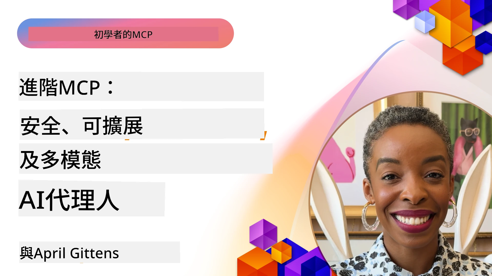

# MCP 高級話題

_(點擊上方圖片觀看本課程影片)_

本章涵蓋模型上下文協定（MCP）實作中的一系列高級主題，包括多模態整合、可擴展性、安全最佳實務和企業整合。這些主題對於構建堅固且生產就緒的 MCP 應用程式，滿足現代 AI 系統需求至關重要。

## 概述

本課程探討模型上下文協定實作的高級概念，重點放在多模態整合、可擴展性、安全最佳實務及企業整合。這些主題是打造能應對企業環境中複雜需求的生產等級 MCP 應用的關鍵。

## 學習目標

完成本課程後，你將能夠：

- 在 MCP 框架中實作多模態能力
- 設計用於高負載場景的可擴展 MCP 架構
- 應用符合 MCP 安全原則的安全最佳實務
- 將 MCP 整合至企業 AI 系統和框架中
- 優化生產環境中的效能與可靠性

## 課程與範例專案

| 連結 | 標題 | 說明 |
|------|-------|-------------|
| [5.1 Integration with Azure](./mcp-integration/README.md) | 與 Azure 整合 | 學習如何將 MCP 伺服器整合到 Azure |
| [5.2 Multi modal sample](./mcp-multi-modality/README.md) | MCP 多模態範例 | 提供音訊、影像及多模態回應範例 |
| [5.3 MCP OAuth2 sample](../../../05-AdvancedTopics/mcp-oauth2-demo) | MCP OAuth2 範例 | 簡易 Spring Boot 應用展示如何使用 MCP 作為授權與資源伺服器的 OAuth2，示範安全的令牌發行、受保護端點、Azure Container Apps 部署和 API 管理整合。 |
| [5.4 Root Contexts](./mcp-root-contexts/README.md) | 根上下文 | 了解更多關於根上下文及其實作方法 |
| [5.5 Routing](./mcp-routing/README.md) | 路由 | 學習不同種類的路由 |
| [5.6 Sampling](./mcp-sampling/README.md) | 取樣 | 學習如何操作取樣 |
| [5.7 Scaling](./mcp-scaling/README.md) | 擴展 | 了解擴展相關知識 |
| [5.8 Security](./mcp-security/README.md) | 安全性 | 保護你的 MCP 伺服器 |
| [5.9 Web Search sample](./web-search-mcp/README.md) | 網頁搜尋 MCP | Python MCP 伺服器與客戶端整合 SerpAPI，實現即時網頁、新聞、產品搜尋及問答。展示多工具協調、外部 API 整合和健全的錯誤處理。 |
| [5.10 Realtime Streaming](./mcp-realtimestreaming/README.md) | 串流 | 即時資料串流在現今數據驅動世界中已成不可或缺，協助企業與應用即時取得資訊以做出及時決策。 |
| [5.11 Realtime Web Search](./mcp-realtimesearch/README.md) | 網頁搜尋 | 即時網頁搜尋，探討 MCP 如何透過提供統一的上下文管理方式，改變 AI 模型、搜尋引擎及應用程式間的即時搜尋。 | 
| [5.12  Entra ID Authentication for Model Context Protocol Servers](./mcp-security-entra/README.md) | Entra ID 驗證 | Microsoft Entra ID 提供強健的雲端身分與存取管理解決方案，確保僅授權用戶及應用能與 MCP 伺服器互動。 |
| [5.13 Microsoft Foundry Agent Integration](./mcp-foundry-agent-integration/README.md) | Microsoft Foundry 整合 | 學習如何將 MCP 伺服器與 Microsoft Foundry 代理整合，利用標準化外部資料來源連接實現強大工具協調與企業 AI 功能。 |
| [5.14 Context Engineering](./mcp-contextengineering/README.md) | 上下文工程 | MCP 伺服器上下文工程未來機會，包括上下文優化、動態上下文管理和 MCP 框架中高效提示工程策略。 |
| [5.15 MCP Custom Transport](./mcp-transport/README.md) | 自訂傳輸 | 學習如何為特殊 MCP 通信情境實作自訂傳輸機制。 |
| [5.16 Protocol Features Deep Dive](./mcp-protocol-features/README.md) | 協定功能 | 掌握進階協定功能，包括進度通知、請求取消、資源範本及錯誤處理模式。 |
| [5.17 Adversarial Multi-Agent Reasoning](./mcp-adversarial-agents/README.md) | 對抗性代理 | 使用兩個立場相反的代理共用 MCP 工具組進行結構化辯論，以捕捉幻覺、挖掘邊緣案例並產生更精確的輸出。 |

> **MCP 規範 2025-11-25 版新增**：本規範新增實驗性支援 **Tasks**（長時間運作且具進度追蹤）、**Tool Annotations**（工具行為的安全元資料）、**URL Mode Elicitation**（向客戶端請求特定 URL 內容）及強化的 **Roots**（工作區上下文管理）。詳情請參閱 [MCP 規範變更記錄](https://spec.modelcontextprotocol.io/)。

## 額外參考資料

如欲取得關於 MCP 高階主題的最新資訊，請參考：
- [MCP 文件](https://modelcontextprotocol.io/)
- [MCP 規範 (2025-11-25)](https://spec.modelcontextprotocol.io/specification/2025-11-25/)
- [GitHub 倉庫](https://github.com/modelcontextprotocol)
- [OWASP MCP 十大安全風險](https://microsoft.github.io/mcp-azure-security-guide/mcp/) - 安全風險與緩解措施
- [MCP 安全高峰工作坊 (Sherpa)](https://azure-samples.github.io/sherpa/) - 實作安全訓練

## 主要重點

- 多模態 MCP 實作擴展 AI 功能超越純文字處理
- 可擴展性對企業部署至關重要，可透過水平與垂直擴展解決
- 全面安全措施保護資料並確保正確存取控制
- 與 Azure OpenAI 及 Microsoft AI Foundry 等平台的企業整合強化 MCP 功能
- 高階 MCP 實作受益於優化架構及謹慎的資源管理

## 練習

設計一個企業級 MCP 實作用於特定使用情境：

1. 確認用例的多模態需求
2. 概述保護敏感資料所需的安全控管
3. 設計可處理變動負載的可擴展架構
4. 計畫與企業 AI 系統的整合點
5. 記錄潛在效能瓶頸及緩解策略

## 其他資源

- [Azure OpenAI 文件](https://learn.microsoft.com/en-us/azure/ai-services/openai/)
- [Microsoft AI Foundry 文件](https://learn.microsoft.com/en-us/ai-services/)

---

## 接下來的內容

從本模組的課程開始閱讀：[5.1 MCP Integration](./mcp-integration/README.md)

完成本模組後，繼續學習：[模組 6：社群貢獻](../06-CommunityContributions/README.md)

---

<!-- CO-OP TRANSLATOR DISCLAIMER START -->
**免責聲明**：
本文件使用 AI 翻譯服務 [Co-op Translator](https://github.com/Azure/co-op-translator) 進行翻譯。雖然我們力求準確，但請注意，自動翻譯可能包含錯誤或不準確之處。原始文件的母語版本應被視為權威來源。對於重要資訊，建議尋求專業人工翻譯。我們不對因使用本翻譯而引起的任何誤解或曲解承擔責任。
<!-- CO-OP TRANSLATOR DISCLAIMER END -->