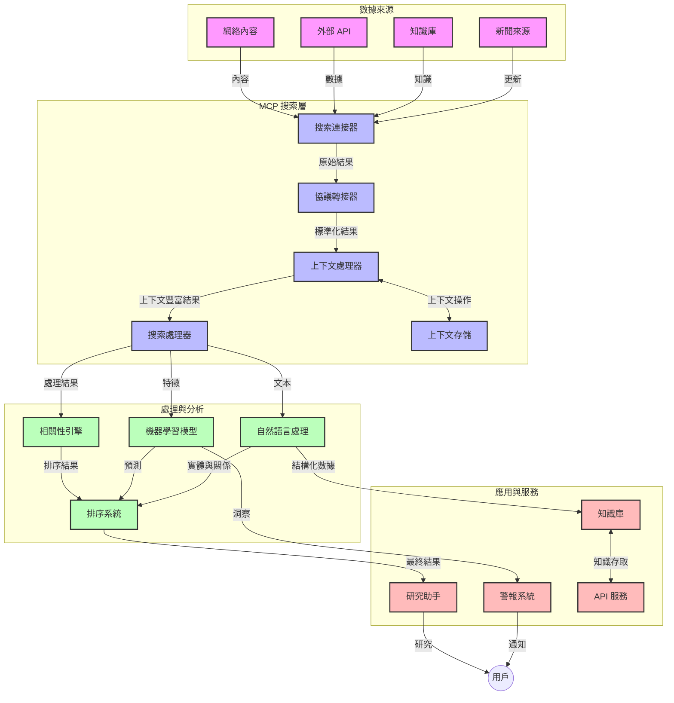
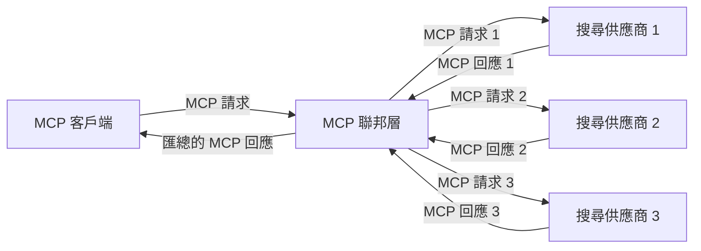
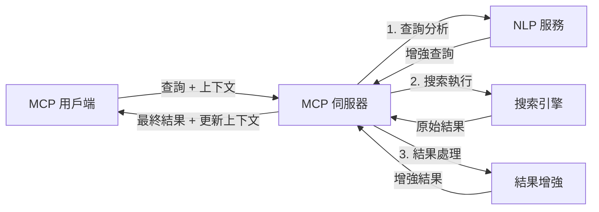

# Model Context Protocol 用於即時網絡搜尋

## 概覽

在今日以資訊為驅動的環境中，即時網絡搜尋變得不可或缺，應用程式需即時存取互聯網上最新資訊，以提供相關且及時的回應。Model Context Protocol（MCP）代表著優化這些即時搜尋流程的重要進展，提升搜尋效率、維持上下文完整性，並改善整體系統效能。

本模組探討 MCP 如何透過標準化管理 AI 模型、搜尋引擎與應用程式間的上下文，有效改變即時網絡搜尋。

### 你將學習到什麼

在此全面指南中，你將發現：

- MCP 如何在 AI 模型與即時網絡搜尋功能之間架設無縫橋樑
- 使用 MCP 實現高效且可擴展搜尋方案的架構範式
- 保留多次查詢與互動中搜尋上下文的技術
- 於多種搜尋場景中使用 Python 與 JavaScript 的實用程式碼實作
- 在 MCP 支援的搜尋系統內平衡相關性、新鮮度與效能的方法

## 即時網絡搜尋簡介

即時網絡搜尋是一種技術方法，使系統能不斷查詢、處理及分析發布或更新中的網絡資訊，從而以最低延遲提供新鮮且相關的資訊。與運作於可能已經延遲數小時甚至數日的索引資料的傳統搜尋系統不同，即時搜尋直接處理網絡的即時資料，交付反映線上內容即時狀態的洞見和資訊。

### 即時網絡搜尋核心概念：

- <strong>持續查詢處理</strong>：搜尋查詢針對不斷更新的資料來源進行處理
- <strong>新鮮度優先</strong>：系統設計強調優先呈現最新資訊
- <strong>相關性平衡</strong>：在相關性與新鮮度之間維持平衡
- <strong>可擴展架構</strong>：系統須能處理可變的查詢負載和資料量
- <strong>上下文理解</strong>：在多次搜尋中維持使用者上下文對結果意義重大
- <strong>動態查詢重構</strong>：基於上下文和先前結果自適應修改查詢
- <strong>多來源整合</strong>：整合多個搜尋供應商及網絡來源的結果
- <strong>語意理解</strong>：基於語意處理查詢與內容，而非僅是關鍵字
- <strong>即時排名</strong>：隨著新資訊湧現持續調整結果排名

### Model Context Protocol 與即時網絡搜尋

Model Context Protocol（MCP）針對即時網絡搜尋環境中的幾項重要挑戰提出解決方案：

1. <strong>搜尋上下文保留</strong>：MCP 標準化如何在分散搜尋元件間維護上下文，確保 AI 模型與處理節點能存取相關查詢歷史及使用者喜好。

2. <strong>高效查詢管理</strong>：透過提供結構化的上下文傳遞機制，MCP 減少每次搜尋迭代重複上下文的負擔。

3. <strong>互通性</strong>：MCP 創造多元搜尋技術與 AI 模型間共通的上下文分享語言，促成更靈活且可擴展的架構。

4. <strong>搜尋優化上下文</strong>：MCP 實作可優先處理對搜尋最有效的上下文元素，優化效能與準確度。

5. <strong>自適應搜尋處理</strong>：憑藉 MCP 的適當上下文管理，搜尋系統能根據使用者需求和資訊變化動態調整處理。

在新聞彙整、研究助理等現代應用中，將 MCP 與網絡搜尋技術整合，可創造更智慧、上下文感知的搜尋，隨著使用者互動持續提供更相關的結果。

## 學習目標

本課結束時，你將能：

- 理解即時網絡搜尋的基本原理及其於現代應用中的挑戰
- 解釋 Model Context Protocol（MCP）如何強化即時網絡搜尋能力
- 使用流行框架與 API 實作基於 MCP 的搜尋方案
- 設計並部署可擴展且高性能的 MCP 搜尋架構
- 將 MCP 概念應用於語意搜尋、研究助手及 AI 擴充瀏覽等多種用例
- 評估 MCP 搜尋技術的未來趨勢與創新
- 開發能從使用者互動中學習的上下文感知搜尋系統
- 使用標準化 MCP 協定將網絡搜尋能力整合至 AI 助理
- 建立分階段搜尋管線，依上下文逐步優化結果
- 優化搜尋效能，同時保持完整的上下文感知

### 定義與意義

即時網絡搜尋指的是以最低延遲不斷查詢、檢索及傳遞網絡資訊。與週期性爬蟲並建立索引的傳統搜尋引擎不同，即時搜尋目標是展示最新可用的資訊，使用者可即刻存取最新內容。

即時網絡搜尋的主要特徵包括：

- <strong>新鮮度</strong>：優先最新內容與更新
- <strong>持續處理</strong>：不斷監測新資訊
- <strong>查詢調適</strong>：根據上下文與反饋優化查詢
- <strong>即時傳遞</strong>：提供查詢結果的延遲極低
- <strong>上下文保留</strong>：基於先前查詢累積資訊以提昇相關性

### 傳統網絡搜尋的挑戰

傳統網絡搜尋在即時場景中面臨多項限制：

1. <strong>上下文碎片化</strong>：跨多次查詢難以維持搜尋上下文
2. <strong>資訊新鮮度</strong>：難以存取與優先最新資訊
3. <strong>整合複雜度</strong>：搜尋系統與應用程式間互通性問題
4. <strong>延遲問題</strong>：在搜尋廣度與回應時間間取得平衡
5. <strong>相關度調校</strong>：在優先新鮮度的同時保證準確性與相關性

## 認識搜尋用的 Model Context Protocol (MCP)

### 搜尋上下文中的 MCP 是什麼？

Model Context Protocol（MCP）是一種標準化通訊協議，用於促進 AI 模型與應用程式間的高效互動。在即時網絡搜尋場景中，MCP 提供框架用於：

- 在多輪查詢過程中保留搜尋上下文
- 標準化搜尋查詢和結果格式
- 優化搜尋參數與結果的傳輸
- 加強模型與搜尋引擎間的通訊

### 核心組件與架構

MCP 用於即時網絡搜尋的架構包含幾個關鍵元件：

1. <strong>查詢上下文管理器</strong>：管理及維護跨多次查詢的搜尋上下文
2. <strong>搜尋處理器</strong>：運用上下文感知技術處理傳入的查詢請求
3. <strong>協議適配器</strong>：在不同搜尋 API 之間轉換並保留上下文
4. <strong>上下文儲存庫</strong>：高效存取搜尋歷史和使用者偏好
5. <strong>搜尋連接端</strong>：連結各種搜尋引擎與網絡 API



### MCP 如何改善即時網絡搜尋

MCP 透過以下方式解決傳統網絡搜尋挑戰：

- <strong>上下文連續性</strong>：在整個搜尋會話中維持查詢間的關聯
- <strong>優化傳輸</strong>：透過智慧上下文管理減少搜尋參數冗餘
- <strong>標準介面</strong>：為搜尋元件提供一致的 API
- <strong>降低延遲</strong>：藉由高效的上下文處理減少作業負荷
- <strong>提升相關性</strong>：通過保留多輪查詢間的使用者意圖提高搜尋準確度

## 整合與實作

即時網絡搜尋系統需謹慎設計與實作架構，兼顧效能與上下文完整性。Model Context Protocol 提供標準化方法整合 AI 模型與搜尋技術，構建更精巧且具上下文感知的搜尋管線。

### MCP 在搜尋架構整合概述

在即時網絡搜尋環境實作 MCP 涉及若干要點：

1. <strong>搜尋上下文序列化</strong>：MCP 提供有效機制將上下文編碼於搜尋請求中，確保重要上下文伴隨查詢流轉整個處理管線。包含針對搜尋相關元資料優化的標準序列格式。

2. <strong>有狀態搜尋處理</strong>：MCP 透過始終如一的上下文呈現，促使搜尋具有更智慧的有狀態處理。對於多階段搜尋管線來說，上下文細緻化能帶來更佳結果。

3. <strong>查詢擴展與優化</strong>：在搜尋系統中，MCP 可促成基於累積上下文的複雜查詢擴展與微調，隨著搜尋進展提供更相關的結果。

4. <strong>結果快取與排序優先</strong>：標準化上下文處理助力管理結果快取與優先排序，使元件能隨搜尋上下文演進自我調整。

5. <strong>搜尋聯邦與彙整</strong>：MCP 促進跨多個後端更精巧的搜尋聯邦，因結構化表示搜尋上下文，能更有意義地匯聚多元來源結果。

在多樣搜尋技術中實施 MCP，創造統一的上下文管理方式，減少客製化整合代碼需求，並強化系統在查詢演變過程中保持意義上下文的能力。

### MCP 在各種網絡搜尋實作中

以下範例遵循現行 MCP 規範，該規範基於 JSON-RPC 協議並採用不同傳輸機制。程式碼示範如何實作自訂搜尋整合，同時完整相容 MCP 協議。

<details>
<summary>使用通用搜尋 API 的 Python 實作</summary>

```python
import asyncio
import json
import aiohttp
from typing import Dict, Any, Optional, List
from contextlib import asynccontextmanager
from collections.abc import AsyncIterator

# 匯入標準 MCP 函式庫
from mcp.client.session import ClientSession
from mcp.client.streamable_http import streamablehttp_client
from mcp.types import TextContent, CreateMessageRequestParams, CreateMessageResult
from mcp.server.fastmcp import FastMCP

# 建立用於網絡搜尋的 FastMCP 伺服器
search_server = FastMCP("WebSearch")

# 處理網絡搜尋操作的類別
class WebSearchHandler:
    def __init__(self, api_endpoint: str, api_key: str):
        self.api_endpoint = api_endpoint
        self.api_key = api_key
        self.session = None
        
    async def initialize(self):
        """Initialize the HTTP session"""
        self.session = aiohttp.ClientSession(
            headers={"Authorization": f"Bearer {self.api_key}"}
        )
    
    async def close(self):
        """Close the HTTP session"""
        if self.session:
            await self.session.close()
            
    async def perform_search(self, query: str, max_results: int = 5, 
                           include_domains: List[str] = None, 
                           exclude_domains: List[str] = None,
                           time_period: str = "any") -> Dict[str, Any]:
        """Perform web search using the search API"""
        # 建立搜尋參數
        search_params = {
            "q": query,
            "limit": max_results,
            "time": time_period
        }
        
        if include_domains:
            search_params["site"] = ",".join(include_domains)
            
        if exclude_domains:
            search_params["exclude_site"] = ",".join(exclude_domains)
        
        # 執行搜尋請求
        try:
            async with self.session.get(
                self.api_endpoint,
                params=search_params
            ) as response:
                if response.status != 200:
                    error_text = await response.text()
                    raise Exception(f"Search API error: {response.status} - {error_text}")
                
                search_data = await response.json()
                
                # 將 API 特定的回應轉換為標準格式
                results = []
                for item in search_data.get("results", []):
                    results.append({
                        "title": item.get("title", ""),
                        "url": item.get("url", ""),
                        "snippet": item.get("snippet", ""),
                        "date": item.get("published_date", ""),
                        "source": item.get("source", "")
                    })
                
                return {
                    "query": query,
                    "totalResults": len(results),
                    "results": results
                }
        except Exception as e:
            print(f"Search API request error: {e}")
            raise

# 初始化搜尋處理器
search_handler = WebSearchHandler(
    api_endpoint="https://api.search-service.example/search",
    api_key="your-api-key-here"
)

# 設定生命週期以管理搜尋處理器
@asyncio.asynccontextmanager
async def app_lifespan(server: FastMCP):
    """Manage application lifecycle"""
    await search_handler.initialize()
    try:
        yield {"search_handler": search_handler}
    finally:
        await search_handler.close()

# 設定伺服器的生命週期
search_server = FastMCP("WebSearch", lifespan=app_lifespan)

# 註冊一個網絡搜尋工具
@search_server.tool()
async def web_search(query: str, max_results: int = 5, 
                   include_domains: List[str] = None,
                   exclude_domains: List[str] = None,
                   time_period: str = "any") -> Dict[str, Any]:
    """
    Search the web for information
    
    Args:
        query: The search query
        max_results: Maximum number of results to return (default: 5)
        include_domains: List of domains to include in search results
        exclude_domains: List of domains to exclude from search results
        time_period: Time period for results ("day", "week", "month", "any")
        
    Returns:
        Dictionary containing search results
    """
    ctx = search_server.get_context()
    search_handler = ctx.request_context.lifespan_context["search_handler"]
    
    results = await search_handler.perform_search(
        query=query,
        max_results=max_results,
        include_domains=include_domains,
        exclude_domains=exclude_domains,
        time_period=time_period
    )
    
    return results

# 範例客戶端使用方法
async def client_example():
    # 使用可串流 HTTP 傳輸連接搜尋伺服器
    async with streamablehttp_client("http://localhost:8000/mcp") as (read, write, _):
        async with ClientSession(read, write) as session:
            # 初始化連接
            await session.initialize()
            
            # 呼叫 web_search 工具
            search_results = await session.call_tool(
                "web_search", 
                {
                    "query": "latest developments in AI and Model Context Protocol",
                    "max_results": 5,
                    "time_period": "day",
                    "include_domains": ["github.com", "microsoft.com"]
                }
            )
            
            print(f"Search results: {search_results}")

# 伺服器執行範例
if __name__ == "__main__":
    # 使用可串流 HTTP 傳輸執行伺服器
    search_server.run(transport="streamable-http")
```
</details> 

<details>
<summary>基於瀏覽器搜尋的 JavaScript 實作</summary>

```javascript
// MCP 伺服器實作用於網絡搜尋
import { McpServer, ResourceTemplate } from '@modelcontextprotocol/sdk/server/mcp.js';
import { StreamableHTTPServerTransport } from '@modelcontextprotocol/sdk/server/streamableHttp.js';
import { z } from 'zod';

// 建立一個用於網絡搜尋的 MCP 伺服器
const searchServer = new McpServer({
    name: "BrowserSearch",
    description: "A server that provides web search capabilities"
});

// 搜尋服務類別
class SearchService {
    constructor(searchApiUrl, apiKey) {
        this.searchApiUrl = searchApiUrl;
        this.apiKey = apiKey;
    }

    async performSearch(parameters) {
        const {
            query = '',
            maxResults = 5,
            includeDomains = [],
            excludeDomains = [],
            timePeriod = 'any'
        } = parameters;
        
        // 使用參數構建搜尋 URL
        const url = new URL(this.searchApiUrl);
        url.searchParams.append('q', query);
        url.searchParams.append('limit', maxResults);
        url.searchParams.append('time', timePeriod);
        
        if (includeDomains.length > 0) {
            url.searchParams.append('site', includeDomains.join(','));
        }
        
        if (excludeDomains.length > 0) {
            url.searchParams.append('exclude_site', excludeDomains.join(','));
        }
        
        try {
            const response = await fetch(url.toString(), {
                method: 'GET',
                headers: {
                    'Authorization': `Bearer ${this.apiKey}`,
                    'Content-Type': 'application/json'
                }
            });
            
            if (!response.ok) {
                const errorText = await response.text();
                throw new Error(`Search API error: ${response.status} - ${errorText}`);
            }
            
            const searchData = await response.json();
            
            // 將特定 API 回應轉換為標準格式
            const results = searchData.results?.map(item => ({
                title: item.title || '',
                url: item.url || '',
                snippet: item.snippet || '',
                date: item.published_date || '',
                source: item.source || ''
            })) || [];
            
            return {
                query,
                totalResults: results.length,
                results
            };
        } catch (error) {
            console.error('Search API request error:', error);
            throw error;
        }
    }
}

// 初始化搜尋服務
const searchService = new SearchService(
    'https://api.search-service.example/search',
    'your-api-key-here'
);

// 為伺服器設置上下文提供者
searchServer.setContextProvider(() => {
    return {
        searchService
    };
});

// 註冊網絡搜尋工具
searchServer.tool({
    name: 'web_search',
    description: 'Search the web for information',
    parameters: {
        type: 'object',
        properties: {
            query: {
                type: 'string',
                description: 'The search query'
            },
            maxResults: {
                type: 'integer',
                description: 'Maximum number of results to return',
                default: 5
            },
            includeDomains: {
                type: 'array',
                items: { type: 'string' },
                description: 'List of domains to include in search results'
            },
            excludeDomains: {
                type: 'array',
                items: { type: 'string' },
                description: 'List of domains to exclude from search results'
            },
            timePeriod: {
                type: 'string',
                description: 'Time period for results',
                enum: ['day', 'week', 'month', 'any'],
                default: 'any'
            }
        },
        required: ['query']
    },
    handler: async (params, context) => {
        const { searchService } = context;
        return await searchService.performSearch(params);
    }
});

// 連接搜尋伺服器的範例客戶端代碼
import { Client } from '@modelcontextprotocol/sdk/client/index.js';
import { StreamableHTTPClientTransport } from '@modelcontextprotocol/sdk/client/streamableHttp.js';

async function connectToSearchServer() {
    // 連接搜尋伺服器
    const transport = new StreamableHTTPClientTransport(
        new URL('http://localhost:8000/mcp')
    );
    
    const client = new Client({
        name: 'search-client',
        version: '1.0.0'
    });
    
    await client.connect(transport);
    
    // 執行搜尋工具
    const searchResults = await client.callTool({
        name: 'web_search',
        arguments: {
            query: 'Model Context Protocol implementation examples',
            maxResults: 10,
            timePeriod: 'week',
            includeDomains: ['github.com', 'docs.microsoft.com']
        }
    });
    
    console.log('Search results:', searchResults);
    
    // 清理
    await client.disconnect();
}

// 啟動伺服器
const transport = new StreamableHTTPServerTransport();
await searchServer.connect(transport);
console.log('Search server running at http://localhost:8000/mcp');

// 在獨立進程中或伺服器啟動後
// connectToSearchServer().catch(console.error);
```
</details> 

## 程式碼範例免責聲明

> <strong>重要提示</strong>：以下程式碼範例展示 Model Context Protocol（MCP）與網絡搜尋功能的整合。雖遵循官方 MCP SDK 的模式與結構，但為教育目的簡化。
> 
> 範例特色包括：
> 
> 1. **Python 實作**：一個 FastMCP 伺服器實作，提供網絡搜尋工具並連結外部搜尋 API。示範妥善的壽命管理、上下文處理及工具實作，依循 [官方 MCP Python SDK](https://github.com/modelcontextprotocol/python-sdk) 範例。伺服器使用新版推薦的 Streamable HTTP 傳輸，已取代舊的 SSE 傳輸以利生產環境部署。
> 
> 2. **JavaScript 實作**：一個以 TypeScript/JavaScript 實作的 FastMCP 範例，參考 [官方 MCP TypeScript SDK](https://github.com/modelcontextprotocol/typescript-sdk)，建立具適切工具定義與客戶端連線的搜尋伺服器，遵循最新的會話管理與上下文維護建議。
> 
> 這些範例用於生產時仍需補充錯誤處理、認證及特定 API 整合程式碼。所示搜尋 API 端點 (`https://api.search-service.example/search`) 為佔位符，須換成實際搜尋服務端點。
> 
> 詳細實作與最新方法，請參閱[官方 MCP 規範](https://spec.modelcontextprotocol.io/)與 SDK 文件。

## 核心概念

### Model Context Protocol (MCP) 框架

MCP 的基礎是為 AI 模型、應用程式與服務建立標準化的上下文交換途徑。在即時網絡搜尋中，此框架對打造連貫、多輪搜尋體驗至關重要。核心元素包括：

1. **客戶端－伺服器架構**：MCP 明確區分搜尋客戶端（請求者）與搜尋伺服器（提供者），允許部署模型多樣。

2. **JSON-RPC 通訊**：協議使用 JSON-RPC 交換訊息，兼容網路技術且易於跨平台實作。

3. <strong>上下文管理</strong>：MCP 定義結構化方式來維護、更新及運用多次互動的搜尋上下文。

4. <strong>工具定義</strong>：搜尋功能以標準化工具形式暴露，擁有明確參數和回傳值。

5. <strong>串流支援</strong>：協議支援搜尋結果串流，對即時搜尋中逐步到達的結果至關重要。

### 網絡搜尋整合模式

MCP 與網絡搜尋整合時，出現若干模式：

#### 1. 直接搜尋供應商整合


此模式中，MCP 伺服器直接對接一個或多個搜尋 API，將 MCP 請求轉換為特定 API 呼叫，並格式化回應作為 MCP 回覆。

#### 2. 聯邦搜尋與上下文保留



此模式分散搜尋查詢至多個相容 MCP 的搜尋供應商，各專長不同內容或搜尋能力，並維持統一上下文。

#### 3. 上下文強化搜尋鏈



此模式將搜尋流程分為多階段，每階段豐富上下文，完成逐步更相關的結果。

### 搜尋上下文組件

基於 MCP 的網絡搜尋中，上下文通常包含：

- <strong>查詢歷史</strong>：目前會話中前次搜尋查詢
- <strong>使用者偏好</strong>：語言、區域、安全搜尋設定
- <strong>互動歷史</strong>：點選哪些結果、停留時間
- <strong>搜尋參數</strong>：篩選、排序及其他搜尋修飾
- <strong>領域知識</strong>：與搜尋相關的主題特定上下文
- <strong>時間上下文</strong>：基於時間的相關度因子
- <strong>來源偏好</strong>：可信或偏好的資訊來源

## 用例與應用

### 研究與資訊收集

MCP 強化研究流程：

- 在搜尋會話中保留研究上下文
- 支持更精巧與上下文相關查詢
- 支援多來源搜尋聯邦
- 促進從搜尋結果中提取知識

### 即時新聞與趨勢監控

MCP 驅動搜尋於新聞監控上具優勢：

- 接近即時發現新興新聞事件
- 上下文過濾相關資訊
- 跨多來源追蹤主題與實體
- 基於使用者上下文的個性化新聞警示

### AI 擴展瀏覽與研究

MCP 給 AI 擴展瀏覽帶來新可能：

- 根據瀏覽器當前活動提出上下文搜尋建議
- 網絡搜尋無縫整合大型語言模型助理
- 基於上下文持續多輪優化搜尋
- 強化事實查證與資訊驗證

## 未來趨勢與創新

### MCP 在網絡搜尋中的演進

展望未來，預期 MCP 持續演進以解決：
- <strong>多模態搜尋</strong>：整合文字、圖片、音訊及影片搜尋並保留上下文
- <strong>去中心化搜尋</strong>：支援分散式及聯邦式搜尋生態系統
- <strong>搜尋隱私</strong>：具上下文感知的隱私保護搜尋機制
- <strong>查詢理解</strong>：自然語言搜尋查詢的深度語意解析

### 技術潛在進展

將塑造 MCP 搜尋未來的新興技術：

1. <strong>神經搜尋架構</strong>：優化於 MCP 的嵌入式搜尋系統
2. <strong>個人化搜尋上下文</strong>：隨時間學習個別使用者搜尋模式
3. <strong>知識圖譜整合</strong>：以領域特定知識圖譜增強上下文搜尋
4. <strong>跨模態上下文</strong>：維持不同搜尋模態間的上下文連貫性

## 實作練習

### 練習一：設定基礎 MCP 搜尋流程

此練習中，您將學習如何：
- 配置一個基礎 MCP 搜尋環境
- 實作網絡搜尋的上下文處理器
- 測試並驗證搜尋迭代中上下文的保留

### 練習二：使用 MCP 搜尋打造研究助理

建立一個完整應用程式以：
- 處理自然語言研究問題
- 執行具上下文感知的網絡搜尋
- 綜合多來源資訊
- 呈現有組織的研究成果

### 練習三：以 MCP 實作多來源搜尋聯邦

進階練習涵蓋：
- 具上下文感知的查詢分派至多個搜尋引擎
- 結果排名與彙總
- 搜尋結果的上下文重複排除
- 處理來源特定的元資料

## 附加資源

- [Model Context Protocol Specification](https://spec.modelcontextprotocol.io/) - MCP 官方規範及詳細協定文件
- [Model Context Protocol Documentation](https://modelcontextprotocol.io/) - 詳細教學與實作指南
- [MCP Python SDK](https://github.com/modelcontextprotocol/python-sdk) - MCP 協定官方 Python 實作
- [MCP TypeScript SDK](https://github.com/modelcontextprotocol/typescript-sdk) - MCP 協定官方 TypeScript 實作
- [MCP Reference Servers](https://github.com/modelcontextprotocol/servers) - MCP 伺服器參考實作
- [Bing Web Search API Documentation](https://learn.microsoft.com/en-us/bing/search-apis/bing-web-search/overview) - 微軟網路搜尋 API
- [Google Custom Search JSON API](https://developers.google.com/custom-search/v1/overview) - Google 可程式化搜尋引擎
- [SerpAPI Documentation](https://serpapi.com/search-api) - 搜尋引擎結果頁 API
- [Meilisearch Documentation](https://www.meilisearch.com/docs) - 開源搜尋引擎
- [Elasticsearch Documentation](https://www.elastic.co/guide/index.html) - 分散式搜尋與分析引擎
- [LangChain Documentation](https://python.langchain.com/docs/get_started/introduction) - 利用大型語言模型構建應用程式

## 學習成果

完成本模組後，您將能夠：

- 理解即時網路搜尋的基礎及挑戰
- 說明 Model Context Protocol (MCP) 如何提升即時網路搜尋能力
- 使用流行框架與 API 實作基於 MCP 的搜尋解決方案
- 設計及部署高擴展性、高效能的 MCP 搜尋架構
- 將 MCP 概念應用於語意搜尋、研究助理與 AI 增強瀏覽等多種情境
- 評估 MCP 基礎搜尋技術的最新趨勢與未來創新

### 信任與安全考量

在實作基於 MCP 的網路搜尋解決方案時，請記住 MCP 規範中的重要原則：

1. <strong>使用者同意與控制</strong>：使用者必須明確同意並理解所有資料存取及操作。這點對於可能存取外部資料來源的網路搜尋尤其重要。

2. <strong>資料隱私</strong>：確保適當處理搜尋查詢及結果，特別是可能包含敏感資訊時。實施適當的存取控制以保護使用者資料。

3. <strong>工具安全</strong>：妥善授權及驗證搜尋工具，因為它們可能透過任意程式碼執行引發安全風險。工具行為描述除非來自可信伺服器，否則不應視為可信。

4. <strong>清晰文件</strong>：根據 MCP 規範的實作指引，提供關於 MCP 搜尋實作的功能、限制與安全考量的明確文件。

5. <strong>完善的同意流程</strong>：構建健全的同意與授權流程，於授權使用前明確說明每個工具的功能，特別是與外部網路資源互動的工具。

關於 MCP 之安全與信任考量的完整細節，請參閱[官方文件](https://modelcontextprotocol.io/specification/2025-11-25/basic/security_best_practices)。

## 接下來的步驟

- [5.12 Entra ID Authentication for Model Context Protocol Servers](../mcp-security-entra/README.md)

---

<!-- CO-OP TRANSLATOR DISCLAIMER START -->
**免責聲明**：
本文件使用 AI 翻譯服務 [Co-op Translator](https://github.com/Azure/co-op-translator) 進行翻譯。雖然我們力求準確，但請注意，自動翻譯可能包含錯誤或不準確之處。原始文件的母語版本應被視為權威來源。對於重要資訊，建議尋求專業人工翻譯。我們不對因使用本翻譯而引起的任何誤解或曲解承擔責任。
<!-- CO-OP TRANSLATOR DISCLAIMER END -->