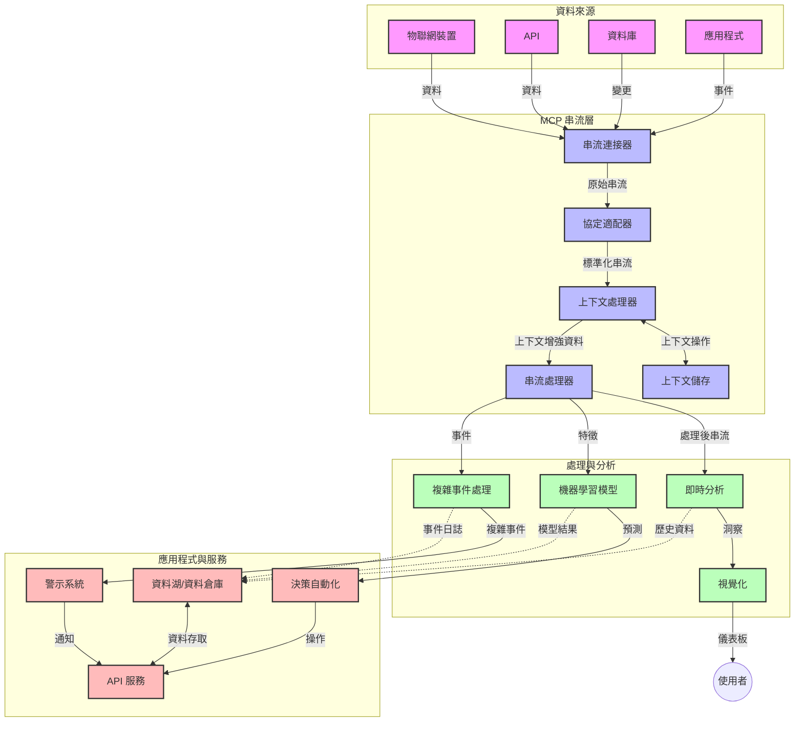

# 實時數據串流的模型上下文協議

## 概述

實時數據串流在當今數據驅動的世界中變得至關重要，企業和應用程序需要即時訪問信息以做出及時決策。模型上下文協議（MCP）代表了優化這些實時串流過程的重要進展，提升數據處理效率、保持上下文完整性並改善整體系統性能。

本模塊探討了 MCP 如何通過為 AI 模型、串流平台和應用程序提供標準化的上下文管理方式來改變實時數據串流。

## 實時數據串流簡介

實時數據串流是一種技術範式，能夠在數據生成時持續傳輸、處理和分析，讓系統能立即響應新資訊。與傳統對靜態數據集進行批處理不同，串流處理的是流動數據，以極低的延遲提供見解和行動。

### 實時數據串流的核心概念：

- <strong>連續數據流</strong>：數據作為不間斷的事件或記錄流持續處理。
- <strong>低延遲處理</strong>：系統設計以最大限度減少數據生成與處理之間的時間。
- <strong>可擴展性</strong>：串流架構必須應對可變的數據量和速度。
- <strong>容錯性</strong>：系統需要具備對故障的韌性，確保數據流不中斷。
- <strong>有狀態處理</strong>：跨事件保持上下文對有意義的分析至關重要。

### 模型上下文協議與實時串流

模型上下文協議（MCP）解決了實時串流環境中的多個關鍵挑戰：

1. <strong>上下文連續性</strong>：MCP 標準化跨分佈式串流元件的上下文維護，確保 AI 模型與處理節點可訪問相關的歷史和環境上下文。

2. <strong>高效狀態管理</strong>：通過提供結構化的上下文傳輸機制，MCP 減少了串流管道中的狀態管理負擔。

3. <strong>互操作性</strong>：MCP 創建了不同串流技術與 AI 模型間共享上下文的共通語言，實現更靈活且可擴展的架構。

4. <strong>串流優化的上下文</strong>：MCP 實作可優先處理最適合實時決策的上下文元素，在性能與精確度間取得最佳平衡。

5. <strong>自適應處理</strong>：藉由 MCP 的正確上下文管理，串流系統可根據不斷變化的數據條件及模式動態調整處理方式。

在從物聯網感測器網絡到金融交易平台的現代應用中，MCP 與串流技術的整合使處理更具智慧與上下文感知，能夠即時對複雜且不斷演變的情況採取適當反應。

## 學習目標

完成本課程後，您將能夠：

- 理解實時數據串流的基本原理及挑戰
- 解釋模型上下文協議（MCP）如何增強實時數據串流
- 使用如 Kafka 和 Pulsar 等流行框架實作基於 MCP 的串流解決方案
- 設計和部署具容錯、高效能的 MCP 串流架構
- 將 MCP 概念應用於物聯網、金融交易及 AI 驅動的分析案例
- 評估 MCP 串流技術的最新趨勢與未來創新


### 定義與意義

實時數據串流包括數據的持續產生、處理與傳遞，且延遲最低。與批次處理中數據以集合形式收集及處理不同，串流數據於到達時即逐步處理，實現即時見解與行動。

實時數據串流的主要特性包括：

- <strong>低延遲</strong>：在毫秒至秒級內處理及分析數據
- <strong>連續流動</strong>：來自多個來源的不間斷數據流
- <strong>即時處理</strong>：數據一到即分析，而非等批量處理
- <strong>事件驅動架構</strong>：對事件發生即時作出回應

### 傳統數據串流的挑戰

傳統串流方法面臨多種限制：

1. <strong>上下文流失</strong>：難以跨分散系統維持上下文
2. <strong>可擴展性問題</strong>：難以擴展以應對高量高速數據
3. <strong>整合複雜性</strong>：不同系統間互操作性困難
4. <strong>延遲管理</strong>：需要在吞吐率與處理時間間平衡
5. <strong>數據一致性</strong>：確保數據在整個串流中的準確與完整

## 了解模型上下文協議 (MCP)

### 什麼是 MCP？

模型上下文協議（MCP）是一種標準化通訊協議，用以促進 AI 模型與應用間的高效互動。在實時數據串流中，MCP 提供下列架構：

- 保留整個數據管道的上下文
- 標準化數據交換格式
- 優化大型數據集的傳輸
- 強化模型與模型、模型與應用間的通訊

### 核心組件與架構

MCP 的實時串流架構包含若干關鍵組件：

1. <strong>上下文管理器</strong>：管理與維護串流管道中的上下文資訊
2. <strong>串流處理器</strong>：使用上下文感知技術處理進入的數據流
3. <strong>協議適配器</strong>：在不同串流協議間轉換，同時保持上下文
4. <strong>上下文存儲</strong>：高效存取上下文資訊
5. <strong>串流連接器</strong>：連接多種串流平台（Kafka、Pulsar、Kinesis 等）



### MCP 如何提升實時數據處理

MCP 通過以下方式應對傳統串流挑戰：

- <strong>上下文完整性</strong>：維持管道中數據點關聯
- <strong>優化傳輸</strong>：透過智慧上下文管理減少數據交換冗餘
- <strong>標準化接口</strong>：為串流元件提供一致 API
- <strong>降低延遲</strong>：高效處理上下文以減少開銷
- <strong>增強可擴展性</strong>：支持橫向擴展同時保持上下文

## 整合與實作

實時數據串流系統需仔細的架構設計與實施，才能兼顧性能與上下文完整。模型上下文協議為 AI 模型與串流技術的整合提供標準方法，使處理管道更為複雜並具上下文感知。

### MCP 在串流架構中的整合概述

在實時串流環境中實施 MCP 需考慮數項要點：

1. <strong>上下文序列化及傳輸</strong>：MCP 提供高效編碼串流數據包內上下文資訊機制，確保關鍵上下文隨數據穿越管道。包括針對串流傳輸優化的標準序列化格式。

2. <strong>有狀態串流處理</strong>：MCP 促進更智能的有狀態處理，在節點間保持一致上下文表示，對分散架構中的狀態管理尤為重要。

3. <strong>事件時間與處理時間</strong>：MCP 實作需解決事件發生時間與處理時間的區分，協議可包含保持事件時間語義的時間上下文。

4. <strong>背壓管理</strong>：MCP 標準化上下文處理，有助管理串流系統背壓，系統元件能通訊其處理能力並調整流量。

5. <strong>上下文窗口與聚合</strong>：MCP 支持更複雜的窗口操作，通過結構化時間及關聯上下文展示，實現事件流間更有意義的聚合。

6. <strong>精確一次處理</strong>：在需精確一次語義的串流系統中，MCP 可包含處理元資料協助追蹤並驗證分散元件的處理狀態。

MCP 在多種串流技術中的實施創造一種統一的上下文管理方案，減少定制整合代碼，並加強系統在數據在線流轉時對有意義上下文的維持能力。

### MCP 在多種數據串流框架中的應用

以下範例根據現行 MCP 規範（以 JSON-RPC 為基礎協議，具不同傳輸機制）撰寫。程式碼示範如何實作自定義傳輸，將 Kafka 和 Pulsar 等串流平台整合，同時完全兼容 MCP 協議。

範例旨在展示串流平台如何與 MCP 整合，提供實時數據處理且保持 MCP 所強調的上下文意識。此方法確保程式碼範例準確反映至 2025 年 6 月的 MCP 規範現狀。

MCP 可整合於下列熱門串流框架：

#### Apache Kafka 整合

```python
import asyncio
import json
from typing import Dict, Any, Optional
from confluent_kafka import Consumer, Producer, KafkaError
from mcp.client import Client, ClientCapabilities
from mcp.core.message import JsonRpcMessage
from mcp.core.transports import Transport

# 用於接駁 MCP 與 Kafka 的自訂傳輸類別
class KafkaMCPTransport(Transport):
    def __init__(self, bootstrap_servers: str, input_topic: str, output_topic: str):
        self.bootstrap_servers = bootstrap_servers
        self.input_topic = input_topic
        self.output_topic = output_topic
        self.producer = Producer({'bootstrap.servers': bootstrap_servers})
        self.consumer = Consumer({
            'bootstrap.servers': bootstrap_servers,
            'group.id': 'mcp-client-group',
            'auto.offset.reset': 'earliest'
        })
        self.message_queue = asyncio.Queue()
        self.running = False
        self.consumer_task = None
        
    async def connect(self):
        """Connect to Kafka and start consuming messages"""
        self.consumer.subscribe([self.input_topic])
        self.running = True
        self.consumer_task = asyncio.create_task(self._consume_messages())
        return self
        
    async def _consume_messages(self):
        """Background task to consume messages from Kafka and queue them for processing"""
        while self.running:
            try:
                msg = self.consumer.poll(1.0)
                if msg is None:
                    await asyncio.sleep(0.1)
                    continue
                
                if msg.error():
                    if msg.error().code() == KafkaError._PARTITION_EOF:
                        continue
                    print(f"Consumer error: {msg.error()}")
                    continue
                
                # 將訊息值解析為 JSON-RPC
                try:
                    message_str = msg.value().decode('utf-8')
                    message_data = json.loads(message_str)
                    mcp_message = JsonRpcMessage.from_dict(message_data)
                    await self.message_queue.put(mcp_message)
                except Exception as e:
                    print(f"Error parsing message: {e}")
            except Exception as e:
                print(f"Error in consumer loop: {e}")
                await asyncio.sleep(1)
    
    async def read(self) -> Optional[JsonRpcMessage]:
        """Read the next message from the queue"""
        try:
            message = await self.message_queue.get()
            return message
        except Exception as e:
            print(f"Error reading message: {e}")
            return None
    
    async def write(self, message: JsonRpcMessage) -> None:
        """Write a message to the Kafka output topic"""
        try:
            message_json = json.dumps(message.to_dict())
            self.producer.produce(
                self.output_topic,
                message_json.encode('utf-8'),
                callback=self._delivery_report
            )
            self.producer.poll(0)  # 觸發回呼函式
        except Exception as e:
            print(f"Error writing message: {e}")
    
    def _delivery_report(self, err, msg):
        """Kafka producer delivery callback"""
        if err is not None:
            print(f'Message delivery failed: {err}')
        else:
            print(f'Message delivered to {msg.topic()} [{msg.partition()}]')
    
    async def close(self) -> None:
        """Close the transport"""
        self.running = False
        if self.consumer_task:
            self.consumer_task.cancel()
            try:
                await self.consumer_task
            except asyncio.CancelledError:
                pass
        self.consumer.close()
        self.producer.flush()

# Kafka MCP 傳輸的使用示範
async def kafka_mcp_example():
    # 使用 Kafka 傳輸建立 MCP 客戶端
    client = Client(
        {"name": "kafka-mcp-client", "version": "1.0.0"},
        ClientCapabilities({})
    )
    
    # 建立並連接 Kafka 傳輸
    transport = KafkaMCPTransport(
        bootstrap_servers="localhost:9092",
        input_topic="mcp-responses",
        output_topic="mcp-requests"
    )
    
    await client.connect(transport)
    
    try:
        # 初始化 MCP 會話
        await client.initialize()
        
        # 透過 MCP 執行工具的示範
        response = await client.execute_tool(
            "process_data",
            {
                "data": "sample data",
                "metadata": {
                    "source": "sensor-1",
                    "timestamp": "2025-06-12T10:30:00Z"
                }
            }
        )
        
        print(f"Tool execution response: {response}")
        
        # 清理關閉程序
        await client.shutdown()
    finally:
        await transport.close()

# 執行示範程式
if __name__ == "__main__":
    asyncio.run(kafka_mcp_example())
```

#### Apache Pulsar 實作

```python
import asyncio
import json
import pulsar
from typing import Dict, Any, Optional
from mcp.core.message import JsonRpcMessage
from mcp.core.transports import Transport
from mcp.server import Server, ServerOptions
from mcp.server.tools import Tool, ToolExecutionContext, ToolMetadata

# 建立一個使用 Pulsar 的自訂 MCP 傳輸
class PulsarMCPTransport(Transport):
    def __init__(self, service_url: str, request_topic: str, response_topic: str):
        self.service_url = service_url
        self.request_topic = request_topic
        self.response_topic = response_topic
        self.client = pulsar.Client(service_url)
        self.producer = self.client.create_producer(response_topic)
        self.consumer = self.client.subscribe(
            request_topic,
            "mcp-server-subscription",
            consumer_type=pulsar.ConsumerType.Shared
        )
        self.message_queue = asyncio.Queue()
        self.running = False
        self.consumer_task = None
    
    async def connect(self):
        """Connect to Pulsar and start consuming messages"""
        self.running = True
        self.consumer_task = asyncio.create_task(self._consume_messages())
        return self
    
    async def _consume_messages(self):
        """Background task to consume messages from Pulsar and queue them for processing"""
        while self.running:
            try:
                # 非阻塞接收並設置超時
                msg = self.consumer.receive(timeout_millis=500)
                
                # 處理訊息
                try:
                    message_str = msg.data().decode('utf-8')
                    message_data = json.loads(message_str)
                    mcp_message = JsonRpcMessage.from_dict(message_data)
                    await self.message_queue.put(mcp_message)
                    
                    # 確認訊息已收到
                    self.consumer.acknowledge(msg)
                except Exception as e:
                    print(f"Error processing message: {e}")
                    # 若發生錯誤則負確認
                    self.consumer.negative_acknowledge(msg)
            except Exception as e:
                # 處理超時或其他例外
                await asyncio.sleep(0.1)
    
    async def read(self) -> Optional[JsonRpcMessage]:
        """Read the next message from the queue"""
        try:
            message = await self.message_queue.get()
            return message
        except Exception as e:
            print(f"Error reading message: {e}")
            return None
    
    async def write(self, message: JsonRpcMessage) -> None:
        """Write a message to the Pulsar output topic"""
        try:
            message_json = json.dumps(message.to_dict())
            self.producer.send(message_json.encode('utf-8'))
        except Exception as e:
            print(f"Error writing message: {e}")
    
    async def close(self) -> None:
        """Close the transport"""
        self.running = False
        if self.consumer_task:
            self.consumer_task.cancel()
            try:
                await self.consumer_task
            except asyncio.CancelledError:
                pass
        self.consumer.close()
        self.producer.close()
        self.client.close()

# 定義一個處理串流數據的範例 MCP 工具
@Tool(
    name="process_streaming_data",
    description="Process streaming data with context preservation",
    metadata=ToolMetadata(
        required_capabilities=["streaming"]
    )
)
async def process_streaming_data(
    ctx: ToolExecutionContext,
    data: str,
    source: str,
    priority: str = "medium"
) -> Dict[str, Any]:
    """
    Process streaming data while preserving context
    
    Args:
        ctx: Tool execution context
        data: The data to process
        source: The source of the data
        priority: Priority level (low, medium, high)
        
    Returns:
        Dict containing processed results and context information
    """
    # 使用 MCP 上下文的示範處理
    print(f"Processing data from {source} with priority {priority}")
    
    # 從 MCP 存取對話上下文
    conversation_id = ctx.conversation_id if hasattr(ctx, 'conversation_id') else "unknown"
    
    # 回傳附加強化上下文的結果
    return {
        "processed_data": f"Processed: {data}",
        "context": {
            "conversation_id": conversation_id,
            "source": source,
            "priority": priority,
            "processing_timestamp": ctx.get_current_time_iso()
        }
    }

# 使用 Pulsar 傳輸的 MCP 伺服器範例實作
async def run_mcp_server_with_pulsar():
    # 建立 MCP 伺服器
    server = Server(
        {"name": "pulsar-mcp-server", "version": "1.0.0"},
        ServerOptions(
            capabilities={"streaming": True}
        )
    )
    
    # 註冊我們的工具
    server.register_tool(process_streaming_data)
    
    # 建立並連接 Pulsar 傳輸
    transport = PulsarMCPTransport(
        service_url="pulsar://localhost:6650",
        request_topic="mcp-requests",
        response_topic="mcp-responses"
    )
    
    try:
        # 使用 Pulsar 傳輸啟動伺服器
        await server.run(transport)
    finally:
        await transport.close()

# 執行伺服器
if __name__ == "__main__":
    asyncio.run(run_mcp_server_with_pulsar())
```

### 部署最佳實踐

實施 MCP 於實時串流時：

1. <strong>設計具容錯能力</strong>：
   - 正確錯誤處理
   - 失敗訊息使用死信佇列
   - 設計冪等處理器

2. <strong>優化性能</strong>：
   - 配置適當緩衝大小
   - 適用時使用批次處理
   - 實施背壓機制

3. <strong>監控與觀察</strong>：
   - 跟蹤串流處理指標
   - 監控上下文傳播
   - 設定異常告警

4. <strong>保障串流安全</strong>：
   - 敏感數據加密
   - 身份驗證與授權
   - 合理存取控制


### MCP 在物聯網與邊緣計算中的應用

MCP 強化物聯網串流：

- 跨管道保留裝置上下文
- 支援高效邊緣到雲端數據串流
- 支援物聯網數據流的實時分析
- 促進具上下文的裝置間通訊

範例：智慧城市感測器網絡
```
Sensors → Edge Gateways → MCP Stream Processors → Real-time Analytics → Automated Responses
```

### 在金融交易與高頻交易的角色

MCP 為金融數據串流帶來重大優勢：

- 極低延遲處理以支持交易決策
- 保持交易上下文於整個處理過程中
- 支援具上下文感知的複雜事件處理
- 保證分散交易系統間數據一致性

### 強化 AI 驅動的數據分析

MCP 開拓串流分析新可能：

- 實時模型訓練與推論
- 持續從串流數據中學習
- 上下文感知的特徵擷取
- 保留上下文的多模型推論管道

## 未來趨勢與創新

### MCP 在實時環境中的演進

展望未來，預計 MCP 將解決以下課題：

- <strong>量子計算整合</strong>：為量子基串流系統做準備
- <strong>邊緣原生處理</strong>：更多具上下文感知的處理轉移至邊緣設備
- <strong>自治式串流管理</strong>：自我優化的串流管道
- <strong>聯邦串流</strong>：分散處理同時維護隱私

### 技術潛在發展

將塑造 MCP 串流未來的新興技術：

1. **AI 優化的串流協議**：專為 AI 工作負載設計的協議
2. <strong>神經形態計算整合</strong>：類腦計算用於串流處理
3. <strong>無伺服器串流</strong>：事件驅動、可擴展的無基礎結構管理串流
4. <strong>分散式上下文存儲</strong>：全球分布且高度一致的上下文管理

## 實作練習

### 練習 1：建立基本 MCP 串流管道

本練習將學習如何：
- 配置基本 MCP 串流環境
- 實作串流處理的上下文管理器
- 測試並驗證上下文保存

### 練習 2：建立實時分析儀表板

打造完整應用程式，完成：
- 使用 MCP 擷取串流數據
- 處理串流並保持上下文
- 即時視覺化結果

### 練習 3：使用 MCP 實作複雜事件處理

進階練習涵蓋：
- 串流中的模式偵測
- 跨多串流的上下文關聯
- 生成保留上下文的複雜事件

## 附加資源

- [Model Context Protocol Specification](https://modelcontextprotocol.io) - 官方 MCP 規範與文件
- [Apache Kafka Documentation](https://kafka.apache.org/documentation/) - 學習 Kafka 串流處理
- [Apache Pulsar](https://pulsar.apache.org/) - 統一訊息與串流平台
- [Streaming Systems: The What, Where, When, and How of Large-Scale Data Processing](https://www.oreilly.com/library/view/streaming-systems/9781491983867/) - 串流架構全面指南
- [Microsoft Azure Event Hubs](https://learn.microsoft.com/azure/event-hubs/event-hubs-about) - 託管事件串流服務
- [MLflow Documentation](https://mlflow.org/docs/latest/index.html) - 針對機器學習模型追蹤與部署
- [Real-Time Analytics with Apache Storm](https://storm.apache.org/releases/current/index.html) - 實時計算處理框架
- [Flink ML](https://nightlies.apache.org/flink/flink-ml-docs-master/) - Apache Flink 的機器學習函式庫
- [LangChain Documentation](https://python.langchain.com/docs/get_started/introduction) - 使用大型語言模型構建應用

## 學習成果

完成本模塊後，您將能夠：

- 理解實時數據串流的基本原理及挑戰
- 解釋模型上下文協議（MCP）如何增強實時數據串流
- 使用如 Kafka 和 Pulsar 等流行框架實作基於 MCP 的串流解決方案
- 設計和部署具容錯、高效能的 MCP 串流架構
- 將 MCP 概念應用於物聯網、金融交易與 AI 驅動分析案例
- 評估 MCP 串流技術的趨勢與未來創新

## 接下來學習

- [5.11 Realtime Search](../mcp-realtimesearch/README.md)

---

<!-- CO-OP TRANSLATOR DISCLAIMER START -->
**免責聲明**：
本文件使用 AI 翻譯服務 [Co-op Translator](https://github.com/Azure/co-op-translator) 進行翻譯。雖然我們力求準確，但請注意，自動翻譯可能包含錯誤或不準確之處。原始文件的母語版本應被視為權威來源。對於重要資訊，建議尋求專業人工翻譯。我們不對因使用本翻譯而引起的任何誤解或曲解承擔責任。
<!-- CO-OP TRANSLATOR DISCLAIMER END -->