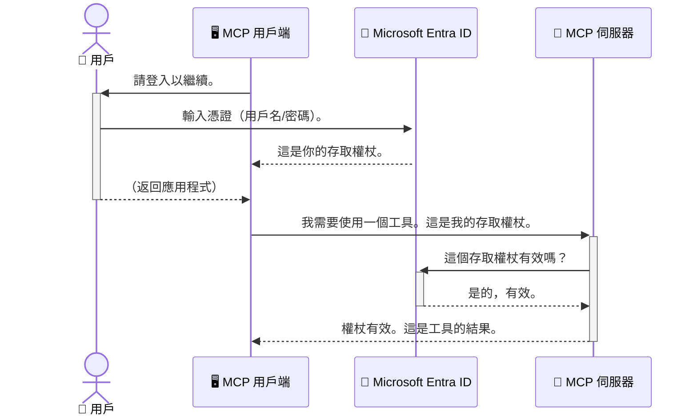

# 保護 AI 工作流程：Model Context Protocol 伺服器的 Entra ID 認證

## 簡介
保護您的 Model Context Protocol (MCP) 伺服器就像鎖上您家門的前門一樣重要。將 MCP 伺服器敞開將使您的工具和數據暴露於未經授權的存取，這可能導致安全漏洞。Microsoft Entra ID 提供強大且基於雲端的身份及存取管理解決方案，有助於確保只有經授權的使用者和應用程序能與您的 MCP 伺服器互動。在本節中，您將學會如何使用 Entra ID 認證來保護您的 AI 工作流程。

## 學習目標
完成本節後，您將能夠：

- 理解保護 MCP 伺服器的重要性。
- 解釋 Microsoft Entra ID 及 OAuth 2.0 認證的基礎知識。
- 辨識公開客戶端與機密客戶端的差異。
- 在本地（公開客戶端）與遠程（機密客戶端） MCP 伺服器場景中實作 Entra ID 認證。
- 在開發 AI 工作流程時應用安全最佳實踐。

## 安全性與 MCP

正如您不會讓家門前門敞開不鎖，您也不應讓 MCP 伺服器任由任何人存取。保護您的 AI 工作流程對建構強健、值得信賴且安全的應用程序至關重要。本章將介紹如何使用 Microsoft Entra ID 來保護您的 MCP 伺服器，確保只有經授權的使用者和應用能存取您的工具和數據。

## 為什麼 MCP 伺服器的安全性重要

想像您的 MCP 伺服器擁有一個可以發送郵件或訪問客戶資料庫的工具。不安全的伺服器意味著任何人都可能使用該工具，導致未經授權的資料存取、垃圾郵件或其他惡意行為。

透過實作認證，您可以確保每個對伺服器的請求都經過驗證，確認發出請求的是使用者或應用的身份。這是保護您的 AI 工作流程的第一且最關鍵的一步。

## Microsoft Entra ID 簡介

[**Microsoft Entra ID**](https://adoption.microsoft.com/microsoft-security/entra/) 是一項基於雲端的身份及存取管理服務。可以把它想像為您應用的萬用安全守衛。它負責處理複雜的使用者身份驗證（authentication）和權限決定（authorization）過程。

使用 Entra ID，您可以：

- 啟用使用者安全登入。
- 保護 API 和服務。
- 從集中位置管理存取政策。

對於 MCP 伺服器，Entra ID 提供強大且廣受信賴的解決方案，用來管理誰能存取您的伺服器功能。

---

## 了解奧妙：Entra ID 認證是如何運作的

Entra ID 採用開放標準如 **OAuth 2.0** 來管理認證。雖然細節可能相當複雜，但核心概念很簡單，可以用類比來理解。

### OAuth 2.0 的溫和介紹：代客鑰匙

把 OAuth 2.0 想像成您的汽車代客服務。當您到達餐廳時，您不會給代客您的主鑰匙，而是給一把 <strong>代客鑰匙</strong>，它有有限權限—可以啟動車子和鎖門，但無法打開後車廂或手套箱。

在這個類比中：

- <strong>您</strong> 是 <strong>使用者</strong>。
- <strong>您的車</strong> 是擁有寶貴工具和數據的 **MCP 伺服器**。
- <strong>代客者</strong> 是 **Microsoft Entra ID**。
- <strong>停車場服務員</strong> 是 **MCP 客戶端**（嘗試存取伺服器的應用）。
- <strong>代客鑰匙</strong> 是 **存取令牌（Access Token）**。

存取令牌是由 MCP 客戶端在您登入後從 Entra ID 取得的一組安全文字字串。客戶端隨每次請求將此令牌提交給 MCP 伺服器。伺服器可驗證令牌，以確保請求合法且客戶端擁有必要權限，而且永遠不需處理您的實際憑證（例如密碼）。

### 認證流程

以下是流程運作方式：



### 介紹 Microsoft Authentication Library (MSAL)

在深入範例程式碼前，重要的是要介紹您會看到的重要組件：**Microsoft Authentication Library (MSAL)**。

MSAL 是 Microsoft 開發的函式庫，它讓開發人員更容易處理認證。您不必編寫所有處理安全令牌、登入和會話續期的複雜程式碼，MSAL 全都幫您完成。

使用 MSAL 有以下好處：

- **安全性高：** 它實作業界標準協定及安全最佳實踐，降低程式碼中可能的漏洞風險。
- **開發簡化：** 抽象化 OAuth 2.0 和 OpenID Connect 協定的複雜性，只需幾行程式碼即能為應用添加穩健的認證。
- **持續維護：** Microsoft 積極維護與更新 MSAL，以應對新的安全威脅和平台變更。

MSAL 支援多種語言與應用程式框架，包括 .NET、JavaScript/TypeScript、Python、Java、Go，以及 iOS 和 Android 等行動平台。這意味著您可以在整個技術棧中使用一致的認證模式。

想了解更多 MSAL，您可參考官方 [MSAL 概覽文件](https://learn.microsoft.com/entra/identity-platform/msal-overview)。

---

## 使用 Entra ID 保護您的 MCP 伺服器：逐步指南

現在，我們來介紹如何使用 Entra ID 來保護一個本地 MCP 伺服器（透過 `stdio` 通訊）。此範例採用 <strong>公開客戶端</strong>，適用於在使用者機器上運行的應用程式，例如桌面程式或本地開發伺服器。

### 情境 1：保護本地 MCP 伺服器（使用公開客戶端）

在這個情境中，我們將展示一個本地運行、透過 `stdio` 通訊的 MCP 伺服器，並在允許存取其工具之前，透過 Entra ID 來作使用者身份驗證。伺服器將提供一個工具，從 Microsoft Graph API 擷取使用者的個人資料資訊。

#### 1. 在 Entra ID 中設定應用程式

撰寫程式碼之前，您需要在 Microsoft Entra ID 中註冊應用程式。這會告訴 Entra ID 有關您的應用程式資訊並授權其使用認證服務。

1. 前往 **[Microsoft Entra 門戶](https://entra.microsoft.com/)**。
2. 進入 <strong>應用程式註冊</strong> 並點擊 <strong>新增註冊</strong>。
3. 給您的應用程式命名（例如：「我的本地 MCP 伺服器」）。
4. 在 <strong>支援的帳戶類型</strong> 中選擇 <strong>僅限本組織目錄中的帳戶</strong>。
5. 本範例可以留空 **重新導向 URI**。
6. 點擊 <strong>註冊</strong>。

註冊後，請記下 **應用程式（用戶端）ID** 和 **目錄（租戶）ID**。這些資訊稍後在程式碼中會用到。

#### 2. 程式碼解析

讓我們來看看處理認證的關鍵程式碼部分。完整程式碼可參考 [mcp-auth-servers GitHub 倉庫](https://github.com/Azure-Samples/mcp-auth-servers)的 [Entra ID - Local - WAM](https://github.com/Azure-Samples/mcp-auth-servers/tree/main/src/entra-id-local-wam) 資料夾。

**`AuthenticationService.cs`**

此類負責與 Entra ID 的互動。

- **`CreateAsync`**：此方法使用您的應用程式 `clientId` 和 `tenantId` 來初始化 MSAL 的 `PublicClientApplication`。
- **`WithBroker`**：啟用代理服務（例如 Windows Web Account Manager），提供更安全且無縫的單一登入體驗。
- **`AcquireTokenAsync`**：主要方法。它會先嘗試靜默取得令牌（如果已有有效會話，使用者不用重新登入）。若無法靜默取得，則會互動式提示使用者登入。

```csharp
// Simplified for clarity
public static async Task<AuthenticationService> CreateAsync(ILogger<AuthenticationService> logger)
{
    var msalClient = PublicClientApplicationBuilder
        .Create(_clientId) // Your Application (client) ID
        .WithAuthority(AadAuthorityAudience.AzureAdMyOrg)
        .WithTenantId(_tenantId) // Your Directory (tenant) ID
        .WithBroker(new BrokerOptions(BrokerOptions.OperatingSystems.Windows))
        .Build();

    // ... cache registration ...

    return new AuthenticationService(logger, msalClient);
}

public async Task<string> AcquireTokenAsync()
{
    try
    {
        // Try silent authentication first
        var accounts = await _msalClient.GetAccountsAsync();
        var account = accounts.FirstOrDefault();

        AuthenticationResult? result = null;

        if (account != null)
        {
            result = await _msalClient.AcquireTokenSilent(_scopes, account).ExecuteAsync();
        }
        else
        {
            // If no account, or silent fails, go interactive
            result = await _msalClient.AcquireTokenInteractive(_scopes).ExecuteAsync();
        }

        return result.AccessToken;
    }
    catch (Exception ex)
    {
        _logger.LogError(ex, "An error occurred while acquiring the token.");
        throw; // Optionally rethrow the exception for higher-level handling
    }
}
```

**`Program.cs`**

這裡設置 MCP 伺服器並整合認證服務。

- **`AddSingleton<AuthenticationService>`**：將 `AuthenticationService` 註冊至依賴注入容器，方便其他部分（如工具）使用。
- **`GetUserDetailsFromGraph` 工具**：此工具需要 `AuthenticationService` 實例。在執行前會呼叫 `authService.AcquireTokenAsync()` 取得有效存取令牌。認證成功後，用該令牌呼叫 Microsoft Graph API 來擷取使用者詳細資訊。

```csharp
// Simplified for clarity
[McpServerTool(Name = "GetUserDetailsFromGraph")]
public static async Task<string> GetUserDetailsFromGraph(
    AuthenticationService authService)
{
    try
    {
        // This will trigger the authentication flow
        var accessToken = await authService.AcquireTokenAsync();

        // Use the token to create a GraphServiceClient
        var graphClient = new GraphServiceClient(
            new BaseBearerTokenAuthenticationProvider(new TokenProvider(authService)));

        var user = await graphClient.Me.GetAsync();

        return System.Text.Json.JsonSerializer.Serialize(user);
    }
    catch (Exception ex)
    {
        return $"Error: {ex.Message}";
    }
}
```

#### 3. 整體運作流程

1. MCP 客戶端嘗試使用 `GetUserDetailsFromGraph` 工具，工具先呼叫 `AcquireTokenAsync`。
2. `AcquireTokenAsync` 觸發 MSAL 函式庫檢查現有有效令牌。
3. 若未找到令牌，MSAL 透過代理提示使用者用 Entra ID 帳戶登入。
4. 使用者完成登入後，Entra ID 發出存取令牌。
5. 工具收到令牌後，使用它安全呼叫 Microsoft Graph API。
6. 使用者資訊回傳至 MCP 客戶端。

此流程確保只有經過身份驗證的使用者能使用工具，從而有效保護您的本地 MCP 伺服器。

### 情境 2：保護遠端 MCP 伺服器（使用機密客戶端）

當 MCP 伺服器在遠端機器（如雲端伺服器）上運行，並透過 HTTP Streaming 類協定通訊時，安全需求有所不同。此時應使用 <strong>機密客戶端</strong> 與 **授權碼流程（Authorization Code Flow）**。此方法較安全，因為應用程式的金鑰不會暴露給瀏覽器。

本範例使用以 TypeScript 為基礎的 MCP 伺服器，並使用 Express.js 處理 HTTP 請求。

#### 1. 在 Entra ID 中設定應用程式

Entra ID 的設定與公開客戶端類似，唯一主要差異是您需建立 <strong>用戶端機密</strong>。

1. 前往 **[Microsoft Entra 門戶](https://entra.microsoft.com/)**。
2. 在您的應用程式註冊中，前往 <strong>憑證及機密</strong> 分頁。
3. 點擊 <strong>新增用戶端機密</strong>，輸入描述後點擊 <strong>新增</strong>。
4. **重要：** 請立即複製機密值，稍後無法再次查看。
5. 您還需要設定 **重新導向 URI**。進入 <strong>認證</strong> 分頁，點擊 <strong>新增平台</strong>，選擇 <strong>網頁</strong>，並輸入應用程式的重新導向 URI（例如 `http://localhost:3001/auth/callback`）。

> **⚠️ 重要安全提示：** 對於生產應用，Microsoft 強烈建議使用 <strong>無機密認證</strong> 方法，如 **管理身分（Managed Identity）** 或 **工作負載身分聯盟（Workload Identity Federation）**，以取代用戶端機密。用戶端機密有暴露或被入侵的風險。管理身分透過消除需要在程式碼或設定中存儲憑證，提供更安全的方式。
> 
> 有關管理身分及其實作更多資訊，請參見 [Azure 資源管理身分概覽](https://learn.microsoft.com/entra/identity/managed-identities-azure-resources/overview)。

#### 2. 程式碼解析

此範例採用會話（session）為基礎的方法。使用者一旦認證，伺服器便將存取令牌和續期令牌存於會話中，給予使用者會話令牌。此會話令牌用於後續請求。完整程式碼可參考 [mcp-auth-servers GitHub 倉庫](https://github.com/Azure-Samples/mcp-auth-servers)的 [Entra ID - Confidential client](https://github.com/Azure-Samples/mcp-auth-servers/tree/main/src/entra-id-cca-session) 資料夾。

**`Server.ts`**

此檔設置 Express 伺服器與 MCP 傳輸層。

- **`requireBearerAuth`**：中介軟體，保護 `/sse` 和 `/message` 端點。它會檢查請求的 `Authorization` 標頭中是否有有效的持權人（bearer token）。
- **`EntraIdServerAuthProvider`**：自訂類別，實作 `McpServerAuthorizationProvider` 介面。負責處理 OAuth 2.0 流程。
- **`/auth/callback`**：處理使用者完成 Entra ID 認證後的重新導向此端點。它會將授權碼兌換為存取令牌和續期令牌。

```typescript
// 為清晰而簡化
const app = express();
const { server } = createServer();
const provider = new EntraIdServerAuthProvider();

// 保護 SSE 端點
app.get("/sse", requireBearerAuth({
  provider,
  requiredScopes: ["User.Read"]
}), async (req, res) => {
  // ... 連接到傳輸 ...
});

// 保護訊息端點
app.post("/message", requireBearerAuth({
  provider,
  requiredScopes: ["User.Read"]
}), async (req, res) => {
  // ... 處理訊息 ...
});

// 處理 OAuth 2.0 回調
app.get("/auth/callback", (req, res) => {
  provider.handleCallback(req.query.code, req.query.state)
    .then(result => {
      // ... 處理成功或失敗 ...
    });
});
```

**`Tools.ts`**

此檔定義 MCP 伺服器所提供的工具。`getUserDetails` 工具與先前範例相似，但它從會話取得存取令牌。

```typescript
// 簡化以提高清晰度
server.setRequestHandler(CallToolRequestSchema, async (request) => {
  const { name } = request.params;
  const context = request.params?.context as { token?: string } | undefined;
  const sessionToken = context?.token;

  if (name === ToolName.GET_USER_DETAILS) {
    if (!sessionToken) {
      throw new AuthenticationError("Authentication token is missing or invalid. Ensure the token is provided in the request context.");
    }

    // 從會話儲存中獲取 Entra ID 令牌
    const tokenData = tokenStore.getToken(sessionToken);
    const entraIdToken = tokenData.accessToken;

    const graphClient = Client.init({
      authProvider: (done) => {
        done(null, entraIdToken);
      }
    });

    const user = await graphClient.api('/me').get();

    // … 返回用戶詳情 …
  }
});
```

**`auth/EntraIdServerAuthProvider.ts`**

此類處理：

- 將使用者導向 Entra ID 登入頁面。
- 交換授權碼以取得存取令牌。
- 將令牌儲存在 `tokenStore`。
- 在存取令牌過期時自動續期。

#### 3. 整體運作流程

1. 使用者第一次嘗試連線到 MCP 伺服器時，`requireBearerAuth` 中介軟體會檢查到其無有效會話，並將其重新導向至 Entra ID 登入頁面。
2. 使用者以其 Entra ID 帳戶登入。
3. Entra ID 將使用者重新導向回 `/auth/callback` 端點並附加授權碼。
4. 伺服器交換該授權碼以取得存取權杖與重新整理權杖，將它們儲存，並建立一個會話權杖傳送給客戶端。
5. 客戶端現在可在未來對 MCP 伺服器的所有請求中使用此會話權杖放在 `Authorization` 標頭內。
6. 當呼叫 `getUserDetails` 工具時，它會使用會話權杖查找 Entra ID 存取權杖，然後使用該權杖呼叫 Microsoft Graph API。

此流程比公用用戶端流程更複雜，但對於面向網際網路的端點是必須的。由於遠端 MCP 伺服器可透過公共網際網路存取，需採取更強的安全措施以防止未經授權的存取和潛在攻擊。


## 安全最佳實務

- **始終使用 HTTPS**：加密客戶端與伺服器間的通訊，以防止權杖被攔截。
- **實作基於角色的存取控制 (RBAC)**：不只檢查使用者是否已驗證；還要檢查使用者被授權執行什麼操作。您可以在 Entra ID 中定義角色，並在您的 MCP 伺服器中檢查這些角色。
- <strong>監控與稽核</strong>：記錄所有驗證事件，以便偵測並回應可疑活動。
- <strong>處理速率限制和節流</strong>：Microsoft Graph 及其他 API 實作速率限制以防止濫用。在您的 MCP 伺服器中實作指數回退與重試機制，以優雅地處理 HTTP 429（請求過多）回應。考慮快取常存取的資料，以減少 API 呼叫。
- <strong>安全儲存權杖</strong>：安全儲存存取權杖與重新整理權杖。對於本機應用程式，使用系統的安全儲存機制。對於伺服器應用程式，考慮使用加密儲存或安全金鑰管理服務，如 Azure Key Vault。
- <strong>權杖過期處理</strong>：存取權杖壽命有限。實作自動使用重新整理權杖來續期，以維持順暢的使用者體驗且不需重新驗證。
- **考慮使用 Azure API Management**：雖然直接在您的 MCP 伺服器中實作安全性可獲得細緻控制，但像 Azure API Management 這類 API 閘道可自動處理許多安全問題，包括驗證、授權、速率限制與監控。它們提供介於您的客戶端與 MCP 伺服器之間的集中式安全層。欲知使用 API 閘道與 MCP 的更多細節，請參閱我們的[Azure API Management Your Auth Gateway For MCP Servers](https://techcommunity.microsoft.com/blog/integrationsonazureblog/azure-api-management-your-auth-gateway-for-mcp-servers/4402690)。


## 主要重點

- 確保您的 MCP 伺服器安全對於保護您的資料和工具至關重要。
- Microsoft Entra ID 提供強健且可擴展的驗證與授權解決方案。
- 本機應用程式使用 <strong>公用用戶端</strong>，遠端伺服器使用 <strong>機密用戶端</strong>。
- <strong>授權碼流程</strong> 是網頁應用程式中最安全的選擇。


## 練習

1. 思考您可能要建立的 MCP 伺服器，是本機伺服器還是遠端伺服器？
2. 根據您的回答，您會使用公用用戶端還是機密用戶端？
3. 您的 MCP 伺服器會請求什麼權限以執行 Microsoft Graph 上的操作？


## 實作練習

### 練習 1：在 Entra ID 註冊應用程式
前往 Microsoft Entra 入口網站。  
註冊您的 MCP 伺服器的新應用程式。  
記錄應用程式 (client) ID 與目錄 (tenant) ID。

### 練習 2：保護本機 MCP 伺服器 (公用客戶端)
- 參照程式範例整合 MSAL (Microsoft Authentication Library) 以實作使用者驗證。
- 透過呼叫從 Microsoft Graph 擷取使用者資訊的 MCP 工具測試驗證流程。

### 練習 3：保護遠端 MCP 伺服器 (機密客戶端)
- 在 Entra ID 註冊機密用戶端並建立用戶端密碼。
- 將您的 Express.js MCP 伺服器設定為使用授權碼流程。
- 測試保護的端點並確認基於權杖的存取。

### 練習 4：套用安全最佳實務
- 啟用本機或遠端伺服器的 HTTPS。
- 在伺服器邏輯中實作基於角色的存取控制 (RBAC)。
- 新增權杖過期處理與安全儲存權杖。


## 資源

1. **MSAL 概觀文件**  
   了解 Microsoft Authentication Library (MSAL) 如何跨平台安全取得權杖：  
   [MSAL Overview on Microsoft Learn](https://learn.microsoft.com/en-gb/entra/msal/overview)

2. **Azure-Samples/mcp-auth-servers GitHub 儲存庫**  
   MCP 伺服器驗證流程的參考實作：  
   [Azure-Samples/mcp-auth-servers on GitHub](https://github.com/Azure-Samples/mcp-auth-servers)

3. **Azure 資源的受控識別概觀**  
   瞭解如何使用系統或使用者指派的受控識別來消除機密資訊：  
   [Managed Identities Overview on Microsoft Learn](https://learn.microsoft.com/en-us/entra/identity/managed-identities-azure-resources/)

4. **Azure API Management：您的 MCP 伺服器驗證閘道**  
   深入探討使用 APIM 作為 MCP 伺服器的安全 OAuth2 閘道：  
   [Azure API Management Your Auth Gateway For MCP Servers](https://techcommunity.microsoft.com/blog/integrationsonazureblog/azure-api-management-your-auth-gateway-for-mcp-servers/4402690)

5. **Microsoft Graph 權限參考**  
   Microsoft Graph 的委派與應用程式權限完整列表：  
   [Microsoft Graph Permissions Reference](https://learn.microsoft.com/zh-tw/graph/permissions-reference)


## 學習成果
完成本節後，您將能：

- 說明為何驗證對 MCP 伺服器與 AI 工作流程至關重要。
- 為本機與遠端 MCP 伺服器情境設定與配置 Entra ID 驗證。
- 根據伺服器部署選擇適當的用戶端類型（公用還是機密）。
- 實作安全編碼實務，包括權杖儲存與基於角色的授權。
- 自信地保護您的 MCP 伺服器及其工具免受未經授權存取。

## 接下來

- [5.13 Model Context Protocol (MCP) Integration with Microsoft Foundry](../mcp-foundry-agent-integration/README.md)

---

<!-- CO-OP TRANSLATOR DISCLAIMER START -->
**免責聲明**：
本文件使用 AI 翻譯服務 [Co-op Translator](https://github.com/Azure/co-op-translator) 進行翻譯。雖然我們力求準確，但請注意，自動翻譯可能包含錯誤或不準確之處。原始文件的母語版本應被視為權威來源。對於重要資訊，建議尋求專業人工翻譯。我們不對因使用本翻譯而引起的任何誤解或曲解承擔責任。
<!-- CO-OP TRANSLATOR DISCLAIMER END -->