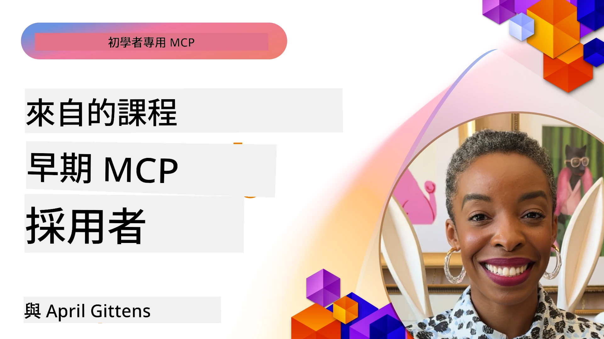

# 🌟 早期採用者的經驗教訓

[](https://youtu.be/jds7dSmNptE)

_(點擊上方圖片觀看本課程影片)_

## 🎯 本模組涵蓋內容

本模組探討了真實組織與開發者如何運用模型上下文協議（MCP）來解決實際挑戰並推動創新。透過詳細案例研究、實戰專案及實用範例，你將發現 MCP 如何實現安全、可擴展的 AI 整合，連接語言模型、工具與企業數據。

### 📚 體驗 MCP 實際應用

想看到這些原則應用於可生產環境的工具嗎？請參閱我們的[**10 個正在改變開發者生產力的 Microsoft MCP 伺服器**](microsoft-mcp-servers.md)，這裡展示了可立即使用的真實 Microsoft MCP 伺服器。

## 概述

本課程探討早期使用者如何運用模型上下文協議（MCP）來解決現實世界問題並推動跨產業創新。透過詳盡案例與實作專案，你將了解到 MCP 如何實現標準化、安全且可擴展的 AI 整合——在一個統一框架中連接大型語言模型、工具與企業數據。你將獲得設計與構建 MCP 解決方案的實用經驗，學習經過驗證的實作模式，並發掘在生產環境中部署 MCP 的最佳實務。此外，課程還強調新興趨勢、未來方向及開源資源，助你掌握 MCP 技術及其不斷發展的生態系統前沿。

## 學習目標

- 分析跨產業的真實 MCP 實作案例  
- 設計並建立完整的 MCP 應用程式  
- 探索 MCP 技術的新興趨勢與未來方向  
- 在實際開發場景中應用最佳實務  

## 真實 MCP 實作案例

### 案例研究 1：企業客戶支援自動化

一家跨國企業實施了 MCP 基礎解決方案，以標準化其客戶支援系統中的 AI 互動。此舉使他們能夠：

- 建立多個大型語言模型供應商的統一介面  
- 維持跨部門一致的提示管理  
- 實施健全的安全與合規控制  
- 根據特定需求輕鬆切換 AI 模型  

**技術實作：**

```python
# Python MCP 伺服器實作，用於客戶支援
import logging
import asyncio
from modelcontextprotocol import create_server, ServerConfig
from modelcontextprotocol.server import MCPServer
from modelcontextprotocol.transports import create_http_transport
from modelcontextprotocol.resources import ResourceDefinition
from modelcontextprotocol.prompts import PromptDefinition
from modelcontextprotocol.tool import ToolDefinition

# 配置日誌記錄
logging.basicConfig(level=logging.INFO)

async def main():
    # 創建伺服器配置
    config = ServerConfig(
        name="Enterprise Customer Support Server",
        version="1.0.0",
        description="MCP server for handling customer support inquiries"
    )
    
    # 初始化 MCP 伺服器
    server = create_server(config)
    
    # 註冊知識庫資源
    server.resources.register(
        ResourceDefinition(
            name="customer_kb",
            description="Customer knowledge base documentation"
        ),
        lambda params: get_customer_documentation(params)
    )
    
    # 註冊提示模板
    server.prompts.register(
        PromptDefinition(
            name="support_template",
            description="Templates for customer support responses"
        ),
        lambda params: get_support_templates(params)
    )
    
    # 註冊支援工具
    server.tools.register(
        ToolDefinition(
            name="ticketing",
            description="Create and update support tickets"
        ),
        handle_ticketing_operations
    )
    
    # 使用 HTTP 傳輸啟動伺服器
    transport = create_http_transport(port=8080)
    await server.run(transport)

if __name__ == "__main__":
    asyncio.run(main())
```
  
**成果：** 模型成本降低 30%，回應一致性提升 45%，並加強全球營運的合規性。

### 案例研究 2：醫療診斷助理

一間醫療服務提供者建立了 MCP 基礎架構，以整合多個專業醫療 AI 模型，同時確保敏感患者資料受保護：

- 在通用與專科醫療模型間無縫切換  
- 嚴格的隱私控制與審計軌跡  
- 與既有電子健康紀錄（EHR）系統整合  
- 醫學術語的一致性提示工程  

**技術實作：**

```csharp
// C# MCP host application implementation in healthcare application
using Microsoft.Extensions.DependencyInjection;
using ModelContextProtocol.SDK.Client;
using ModelContextProtocol.SDK.Security;
using ModelContextProtocol.SDK.Resources;

public class DiagnosticAssistant
{
    private readonly MCPHostClient _mcpClient;
    private readonly PatientContext _patientContext;
    
    public DiagnosticAssistant(PatientContext patientContext)
    {
        _patientContext = patientContext;
        
        // Configure MCP client with healthcare-specific settings
        var clientOptions = new ClientOptions
        {
            Name = "Healthcare Diagnostic Assistant",
            Version = "1.0.0",
            Security = new SecurityOptions
            {
                Encryption = EncryptionLevel.Medical,
                AuditEnabled = true
            }
        };
        
        _mcpClient = new MCPHostClientBuilder()
            .WithOptions(clientOptions)
            .WithTransport(new HttpTransport("https://healthcare-mcp.example.org"))
            .WithAuthentication(new HIPAACompliantAuthProvider())
            .Build();
    }
    
    public async Task<DiagnosticSuggestion> GetDiagnosticAssistance(
        string symptoms, string patientHistory)
    {
        // Create request with appropriate resources and tool access
        var resourceRequest = new ResourceRequest
        {
            Name = "patient_records",
            Parameters = new Dictionary<string, object>
            {
                ["patientId"] = _patientContext.PatientId,
                ["requestingProvider"] = _patientContext.ProviderId
            }
        };
        
        // Request diagnostic assistance using appropriate prompt
        var response = await _mcpClient.SendPromptRequestAsync(
            promptName: "diagnostic_assistance",
            parameters: new Dictionary<string, object>
            {
                ["symptoms"] = symptoms,
                patientHistory = patientHistory,
                relevantGuidelines = _patientContext.GetRelevantGuidelines()
            });
            
        return DiagnosticSuggestion.FromMCPResponse(response);
    }
}
```
  
**成果：** 提升醫師診斷建議，同時完全遵守 HIPAA 規範，大幅減少系統間的上下文切換。

### 案例研究 3：金融服務風險分析

一家金融機構採用 MCP 標準化其跨部門的風險分析流程：

- 建立統一介面以整合信用風險、詐欺偵測與投資風險模型  
- 實施嚴格的存取控制與模型版本管理  
- 確保所有 AI 建議可審查  
- 維持跨系統的一致資料格式  

**技術實作：**

```java
// Java MCP 服務器用於金融風險評估
import org.mcp.server.*;
import org.mcp.security.*;

public class FinancialRiskMCPServer {
    public static void main(String[] args) {
        // 建立具備金融合規功能的 MCP 服務器
        MCPServer server = new MCPServerBuilder()
            .withModelProviders(
                new ModelProvider("risk-assessment-primary", new AzureOpenAIProvider()),
                new ModelProvider("risk-assessment-audit", new LocalLlamaProvider())
            )
            .withPromptTemplateDirectory("./compliance/templates")
            .withAccessControls(new SOCCompliantAccessControl())
            .withDataEncryption(EncryptionStandard.FINANCIAL_GRADE)
            .withVersionControl(true)
            .withAuditLogging(new DatabaseAuditLogger())
            .build();
            
        server.addRequestValidator(new FinancialDataValidator());
        server.addResponseFilter(new PII_RedactionFilter());
        
        server.start(9000);
        
        System.out.println("Financial Risk MCP Server running on port 9000");
    }
}
```
  
**成果：** 強化法規合規性，模型部署週期加快 40%，提升各部門風險評估一致性。

### 案例研究 4：Microsoft Playwright MCP 伺服器用於瀏覽器自動化

Microsoft 開發了[Playwright MCP 伺服器](https://github.com/microsoft/playwright-mcp)，透過模型上下文協議實現安全、標準化的瀏覽器自動化。此生產就緒伺服器允許 AI 代理和大型語言模型以受控、可審計且可擴展的方式與網頁瀏覽器互動，支援自動化網頁測試、資料擷取和端到端工作流程等應用。

> **🎯 生產就緒工具**  
> 
> 本案例展示了你今日即可使用的真實 MCP 伺服器！深入了解 Playwright MCP 伺服器及其他 9 個生產就緒的 Microsoft MCP 伺服器，請參閱我們的[**Microsoft MCP 伺服器指南**](microsoft-mcp-servers.md#8--playwright-mcp-server)。

**主要功能：**  
- 將瀏覽器自動化功能（導航、表單填寫、螢幕截圖等）作為 MCP 工具公開  
- 實裝嚴格存取控制與沙箱機制防止未授權操作  
- 提供所有瀏覽器互動的詳細審計日誌  
- 支援與 Azure OpenAI 及其他大型語言模型供應商整合，實現代理驅動的自動化  
- 為 GitHub Copilot 的編碼代理提供網頁瀏覽功能  

**技術實作：**

```typescript
// TypeScript：喺MCP伺服器登記Playwright瀏覽器自動化工具
import { createServer, ToolDefinition } from 'modelcontextprotocol';
import { launch } from 'playwright';

const server = createServer({
  name: 'Playwright MCP Server',
  version: '1.0.0',
  description: 'MCP server for browser automation using Playwright'
});

// 登記一個用於導航到URL並捕捉截圖嘅工具
server.tools.register(
  new ToolDefinition({
    name: 'navigate_and_screenshot',
    description: 'Navigate to a URL and capture a screenshot',
    parameters: {
      url: { type: 'string', description: 'The URL to visit' }
    }
  }),
  async ({ url }) => {
    const browser = await launch();
    const page = await browser.newPage();
    await page.goto(url);
    const screenshot = await page.screenshot();
    await browser.close();
    return { screenshot };
  }
);

// 啟動MCP伺服器
server.listen(8080);
```
  
**成果：**

- 為 AI 代理和大型語言模型啟用安全且程式化的瀏覽器自動化  
- 降低人工測試工時並提升網頁應用測試覆蓋率  
- 提供適用於企業環境的可重用、可擴展瀏覽器工具整合框架  
- 支援 GitHub Copilot 的網路瀏覽功能  

**參考資料：**

- [Playwright MCP 伺服器 GitHub 倉庫](https://github.com/microsoft/playwright-mcp)  
- [Microsoft AI 與自動化解決方案](https://azure.microsoft.com/en-us/products/ai-services/)  

### 案例研究 5：Azure MCP – 企業級模型上下文協議雲服務

Azure MCP Server ([https://aka.ms/azmcp](https://aka.ms/azmcp)) 是 Microsoft 提供的模型上下文協議托管企業級實作，設計為提供可擴展、安全且合規的 MCP 伺服器雲端服務。Azure MCP 助力組織快速部署、管理並整合 MCP 伺服器與 Azure AI、資料及安全服務，降低營運負擔並加速 AI 採用。

> **🎯 生產就緒工具**  
> 
> 這是可立即使用的真實 MCP 伺服器！更多關於 Microsoft Foundry MCP 伺服器資訊，請參閱我們的[**Microsoft MCP 伺服器指南**](microsoft-mcp-servers.md)。

- 完整托管 MCP 伺服器主機，具備內建擴展、監控與安全性  
- 原生整合 Azure OpenAI、Azure AI 搜尋及其他 Azure 服務  
- 透過 Microsoft Entra ID 實作企業認證與授權  
- 支援自訂工具、提示範本與資源連接器  
- 符合企業安全與法規要求  

**技術實作：**

```yaml
# Example: Azure MCP server deployment configuration (YAML)
apiVersion: mcp.microsoft.com/v1
kind: McpServer
metadata:
  name: enterprise-mcp-server
spec:
  modelProviders:
    - name: azure-openai
      type: AzureOpenAI
      endpoint: https://<your-openai-resource>.openai.azure.com/
      apiKeySecret: <your-azure-keyvault-secret>
  tools:
    - name: document_search
      type: AzureAISearch
      endpoint: https://<your-search-resource>.search.windows.net/
      apiKeySecret: <your-azure-keyvault-secret>
  authentication:
    type: EntraID
    tenantId: <your-tenant-id>
  monitoring:
    enabled: true
    logAnalyticsWorkspace: <your-log-analytics-id>
```
  
**成果：**  
- 提供現成合規 MCP 伺服器平台，縮短企業 AI 專案落地時間  
- 簡化大型語言模型、工具與企業資料來源整合  
- 強化 MCP 工作負載的安全性、可觀察性與營運效率  
- 透過 Azure SDK 最佳實務與當前驗證模式提升程式碼品質  

**參考資料：**  
- [Azure MCP 文件](https://aka.ms/azmcp)  
- [Azure MCP 伺服器 GitHub 倉庫](https://github.com/Azure/azure-mcp)  
- [Azure AI 服務](https://azure.microsoft.com/en-us/products/ai-services/)  
- [Microsoft MCP 中心](https://mcp.azure.com)  

## 案例研究 6：NLWeb  
MCP（模型上下文協議）是用於聊天機器人與 AI 助理與工具互動的新興協議。每個 NLWeb 實例同時也是 MCP 伺服器，支援一個核心方法 ask，用於以自然語言向網站提問。回傳的回應使用 schema.org，一個廣泛使用的描述網頁數據的詞彙。簡而言之，MCP 對 NLWeb 的關係就像 HTTP 對 HTML。NLWeb 結合協議、Schema.org 格式及範例程式碼，協助網站快速建立這些端點，透過會話介面造福人類，同時使機器能夠以自然的代理對代理互動。

NLWeb 有兩個明確的組成部分：  
- 一套非常簡單的協議，支援以自然語言介面與網站互動，並使用 json 與 schema.org 格式回傳答案。詳情請參閱 REST API 文件。  
- 一個簡易實作，利用現有標記，適用於可抽象為清單項目的網站（產品、食譜、景點、評論等）。結合一組介面元件，站點可以輕鬆提供內容的會話介面。更多資訊請參考「聊天查詢流程（Life of a chat query）」文件。  

**參考資料：**  
- [Azure MCP 文件](https://aka.ms/azmcp)  
- [NLWeb](https://github.com/microsoft/NlWeb)  

### 案例研究 7：Microsoft Foundry MCP 伺服器 – 企業 AI 代理整合

Microsoft Foundry MCP 伺服器示範如何在企業環境中運用 MCP 協調與管理 AI 代理與工作流程。透過整合 MCP 與 Microsoft Foundry，組織能標準化代理互動、利用 Foundry 的工作流程管理，並確保安全且可擴展的部署。

> **🎯 生產就緒工具**  
> 
> 這是實際可用的 MCP 伺服器！更多 Microsoft Foundry MCP 伺服器資訊，請參閱我們的[**Microsoft MCP 伺服器指南**](microsoft-mcp-servers.md#9--microsoft-foundry-mcp-server)。

**主要功能：**  
- 全面存取 Azure AI 生態系統，包括模型目錄與部署管理  
- 透過 Azure AI 搜尋進行知識索引，支援檢索增強生成（RAG）應用  
- 用於 AI 模型效能評估與品質保證的工具  
- 整合 Microsoft Foundry Catalog 與 Labs，探索尖端研究模型  
- 具備代理管理與評估能力，適用於生產環境  

**成果：**  
- 快速原型開發與穩健監控 AI 代理工作流程  
- 無縫整合 Azure AI 服務，支援進階場景  
- 統一介面用於構建、部署與監控代理流程  
- 提升企業安全性、合規性與營運效率  
- 加速 AI 採用，同時維持對複雜代理驅動流程的掌控  

**參考資料：**  
- [Microsoft Foundry MCP 伺服器 GitHub 倉庫](https://github.com/azure-ai-foundry/mcp-foundry)  
- [Azure AI 代理與 MCP 整合（Microsoft Foundry 部落格）](https://devblogs.microsoft.com/foundry/integrating-azure-ai-agents-mcp/)  

### 案例研究 8：Foundry MCP Playground – 試驗與原型開發

Foundry MCP Playground 提供可立即使用的環境，供開發者試驗 MCP 伺服器及 Microsoft Foundry 整合。開發者可快速原型設計、測試並評估 AI 模型與代理工作流程，利用 Microsoft Foundry Catalog 與 Labs 的資源。該 Playground 簡化部署，具備範例專案並支援協作開發，輕鬆探索最佳實務與新場景，降低門檻。尤其適合希望驗證想法、分享實驗及加速學習的團隊，毋須複雜基礎建設。借此促進 MCP 與 Microsoft Foundry 生態系的創新與社群貢獻。

**參考資料：**

- [Foundry MCP Playground GitHub 倉庫](https://github.com/azure-ai-foundry/foundry-mcp-playground)  

### 案例研究 9：Microsoft Learn Docs MCP 伺服器 — AI 驅動的文件存取

Microsoft Learn Docs MCP 伺服器為雲端託管服務，透過模型上下文協議提供 AI 助理即時訪問官方 Microsoft 文件。該生產就緒伺服器連接全面的 Microsoft Learn 生態系，支援官方資料來源的語義搜尋。

> **🎯 生產就緒工具**  
> 
> 這是你現在可用的真實 MCP 伺服器！欲了解更多 Microsoft Learn Docs MCP 伺服器資訊，請參閱我們的[**Microsoft MCP 伺服器指南**](microsoft-mcp-servers.md#1--microsoft-learn-docs-mcp-server)。

**主要功能：**  
- 即時存取 Microsoft 正式文件、Azure 文件及 Microsoft 365 文件  
- 具備理解上下文與意圖的進階語義搜尋能力  
- Microsoft Learn 發布內容隨時更新  
- 全面涵蓋 Microsoft Learn、Azure 文件及 Microsoft 365 來源  
- 回傳多達 10 筆高品質內容片段，包含文章標題與 URL  

**重要性：**  
- 解決 Microsoft 技術的「過時 AI 知識」問題  
- 確保 AI 助理掌握最新 .NET、C#、Azure 和 Microsoft 365 功能  
- 提供權威第一方資訊，確保生成代碼準確無誤  
- 對於開發快速演進的 Microsoft 技術的開發者至關重要  

**成果：**  
- 大幅提升 AI 生成 Microsoft 技術代碼的準確度  
- 減少搜尋最新文件與最佳實務的時間  
- 提升開發者生產力，支援上下文感知的文件檢索  
- 與開發工作流程無縫整合，無需離開 IDE  

**參考資料：**  
- [Microsoft Learn Docs MCP 伺服器 GitHub 倉庫](https://github.com/MicrosoftDocs/mcp)  
- [Microsoft Learn 文件](https://learn.microsoft.com/)  

## 實戰專案

### 專案 1：構建多供應商 MCP 伺服器

**目標：** 建立一個能根據特定條件將請求路由至多個 AI 模型供應商的 MCP 伺服器。

**需求：**

- 支援至少三個不同模型供應商（例如 OpenAI、Anthropic、本地模型）  
- 實作基於請求元資料的路由機制  
- 建立一套管理供應商認證的配置系統  
- 加入快取以優化效能與成本  
- 建置簡易儀表板監控使用情況  

**實作步驟：**

1. 設定基本 MCP 伺服器基礎架構  
2. 為各 AI 模型服務實作供應商適配器  
3. 根據請求屬性建立路由邏輯  
4. 加入針對高頻請求的快取機制  
5. 開發監控儀表板  
6. 以多種請求模式進行測試  

**技術選用：**  
可依個人喜好選擇 Python（.NET/Java/Python）、Redis 作為快取，及簡易網頁框架建置儀表板。

### 專案 2：企業提示管理系統

**目標：** 開發一個基於 MCP 的系統，用於管理、版本控制及跨組織部署提示範本。

**需求：**
- 建立一個集中式的提示模板庫
- 實作版本控管與審核工作流程
- 建立帶有範例輸入的模板測試功能
- 開發基於角色的存取控制
- 建立用於模板擷取與部署的 API

**實作步驟：**

1. 設計模板儲存的資料庫結構
2. 建立模板 CRUD 操作的核心 API
3. 實作版本控管系統
4. 建立審核工作流程
5. 開發測試框架
6. 建立簡易的網頁管理介面
7. 與 MCP 伺服器整合

**技術選擇：** 您可依喜好選擇後端框架、SQL 或 NoSQL 資料庫，以及用於管理介面的前端框架。

### 專案 3：基於 MCP 的內容生成平台

**目標：** 建立一個內容生成平台，利用 MCP 提供不同內容類型的一致輸出結果。

**需求：**

- 支援多種內容格式（部落格文章、社群媒體、行銷文案）
- 實作基於模板的生成並具備自訂選項
- 建立內容檢視與反饋系統
- 追蹤內容效能指標
- 支援內容版本控管與迭代

**實作步驟：**

1. 建置 MCP 用戶端基礎架構
2. 建立不同內容類型的模板
3. 建立內容生成管線
4. 實作檢視系統
5. 開發效能指標追蹤系統
6. 建立用於模板管理及內容生成的用戶介面

**技術選擇：** 您喜愛的程式語言、網頁框架與資料庫系統。

## MCP 技術的未來方向

### 新興趨勢

1. **多模態 MCP**
   - 擴展 MCP 以標準化與影像、音訊及影片模型的互動
   - 發展跨模態推理能力
   - 不同模態的標準化提示格式

2. **聯邦 MCP 基礎架構**
   - 可跨組織共享資源的分散式 MCP 網絡
   - 用於安全模型共享的標準化協議
   - 保護隱私的運算技術

3. **MCP 市場生態**
   - 用於分享與貨幣化 MCP 模板與插件的生態系統
   - 品質保證與認證流程
   - 與模型市場整合

4. **用於邊緣運算的 MCP**
   - 適用於資源受限邊緣設備的 MCP 標準調整
   - 低頻寬環境的優化協議
   - 專為物聯網生態系統打造的 MCP 實作

5. <strong>法規架構</strong>
   - 為符合規範而開發的 MCP 擴展
   - 標準化的審計軌跡與可解釋性介面
   - 與新興 AI 管理框架整合

### 微軟的 MCP 解決方案

微軟與 Azure 已開發多個開源專案，協助開發者在各種場景下實作 MCP：

#### Microsoft Organization

1. [playwright-mcp](https://github.com/microsoft/playwright-mcp) - 用於瀏覽器自動化與測試的 Playwright MCP 伺服器
2. [files-mcp-server](https://github.com/microsoft/files-mcp-server) - OneDrive MCP 伺服器實作，用於本地測試與社群貢獻
3. [NLWeb](https://github.com/microsoft/NlWeb) - NLWeb 為一套開放協定與相關開源工具集合，主要聚焦於建立 AI Web 的基礎層

#### Azure-Samples Organization

1. [mcp](https://github.com/Azure-Samples/mcp) - 提供多語言下 Azure MCP 伺服器建置與整合的範例、工具與資源連結
2. [mcp-auth-servers](https://github.com/Azure-Samples/mcp-auth-servers) - 示範基於現行 Model Context Protocol 規範的認證 MCP 伺服器範例
3. [remote-mcp-functions](https://github.com/Azure-Samples/remote-mcp-functions) - Azure Functions 上遠端 MCP 伺服器實作的入口頁與語言專用倉庫連結
4. [remote-mcp-functions-python](https://github.com/Azure-Samples/remote-mcp-functions-python) - 使用 Python 透過 Azure Functions 建立與部署自訂遠端 MCP 伺服器的快速開始範本
5. [remote-mcp-functions-dotnet](https://github.com/Azure-Samples/remote-mcp-functions-dotnet) - 使用 .NET/C# 透過 Azure Functions 建置與部署自訂遠端 MCP 伺服器的快速開始範本
6. [remote-mcp-functions-typescript](https://github.com/Azure-Samples/remote-mcp-functions-typescript) - 使用 TypeScript 透過 Azure Functions 建置與部署自訂遠端 MCP 伺服器的快速開始範本
7. [remote-mcp-apim-functions-python](https://github.com/Azure-Samples/remote-mcp-apim-functions-python) - 以 Python 使用 Azure API 管理作為遠端 MCP 伺服器的 AI 閘道
8. [AI-Gateway](https://github.com/Azure-Samples/AI-Gateway) - APIM ❤️ AI 實驗，包含 MCP 功能，整合 Azure OpenAI 與 AI Foundry

這些專案提供各種實作、範本與資源，覆蓋不同程式語言與 Azure 服務的 Model Context Protocol 應用。涵蓋範圍從基礎伺服器實作、認證、雲端部署，到企業整合場景。

#### MCP 資源目錄

官方微軟 MCP 倉庫中的 [MCP Resources 目錄](https://github.com/microsoft/mcp/tree/main/Resources) 蒐集了範例資源、提示模板與工具定義，供 MCP 伺服器使用。此目錄設計協助開發者快速啟動 MCP，提供可重用構件與最佳實踐範例：

- **提示模板：** 用於常見 AI 任務與情境的現成提示模板，可調整以配合您的 MCP 伺服器實作。
- **工具定義：** 範例工具架構與元資料，用以標準化不同 MCP 伺服器間的工具整合與呼叫。
- **資源範例：** 連接資料源、API 與外部服務的範例資源定義，適用於 MCP 框架。
- **參考實作：** 展示在真實 MCP 專案中如何結構化與組織資源、提示與工具的實用範例。

這些資源有助加速開發、促進標準化，並確保 MCP 基礎解決方案的最佳操作。

#### MCP 資源目錄

- [MCP 資源（範例提示、工具與資源定義）](https://github.com/microsoft/mcp/tree/main/Resources)

### 研究機會

- 在 MCP 框架下的高效提示優化技術
- 多租戶 MCP 部署的安全模型
- 不同 MCP 實作間的效能基準測試
- MCP 伺服器的形式驗證方法

## 結論

Model Context Protocol (MCP) 正快速塑造跨產業標準化、安全且可互操作的 AI 整合未來。透過本課程的案例研究及實作專案，您已見識 Microsoft 與 Azure 等早期採用者如何利用 MCP 解決實務挑戰、加速 AI 採用，並確保合規、安全與可擴展性。MCP 的模組化方式令組織得以在一致且可審核架構中連接大型語言模型、工具及企業資料。隨著 MCP 持續演進，積極參與社群、探索開源資源並應用最佳實務，將是打造堅實且可面向未來 AI 解決方案的關鍵。

## 附加資源

- [MCP Foundry GitHub 倉庫](https://github.com/azure-ai-foundry/mcp-foundry)
- [Foundry MCP Playground](https://github.com/azure-ai-foundry/foundry-mcp-playground)
- [將 Azure AI 代理整合至 MCP（Microsoft Foundry 部落格）](https://devblogs.microsoft.com/foundry/integrating-azure-ai-agents-mcp/)
- [MCP GitHub 倉庫 (Microsoft)](https://github.com/microsoft/mcp)
- [MCP 資源目錄（範例提示、工具與資源定義）](https://github.com/microsoft/mcp/tree/main/Resources)
- [MCP 社群與文件](https://modelcontextprotocol.io/introduction)
- [MCP 規範（2025-11-25）](https://spec.modelcontextprotocol.io/specification/2025-11-25/)
- [Azure MCP 文件](https://aka.ms/azmcp)
- [OWASP MCP 十大](https://microsoft.github.io/mcp-azure-security-guide/mcp/) - 安全最佳實務
- [Playwright MCP Server GitHub 倉庫](https://github.com/microsoft/playwright-mcp)
- [Files MCP Server (OneDrive)](https://github.com/microsoft/files-mcp-server)
- [Azure-Samples MCP](https://github.com/Azure-Samples/mcp)
- [MCP Auth Servers (Azure-Samples)](https://github.com/Azure-Samples/mcp-auth-servers)
- [Remote MCP Functions (Azure-Samples)](https://github.com/Azure-Samples/remote-mcp-functions)
- [Remote MCP Functions Python (Azure-Samples)](https://github.com/Azure-Samples/remote-mcp-functions-python)
- [Remote MCP Functions .NET (Azure-Samples)](https://github.com/Azure-Samples/remote-mcp-functions-dotnet)
- [Remote MCP Functions TypeScript (Azure-Samples)](https://github.com/Azure-Samples/remote-mcp-functions-typescript)
- [Remote MCP APIM Functions Python (Azure-Samples)](https://github.com/Azure-Samples/remote-mcp-apim-functions-python)
- [AI-Gateway (Azure-Samples)](https://github.com/Azure-Samples/AI-Gateway)
- [Microsoft AI 與自動化解決方案](https://azure.microsoft.com/en-us/products/ai-services/)

## 練習題

1. 分析一個案例研究，並提出另一種實作方案。
2. 選擇一個專案構想，撰寫詳細技術規格。
3. 研究一個案例研究未涵蓋的產業，概述 MCP 如何解決其特定挑戰。
4. 探索未來方向之一，設計一個支援它的新型 MCP 擴展構想。

## 下一步

深入探究：[Microsoft MCP Servers](./microsoft-mcp-servers.md)

繼續閱讀：[模組 8：最佳實踐](../08-BestPractices/README.md)

---

<!-- CO-OP TRANSLATOR DISCLAIMER START -->
**免責聲明**：
本文件使用 AI 翻譯服務 [Co-op Translator](https://github.com/Azure/co-op-translator) 進行翻譯。雖然我們力求準確，但請注意，自動翻譯可能包含錯誤或不準確之處。原始文件的母語版本應被視為權威來源。對於重要資訊，建議尋求專業人工翻譯。我們不對因使用本翻譯而引起的任何誤解或曲解承擔責任。
<!-- CO-OP TRANSLATOR DISCLAIMER END -->