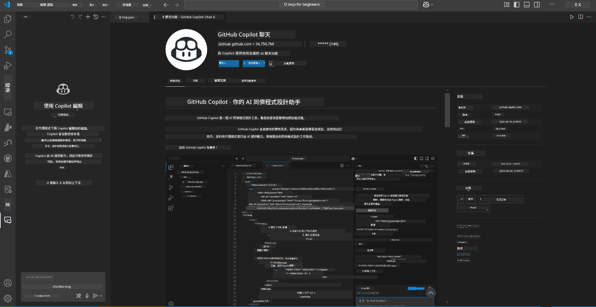
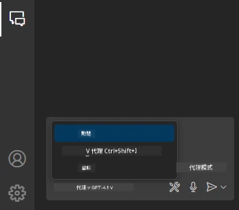
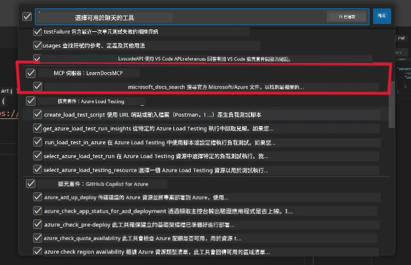
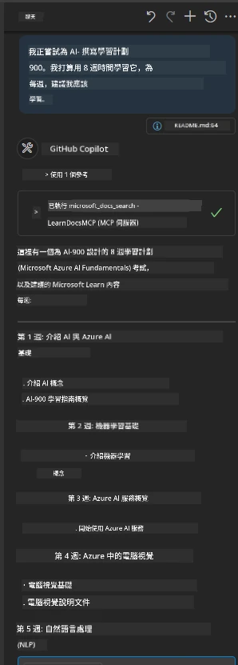
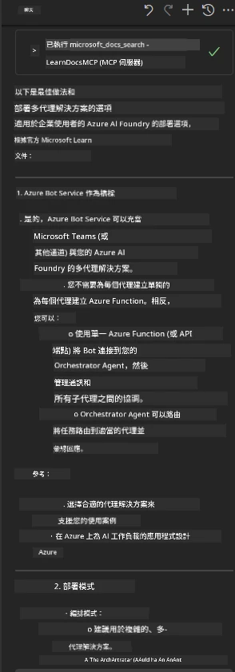

# 情境 3：在 VS Code 中使用 MCP 伺服器的編輯器內文件

## 概觀

在本情境中，您將學習如何使用 MCP 伺服器，將 Microsoft Learn 文件直接帶入您的 Visual Studio Code 環境。您無需不斷切換瀏覽器分頁搜尋文件，而可以在編輯器內存取、搜尋和參考官方文件。此方法簡化您的工作流程，讓您保持專注，並實現與 GitHub Copilot 等工具的無縫整合。

- 在 VS Code 內搜尋和閱讀文件，無需離開您的編碼環境。
- 參考文件並直接將連結插入 README 或課程檔案中。
- 結合 GitHub Copilot 和 MCP，實現無縫的 AI 助力文件工作流程。

## 學習目標

完成本章後，您將了解如何在 VS Code 中設定和使用 MCP 伺服器，以增強您的文件與開發工作流程。您將能夠：

- 配置您的工作區以使用 MCP 伺服器進行文件查找。
- 直接在 VS Code 內搜尋和插入文件。
- 結合 GitHub Copilot 與 MCP 的威力，打造更高效的 AI 增強式工作流程。

這些技能將幫助您保持專注，提升文件品質，並提高作為開發人員或技術撰寫人的生產力。

## 解決方案

要實現編輯器內文件存取，您將遵循一系列步驟，將 MCP 伺服器與 VS Code 及 GitHub Copilot 整合。本方案適合課程作者、文件撰寫者及開發人員，想要在操作文件與 Copilot 時保持專注於編輯器。

- 在撰寫課程或專案文件時，快速新增參考連結到 README。
- 使用 Copilot 生成程式碼，並用 MCP 即時查找及引用相關文件。
- 保持專注於編輯器，提高生產力。

### 分步指南

開始時，請遵循以下步驟。每個步驟您都可以加入資產資料夾中的截圖來視覺化說明過程。

1. **新增 MCP 配置：**  
   在您的專案根目錄下建立 `.vscode/mcp.json` 檔案，並加入以下配置：  
   ```json
   {
     "servers": {
       "LearnDocsMCP": {
         "url": "https://learn.microsoft.com/api/mcp"
       }
     }
   }
   ```
   
   此配置告訴 VS Code 如何連接到 [`Microsoft Learn Docs MCP server`](https://github.com/MicrosoftDocs/mcp)。
   
   
    
2. **打開 GitHub Copilot 聊天面板：**  
   如果尚未安裝 GitHub Copilot 擴充功能，請至 VS Code 的 Extensions 視圖安裝。您可以直接從 [Visual Studio Code Marketplace](https://marketplace.visualstudio.com/items?itemName=GitHub.copilot-chat) 下載。安裝完成後，從側邊欄開啟 Copilot Chat 面板。

   

3. **啟用代理模式並驗證工具：**  
   在 Copilot Chat 面板中啟用代理模式。

   

   啟用代理模式後，確認 MCP 伺服器已列為可用工具之一。如此可確保 Copilot 代理能存取文件伺服器，提取相關資訊。
   
   
4. **開始新聊天並提示代理：**  
   在 Copilot Chat 面板打開新聊天。您現在可以向代理提出文件查詢。代理將利用 MCP 伺服器直接在您的編輯器中取得並顯示相關 Microsoft Learn 文件。

   - *「我正在為主題 X 撰寫學習計劃。我打算花 8 週時間學習，每週請建議我應該學習的內容。」*

   

5. **即時查詢：**

   > 以下取自 Microsoft Foundry Discord 的 [#get-help](https://discord.gg/D6cRhjHWSC) 頻道之即時查詢（[查看原文訊息](https://discord.com/channels/1113626258182504448/1385498306720829572)）：
   
   *「我想了解如何使用在 Azure AI Foundry 上開發的 AI 代理部署多代理解決方案。我見目前沒有像 Copilot Studio 頻道那種直接部署的方法。企業用戶要互動並完成工作，有哪些不同方式可以部署此方案？
有許多文章/博客提到可使用 Azure Bot 服務來做這件事，充當 MS Teams 與 Azure AI Foundry 代理的橋樑。請問如果我在 Azure AI Foundry 上透過 Azure function 連接 Orchestrator 代理，建立 Azure Bot，這樣可行嗎？或者我需要為多代理解決方案中的每個 AI 代理，建立 Azure function 以在 Bot framework 做統籌？也歡迎其他建議。」*

   

   代理會回應相關的文件連結與摘要，您可直接插入 markdown 檔案內，或做為程式碼中引用的參考。

### 範例查詢

以下是您可以嘗試的一些範例查詢。這些查詢展示了 MCP 伺服器與 Copilot 如何協同工作，在 VS Code 內即時提供情境感知的文件及參考，而無需離開編輯器：

- 「請示範如何使用 Azure Functions 觸發器。」
- 「插入 Azure Key Vault 官方文件的連結。」
- 「Azure 資源安全的最佳實務有哪些？」
- 「尋找 Azure AI 服務的快速入門。」

這些查詢將顯示 MCP 伺服器和 Copilot 如何協同合作，提供即時且上下文相關的文件和參考，無需離開 VS Code。

---

---

<!-- CO-OP TRANSLATOR DISCLAIMER START -->
**免責聲明**：
本文件使用 AI 翻譯服務 [Co-op Translator](https://github.com/Azure/co-op-translator) 進行翻譯。雖然我們力求準確，但請注意，自動翻譯可能包含錯誤或不準確之處。原始文件的母語版本應被視為權威來源。對於重要資訊，建議尋求專業人工翻譯。我們不對因使用本翻譯而引起的任何誤解或曲解承擔責任。
<!-- CO-OP TRANSLATOR DISCLAIMER END -->