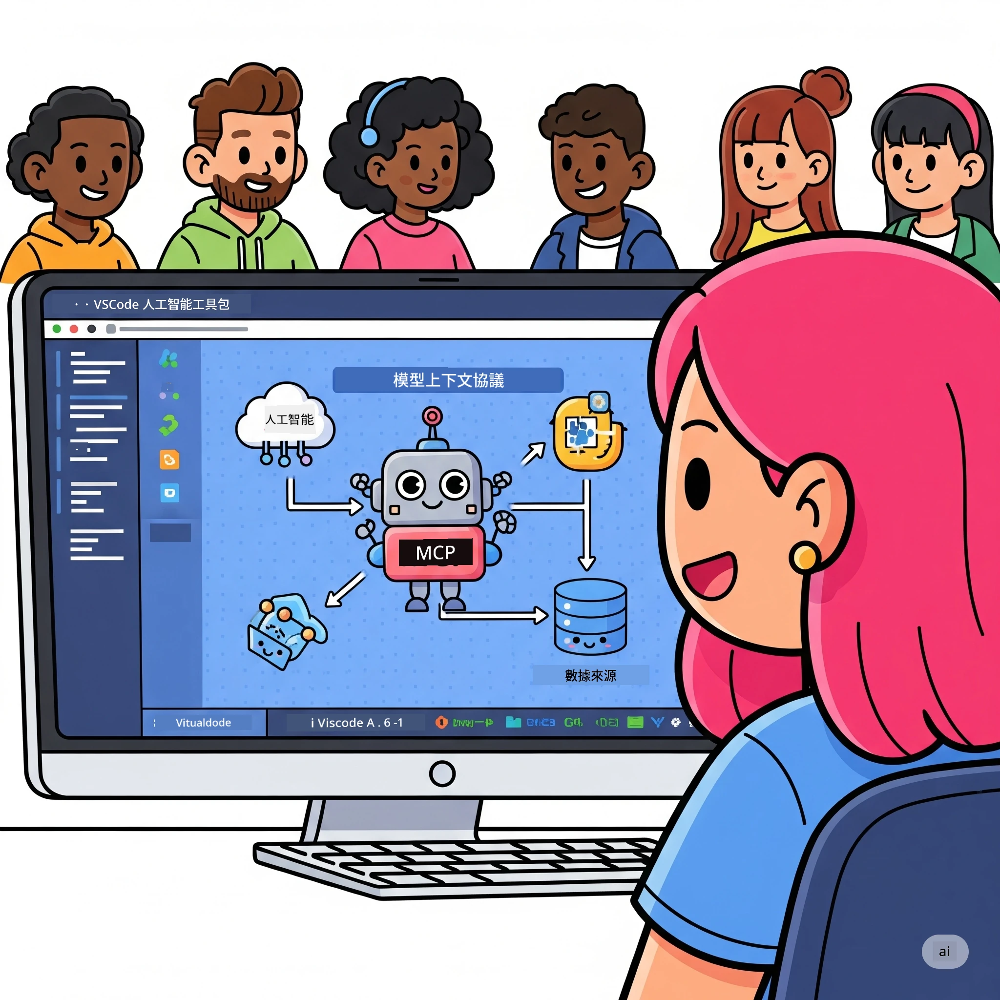
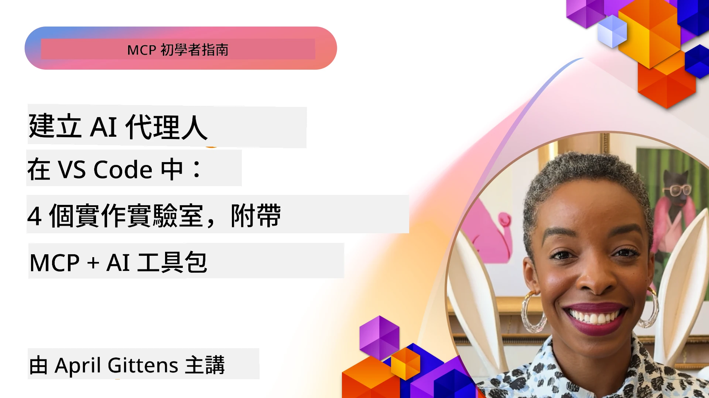

# 精簡 AI 工作流程：使用 Microsoft Foundry Toolkit 建立 MCP 伺服器

## 🎯  概覽

_（點擊上方圖片觀看本課程影片）_

歡迎來到 **Model Context Protocol (MCP) 工作坊**！這個全面的實作工作坊結合了兩項先進技術，徹底改造 AI 應用開發：

- **🔗 Model Context Protocol (MCP)**：為 AI 工具整合打造的開放標準
- **🛠️ Microsoft Foundry Toolkit VS Code 擴充套件**：微軟強大的 AI 開發擴充功能

### 🎓 你將學到什麼

完成本工作坊後，你將掌握打造智慧型應用程式的技巧，能將 AI 模型與真實世界工具和服務連結。從自動測試到客製化 API 整合，學會解決複雜的商業挑戰。

## 🏗️ 技術棧

### 🔌 Model Context Protocol (MCP)

MCP 是 AI 的 **「USB-C」** — 一個連接 AI 模型與外部工具和資料源的通用標準。

**✨ 主要特點：**

- 🔄 <strong>標準化整合</strong>：AI 工具連接的通用介面
- 🏛️ <strong>彈性架構</strong>：透過 stdio/SSE 傳輸支援本地及遠端伺服器
- 🧰 <strong>豐富生態系</strong>：工具、提示詞和資源合而為一的協定
- 🔒 <strong>企業級準備</strong>：內建安全性與可靠性

**🎯 MCP 的重要性：**  
就像 USB-C 消除纜線混亂一樣，MCP 消除 AI 整合的複雜度。單一協定，無限可能。

### 🤖 Microsoft Foundry Toolkit VS Code 擴充套件

微軟的旗艦 AI 開發擴充，把 VS Code 變成 AI 強大平台。

**🚀 核心能力：**

- 📦 <strong>模型目錄</strong>：存取 Azure AI、GitHub、Hugging Face、Ollama 等模型
- ⚡ <strong>本地推論</strong>：利用 ONNX 最佳化 CPU/GPU/NPU 執行
- 🏗️ **Agent Builder**：支援 MCP 整合的視覺化 AI 代理開發
- 🎭 <strong>多模態</strong>：支援文字、視覺與結構化輸出

**💡 開發優勢：**

- 零設定模型部署
- 視覺化提示詞工程
- 即時測試操場
- 無縫整合 MCP 伺服器

## 📚 學習歷程

### [🚀 模組 1：Microsoft Foundry Toolkit 基礎](./lab1/README.md)

<strong>時長</strong>：15 分鐘

- 🛠️ 安裝與配置 Microsoft Foundry Toolkit for VS Code
- 🗂️ 探索模型目錄（GitHub、ONNX、OpenAI、Anthropic、Google 超過 100 個模型）
- 🎮 掌握實時模型測試的互動操場
- 🤖 使用 Agent Builder 建立首個 AI 代理
- 📊 內建指標評估模型效能（F1、相關性、相似度、連貫性）
- ⚡ 學習批次處理與多模態支援功能

**🎯 學習成果**：建立完整功能 AI 代理，深入了解 Microsoft Foundry Toolkit 能力

### [🌐 模組 2：MCP 與 Microsoft Foundry Toolkit 基礎](./lab2/README.md)

<strong>時長</strong>：20 分鐘

- 🧠 掌握 Model Context Protocol (MCP) 架構與概念
- 🌐 探索微軟 MCP 伺服器生態系
- 🤖 使用 Playwright MCP 伺服器建立瀏覽器自動化代理
- 🔧 Integrate MCP 伺服器與 Microsoft Foundry Toolkit Agent Builder
- 📊 配置並測試代理中的 MCP 工具
- 🚀 匯出並部署 MCP 強化代理用於生產環境

**🎯 學習成果**：部署一個透過 MCP 與外部工具強化的 AI 代理

### [🔧 模組 3：Microsoft Foundry Toolkit 的進階 MCP 開發](./lab3/README.md)

<strong>時長</strong>：20 分鐘

- 💻 使用 Microsoft Foundry Toolkit 建立自訂 MCP 伺服器
- 🐍 配置並使用最新 MCP Python SDK (v1.9.3)
- 🔍 設定並使用 MCP Inspector 進行除錯
- 🛠️ 建立具專業除錯流程的天氣 MCP 伺服器
- 🧪 在 Agent Builder 與 Inspector 環境中除錯 MCP 伺服器

**🎯 學習成果**：使用現代工具開發及除錯自訂 MCP 伺服器

### [🐙 模組 4：實務 MCP 開發 - 自訂 GitHub Clone 伺服器](./lab4/README.md)

<strong>時長</strong>：30 分鐘

- 🏗️ 建立實務上的 GitHub Clone MCP 伺服器以加速開發工作流程
- 🔄 實作具驗證與錯誤處理的智慧型倉庫克隆
- 📁 建立智慧化目錄管理與 VS Code 整合
- 🤖 使用配合自訂 MCP 工具的 GitHub Copilot 代理模式
- 🛡️ 採用生產等級的可靠性及跨平台相容性

**🎯 學習成果**：部署實務生產用的 MCP 伺服器，簡化真實開發工作流程

## 💡 實際應用與影響

### 🏢 企業應用案例

#### 🔄 DevOps 自動化

透過智能自動化轉型開發工作流程：

- <strong>智慧型倉庫管理</strong>：AI 驅動的程式碼審查與合併決策
- **智慧 CI/CD**：根據程式碼變更自動優化管線
- <strong>議題分級</strong>：自動分類及指派缺陷

#### 🧪 品質保證革新

提升測試效率與品質：

- <strong>智慧測試生成</strong>：自動建立全面測試套件
- <strong>視覺回歸測試</strong>：AI 驅動的 UI 變更偵測
- <strong>效能監控</strong>：主動問題偵測與修復

#### 📊 資料流程智慧

打造更聰明的資料處理流程：

- **自適應 ETL 流程**：自我優化資料轉換
- <strong>異常偵測</strong>：即時資料品質監控
- <strong>智慧路由</strong>：智能管理資料流向

#### 🎧 客戶體驗提升

創造卓越客戶互動：

- <strong>情境感知支援</strong>：AI 代理可以存取顧客歷史
- <strong>先發制人解決問題</strong>：預測式客服
- <strong>多通路整合</strong>：跨平台的統一 AI 體驗

## 🛠️ 前置條件與設定

### 💻 系統需求

| 元件 | 需求 | 備註 |
|-----------|-------------|-------|
| <strong>作業系統</strong> | Windows 10+、macOS 10.15+、Linux | 任何現代作業系統 |
| **Visual Studio Code** | 最新穩定版 | Microsoft Foundry Toolkit 所需 |
| **Node.js** | v18.0+ 與 npm | 用於 MCP 伺服器開發 |
| **Python** | 3.10+ | 選用，Python MCP 伺服器使用 |
| <strong>記憶體</strong> | 最少 8GB RAM | 為本地模型建議 16GB |

### 🔧 開發環境

#### 推薦 VS Code 擴充套件

- **Microsoft Foundry Toolkit** (ms-windows-ai-studio.windows-ai-studio)
- **Python** (ms-python.python)
- **Python Debugger** (ms-python.debugpy)
- **GitHub Copilot** (GitHub.copilot) - 選用但有幫助

#### 選用工具

- **uv**：現代 Python 套件管理器
- **MCP Inspector**：MCP 伺服器視覺除錯工具
- **Playwright**：用於網頁自動化範例

## 🎖️ 學習成果與認證路徑

### 🏆 技能掌握檢核表

完成本工作坊後，你將在以下領域達到精通：

#### 🎯 核心能力

- [ ] **MCP 協定精通**：深入理解架構及實作模式
- [ ] **Microsoft Foundry Toolkit 熟練**：熟練使用快速開發
- [ ] <strong>自訂伺服器開發</strong>：建立、部署及維護生產 MCP 伺服器
- [ ] <strong>工具整合卓越</strong>：無縫結合 AI 與既有開發流程
- [ ] <strong>問題解決應用</strong>：運用學得技能解決商業挑戰

#### 🔧 技術技能

- [ ] 設定及配置 VS Code 內的 Microsoft Foundry Toolkit
- [ ] 設計並實作自訂 MCP 伺服器
- [ ] 將 GitHub 模型整合入 MCP 架構
- [ ] 使用 Playwright 建立自動化測試流程
- [ ] 部署 AI 代理至生產環境
- [ ] 除錯並優化 MCP 伺服器效能

#### 🚀 進階能力

- [ ] 設計企業級 AI 集成架構
- [ ] 實作 AI 應用安全最佳實踐
- [ ] 設計可擴展 MCP 伺服器架構
- [ ] 建立特定領域的自訂工具鏈
- [ ] 指導他人進行 AI 原生開發

## 📖 補充資源

- [MCP 規範 (2025-11-25)](https://spec.modelcontextprotocol.io/specification/2025-11-25/)
- [Microsoft Foundry Toolkit GitHub 倉庫](https://github.com/microsoft/vscode-ai-toolkit)
- [MCP 伺服器範例集合](https://github.com/modelcontextprotocol/servers)
- [最佳實踐指南](https://modelcontextprotocol.io/docs/best-practices)
- [OWASP MCP 十大](https://microsoft.github.io/mcp-azure-security-guide/mcp/) - 安全最佳實踐

---

**🚀 準備好革新你的 AI 開發流程了嗎？**

讓我們一起用 MCP 和 Microsoft Foundry Toolkit 建構智慧型應用的未來！

## 接下來

繼續前往：[模組 11：MCP 伺服器實作實驗](../11-MCPServerHandsOnLabs/README.md)

---

<!-- CO-OP TRANSLATOR DISCLAIMER START -->
**免責聲明**：
本文件使用 AI 翻譯服務 [Co-op Translator](https://github.com/Azure/co-op-translator) 進行翻譯。雖然我們力求準確，但請注意，自動翻譯可能包含錯誤或不準確之處。原始文件的母語版本應被視為權威來源。對於重要資訊，建議尋求專業人工翻譯。我們不對因使用本翻譯而引起的任何誤解或曲解承擔責任。
<!-- CO-OP TRANSLATOR DISCLAIMER END -->