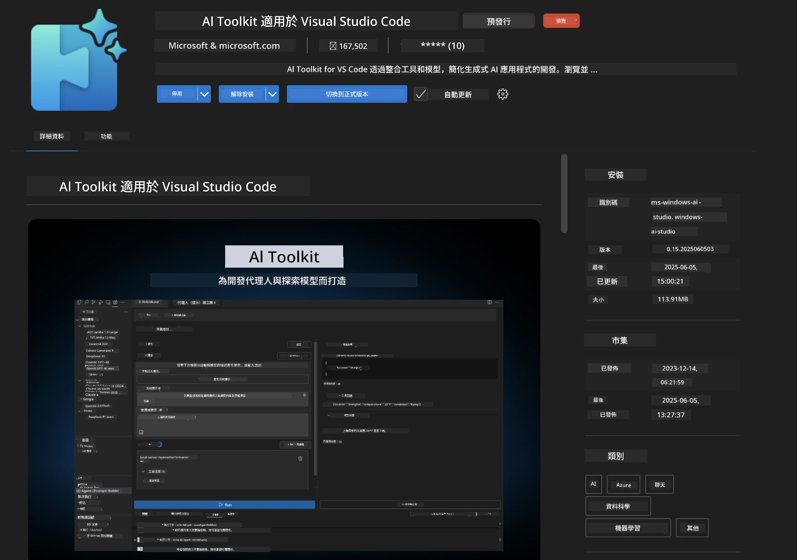
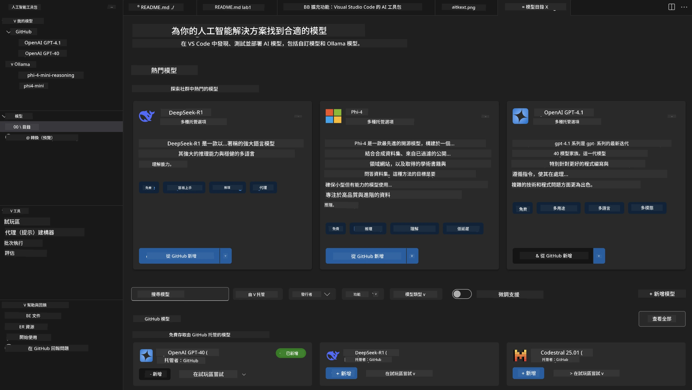
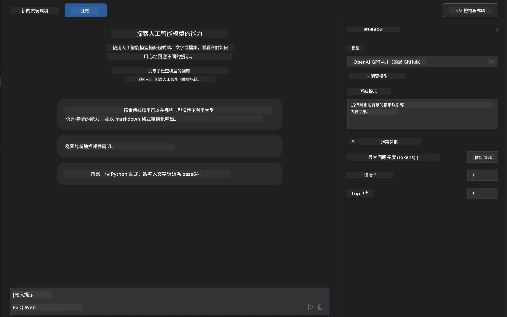
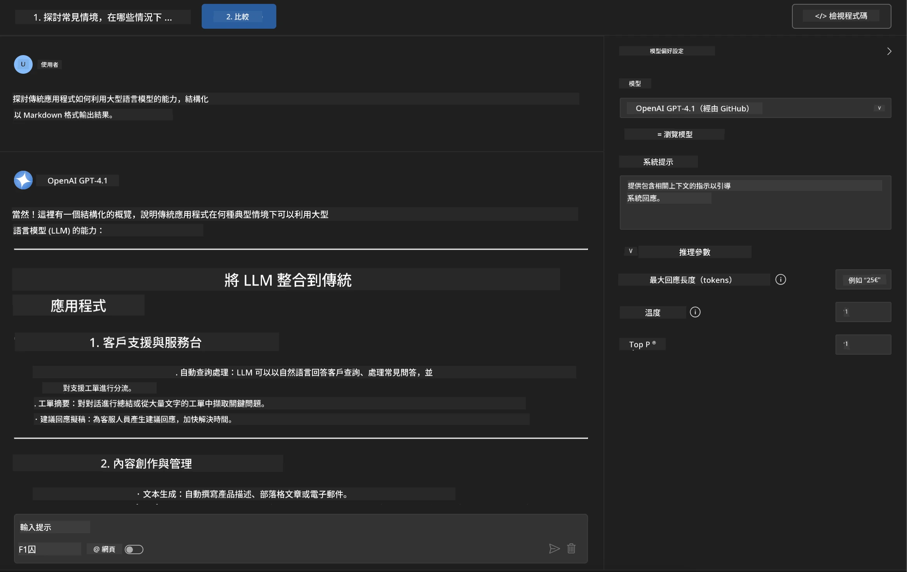
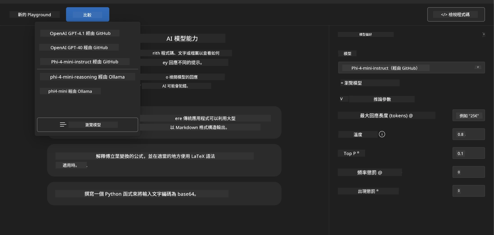
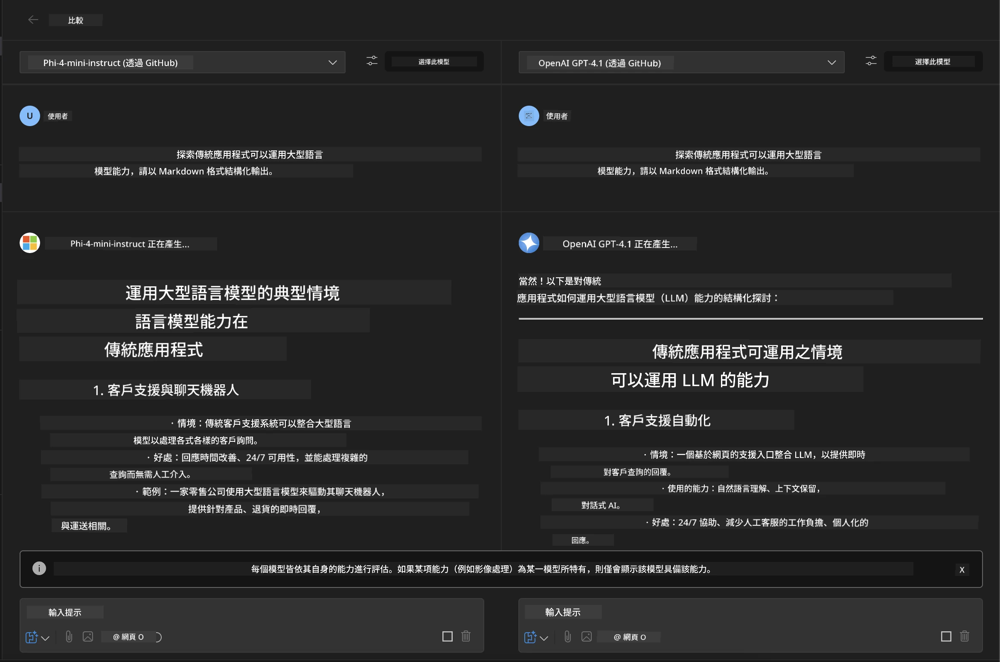
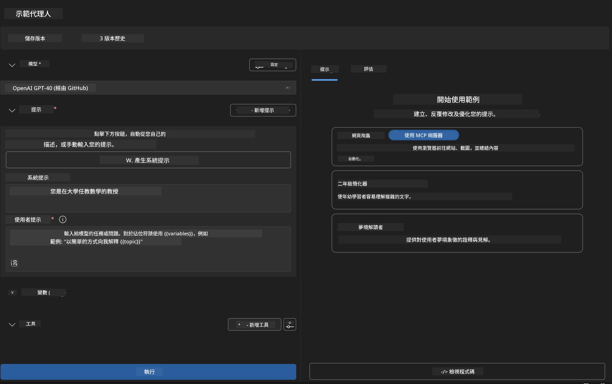
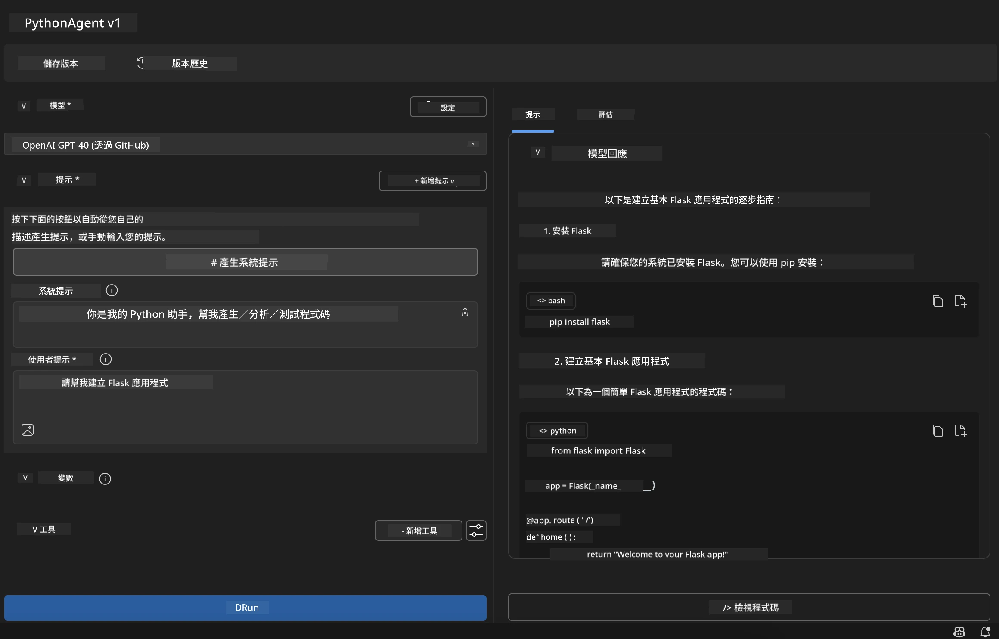

# 🚀 模組 1：Microsoft Foundry Toolkit 基礎知識

[]()
[]()
[]()

## 📋 學習目標

完成本模組後，您將能夠：
- ✅ 安裝和設定 Microsoft Foundry Toolkit VS Code 擴充功能
- ✅ 導覽模型目錄並理解不同的模型來源
- ✅ 使用 Playground 進行模型測試和實驗
- ✅ 使用 Agent Builder 創建自訂 AI 代理
- ✅ 比較不同供應商的模型效能
- ✅ 應用提示工程的最佳實務

## 🧠 Microsoft Foundry Toolkit 簡介

**Microsoft Foundry Toolkit VS Code 擴充功能** 是微軟的旗艦擴充套件，能將 VS Code 轉變為功能完善的 AI 開發環境。它搭起 AI 研究與實際應用開發之間的橋樑，讓各種技能等級的開發人員都能輕鬆利用生成式 AI。

### 🌟 主要功能

| 功能 | 說明 | 使用案例 |
|---------|-------------|----------|
| **🗂️ 模型目錄** | 可存取來自 GitHub、ONNX、OpenAI、Anthropic、Google 的 100 多款模型 | 模型發現與挑選 |
| **🔌 BYOM 支援** | 整合您自己的模型（本地/遠端） | 自訂模型部署 |
| **🎮 互動式 Playground** | 具有聊天介面的即時模型測試 | 快速原型與測試 |
| **📎 多模態支援** | 處理文字、圖片及附件 | 複雜的 AI 應用 |
| **⚡ 批次處理** | 同時執行多個提示 | 高效率測試流程 |
| **📊 模型評估** | 內建指標（F1、相關性、相似度、一致性） | 效能評估 |

### 🎯 為何 Microsoft Foundry Toolkit 重要

- **🚀 加速開發**：從構想到原型僅需數分鐘
- **🔄 統一工作流程**：一個介面可管理多個 AI 供應商
- **🧪 輕鬆實驗**：無需複雜設置即可比較模型
- **📈 適合生產**：順利從原型轉向部署

## 🛠️ 前置條件與設定

### 📦 安裝 Microsoft Foundry Toolkit 擴充功能

**步驟 1：進入擴充功能市集**
1. 開啟 Visual Studio Code
2. 前往擴充功能視窗（`Ctrl+Shift+X` 或 `Cmd+Shift+X`）
3. 搜尋「Microsoft Foundry Toolkit」

**步驟 2：選擇版本**
- **🟢 正式版**：建議用於生產環境
- **🔶 預覽版**：搶先體驗最新功能

**步驟 3：安裝並啟用**



### ✅ 驗證清單
- [ ] Microsoft Foundry Toolkit 圖示出現在 VS Code 側邊欄
- [ ] 擴充功能已啟用並運作中
- [ ] 輸出面板中無安裝錯誤訊息

## 🧪 實作練習 1：探索 GitHub 模型

**🎯 目標**：掌握模型目錄並測試第一個 AI 模型

### 📊 步驟 1：導覽模型目錄

模型目錄是您進入 AI 生態系的入口。它匯聚多個供應商的模型，方便發現與比較選項。

**🔍 導覽指南：**

點擊 Microsoft Foundry Toolkit 側邊欄中的 **MODELS - Catalog**



**💡 專家提示**：尋找具備符合您使用案例的特定功能的模型（例如程式碼生成、創意寫作、分析）。

**⚠️ 注意**：托管在 GitHub 的模型（即 GitHub 模型）免費使用，但受到請求和代幣數量限制。若要使用非 GitHub 模型（透過 Azure AI 或其他端點託管的外部模型），您需提供相應的 API 金鑰或身份驗證。

### 🚀 步驟 2：新增並設定您的第一個模型

**模型選擇策略：**
- **GPT-4.1**：適用於複雜推理與分析
- **Phi-4-mini**：輕量快速，適合簡單任務

**🔧 設定流程：**
1. 從目錄中選取 **OpenAI GPT-4.1**
2. 點擊 **Add to My Models**，將模型註冊以使用
3. 選擇 **Try in Playground**，啟動測試環境
4. 等待模型初始化（首次設定可能需點時間）



**⚙️ 了解模型參數：**
- **Temperature**：控制創造力（0 = 確定性，1 = 創意性）
- **Max Tokens**：最大回應長度
- **Top-p**：核采樣，用於回應多樣性

### 🎯 步驟 3：精通 Playground 介面

Playground 是您的 AI 實驗室。以下為最大化其效能的方法：

**🎨 提示工程最佳實務：**
1. <strong>具體明確</strong>：清楚且詳細的指令帶來更佳結果
2. <strong>提供背景</strong>：包含相關背景資料
3. <strong>使用範例</strong>：示範您想要的結果
4. <strong>反覆調整</strong>：根據初步結果優化提示

**🧪 測試情境：**
```markdown
# Example 1: Code Generation
"Write a Python function that calculates the factorial of a number using recursion. Include error handling and docstrings."

# Example 2: Creative Writing
"Write a professional email to a client explaining a project delay, maintaining a positive tone while being transparent about challenges."

# Example 3: Data Analysis
"Analyze this sales data and provide insights: [paste your data]. Focus on trends, anomalies, and actionable recommendations."
```



### 🏆 挑戰練習：模型效能比較

**🎯 目標**：利用相同提示比較不同模型，了解其優勢

**📋 教學指引：**
1. 將 **Phi-4-mini** 加入您的工作區
2. 對 GPT-4.1 和 Phi-4-mini 使用相同提示



3. 比較回應質量、速度與準確度
4. 在結果區塊中記錄您的發現



**💡 重要見解：**
- 什麼時候使用大型語言模型（LLM）與小型語言模型（SLM）
- 成本與效能的權衡
- 不同模型的專門能力

## 🤖 實作練習 2：使用 Agent Builder 建立自訂代理

**🎯 目標**：創造針對特定任務及流程的專用 AI 代理

### 🏗️ 步驟 1：了解 Agent Builder

Agent Builder 是 Microsoft Foundry Toolkit 的亮點。它讓您能打造專用 AI 助手，結合大型語言模型的力量、客製指令、特定參數和專業知識。

**🧠 代理架構組成：**
- <strong>核心模型</strong>：基礎 LLM（GPT-4、Groks、Phi 等）
- <strong>系統提示</strong>：定義代理的個性與行為
- <strong>參數設定</strong>：微調最佳表現的設定
- <strong>工具整合</strong>：連接外部 API 與 MCP 服務
- <strong>記憶體</strong>：對話上下文與會話持續性



### ⚙️ 步驟 2：代理設定詳解

**🎨 創建有效的系統提示：**
```markdown
# Template Structure:
## Role Definition
You are a [specific role] with expertise in [domain].

## Capabilities
- List specific abilities
- Define scope of knowledge
- Clarify limitations

## Behavior Guidelines
- Response style (formal, casual, technical)
- Output format preferences
- Error handling approach

## Examples
Provide 2-3 examples of ideal interactions
```

*當然，您也可以使用 Generate System Prompt，藉由 AI 幫助生成並優化提示*

**🔧 參數優化：**
| 參數 | 推薦範圍 | 使用案例 |
|-----------|------------------|----------|
| **Temperature** | 0.1-0.3 | 技術性 / 事實回應 |
| **Temperature** | 0.7-0.9 | 創意 / 腦力激盪任務 |
| **Max Tokens** | 500-1000 | 簡潔回應 |
| **Max Tokens** | 2000-4000 | 詳細說明 |

### 🐍 步驟 3：實務練習 - Python 程式設計代理

**🎯 任務**：創建專門的 Python 程式語言助理

**📋 設定步驟：**

1. <strong>模型選擇</strong>：選擇 **Claude 3.5 Sonnet**（程式碼表現優異）

2. <strong>系統提示設計</strong>：
```markdown
# Python Programming Expert Agent

## Role
You are a senior Python developer with 10+ years of experience. You excel at writing clean, efficient, and well-documented Python code.

## Capabilities
- Write production-ready Python code
- Debug complex issues
- Explain code concepts clearly
- Suggest best practices and optimizations
- Provide complete working examples

## Response Format
- Always include docstrings
- Add inline comments for complex logic
- Suggest testing approaches
- Mention relevant libraries when applicable

## Code Quality Standards
- Follow PEP 8 style guidelines
- Use type hints where appropriate
- Handle exceptions gracefully
- Write readable, maintainable code
```

3. <strong>參數設定</strong>：
   - Temperature：0.2（穩定可靠的程式碼）
   - Max Tokens：2000（詳盡說明）
   - Top-p：0.9（均衡創造力）



### 🧪 步驟 4：測試您的 Python 代理

**測試場景：**
1. <strong>基本功能</strong>：「建立一個尋找質數的函數」
2. <strong>複雜演算法</strong>：「實作一個包含插入、刪除與搜尋方法的二元搜尋樹」
3. <strong>實務問題</strong>：「建立一個可處理速率限制和重試的網頁爬蟲」
4. <strong>除錯</strong>：「修正以下程式碼 [貼上錯誤程式碼]」

**🏆 成功標準：**
- ✅ 程式碼正確運行無錯誤
- ✅ 包含適當文件說明
- ✅ 遵循 Python 最佳實務
- ✅ 提供清楚解釋
- ✅ 建議改進方法

## 🎓 模組 1 結語與後續步驟

### 📊 知識檢測

測試您的理解：
- [ ] 能說明目錄中不同模型的差異嗎？
- [ ] 您是否已成功建立並測試自訂代理？
- [ ] 是否了解如何為不同使用案例優化參數？
- [ ] 能設計有效的系統提示嗎？

### 📚 其他資源

- **Microsoft Foundry Toolkit 文件**： [官方 Microsoft Docs](https://github.com/microsoft/vscode-ai-toolkit)
- <strong>提示工程指南</strong>： [最佳實務](https://platform.openai.com/docs/guides/prompt-engineering)
- **Microsoft Foundry Toolkit 中的模型**： [發展中的模型](https://github.com/microsoft/vscode-ai-toolkit/blob/main/doc/models.md)

**🎉 恭喜！** 您已掌握 Microsoft Foundry Toolkit 基礎，準備建立更進階的 AI 應用！

### 🔜 繼續下一模組

準備探索更高階功能？繼續前往 **[模組 2：使用 Microsoft Foundry Toolkit 的 MCP 基礎](../lab2/README.md)**，您將學習如何：
- 使用模型上下文協定（MCP）連接外部工具給代理
- 利用 Playwright 建立瀏覽器自動化代理
- 將 MCP 伺服器與 Microsoft Foundry Toolkit 代理整合
- 以外部資料與功能強化代理

---

<!-- CO-OP TRANSLATOR DISCLAIMER START -->
**免責聲明**：
本文件使用 AI 翻譯服務 [Co-op Translator](https://github.com/Azure/co-op-translator) 進行翻譯。雖然我們力求準確，但請注意，自動翻譯可能包含錯誤或不準確之處。原始文件的母語版本應被視為權威來源。對於重要資訊，建議尋求專業人工翻譯。我們不對因使用本翻譯而引起的任何誤解或曲解承擔責任。
<!-- CO-OP TRANSLATOR DISCLAIMER END -->