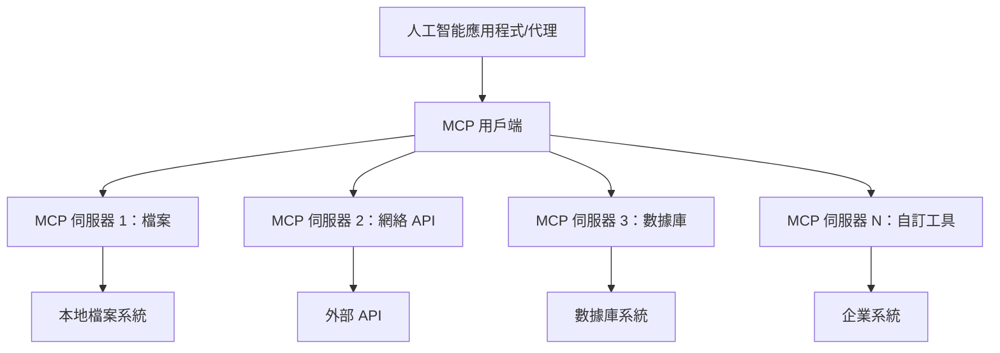
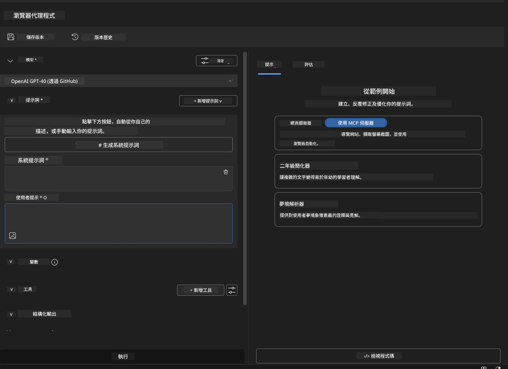
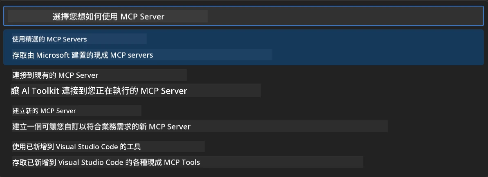
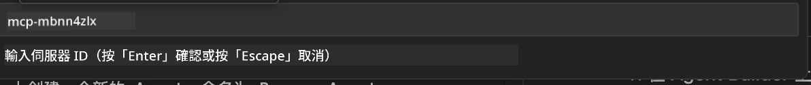
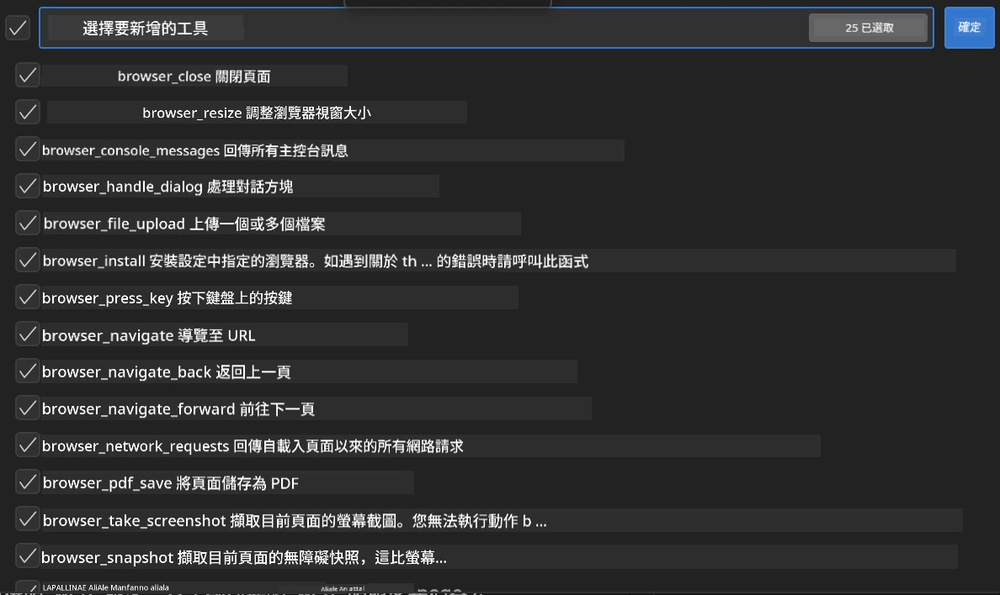
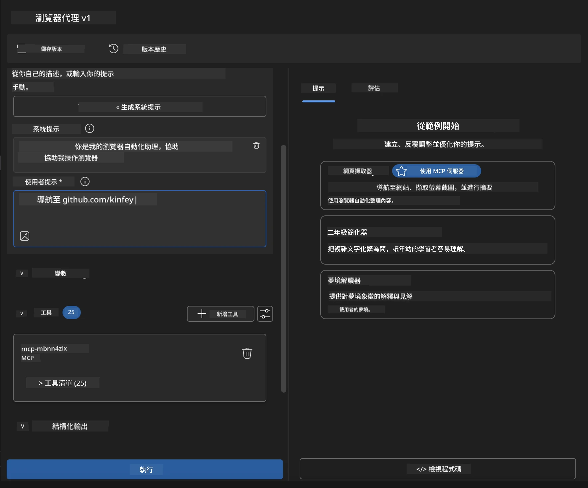
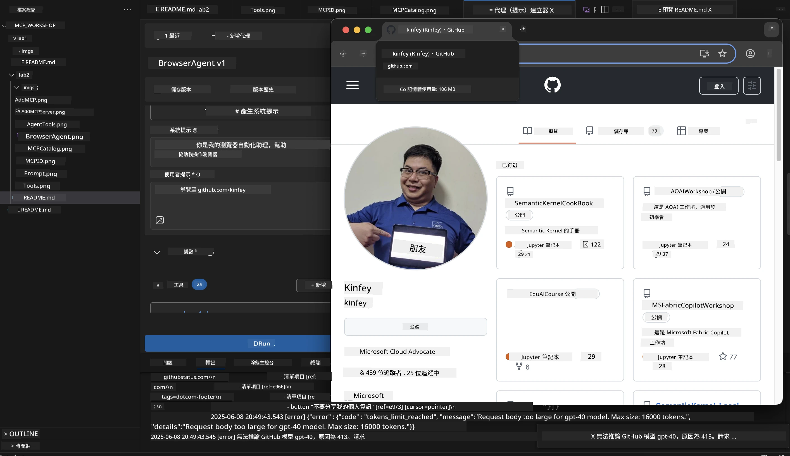
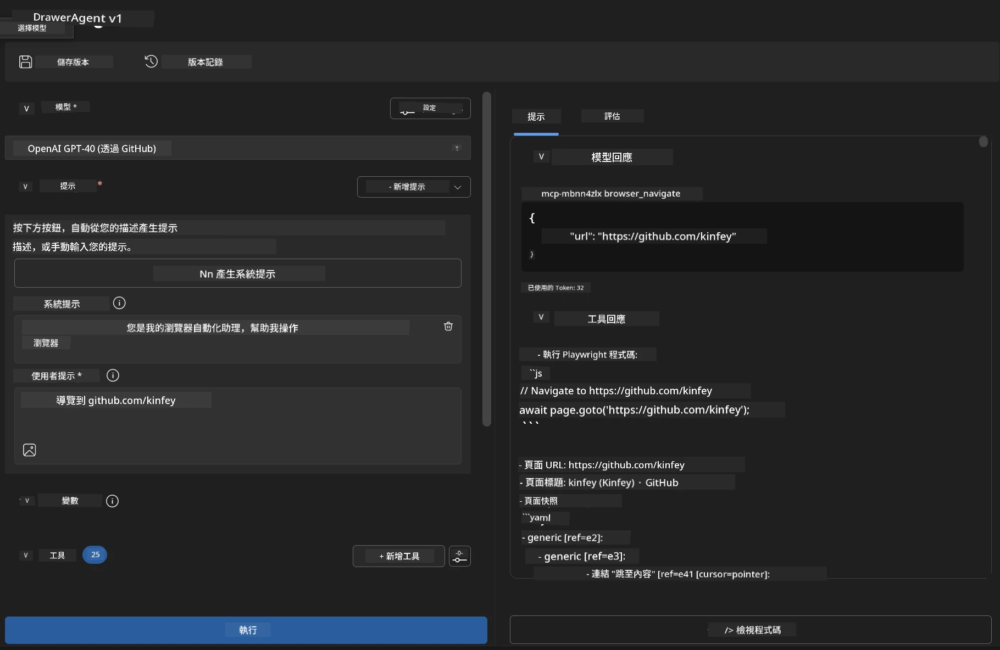
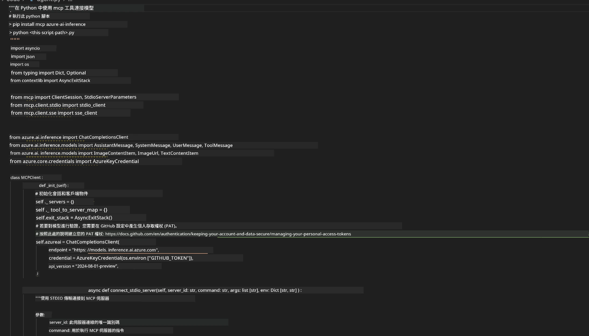

# 🌐 模組 2：Microsoft Foundry Toolkit 基礎與 MCP

[]()
[]()
[]()

## 📋 學習目標

完成本模組後，您將能夠：
- ✅ 了解模型上下文協議 (MCP) 架構與優勢
- ✅ 探索 Microsoft 的 MCP 伺服器生態系統
- ✅ 將 MCP 伺服器整合至 Microsoft Foundry Toolkit Agent Builder
- ✅ 使用 Playwright MCP 構建功能完整的瀏覽器自動化代理
- ✅ 為您的代理配置並測試 MCP 工具
- ✅ 匯出與部署具 MCP 功能的代理至生產環境

## 🎯 以模組 1 為基礎

在模組 1 中，我們掌握了 Microsoft Foundry Toolkit 的基本知識並創建了第一個 Python 代理。現在，我們將透過革新的 **模型上下文協議 (MCP)**，為您的代理注入強大動力，連結外部工具與服務。

將此視為從基本計算器升級至完整電腦──您的 AI 代理將擁有以下能力：
- 🌐 瀏覽並與網站互動
- 📁 訪問及操作檔案
- 🔧 整合企業系統
- 📊 處理 API 的即時資料

## 🧠 了解模型上下文協議 (MCP)

### 🔍 什麼是 MCP？

模型上下文協議 (MCP) 是 AI 應用的 **「USB-C」** ——一種革新的開放標準，連接大型語言模型（LLM）與外部工具、資料來源和服務。就如同 USB-C 透過一個通用連接消除纜線混亂，MCP 以一套標準化協議消弭 AI 整合的複雜性。

### 🎯 MCP 解決的問題

**MCP 之前：**
- 🔧 每個工具都需自訂整合
- 🔄 供應商鎖定，遭受專有解決方案限制
- 🔒 臨時連接導致安全漏洞
- ⏱️ 基本整合需要數月開發

**有了 MCP：**
- ⚡ 即插即用的工具整合
- 🔄 供應商中立的架構
- 🛡️ 內建安全最佳實踐
- 🚀 幾分鐘即可新增新功能

### 🏗️ MCP 架構深入探討

MCP 採用 **客戶端-伺服器架構**，建立安全且具擴充性的生態系統：



**🔧 核心組件：**

| 組件 | 角色 | 範例 |
|-----------|------|----------|
| **MCP 主機** | 消費 MCP 服務的應用程式 | Claude Desktop、VS Code、Microsoft Foundry Toolkit |
| **MCP 用戶端** | 協議處理器（1:1 與伺服器） | 內建於主機應用程式中 |
| **MCP 伺服器** | 透過標準協議暴露功能 | Playwright、Files、Azure、GitHub |
| <strong>傳輸層</strong> | 通訊方式 | stdio、HTTP、WebSockets |


## 🏢 微軟的 MCP 伺服器生態系統

微軟領導 MCP 生態系，提供涵蓋企業需求的完整伺服器套件。

### 🌟 微軟 MCP 伺服器特色

#### 1. ☁️ Azure MCP 伺服器
**🔗 程式庫**： [azure/azure-mcp](https://github.com/azure/azure-mcp)
**🎯 目的**：結合 AI 的全面 Azure 資源管理

**✨ 主要功能：**
- 宣告式基礎設施配置
- 即時資源監控
- 成本優化建議
- 安全合規檢查

**🚀 使用案例：**
- AI 助理的基礎設施即程式碼
- 自動資源擴展
- 雲端成本優化
- DevOps 工作流程自動化

#### 2. 📊 Microsoft Dataverse MCP
**📚 文件**：[Microsoft Dataverse Integration](https://go.microsoft.com/fwlink/?linkid=2320176)
**🎯 目的**：業務資料的自然語言介面

**✨ 主要功能：**
- 自然語言資料庫查詢
- 具業務脈絡理解
- 客製提示模板
- 企業資料治理

**🚀 使用案例：**
- 商業智慧報告
- 客戶資料分析
- 銷售管線洞察
- 合規資料查詢

#### 3. 🌐 Playwright MCP 伺服器
**🔗 程式庫**： [microsoft/playwright-mcp](https://github.com/microsoft/playwright-mcp)
**🎯 目的**：瀏覽器自動化與網頁互動功能

**✨ 主要功能：**
- 跨瀏覽器自動化（Chrome、Firefox、Safari）
- 智能元素偵測
- 螢幕截圖及 PDF 產生
- 網路流量監控

**🚀 使用案例：**
- 自動化測試工作流程
- 網頁擷取與資料萃取
- UI/UX 監測
- 競爭分析自動化

#### 4. 📁 Files MCP 伺服器
**🔗 程式庫**： [microsoft/files-mcp-server](https://github.com/microsoft/files-mcp-server)
**🎯 目的**：智慧型檔案系統操作

**✨ 主要功能：**
- 宣告式檔案管理
- 內容同步
- 版本控制整合
- 分析擷取檔案元數據

**🚀 使用案例：**
- 文件管理
- 程式碼庫組織
- 內容發布工作流程
- 資料管線檔案處理

#### 5. 📝 MarkItDown MCP 伺服器
**🔗 程式庫**： [microsoft/markitdown](https://github.com/microsoft/markitdown)
**🎯 目的**：進階 Markdown 處理與操控

**✨ 主要功能：**
- 富 Markdown 解析
- 格式轉換 (MD ↔ HTML ↔ PDF)
- 內容結構分析
- 範本處理

**🚀 使用案例：**
- 技術文件工作流程
- 內容管理系統
- 報告生成
- 知識庫自動化

#### 6. 📈 Clarity MCP 伺服器
**📦 套件**： [@microsoft/clarity-mcp-server](https://www.npmjs.com/package/@microsoft/clarity-mcp-server)
**🎯 目的**：網站分析與用戶行為洞察

**✨ 主要功能：**
- 熱點圖數據分析
- 用戶會話錄製
- 效能指標
- 漏斗轉換分析

**🚀 使用案例：**
- 網站優化
- 用戶體驗研究
- A/B 測試分析
- 商業智慧儀表板

### 🌍 社群生態系統

除微軟伺服器外，MCP 生態包含：
- **🐙 GitHub MCP**：儲存庫管理與程式碼分析
- **🗄️ 資料庫 MCP**：PostgreSQL、MySQL、MongoDB 整合
- **☁️ 雲端供應商 MCP**：AWS、GCP、Digital Ocean 工具
- **📧 通訊 MCP**：Slack、Teams、電子郵件整合

## 🛠️ 實作實驗：建立瀏覽器自動化代理

**🎯 專案目標**：使用 Playwright MCP 伺服器，創建智能瀏覽器自動化代理，能夠瀏覽網站、擷取資訊並執行複雜的網頁互動。

### 🚀 階段 1：代理基礎設定

#### 步驟 1：初始化代理
1. **開啟 Microsoft Foundry Toolkit Agent Builder**
2. <strong>建立新代理</strong>，設定如下：
   - <strong>名稱</strong>：`BrowserAgent`
   - <strong>模型</strong>：選擇 GPT-4o




### 🔧 階段 2：MCP 整合流程

#### 步驟 3：新增 MCP 伺服器整合
1. <strong>前往代理建構器中的工具區段</strong>
2. **點擊「新增工具」**，開啟整合選單
3. **選擇「MCP 伺服器」** 選項


**🔍 理解工具類型：**
- <strong>內建工具</strong>：預設 Microsoft Foundry Toolkit 功能
- **MCP 伺服器**：外部服務整合
- **自訂 API**：您自己的服務端點
- <strong>功能呼叫</strong>：直接模型函式存取

#### 步驟 4：選擇 MCP 伺服器
1. **選擇「MCP 伺服器」**


2. **瀏覽 MCP 目錄，探索可用整合**



### 🎮 階段 3：Playwright MCP 配置

#### 步驟 5：選擇與配置 Playwright
1. **點擊「使用推薦 MCP 伺服器」**，存取微軟認證伺服器
2. **從推薦列表中選擇「Playwright」**
3. **接受預設 MCP ID** 或依環境自訂



#### 步驟 6：啟用 Playwright 功能
**🔑 關鍵步驟**：選擇 Playwright 所有可用方法以獲得最大功能



**🛠️ Playwright 重要工具：**
- <strong>瀏覽</strong>：`goto`、`goBack`、`goForward`、`reload`
- <strong>互動</strong>：`click`、`fill`、`press`、`hover`、`drag`
- <strong>擷取</strong>：`textContent`、`innerHTML`、`getAttribute`
- <strong>驗證</strong>：`isVisible`、`isEnabled`、`waitForSelector`
- <strong>截圖</strong>：`screenshot`、`pdf`、`video`
- <strong>網路</strong>：`setExtraHTTPHeaders`、`route`、`waitForResponse`

#### 步驟 7：確認整合成功
**✅ 成功指標：**
- 所有工具出現在 Agent Builder 介面
- 整合面板無錯誤訊息
- Playwright 伺服器狀態顯示「已連接」


**🔧 常見問題排除：**
- <strong>連線失敗</strong>：檢查網路連線與防火牆設定
- <strong>工具遺漏</strong>：確保設置階段選取了所有功能
- <strong>權限錯誤</strong>：確認 VS Code 具備必要系統權限

### 🎯 階段 4：進階提示工程

#### 步驟 8：設計智能系統提示
創建發揮 Playwright 全能的高階提示：

```markdown
# Web Automation Expert System Prompt

## Core Identity
You are an advanced web automation specialist with deep expertise in browser automation, web scraping, and user experience analysis. You have access to Playwright tools for comprehensive browser control.

## Capabilities & Approach
### Navigation Strategy
- Always start with screenshots to understand page layout
- Use semantic selectors (text content, labels) when possible
- Implement wait strategies for dynamic content
- Handle single-page applications (SPAs) effectively

### Error Handling
- Retry failed operations with exponential backoff
- Provide clear error descriptions and solutions
- Suggest alternative approaches when primary methods fail
- Always capture diagnostic screenshots on errors

### Data Extraction
- Extract structured data in JSON format when possible
- Provide confidence scores for extracted information
- Validate data completeness and accuracy
- Handle pagination and infinite scroll scenarios

### Reporting
- Include step-by-step execution logs
- Provide before/after screenshots for verification
- Suggest optimizations and alternative approaches
- Document any limitations or edge cases encountered

## Ethical Guidelines
- Respect robots.txt and rate limiting
- Avoid overloading target servers
- Only extract publicly available information
- Follow website terms of service
```

#### 步驟 9：建立動態使用者提示
設計展示多項功能的提示：

**🌐 網頁分析範例：**
```markdown
Navigate to github.com/kinfey and provide a comprehensive analysis including:
1. Repository structure and organization
2. Recent activity and contribution patterns  
3. Documentation quality assessment
4. Technology stack identification
5. Community engagement metrics
6. Notable projects and their purposes

Include screenshots at key steps and provide actionable insights.
```



### 🚀 階段 5：執行與測試

#### 步驟 10：執行首次自動化
1. **點擊「執行」** 啟動自動化序列
2. <strong>監控即時執行狀態</strong>：
   - 自動啟動 Chrome 瀏覽器
   - 代理導覽目標網站
   - 每重要步驟截圖紀錄
   - 分析結果即時串流



#### 步驟 11：分析結果與洞察
在 Agent Builder 介面查看完整分析：



### 🌟 階段 6：進階功能與部署

#### 步驟 12：匯出與生產部署
Agent Builder 支援多種部署選項：



## 🎓 模組 2 總結與後續步驟

### 🏆 解鎖成就：MCP 整合大師

**✅ 已掌握技能：**
- [ ] 了解 MCP 架構與優勢
- [ ] 掌握微軟 MCP 伺服器生態系
- [ ] 整合 Playwright MCP 至 Microsoft Foundry Toolkit
- [ ] 建構複雜瀏覽器自動化代理
- [ ] 進階網頁自動化提示工程

### 📚 額外資源

- **🔗 MCP 規範**：[官方協議文件](https://modelcontextprotocol.io/)
- **🛠️ Playwright API**：[完整方法參考](https://playwright.dev/docs/api/class-playwright)
- **🏢 微軟 MCP 伺服器**：[企業整合指南](https://github.com/microsoft/mcp-servers)
- **🌍 社群範例**：[MCP 伺服器展示](https://github.com/modelcontextprotocol/servers)

**🎉 恭喜您！** 成功掌握 MCP 整合，現在可以打造具備外部工具能力的生產級 AI 代理！


### 🔜 繼續下一模組

準備將 MCP 技能提升至更高層次？請前往 **[模組 3：Microsoft Foundry Toolkit 進階 MCP 開發](../lab3/README.md)**，學習如何：
- 創建自訂 MCP 伺服器
- 配置及使用最新 MCP Python SDK
- 設置 MCP Inspector 作除錯之用
- 精通進階 MCP 伺服器開發流程
- 從零打造氣象 MCP 伺服器

---

<!-- CO-OP TRANSLATOR DISCLAIMER START -->
**免責聲明**：
本文件使用 AI 翻譯服務 [Co-op Translator](https://github.com/Azure/co-op-translator) 進行翻譯。雖然我們力求準確，但請注意，自動翻譯可能包含錯誤或不準確之處。原始文件的母語版本應被視為權威來源。對於重要資訊，建議尋求專業人工翻譯。我們不對因使用本翻譯而引起的任何誤解或曲解承擔責任。
<!-- CO-OP TRANSLATOR DISCLAIMER END -->