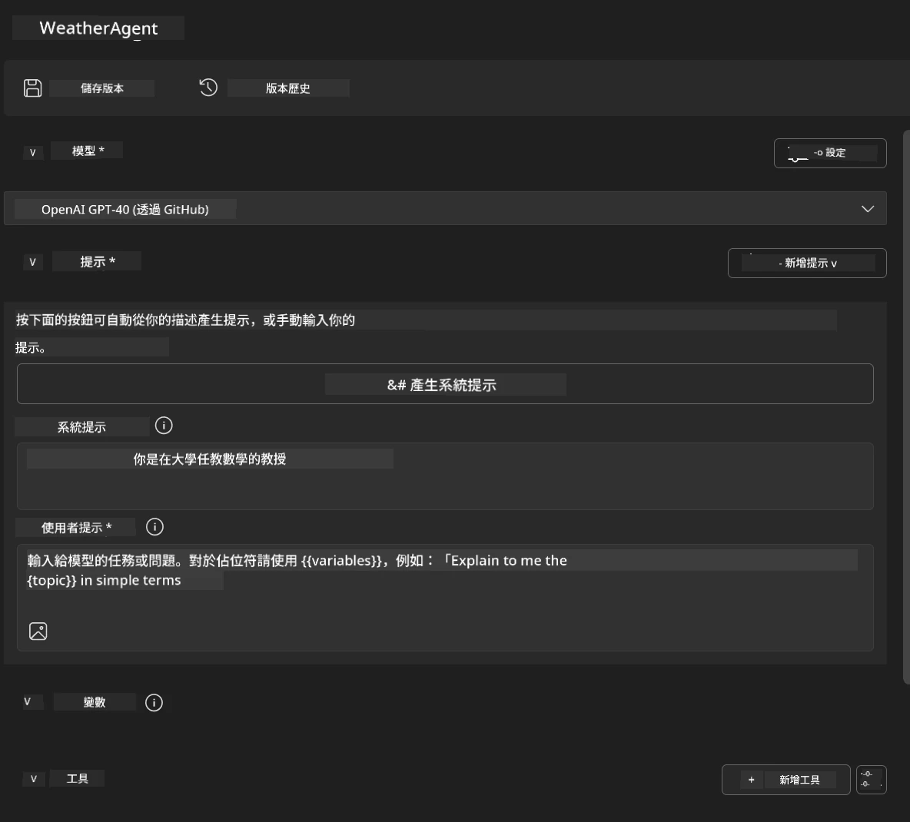
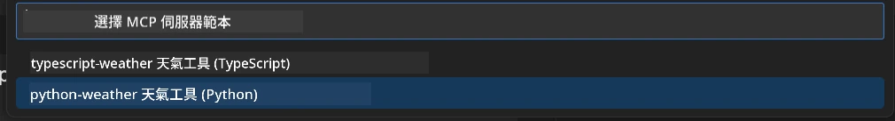
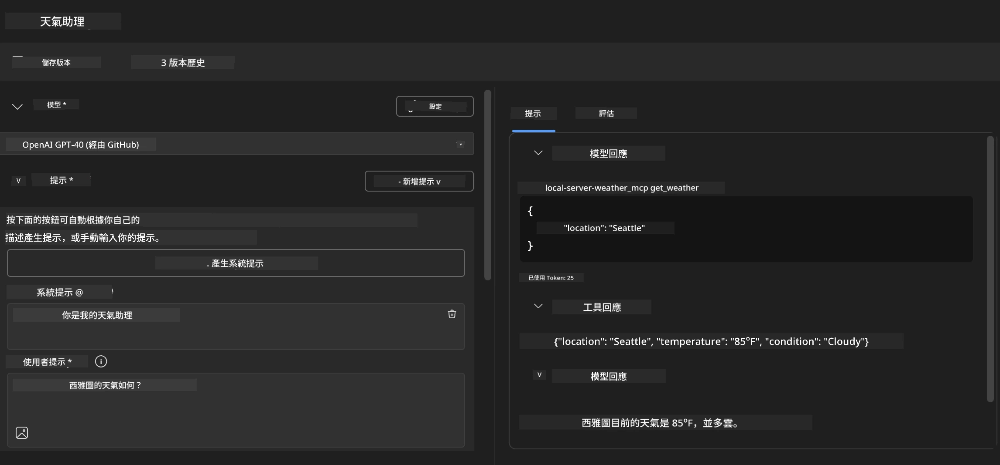
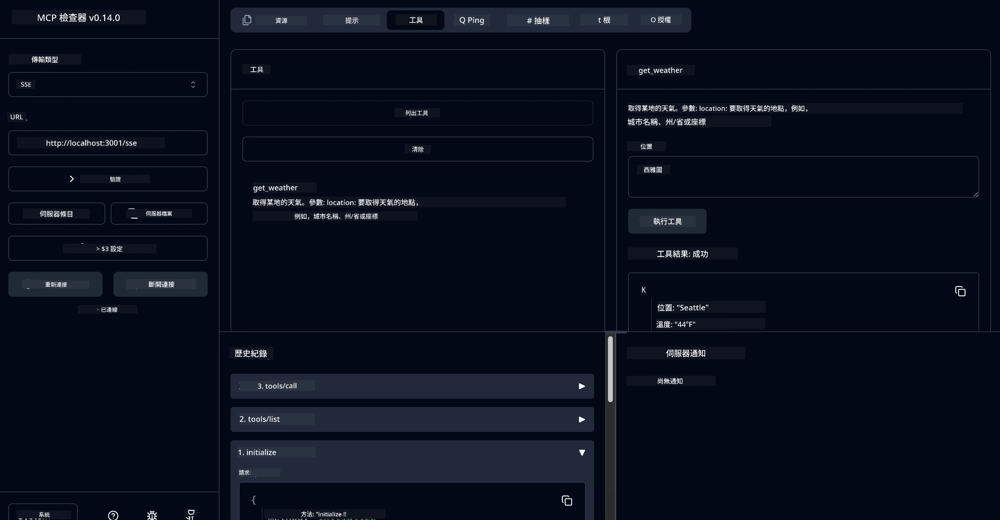

# 🔧 模組 3：使用 Microsoft Foundry Toolkit 進階 MCP 開發


## 🎯 學習目標

完成本實驗後，您將能夠：

- ✅ 使用 Microsoft Foundry Toolkit 建立自訂 MCP 伺服器
- ✅ 設定並使用最新的 MCP Python SDK（v1.9.3）
- ✅ 設定並使用 MCP Inspector 進行除錯
- ✅ 在 Agent Builder 與 Inspector 環境中除錯 MCP 伺服器
- ✅ 理解進階 MCP 伺服器開發工作流程

## 📋 先決條件

- 完成實驗 2（MCP 基礎知識）
- 安裝 Microsoft Foundry Toolkit 擴充功能的 VS Code
- Python 3.10+ 執行環境
- Inspector 設定所需的 Node.js 和 npm

## 🏗️ 您將建構的內容

在本實驗中，您將建立一個 **Weather MCP Server**，示範：
- 自訂 MCP 伺服器實作
- 與 Microsoft Foundry Toolkit Agent Builder 整合
- 專業除錯工作流程
- 現代 MCP SDK 使用模式

---

## 🔧 核心元件概述

### 🐍 MCP Python SDK
Model Context Protocol Python SDK 提供建構自訂 MCP 伺服器的基礎。您將使用增強除錯功能的版本 1.9.3。

### 🔍 MCP Inspector
一款強大的除錯工具，提供：
- 即時伺服器監控
- 工具執行視覺化
- 網路請求/回應檢視
- 互動式測試環境

---

## 📖 實作步驟詳解

### 第 1 步：在 Agent Builder 建立 WeatherAgent

1. **透過 Microsoft Foundry Toolkit 擴充功能在 VS Code 啟動 Agent Builder**
2. <strong>建立一個新代理人</strong>，設定如下：
   - 代理人名稱：`WeatherAgent`



### 第 2 步：初始化 MCP 伺服器專案

1. **在 Agent Builder 中導航至 Tools** → **Add Tool**
2. **選擇「MCP Server」** 
3. **選取「Create A new MCP Server」**
4. **選擇 `python-weather` 模板**
5. **命名您的伺服器：** `weather_mcp`



### 第 3 步：開啟並檢視專案

1. **在 VS Code 中開啟產生的專案**
2. **檢視專案結構：**
   ```
   weather_mcp/
   ├── src/
   │   ├── __init__.py
   │   └── server.py
   ├── inspector/
   │   ├── package.json
   │   └── package-lock.json
   ├── .vscode/
   │   ├── launch.json
   │   └── tasks.json
   ├── pyproject.toml
   └── README.md
   ```

### 第 4 步：升級到最新 MCP SDK

> **🔍 為什麼要升級？** 我們想要使用帶有增強功能和更佳除錯能力的最新 MCP SDK（v1.9.3）與 Inspector 服務（0.14.0）。

#### 4a. 更新 Python 相依套件

**編輯 `pyproject.toml`：** 更新 [./code/weather_mcp/pyproject.toml](../../../../10-StreamliningAIWorkflowsBuildingAnMCPServerWithAIToolkit/lab3/code/weather_mcp/pyproject.toml)


#### 4b. 更新 Inspector 設定

**編輯 `inspector/package.json`：** 更新 [./code/weather_mcp/inspector/package.json](../../../../10-StreamliningAIWorkflowsBuildingAnMCPServerWithAIToolkit/lab3/code/weather_mcp/inspector/package.json)

#### 4c. 更新 Inspector 相依套件

**編輯 `inspector/package-lock.json`：** 更新 [./code/weather_mcp/inspector/package-lock.json](../../../../10-StreamliningAIWorkflowsBuildingAnMCPServerWithAIToolkit/lab3/code/weather_mcp/inspector/package-lock.json)

> **📝 注意：** 此檔案包含大量相依套件定義。以下為重要結構摘要 — 完整內容確保依賴解決正確。


> **⚡ 完整 Package Lock：** 完整的 package-lock.json 約含 3000 行相依定義。上述為重點結構 — 請使用提供的檔案以完整解析相依。

### 第 5 步：設定 VS Code 除錯

*注意：請複製指定路徑的檔案以取代相對應的本機檔案*

#### 5a. 更新啟動設定

**編輯 `.vscode/launch.json`：**

```json
{
  "version": "0.2.0",
  "configurations": [
    {
      "name": "Attach to Local MCP",
      "type": "debugpy",
      "request": "attach",
      "connect": {
        "host": "localhost",
        "port": 5678
      },
      "presentation": {
        "hidden": true
      },
      "internalConsoleOptions": "neverOpen",
      "postDebugTask": "Terminate All Tasks"
    },
    {
      "name": "Launch Inspector (Edge)",
      "type": "msedge",
      "request": "launch",
      "url": "http://localhost:6274?timeout=60000&serverUrl=http://localhost:3001/sse#tools",
      "cascadeTerminateToConfigurations": [
        "Attach to Local MCP"
      ],
      "presentation": {
        "hidden": true
      },
      "internalConsoleOptions": "neverOpen"
    },
    {
      "name": "Launch Inspector (Chrome)",
      "type": "chrome",
      "request": "launch",
      "url": "http://localhost:6274?timeout=60000&serverUrl=http://localhost:3001/sse#tools",
      "cascadeTerminateToConfigurations": [
        "Attach to Local MCP"
      ],
      "presentation": {
        "hidden": true
      },
      "internalConsoleOptions": "neverOpen"
    }
  ],
  "compounds": [
    {
      "name": "Debug in Agent Builder",
      "configurations": [
        "Attach to Local MCP"
      ],
      "preLaunchTask": "Open Agent Builder",
    },
    {
      "name": "Debug in Inspector (Edge)",
      "configurations": [
        "Launch Inspector (Edge)",
        "Attach to Local MCP"
      ],
      "preLaunchTask": "Start MCP Inspector",
      "stopAll": true
    },
    {
      "name": "Debug in Inspector (Chrome)",
      "configurations": [
        "Launch Inspector (Chrome)",
        "Attach to Local MCP"
      ],
      "preLaunchTask": "Start MCP Inspector",
      "stopAll": true
    }
  ]
}
```

**編輯 `.vscode/tasks.json`：**

```
{
  "version": "2.0.0",
  "tasks": [
    {
      "label": "Start MCP Server",
      "type": "shell",
      "command": "python -m debugpy --listen 127.0.0.1:5678 src/__init__.py sse",
      "isBackground": true,
      "options": {
        "cwd": "${workspaceFolder}",
        "env": {
          "PORT": "3001"
        }
      },
      "problemMatcher": {
        "pattern": [
          {
            "regexp": "^.*$",
            "file": 0,
            "location": 1,
            "message": 2
          }
        ],
        "background": {
          "activeOnStart": true,
          "beginsPattern": ".*",
          "endsPattern": "Application startup complete|running"
        }
      }
    },
    {
      "label": "Start MCP Inspector",
      "type": "shell",
      "command": "npm run dev:inspector",
      "isBackground": true,
      "options": {
        "cwd": "${workspaceFolder}/inspector",
        "env": {
          "CLIENT_PORT": "6274",
          "SERVER_PORT": "6277",
        }
      },
      "problemMatcher": {
        "pattern": [
          {
            "regexp": "^.*$",
            "file": 0,
            "location": 1,
            "message": 2
          }
        ],
        "background": {
          "activeOnStart": true,
          "beginsPattern": "Starting MCP inspector",
          "endsPattern": "Proxy server listening on port"
        }
      },
      "dependsOn": [
        "Start MCP Server"
      ]
    },
    {
      "label": "Open Agent Builder",
      "type": "shell",
      "command": "echo ${input:openAgentBuilder}",
      "presentation": {
        "reveal": "never"
      },
      "dependsOn": [
        "Start MCP Server"
      ],
    },
    {
      "label": "Terminate All Tasks",
      "command": "echo ${input:terminate}",
      "type": "shell",
      "problemMatcher": []
    }
  ],
  "inputs": [
    {
      "id": "openAgentBuilder",
      "type": "command",
      "command": "ai-mlstudio.agentBuilder",
      "args": {
        "initialMCPs": [ "local-server-weather_mcp" ],
        "triggeredFrom": "vsc-tasks"
      }
    },
    {
      "id": "terminate",
      "type": "command",
      "command": "workbench.action.tasks.terminate",
      "args": "terminateAll"
    }
  ]
}
```


---

## 🚀 執行及測試您的 MCP 伺服器

### 第 6 步：安裝相依套件

完成設定變更後，執行以下指令：

**安裝 Python 相依套件：**
```bash
uv sync
```

**安裝 Inspector 相依套件：**
```bash
cd inspector
npm install
```

### 第 7 步：使用 Agent Builder 除錯

1. **按下 F5** 或使用 **「在 Agent Builder 中除錯」** 設定執行
2. <strong>從除錯面板選擇複合設定</strong>
3. **等待伺服器啟動及 Agent Builder 開啟**
4. **使用自然語言輸入測試您的 weather MCP 伺服器**

輸入提示類似如下

SYSTEM_PROMPT

```
You are my weather assistant
```

USER_PROMPT

```
How's the weather like in Seattle
```



### 第 8 步：使用 MCP Inspector 除錯

1. **使用「在 Inspector 中除錯」設定（Edge 或 Chrome）**
2. **在瀏覽器開啟 Inspector 介面，網址為 `http://localhost:6274`**
3. **探索互動式測試環境：**
   - 查看可用工具
   - 測試工具執行
   - 監控網路請求
   - 除錯伺服器回應



---

## 🎯 主要學習成果

完成本實驗，您已：

- [x] **使用 Microsoft Foundry Toolkit 範本建立自訂 MCP 伺服器**
- [x] **升級至最新 MCP SDK**（v1.9.3），提升功能性
- [x] <strong>設定專業除錯流程</strong>，適用於 Agent Builder 與 Inspector
- [x] **設定 MCP Inspector** 進行互動式伺服器測試
- [x] **掌握 VS Code 的 MCP 開發除錯設定**

## 🔧 進階功能探索

| 功能 | 說明 | 使用案例 |
|---------|-------------|----------|
| **MCP Python SDK v1.9.3** | 最新協議實作 | 現代伺服器開發 |
| **MCP Inspector 0.14.0** | 互動除錯工具 | 即時伺服器測試 |
| **VS Code 除錯** | 整合開發環境 | 專業除錯工作流程 |
| **Agent Builder 整合** | 直接連結 Microsoft Foundry Toolkit | 端對端代理人測試 |

## 📚 其他資源

- [MCP Python SDK 文件](https://modelcontextprotocol.io/docs/sdk/python)
- [Microsoft Foundry Toolkit 擴充功能指南](https://code.visualstudio.com/docs/ai/ai-toolkit)
- [VS Code 除錯文件](https://code.visualstudio.com/docs/editor/debugging)
- [Model Context Protocol 規格說明](https://modelcontextprotocol.io/docs/concepts/architecture)

---

**🎉 恭喜！** 您已成功完成實驗 3，現在能使用專業開發流程建立、除錯及部署自訂 MCP 伺服器。

### 🔜 繼續下一模組

準備好將 MCP 技能應用到實務開發流程了嗎？請繼續至 **[模組 4：實務 MCP 開發－自訂 GitHub 克隆伺服器](../lab4/README.md)**，您將會：
- 建立可用於生產的 MCP 伺服器，實現 GitHub 倉庫自動化操作
- 透過 MCP 實作 GitHub 倉庫複製功能
- 將自訂 MCP 伺服器與 VS Code 及 GitHub Copilot Agent Mode 整合
- 在生產環境測試與部署自訂 MCP 伺服器
- 學習實務上開發者的工作流程自動化

---

<!-- CO-OP TRANSLATOR DISCLAIMER START -->
**免責聲明**：
本文件使用 AI 翻譯服務 [Co-op Translator](https://github.com/Azure/co-op-translator) 進行翻譯。雖然我們力求準確，但請注意，自動翻譯可能包含錯誤或不準確之處。原始文件的母語版本應被視為權威來源。對於重要資訊，建議尋求專業人工翻譯。我們不對因使用本翻譯而引起的任何誤解或曲解承擔責任。
<!-- CO-OP TRANSLATOR DISCLAIMER END -->