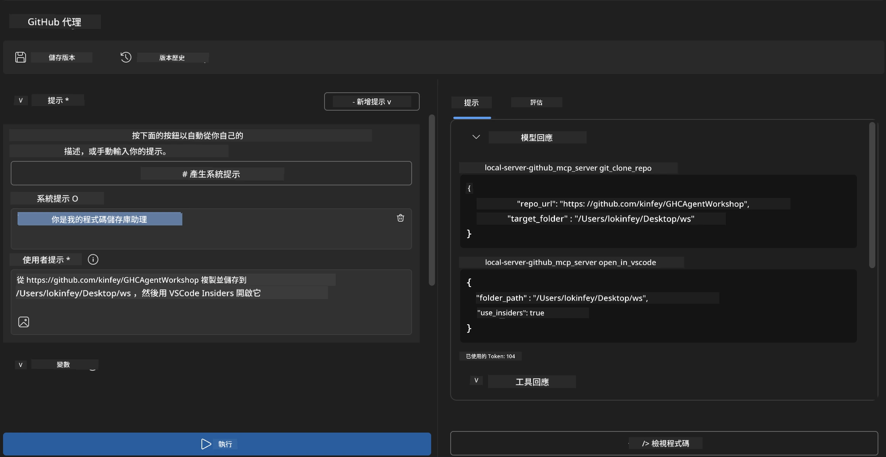
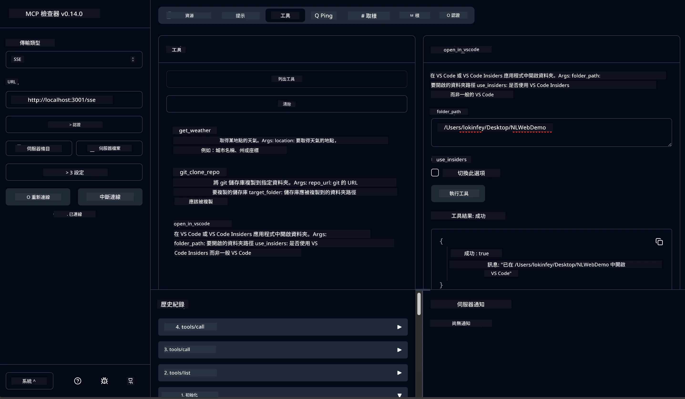

# 🐙 模組 4：實戰 MCP 開發 - 自訂 GitHub 複製伺服器


> **⚡ 快速開始：** 在短短 30 分鐘內建置生產環境就緒的 MCP 伺服器，自動執行 GitHub 倉庫複製並整合 VS Code！

## 🎯 學習目標

完成本實驗後，您將能夠：

- ✅ 建立用於真實開發工作流程的自訂 MCP 伺服器
- ✅ 透過 MCP 實作 GitHub 倉庫複製功能
- ✅ 將自訂 MCP 伺服器整合至 VS Code 與 Agent Builder
- ✅ 使用 GitHub Copilot Agent Mode 搭配自訂 MCP 工具
- ✅ 在生產環境中測試與部署自訂 MCP 伺服器

## 📋 預備條件

- 完成第一至三單元實驗（MCP 基礎與進階開發）
- GitHub Copilot 訂閱（[提供免費註冊](https://github.com/github-copilot/signup)）
- 已安裝並設定 Microsoft Foundry Toolkit 及 GitHub Copilot 擴充功能的 VS Code
- 已安裝並設定 Git CLI

## 🏗️ 專案概覽

### <strong>真實開發挑戰</strong>
作為開發者，我們經常在 GitHub 上複製倉庫並在 VS Code 或 VS Code Insiders 中開啟。此手動流程包含：
1. 開啟終端機/命令提示字元
2. 移動至目標目錄
3. 執行 `git clone` 指令
4. 在複製的目錄中開啟 VS Code

**我們的 MCP 解決方案將此流程整合為一個智慧型指令！**

### <strong>您將建置的內容</strong>
一個 **GitHub 複製 MCP 伺服器**（`git_mcp_server`），具備：

| 功能 | 描述 | 優點 |
|---------|-------------|---------|
| 🔄 <strong>智慧倉庫複製</strong> | 複製 GitHub 倉庫並進行驗證 | 自動錯誤檢查 |
| 📁 <strong>智慧目錄管理</strong> | 安全檢查並建立目錄 | 避免覆寫檔案 |
| 🚀 **跨平台 VS Code 整合** | 在 VS Code/Insiders 開啟專案 | 流程無縫轉換 |
| 🛡️ <strong>強健的錯誤處理</strong> | 處理網路、權限與路徑問題 | 生產環境穩定性 |

---

## 📖 逐步實作

### 第 1 步：在 Agent Builder 建立 GitHub Agent

1. 透過 Microsoft Foundry Toolkit 擴充功能啟動 Agent Builder
2. 以以下設定建立新代理：
   ```
   Agent Name: GitHubAgent
   ```

3. 初始化自訂 MCP 伺服器：
   - 導覽至 <strong>工具</strong> → <strong>新增工具</strong> → **MCP 伺服器**
   - 選擇 **"建立全新 MCP 伺服器"**
   - 選擇 **Python 範本** 以獲得最大彈性
   - **伺服器名稱:** `git_mcp_server`

### 第 2 步：設定 GitHub Copilot Agent Mode

1. 在 VS Code 中開啟 GitHub Copilot（Ctrl/Cmd + Shift + P → "GitHub Copilot: Open"）
2. 在 Copilot 介面中選擇 Agent 模型
3. 選擇具備強化推理能力的 Claude 3.7 模型
4. 啟用 MCP 整合以利存取工具

> **💡 專家提示：** Claude 3.7 提供更優異的開發流程理解與錯誤處理模式。

### 第 3 步：實作核心 MCP 伺服器功能

**請使用 GitHub Copilot Agent Mode 輸入以下詳細提示：**

```
Create two MCP tools with the following comprehensive requirements:

🔧 TOOL A: clone_repository
Requirements:
- Clone any GitHub repository to a specified local folder
- Return the absolute path of the successfully cloned project
- Implement comprehensive validation:
  ✓ Check if target directory already exists (return error if exists)
  ✓ Validate GitHub URL format (https://github.com/user/repo)
  ✓ Verify git command availability (prompt installation if missing)
  ✓ Handle network connectivity issues
  ✓ Provide clear error messages for all failure scenarios

🚀 TOOL B: open_in_vscode
Requirements:
- Open specified folder in VS Code or VS Code Insiders
- Cross-platform compatibility (Windows/Linux/macOS)
- Use direct application launch (not terminal commands)
- Auto-detect available VS Code installations
- Handle cases where VS Code is not installed
- Provide user-friendly error messages

Additional Requirements:
- Follow MCP 1.9.3 best practices
- Include proper type hints and documentation
- Implement logging for debugging purposes
- Add input validation for all parameters
- Include comprehensive error handling
```

### 第 4 步：測試您的 MCP 伺服器

#### 4a. 在 Agent Builder 測試

1. 啟動 Agent Builder 的除錯組態
2. 使用以下系統提示設定您的代理：

```
SYSTEM_PROMPT:
You are my intelligent coding repository assistant. You help developers efficiently clone GitHub repositories and set up their development environment. Always provide clear feedback about operations and handle errors gracefully.
```

3. 以真實使用場景執行測試：

```
USER_PROMPT EXAMPLES:

Scenario : Basic Clone and Open
"Clone {Your GitHub Repo link such as https://github.com/kinfey/GHCAgentWorkshop
 } and save to {The global path you specify}, then open it with VS Code Insiders"
```



**預期結果：**
- ✅ 成功複製並確認路徑
- ✅ 自動啟動 VS Code
- ✅ 對無效情境顯示清晰錯誤訊息
- ✅ 妥善處理邊界案例

#### 4b. 在 MCP Inspector 測試



---


**🎉 恭喜！** 您已成功建置一個實用且生產環境就緒的 MCP 伺服器，解決真實開發流程挑戰。您的自訂 GitHub 複製伺服器彰顯 MCP 自動化與提升開發生產力的強大能力。

### 🏆 成就解鎖：
- ✅ **MCP 開發者** - 建立自訂 MCP 伺服器
- ✅ <strong>流程自動化師</strong> - 精簡開發流程  
- ✅ <strong>整合專家</strong> - 串接多種開發工具
- ✅ <strong>生產就緒</strong> - 建置可部署解決方案

---

## 🎓 工作坊完成：您與 Model Context Protocol 的旅程

**親愛的工作坊參與者，**

恭喜您完成 Model Context Protocol 工作坊的全部四個模組！您已從瞭解 Microsoft Foundry Toolkit 基礎，到建置解決真實開發挑戰的生產環境 MCP 伺服器，走過一段不凡旅程。

### 🚀 您的學習路徑回顧：

**[模組 1](../lab1/README.md)**：由探索 Microsoft Foundry Toolkit 基礎、模型測試到建立第一個 AI 代理。

**[模組 2](../lab2/README.md)**：學習 MCP 架構，整合 Playwright MCP，並建置首個瀏覽器自動化代理。

**[模組 3](../lab3/README.md)**：進階進入自訂 MCP 伺服器開發，以天氣 MCP 伺服器及除錯工具精進技能。

**[模組 4](../lab4/README.md)**：將所學應用於建置實戰 GitHub 倉庫流程自動化工具。

### 🌟 您的掌握重點：

- ✅ **Microsoft Foundry Toolkit 生態系統**：模型、代理及整合模式
- ✅ **MCP 架構**：客戶端-伺服器設計、傳輸協定與安全性
- ✅ <strong>開發工具</strong>：從 Playground、Inspector 到生產部署
- ✅ <strong>自訂開發</strong>：建立、測試及部署自訂 MCP 伺服器
- ✅ <strong>實戰應用</strong>：以 AI 解決真實工作流程挑戰

### 🔮 您的下一步：

1. **建置您的 MCP 伺服器**：運用這些技能自動化您的專屬工作流程
2. **加入 MCP 社群**：分享創作並向他人學習
3. <strong>探索進階整合</strong>：將 MCP 伺服器串接企業系統
4. <strong>貢獻開源</strong>：協助提升 MCP 工具與文件

請記住，這只是開始。Model Context Protocol 生態系統正在快速演進，您現在已具備站在 AI 驅動開發工具前沿的能力。

**感謝您的參與與學習熱忱！**

我們希望本工作坊激發您創意，改變您在開發旅程中如何建置及互動 AI 工具。

**祝編程愉快！**

---

## 下一步

恭喜完成所有模組 10 的實驗！

- 返回：[模組 10 概述](../README.md)
- 繼續：[模組 11：MCP 伺服器實作實驗](../../11-MCPServerHandsOnLabs/README.md)

---

<!-- CO-OP TRANSLATOR DISCLAIMER START -->
**免責聲明**：
本文件使用 AI 翻譯服務 [Co-op Translator](https://github.com/Azure/co-op-translator) 進行翻譯。雖然我們力求準確，但請注意，自動翻譯可能包含錯誤或不準確之處。原始文件的母語版本應被視為權威來源。對於重要資訊，建議尋求專業人工翻譯。我們不對因使用本翻譯而引起的任何誤解或曲解承擔責任。
<!-- CO-OP TRANSLATOR DISCLAIMER END -->