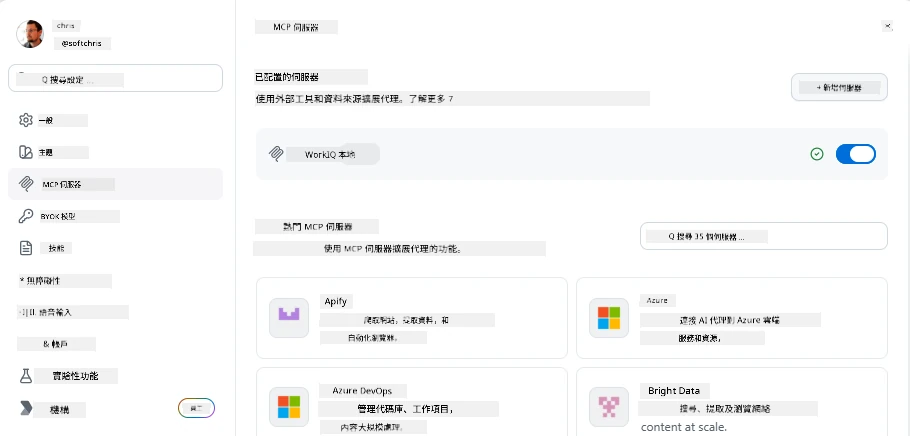
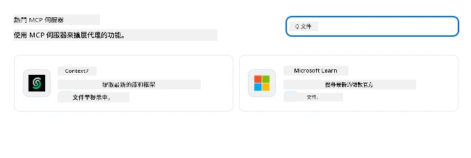
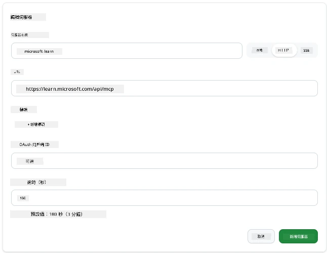
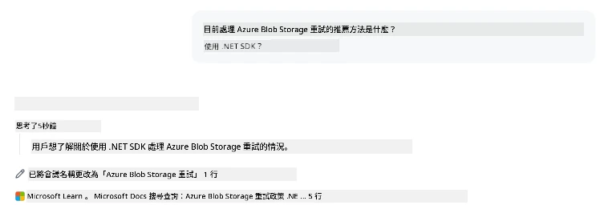
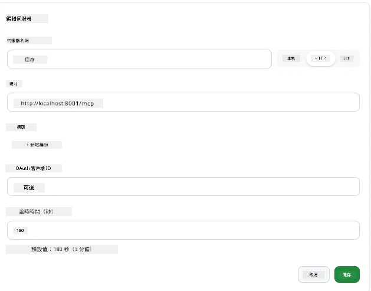
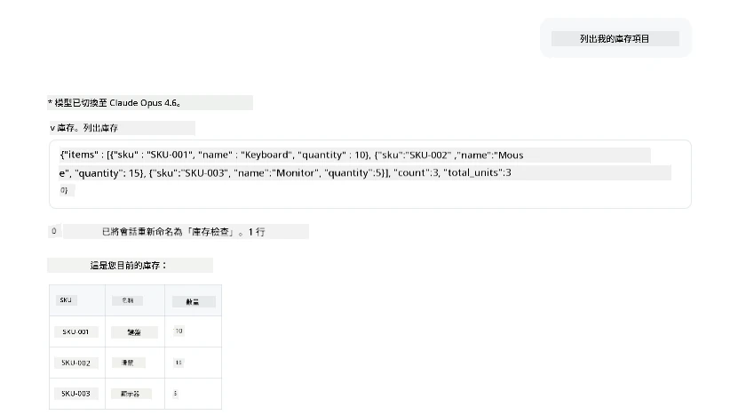
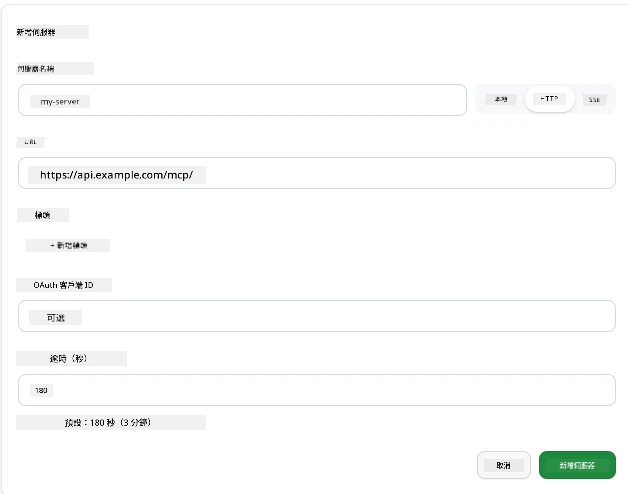
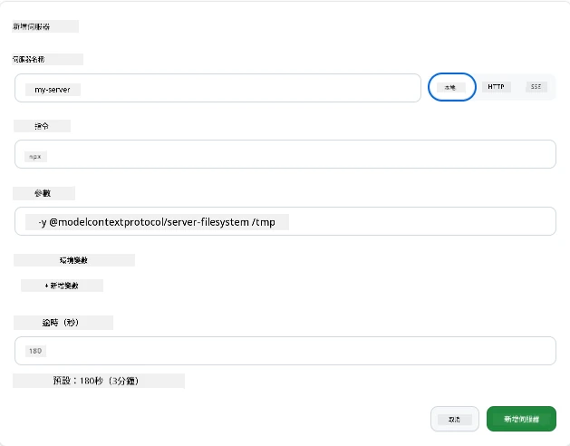

# 在 GitHub Copilot App 中使用 MCP 伺服器

到目前為止，你已經了解 MCP 的運作方式。你建立了伺服器，定義了工具和資源，並連接了用戶端。我們尚未做的，是反過來：不再是你建立伺服器，而是作為一個使用支援 MCP 的 AI 應用程式的用戶，這會是怎樣的體驗？

[GitHub Copilot App](https://github.com/github/app) 是一款可使用 MCP 伺服器的桌面應用程式。將 MCP 伺服器連接到它後，可以釋放一個新層級：Copilot 現在能讀取你的文件、調用內部 API、查詢資料庫，或與你包裝在伺服器裡的任何服務對話。應用程式成為主機；你的 MCP 伺服器則成為它的工具。

本課程將帶你完整體驗這流程——從找到 MCP 設定面板，到連接一個真實的文件伺服器，接著接線自己客製的伺服器。

## 學習目標

課程結束時，你將能夠：

- 定位與瀏覽 Copilot App 設定中的 MCP 伺服器面板。
- 連接一個託管的文件伺服器並在會話中使用它。
- 註冊自訂伺服器並驗證 Copilot 能調用其工具。
- 配置如何調用伺服器，提供環境變數或自訂標頭（HTTP 時）。

## Copilot App 作為 MCP 主機

基本概念是：**Copilot 的代理很聰明，但它只知道你告訴它的東西。** 預設情況下，代理可以讀取工作區中的檔案和執行終端命令，但無法查詢資料庫、查看你的行事曆或呼叫自訂 API，除非有協助。這正是 MCP 伺服器的作用。它們充當 Copilot 與你的系統——資料庫、版本控制、API、設計工具之間的橋樑，賦予代理完成工作所需的資訊和行動能力。

讓我們先找到管理應用程式 MCP 伺服器的設定。

## 第一步：找到 MCP 設定面板

開啟 Copilot App，找出左下角的齒輪圖示並點擊。


確定你選擇「MCP Servers」，你現在應該會在上方看到已配置的伺服器，下方有熱門伺服器市場，且上方有一個「Add Server」按鈕，如下圖：



這就是你的控制中心。你可以在這裡新增、移除、啟用和停用伺服器。更動會對新的會話生效；如果你已開啟會話，更動後需重新開始新會話。

## 第二步：連接文件伺服器

讓我們立刻做一件有用的事。Microsoft Docs MCP 伺服器讓 Copilot 能訪問官方 Microsoft 文件，包括 Azure、.NET、TypeScript 等。代理不再只能依賴訓練資料（有截止日期），而是能在查詢時拉取最新文件。

新增方式：

1. 在熱門伺服器方格中，輸入 **learn** 並選擇名為「Microsoft Learn」的伺服器。

   

   點擊後會出現一個表單，名稱、傳輸類型和 URL 已預填，只需點「Add Server」。

2. 點選「Add Server」，連線伺服器將花費幾秒鐘。

   

   加入後，伺服器會出現在上方配置區。接著試用看看。

3. 關閉對話框，選取 Quick chat。

4. 輸入以下提示，觸發 Microsoft Learn 伺服器上的工具。

   ```text
   What's the current recommended approach for handling Azure Blob Storage 
   retries using the .NET SDK?
   ```

   

你會看到它參考了我們剛添加的 MCP 伺服器。

## 第三步：連接自訂 stdio 伺服器

預設伺服器方便，但真正厲害的是連接你自己的伺服器。假設你建立（或被提供）一個伺服器，封裝你公司的內部 API 或知識庫。在這例子裡，我們用自己建的 MCP 伺服器來處理公司的庫存管理。

1. 點齒輪，選擇「MCP servers」。

2. 點「Add Server」按鈕再選「+ Add Custom server」，填寫以下值：

   - 名稱：`Inventory Server`
   - 在右側選擇傳輸類型，選 **http**

   選擇「Add Server」，它會出現在配置伺服器清單中。

   

4. 測試用以下提示：

    ```
    list inventory
    ```

   

你現在應該會看到從自訂伺服器返回的庫存項目清單。

太好了，你現在應該已經了解如何新增外部及自訂的 MCP 伺服器到 Copilot App。接著，我們來談談如何處理祕密和環境變數。

## 第四步：進階設定

到目前為止，你看到如何新增 MCP 伺服器，只要提供名稱和 URL。但如果伺服器需要 API 金鑰或其他值呢？根據傳輸類型，我們可以提供所需資訊。

- **http 或 SSE 傳輸**：可設定所需的標頭。

   例如認證時，你可以指定 Authorization 標頭，值可以是靜態字串。如果使用 OAuth，亦可提供 OAuth 客戶端 ID。

   

- **stdio 傳輸**：可設定環境變數。

   你可以指定開啟伺服器時需要傳入的多個環境變數。

   

## 總結

Copilot App 將 MCP 伺服器視為代理能力的一級擴充。你在本課程中完整體驗了從新增 MCP 伺服器到會話使用的整個流程。你現在能連接公開伺服器、內部 API 和自訂工具，讓你的代理能自主存取完成任務所需的資訊和行動。

## 📚 補充資源

### 官方文件

- [GitHub Copilot App](https://github.com/github/app)
- [MCP 規範](https://modelcontextprotocol.io/specification/2025-03-26) - Model Context Protocol 規範

### 社群
- [MCP Community Discord](https://discord.com/invite/ByRwuEEgH4) - 直播討論
- [GitHub 論壇](https://github.com/microsoft/MCP-Server-and-PostgreSQL-Sample-Retail/discussions) - 問答與分享
- [Stack Overflow](https://stackoverflow.com/questions/tagged/model-context-protocol) - 技術問題

---

<!-- CO-OP TRANSLATOR DISCLAIMER START -->
**免責聲明**：
本文件使用 AI 翻譯服務 [Co-op Translator](https://github.com/Azure/co-op-translator) 進行翻譯。雖然我們力求準確，但請注意，自動翻譯可能包含錯誤或不準確之處。原始文件的母語版本應被視為權威來源。對於重要資訊，建議尋求專業人工翻譯。我們不對因使用本翻譯而引起的任何誤解或曲解承擔責任。
<!-- CO-OP TRANSLATOR DISCLAIMER END -->