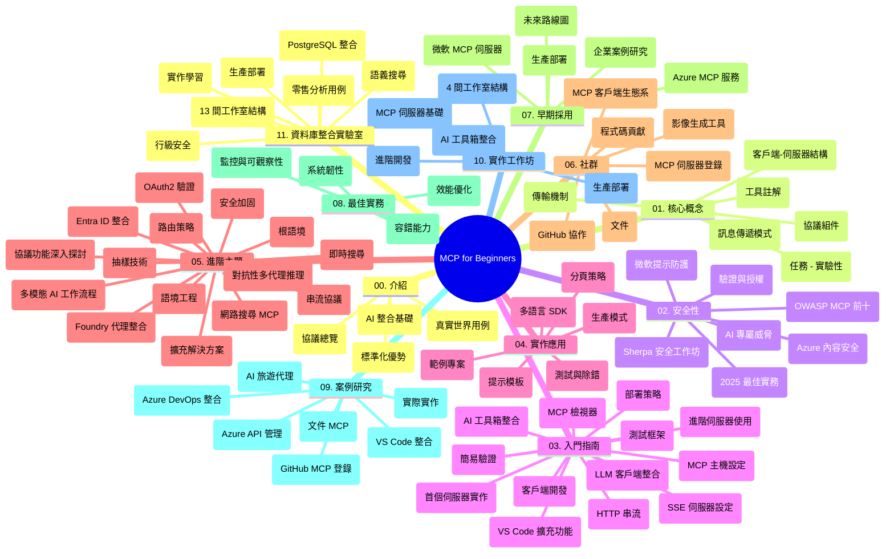

# Model Context Protocol (MCP) for Beginners - 學習指南

本學習指南提供「Model Context Protocol (MCP) for Beginners」課程的資源庫結構與內容概覽。使用此指南可高效導航資源庫，充分利用可用的資源。

## 資源庫概覽

Model Context Protocol (MCP) 是 AI 模型與客戶端應用之間互動的標準化框架。最初由 Anthropic 創建，MCP 現由更廣泛的 MCP 社群通過官方 GitHub 組織維護。本資源庫提供涵蓋 C#、Java、JavaScript、Python 及 TypeScript 的實作範例，專為 AI 開發者、系統架構師及軟件工程師設計。

## 課程視覺圖

## 資源庫結構

資源庫組織成十一個主要部分，各自聚焦 MCP 的不同面向：

1. **介紹 (00-Introduction/)**
   - Model Context Protocol 概述
   - 為何 AI 流程中標準化至關重要
   - 實際應用案例與效益

2. **核心概念 (01-CoreConcepts/)**
   - 客戶端-伺服器架構
   - 協議關鍵組件
   - MCP 中的訊息模式

3. **安全性 (02-Security/)**
   - MCP 系統中的安全威脅
   - 實作安全最佳實務
   - 認證與授權策略
   - <strong>全面安全文件</strong>:
     - MCP 2025 年安全最佳實務
     - Azure 內容安全實作指南
     - MCP 安全控管與技術
     - MCP 快速參考最佳實務
   - <strong>主要安全主題</strong>:
     - Prompt 注入與工具中毒攻擊
     - 會話劫持與混淆代理問題
     - Token 穿透漏洞
     - 過度權限與存取控制
     - AI 元件供應鏈安全
     - 微軟 Prompt Shields 整合

4. **快速開始 (03-GettingStarted/)**
   - 環境設定與配置
   - 建立基本 MCP 伺服器和客戶端
   - 與現有應用整合
   - 包含章節：
     - 首個伺服器實作
     - 客戶端開發
     - LLM 客戶端整合
     - VS Code 整合
     - 伺服器端事件（SSE）伺服器
     - 進階伺服器用法
     - HTTP 串流
     - AI 工具包整合
     - 測試策略
     - 部署指引

5. **實務實作 (04-PracticalImplementation/)**
   - 跨程式語言使用 SDK
   - 除錯、測試與驗證技術
   - 製作可復用 Prompt 範本與工作流程
   - 範例專案與實作示範

6. **進階主題 (05-AdvancedTopics/)**
   - Context 工程技術
   - Foundry agent 整合
   - 多模態 AI 工作流程
   - OAuth2 認證展示
   - 即時搜尋功能
   - 即時串流
   - 根上下文實作
   - 路由策略
   - 取樣技術
   - 擴展策略
   - 安全性考量
   - Entra ID 安全整合
   - 網頁搜尋整合
   - 對抗性多智能體推理（辯論模式）

7. **社群貢獻 (06-CommunityContributions/)**
   - 如何貢獻程式碼與文檔
   - 透過 GitHub 合作
   - 社群驅動的增強與回饋
   - 使用多種 MCP 客戶端（Claude Desktop、Cline、VSCode）
   - 與流行 MCP 伺服器合作包括圖像生成

8. **早期採用經驗 (07-LessonsfromEarlyAdoption/)**
   - 真實世界實作與成功案例
   - 構建與部署基於 MCP 的解決方案
   - 趨勢與未來藍圖
   - **微軟 MCP 伺服器指南**：涵蓋 10 個生產級微軟 MCP 伺服器詳細介紹，包括：
     - Microsoft Learn Docs MCP Server
     - Azure MCP Server（15+ 專門連接器）
     - GitHub MCP Server
     - Azure DevOps MCP Server
     - MarkItDown MCP Server
     - SQL Server MCP Server
     - Playwright MCP Server
     - Dev Box MCP Server
     - Microsoft Foundry MCP Server
     - Microsoft 365 Agents Toolkit MCP Server

9. **最佳實務 (08-BestPractices/)**
   - 性能調校與優化
   - 設計容錯 MCP 系統
   - 測試與韌性策略

10. **案例研究 (09-CaseStudy/)**
    - <strong>七個綜合案例研究</strong>展示 MCP 在多元場景的靈活運用：
    - **Azure AI 旅行代理人**：多智能體協作結合 Azure OpenAI 與 AI 搜尋
    - **Azure DevOps 整合**：用 YouTube 資料更新自動化工作流程
    - <strong>即時文件擷取</strong>：Python 控制台客戶端搭配串流 HTTP
    - <strong>互動式學習計劃生成器</strong>：Chainlit 網頁應用引入對話式 AI
    - <strong>編輯器內文件</strong>：VS Code 與 GitHub Copilot 流程整合
    - **Azure API 管理**：企業 API 整合與 MCP 伺服器建置
    - **GitHub MCP Registry**：生態系發展與智能代理整合平台
    - 實作範例涵蓋企業整合、開發者生產力及生態系發展

11. **實務工作坊 (10-StreamliningAIWorkflowsBuildingAnMCPServerWithAIToolkit/)**
    - 結合 MCP 與 AI 工具包的綜合實務工作坊
    - 建置智能應用，連結 AI 模型與現實工具
    - 實作模組包括基礎、客製伺服器開發及生產部署策略
    - <strong>實驗室結構</strong>：
      - Lab 1：MCP 伺服器基礎
      - Lab 2：進階 MCP 伺服器開發
      - Lab 3：AI 工具包整合
      - Lab 4：生產部署與擴展
    - 依照實驗室導引逐步學習

12. **MCP 伺服器資料庫整合實驗室 (11-MCPServerHandsOnLabs/)**
    - <strong>完整 13 個實驗室學習路徑</strong>建置生產級 MCP 伺服器並整合 PostgreSQL
    - <strong>真實零售分析實作</strong>採用 Zava Retail 用例
    - <strong>企業級模式</strong>含行級安全（Row Level Security）、語意搜尋及多租戶資料存取
    - <strong>完整實驗室結構</strong>：
      - **實驗室 00-03：基礎** - 介紹、架構、安全性、環境設置
      - **實驗室 04-06：建構 MCP 伺服器** - 資料庫設計、MCP 伺服器實作、工具開發
      - **實驗室 07-09：進階功能** - 語意搜尋、測試與除錯、VS Code 整合
      - **實驗室 10-12：生產與最佳實務** - 部署、監控、優化
    - <strong>涵蓋技術</strong>：FastMCP 框架、PostgreSQL、Azure OpenAI、Azure Container Apps、Application Insights
    - <strong>學習成果</strong>：生產級 MCP 伺服器、資料庫整合模式、AI 驅動分析、企業安全

## 附加資源

資源庫還包括支援資源：

- **Images 資料夾**：課程中使用的圖表與插圖
- <strong>翻譯</strong>：多語言支援及文檔自動翻譯
- **官方 MCP 資源**：
  - [MCP Documentation](https://modelcontextprotocol.io/)
  - [MCP Specification](https://spec.modelcontextprotocol.io/)
  - [MCP GitHub Repository](https://github.com/modelcontextprotocol)

## 如何使用此資源庫

1. <strong>按序學習</strong>：依循章節順序（00 到 11）獲得有結構的學習體驗。
2. <strong>語言專注</strong>：若專注於特定程式語言，探索 samples 目錄中該語言的實作。
3. <strong>實務實作</strong>：從「快速開始」章節設置環境，建置首個 MCP 伺服器與客戶端。
4. <strong>進階探索</strong>：熟悉基礎後，深入進階主題擴展知識。
5. <strong>社群參與</strong>：加入 MCP 社群透過 GitHub 討論及 Discord 頻道，連接專家與其他開發者。

## MCP 客戶端與工具

課程涵蓋各種 MCP 客戶端與工具：

1. <strong>官方客戶端</strong>：
   - Visual Studio Code
   - Visual Studio Code 中的 MCP
   - Claude Desktop
   - VSCode 中的 Claude
   - Claude API

2. <strong>社群客戶端</strong>：
   - Cline（終端機版）
   - Cursor（程式碼編輯器）
   - ChatMCP
   - Windsurf

3. **MCP 管理工具**：
   - MCP CLI
   - MCP Manager
   - MCP Linker
   - MCP Router

## 熱門 MCP 伺服器

資源庫介紹多種 MCP 伺服器，包括：

1. **官方 Microsoft MCP 伺服器**：
   - Microsoft Learn Docs MCP Server
   - Azure MCP Server（15+ 專門連接器）
   - GitHub MCP Server
   - Azure DevOps MCP Server
   - MarkItDown MCP Server
   - SQL Server MCP Server
   - Playwright MCP Server
   - Dev Box MCP Server
   - Microsoft Foundry MCP Server
   - Microsoft 365 Agents Toolkit MCP Server

2. <strong>官方參考伺服器</strong>：
   - Filesystem
   - Fetch
   - Memory
   - Sequential Thinking

3. <strong>圖像生成</strong>：
   - Azure OpenAI DALL-E 3
   - Stable Diffusion WebUI
   - Replicate

4. <strong>開發工具</strong>：
   - Git MCP
   - Terminal Control
   - Code Assistant

5. <strong>專門伺服器</strong>：
   - Salesforce
   - Microsoft Teams
   - Jira & Confluence

## 貢獻

本資源庫歡迎社群貢獻。參見「社群貢獻」章節，了解如何有效地為 MCP 生態系統做出貢獻。

----

*本學習指南最後更新於 2026 年 2 月 5 日，反映最新 MCP 規範 2025-11-25，並提供該日期資源庫的概覽。資源庫內容可能會在此日期後更新。*

---

<!-- CO-OP TRANSLATOR DISCLAIMER START -->
**免責聲明**：
本文件使用 AI 翻譯服務 [Co-op Translator](https://github.com/Azure/co-op-translator) 進行翻譯。雖然我們力求準確，但請注意，自動翻譯可能包含錯誤或不準確之處。原始文件的母語版本應被視為權威來源。對於重要資訊，建議尋求專業人工翻譯。我們不對因使用本翻譯而引起的任何誤解或曲解承擔責任。
<!-- CO-OP TRANSLATOR DISCLAIMER END -->