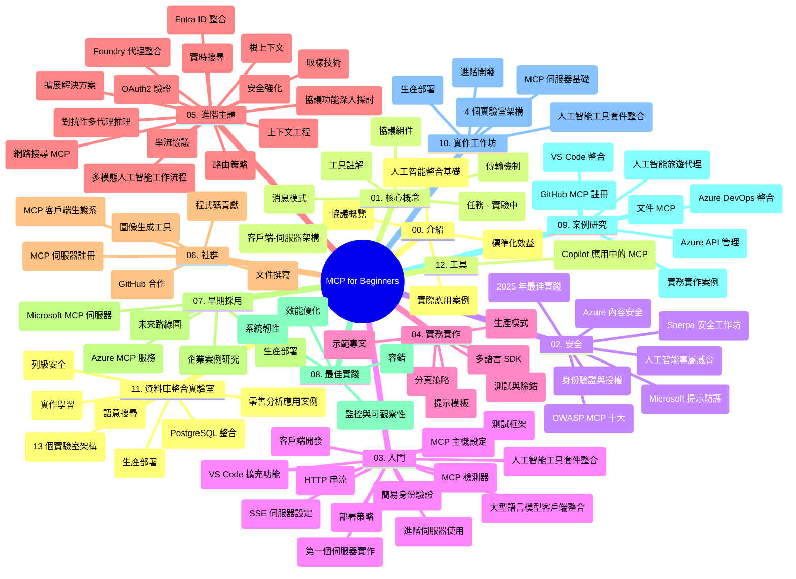

# 初學者模型語境協議（MCP）學習指南

本學習指南概述了「初學者模型語境協議（MCP）」課程的倉庫結構與內容。請使用此指南有效瀏覽倉庫，充分利用可用資源。

## 倉庫總覽

模型語境協議（MCP）是一個 AI 模型與客戶端應用間互動的標準化框架。MCP 最初由 Anthropic 創建，現由更廣泛的 MCP 社群通過官方 GitHub 組織維護。此倉庫提供包含 C#、Java、JavaScript、Python 和 TypeScript 的實作程式碼範例，為 AI 開發者、系統架構師及軟件工程師設計的完整課程。

## 視覺課程地圖

## 倉庫結構

倉庫分為十二個主要部分，各自聚焦 MCP 的不同面向：

1. **介紹 (00-Introduction/)**
   - 模型語境協議概覽
   - 為何 AI 流程需標準化
   - 實際應用案例與效益

2. **核心概念 (01-CoreConcepts/)**
   - 客戶端-伺服器架構
   - 重要協議組件
   - MCP 中的訊息傳遞模式

3. **安全性 (02-Security/)**
   - MCP 基礎系統的安全威脅
   - 安全實作最佳實務
   - 認證與授權策略
   - **完整安全文件：**
     - MCP 2025 年安全最佳實務
     - Azure 內容安全實作指南
     - MCP 安全控制與技術
     - MCP 快速安全實務參考
   - **重要安全議題：**
     - 提示注入與工具中毒攻擊
     - 會話劫持與代理被誤用問題
     - 權杖穿透漏洞
     - 過度許可與存取控制
     - AI 組件供應鏈安全
     - Microsoft 提示盾牌整合

4. **入門指南 (03-GettingStarted/)**
   - 環境設置與配置
   - 創建基礎 MCP 伺服器和客戶端
   - 與現有應用程式整合
   - 包含章節：
     - 首個伺服器實作
     - 客戶端開發
     - LLM 客戶端整合
     - VS Code 整合
     - 伺服器推送事件（SSE）伺服器
     - 進階伺服器使用
     - HTTP 串流
     - AI 工具包整合
     - 測試策略
     - 部署指南

5. **實務應用 (04-PracticalImplementation/)**
   - 各程式語言 SDK 使用方式
   - 除錯、測試與驗證技術
   - 撰寫可重用提示模板與工作流程
   - 範例專案與實作範例

6. **進階主題 (05-AdvancedTopics/)**
   - 語境工程技巧
   - Foundry 代理整合
   - 多模態 AI 工作流程 
   - OAuth2 認證示範
   - 實時搜尋能力
   - 實時串流
   - 根語境實作
   - 路由策略
   - 抽樣技巧
   - 規模擴展方法
   - 安全性考量
   - Entra ID 安全整合
   - 網路搜尋整合
   - 對抗式多代理推理（辯論模式）

7. **社群貢獻 (06-CommunityContributions/)**
   - 如何貢獻程式碼與文件
   - 透過 GitHub 協作
   - 社群驅動的改進與回饋
   - 使用多種 MCP 客戶端（Claude Desktop、Cline、VSCode）
   - 運用主流 MCP 伺服器包含圖像生成功能

8. **早期採用經驗 (07-LessonsfromEarlyAdoption/)**
   - 實際案例與成功故事
   - 建立及部署基於 MCP 的解決方案
   - 趨勢與未來路線圖
   - **Microsoft MCP 伺服器指南**：完整介紹 10 個生產準備級 Microsoft MCP 伺服器，包括：
     - Microsoft Learn Docs MCP 伺服器
     - Azure MCP 伺服器（15+ 專用連接器）
     - GitHub MCP 伺服器
     - Azure DevOps MCP 伺服器
     - MarkItDown MCP 伺服器
     - SQL Server MCP 伺服器
     - Playwright MCP 伺服器
     - Dev Box MCP 伺服器
     - Microsoft Foundry MCP 伺服器
     - Microsoft 365 Agents Toolkit MCP 伺服器

9. **最佳實務 (08-BestPractices/)**
   - 效能調校與優化
   - 設計容錯 MCP 系統
   - 測試與韌性策略

10. **案例研究 (09-CaseStudy/)**
    - <strong>七個完整案例研究</strong> 展示 MCP 在不同場景下的多樣應用：
    - **Azure AI 旅遊代理**：多代理協調結合 Azure OpenAI 與 AI 搜尋
    - **Azure DevOps 整合**：自動化工作流程與 YouTube 資料更新
    - <strong>實時文件擷取</strong>：Python 控制台客戶端搭配串流 HTTP
    - <strong>互動式學習計畫產生器</strong>：Chainlit 網頁應用與會話式 AI
    - <strong>編輯器內文件</strong>：VS Code 與 GitHub Copilot 工作流程整合
    - **Azure API 管理**：企業 API 整合搭配 MCP 伺服器建置
    - **GitHub MCP 登記註冊**：生態系發展與代理整合平台
    - 涵蓋企業整合、開發者生產力與生態系發展的實作範例

11. **實作工作坊 (10-StreamliningAIWorkflowsBuildingAnMCPServerWithAIToolkit/)**
    - 結合 MCP 與 AI 工具包的全面實作工作坊
    - 建置連接 AI 模型與現實世界工具的智慧應用
    - 實作模組涵蓋基礎、客製伺服器開發及生產部署策略
    - <strong>實驗室結構</strong>：
      - 實驗室 1：MCP 伺服器基礎
      - 實驗室 2：進階 MCP 伺服器開發
      - 實驗室 3：AI 工具包整合
      - 實驗室 4：生產部署及規模擴展
    - 實驗室式逐步教學法

12. **MCP 伺服器資料庫整合實驗室 (11-MCPServerHandsOnLabs/)**
    - **完整 13 個實驗室學習路徑**，建置生產級 MCP 伺服器並整合 PostgreSQL
    - <strong>實務零售分析實作</strong>，採用 Zava Retail 案例
    - <strong>企業級模式</strong> 包括行級安全（RLS）、語意搜尋及多租戶資料存取
    - <strong>完整實驗室結構</strong>：
      - **實驗室 00-03：基礎** — 介紹、架構、安全、環境建置
      - **實驗室 04-06：建置 MCP 伺服器** — 資料庫設計、MCP 伺服器實作、工具開發
      - **實驗室 07-09：進階功能** — 語意搜尋、測試與除錯、VS Code 整合
      - **實驗室 10-12：生產與最佳實務** — 部署、監控、優化
    - <strong>涵蓋技術</strong>：FastMCP 框架、PostgreSQL、Azure OpenAI、Azure Container Apps、Application Insights
    - <strong>學習成果</strong>：生產準備 MCP 伺服器、資料庫整合模式、AI 驅動分析、企業安全

13. **工具 (12-tooling/)**
    - 學習如何在 Copilot 應用及其他工具中使用 MCP

## 額外資源

倉庫包含輔助資源：

- **Images 資料夾**：課程中使用的圖表與說明圖
- <strong>翻譯</strong>：多語言支援與文件自動翻譯
- **官方 MCP 資源**：
  - [MCP 文件](https://modelcontextprotocol.io/)
  - [MCP 規範](https://spec.modelcontextprotocol.io/)
  - [MCP GitHub 倉庫](https://github.com/modelcontextprotocol)

## 如何使用本倉庫

1. <strong>循序學習</strong>：依章節順序（00 至 11）學習，建立系統性知識。
2. <strong>針對特定語言</strong>：如有偏好程式語言，請探索對應語言的範例目錄。
3. <strong>實務實作</strong>：從「入門指南」開始，設定環境，創建第一個 MCP 伺服器與客戶端。
4. <strong>深入探索</strong>：掌握基礎後，進入進階主題擴展知識。
5. <strong>社群參與</strong>：加入 MCP 社群，透過 GitHub 論壇與 Discord 頻道與專家及其他開發者交流。

## MCP 客戶端與工具

課程涵蓋的 MCP 客戶端及工具：

1. <strong>官方客戶端</strong>：
   - Visual Studio Code 
   - MCP 在 Visual Studio Code 中的整合
   - Claude Desktop
   - Claude 在 VSCode 中的使用
   - Claude API

2. <strong>社群客戶端</strong>：
   - Cline（終端機為基礎）
   - Cursor（程式碼編輯器）
   - ChatMCP
   - Windsurf

3. **MCP 管理工具**：
   - MCP CLI
   - MCP 管理員
   - MCP 連結器
   - MCP 路由器

## 熱門 MCP 伺服器

倉庫介紹多種 MCP 伺服器，包括：

1. **Microsoft 官方 MCP 伺服器**：
   - Microsoft Learn Docs MCP 伺服器
   - Azure MCP 伺服器（15+ 專用連接器）
   - GitHub MCP 伺服器
   - Azure DevOps MCP 伺服器
   - MarkItDown MCP 伺服器
   - SQL Server MCP 伺服器
   - Playwright MCP 伺服器
   - Dev Box MCP 伺服器
   - Microsoft Foundry MCP 伺服器
   - Microsoft 365 Agents Toolkit MCP 伺服器

2. <strong>官方參考伺服器</strong>：
   - 檔案系統
   - Fetch
   - 記憶體
   - 連續思考

3. <strong>圖像生成</strong>：
   - Azure OpenAI DALL-E 3
   - Stable Diffusion WebUI
   - Replicate

4. <strong>開發工具</strong>：
   - Git MCP
   - 終端機控制
   - 程式碼助理

5. <strong>專業伺服器</strong>：
   - Salesforce
   - Microsoft Teams
   - Jira 與 Confluence

## 貢獻

歡迎社群參與本倉庫貢獻，詳見社群貢獻章節了解如何有效參與 MCP 生態系。

----

*本學習指南最後更新於 2026 年 2 月 5 日，反映最新 MCP 規範 2025-11-25，並提供截至當時的倉庫概覽。倉庫內容可能於此日期後更新。*

---

<!-- CO-OP TRANSLATOR DISCLAIMER START -->
**免責聲明**：
本文件使用 AI 翻譯服務 [Co-op Translator](https://github.com/Azure/co-op-translator) 進行翻譯。雖然我們力求準確，但請注意，自動翻譯可能包含錯誤或不準確之處。原始文件的母語版本應被視為權威來源。對於重要資訊，建議尋求專業人工翻譯。我們不對因使用本翻譯而引起的任何誤解或曲解承擔責任。
<!-- CO-OP TRANSLATOR DISCLAIMER END -->