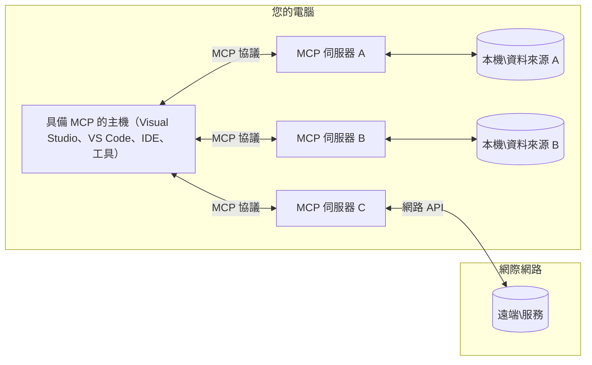

# MCP 核心概念：掌握用於 AI 整合的模型上下文協定

[](https://youtu.be/earDzWGtE84)

_(點擊上方圖片觀看本課程影片)_

[模型上下文協定 (Model Context Protocol, MCP)](https://github.com/modelcontextprotocol) 是一個強大且標準化的架構，優化大型語言模型 (LLMs) 與外部工具、應用程式及資料來源之間的溝通。本指南將引導您了解 MCP 的核心概念。您將學習其用戶端-伺服器架構、基本組件、通訊機制及實作最佳實務。

- **明確用戶同意**：所有資料存取與操作皆需用戶明確同意後方可執行。用戶必須清楚了解將被存取的資料與將執行的動作，且可細部控制權限及授權。

- **資料隱私保護**：僅在取得明確同意後揭露用戶資料，且必須以強健的存取控管保護整個互動生命週期。實作必須防止未授權資料傳輸並維持嚴格隱私界限。

- **工具執行安全**：每次工具調用都需用戶明確同意，並清楚了解工具功能、參數以及可能影響。必須有嚴格安全界限避免非預期、不安全或惡意的工具執行。

- **傳輸層安全**：所有通訊通道應採用適當的加密與身份驗證機制。遠端連線應使用安全傳輸協定及妥善的憑證管理。

#### 實作指導方針：

- **權限管理**：實作細粒度權限系統，允許用戶控制可訪問的伺服器、工具及資源  
- **身份驗證與授權**：使用安全驗證方法（OAuth、API 金鑰），並妥善管理與過期憑證  
- **輸入驗證**：根據定義的結構驗證所有參數與資料輸入，避免注入攻擊  
- **稽核日誌**：維護全面的作業紀錄，以利安全監控與合規性

## 概覽

本課程探討構成模型上下文協定 (MCP) 生態系統的基本架構及組件。您將理解用戶端-伺服器架構、重要元件及使 MCP 互動得以運作的通訊機制。

## 主要學習目標

課程結束後，您將能：

- 理解 MCP 的用戶端-伺服器架構。  
- 辨識 Hosts、Clients 和 Servers 的角色與責任。  
- 分析使 MCP 成為靈活整合層的核心特色。  
- 學習 MCP 生態系統中資訊流動的運作方式。  
- 透過 .NET、Java、Python 和 JavaScript 程式範例取得實務洞見。

## MCP 架構：深入剖析

MCP 生態系統架構基於用戶端-伺服器模型。此模組化結構讓 AI 應用能有效地與工具、資料庫、API 及上下文資源互動。以下是該架構的核心組件。

MCP 基於用戶端-伺服器架構，其中主機應用程式可連接多個伺服器：


- **MCP Hosts**：如 VSCode、Claude Desktop、IDE 或希望透過 MCP 存取資料的 AI 工具  
- **MCP Clients**：與伺服器維持一對一連線的協定用戶端  
- **MCP Servers**：每個透過標準化模型上下文協定暴露特定能力的輕量級程式  
- **本地資料來源**：您的電腦檔案、資料庫及 MCP 伺服器可安全存取的服務  
- **遠端服務**：透過 API 連接的網際網路遠端系統  

MCP 協定是一個持續演化的標準，採用日期為版本格式 (YYYY-MM-DD)。目前協定版本為 **2025-11-25**。您可查看此 [協定規格最新更新](https://modelcontextprotocol.io/specification/2025-11-25/)

### 1. Hosts

在模型上下文協定 (MCP) 中，**Hosts** 是作為用戶與協定互動主要介面的 AI 應用程式。Hosts 負責協調和管理對多個 MCP 伺服器的連接，為每個伺服器連線建立專屬的 MCP 用戶端。Hosts 範例如下：

- **AI 應用程式**：Claude Desktop、Visual Studio Code、Claude Code  
- **開發環境**：集成 MCP 的 IDE 和程式編輯器  
- **自訂應用程式**：專為 AI 代理及工具打造的應用程式  

**Hosts** 是協調 AI 模型互動的應用程式。它們：

- **協調 AI 模型**：執行或與 LLMs 互動以生成回應並協調 AI 工作流程  
- **管理用戶端連線**：為每個 MCP 伺服器連線建立並維護一個 MCP 客戶端  
- **控制用戶介面**：處理對話流程、用戶互動與回應呈現  
- **強制安全控管**：控管權限、安全限制與身份驗證  
- **處理用戶同意**：管理用戶對資料共享和工具執行的批准  

### 2. Clients

**Clients** 是維持 Hosts 與 MCP 伺服器間專屬一對一連線的重要元件。Host 為連接特定 MCP 伺服器而實例化每個 MCP 用戶端，以確保有組織且安全的通訊通道。多重客戶端讓 Host 能同時連接多個伺服器。

**Clients** 是 Host 內的連接元件。它們：

- **協定通訊**：以 JSON-RPC 2.0 傳送請求給伺服器，包含提示和指令  
- **功能協商**：初始化時和伺服器協商支援功能與協定版本  
- **工具執行管理**：管理模型的工具執行請求並處理回應  
- **即時更新**：處理來自伺服器的通知和即時更新  
- **回應處理**：處理並格式化伺服器回應以供用戶顯示  

### 3. Servers

**Servers** 是提供上下文、工具及能力給 MCP 用戶端的程式。可在本機（與 Host 同機）執行，或遠端部署於外部平台，負責處理用戶端請求並提供結構化回應。伺服器透過標準化模型上下文協定暴露特定功能。

**Servers** 是提供上下文和能力的服務。它們：

- **功能註冊**：註冊並向用戶端暴露可用原語（資源、提示、工具）  
- **請求處理**：接收並執行來自用戶端的工具呼叫、資源請求與提示請求  
- **上下文提供**：提供上下文資訊與資料以增強模型回應  
- **狀態管理**：維護會話狀態並在必要時處理有狀態的互動  
- **即時通知**：向連接用戶端發送能力變更和更新通知  

任何人皆可開發伺服器以擴充模型功能並支持本機與遠端部署方案。

### 4. 伺服器原語 (Server Primitives)

模型上下文協定 (MCP) 中的伺服器提供三種核心 **原語**，定義用戶端、主機與語言模型間豐富互動的基本構建塊。這些原語規範透過協定可取得的上下文資訊與可執行動作類型。

MCP 伺服器可任意組合以下三種核心原語來暴露能力：

#### 資源 (Resources)  

**資源** 是提供上下文資訊給 AI 應用的資料來源。它們代表可提升模型理解與決策的靜態或動態內容：

- **上下文資料**：供 AI 模型使用的結構化資訊與上下文  
- **知識庫**：文件資料庫、文章、手冊及研究論文  
- **本地資料來源**：檔案、資料庫及本地系統資訊  
- **外部資料**：API 回應、網路服務及遠端系統資料  
- **動態內容**：根據外部條件即時更新的資料  

資源以 URI 識別，並支援透過 `resources/list` 進行搜尋及 `resources/read` 進行讀取：

```text
file://documents/project-spec.md
database://production/users/schema
api://weather/current
```

#### 提示 (Prompts)

**提示** 是可重用的範本，幫助結構化與語言模型的互動。提供標準化的互動範式與範本化工作流程：

- **基於模板的互動**：預先結構化的訊息與對話開頭  
- **工作流程模板**：常見任務及互動的標準化序列  
- **少量示例**：用於指導模型的示例範本  
- **系統提示**：定義模型行為與上下文的基礎提示  
- **動態模板**：可參數化且適應特定上下文的提示  

提示支援變數替代，並可透過 `prompts/list` 搜尋及 `prompts/get` 取得：

```markdown
Generate a {{task_type}} for {{product}} targeting {{audience}} with the following requirements: {{requirements}}
```

#### 工具 (Tools)

**工具** 是 AI 模型可調用執行特定動作的函式。它們代表 MCP 生態系的「動詞」，讓模型可與外部系統互動：

- **可執行函式**：模型可帶特定參數調用的獨立操作  
- **外部系統整合**：API 呼叫、資料庫查詢、檔案操作、計算  
- **獨特身份**：每個工具皆有獨特名稱、描述與參數結構  
- **結構化輸入/輸出**：工具接受驗證過的參數並回傳結構化、類型化回應  
- **動作能力**：使模型可執行現實世界動作並取得即時資料  

工具以 JSON Schema 定義參數驗證，並可透過 `tools/list` 搜尋及 `tools/call` 執行。工具亦可包括 **圖示** 作為額外的 UI 元資料。

**工具註記**：工具支援行為註記（例如 `readOnlyHint`、`destructiveHint`），描述工具是否只讀或具破壞性，協助用戶端做出執行判斷。

工具範例定義：

```typescript
server.tool(
  "search_products", 
  {
    query: z.string().describe("Search query for products"),
    category: z.string().optional().describe("Product category filter"),
    max_results: z.number().default(10).describe("Maximum results to return")
  }, 
  async (params) => {
    // 執行搜尋並返回結構化結果
    return await productService.search(params);
  }
);
```

## 用戶端原語 (Client Primitives)

在模型上下文協定 (MCP) 中，**用戶端** 可暴露原語讓伺服器要求主機應用程式提供額外能力。這些用戶端原語允許更豐富、互動式的伺服器實作，能存取 AI 模型功能和用戶互動。

### 取樣 (Sampling)

**取樣** 允許伺服器向用戶端的 AI 應用請求語言模型的補全。此原語讓伺服器不需內嵌自身模型依賴，即可使用 LLM 能力：

- **模型無關存取**：伺服器要求補全時無需包含 LLM SDK 或管理模型存取  
- **伺服器主導 AI**：伺服器可自主利用用戶端 AI 模型生成內容  
- **遞迴 LLM 互動**：支援伺服器需要 AI 助力進行複雜處理的場景  
- **動態內容生成**：讓伺服器能用主機模型創建上下文回應  
- **工具呼叫支援**：伺服器可包含 `tools` 和 `toolChoice` 參數，允許用戶端模型於取樣時調用工具  

取樣透過 `sampling/complete` 方法啟動，伺服器向用戶端傳送補全請求。

### 根目錄 (Roots)

**根目錄** 提供標準化方式，讓用戶端向伺服器暴露檔案系統邊界，協助伺服器了解可存取的目錄和檔案範圍：

- **檔案系統邊界**：定義伺服器可操作的檔案系統範圍界限  
- **存取控管**：協助伺服器瞭解其權限能存取哪些目錄與檔案  
- **動態更新**：用戶端根目錄變更時可通知伺服器  
- **基於 URI 識別**：根目錄使用 `file://` URI 來識別可存取目錄和檔案  

根目錄透過 `roots/list` 方法搜尋，用戶端在根目錄變動時發送 `notifications/roots/list_changed`。

### 引導 (Elicitation)

**引導** 允許伺服器透過用戶端介面請求用戶提供更多資訊或確認：

- **用戶輸入請求**：當執行工具需額外資訊時，伺服器可請求用戶提供  
- **確認對話方塊**：對敏感或影響深遠操作請求用戶批准  
- **互動式工作流程**：讓伺服器創建逐步的用戶互動  
- **動態參數收集**：工具執行時收集缺少或可選的參數  

引導請求使用 `elicitation/request` 方法，透過用戶端介面收集用戶輸入。

**URL 模式引導**：伺服器也可請求基於 URL 的用戶互動，讓伺服器引導用戶前往外部網頁做驗證、確認或資料輸入。

### 日誌 (Logging)

**日誌** 允許伺服器向用戶端發送結構化記錄訊息，用於除錯、監控及運作可視化：

- **除錯支援**：協助伺服器提供詳細執行記錄以利故障排除  
- **運作監控**：向用戶端發送狀態更新與效能指標  
- **錯誤回報**：提供詳細錯誤上下文與診斷資訊  
- **稽核軌跡**：建立伺服器操作與決策的完整紀錄  

日誌訊息傳送給用戶端，使伺服器作業具透明度並促進除錯。

## MCP 中的資訊流

模型上下文協定 (MCP) 定義了主機、用戶端、伺服器及模型間結構化的資訊流動。理解此流向有助於釐清用戶請求如何被處理，及外部工具與資料如何被整合至模型回應中。
- **主機啟動連線**  
  主機應用程式（例如 IDE 或聊天介面）建立與 MCP 伺服器的連線，通常透過 STDIO、WebSocket 或其他支援的傳輸方式。

- **能力協商**  
  用戶端（內嵌於主機中）與伺服器交換關於其支援功能、工具、資源及協議版本的資訊。此舉確保雙方了解會話中可用的功能。

- **使用者請求**  
  使用者與主機互動（例如輸入提示或指令）。主機收集此輸入並傳遞給用戶端進行處理。

- **資源或工具使用**  
  - 用戶端可能會向伺服器請求額外的上下文或資源（如檔案、資料庫條目或知識庫文章）以豐富模型的理解。  
  - 如果模型判定需要使用工具（例如擷取資料、執行計算或呼叫 API），用戶端會傳送工具呼叫請求給伺服器，指定工具名稱與參數。

- **伺服器執行**  
  伺服器接收資源或工具請求，執行必要操作（如執行函式、查詢資料庫或擷取檔案），並以結構化格式將結果回傳給用戶端。

- **回應生成**  
  用戶端整合伺服器回覆（資源資料、工具輸出等）到持續的模型互動中。模型使用這些資訊產生完整且符合上下文的回應。

- **結果呈現**  
  主機接收用戶端的最終輸出並呈現給使用者，通常包含模型產生的文字以及任何工具執行或資源查詢結果。

此流程使 MCP 能透過無縫連接模型與外部工具及資料來源，支援先進、互動且具上下文感知的 AI 應用。

## 協議架構與層次

MCP 由兩個不同的架構層級組成，協同提供完整的通訊框架：

### 資料層

**資料層** 使用 **JSON-RPC 2.0** 作為基礎，實作 MCP 協議核心。此層定義訊息結構、語義與互動模式：

#### 核心元件：

- **JSON-RPC 2.0 協議**：所有通訊使用標準化的 JSON-RPC 2.0 訊息格式，涵蓋方法呼叫、回應和通知  
- **生命週期管理**：處理用戶端與伺服器之間的連線初始化、能力協商與會話終止  
- **伺服器原語**：讓伺服器透過工具、資源和提示提供核心功能  
- **用戶端原語**：讓伺服器請求大型語言模型 (LLM) 取樣、引導使用者輸入並發送日誌訊息  
- **即時通知**：支援非同步通知，無須輪詢即可動態更新

#### 主要特色：

- **協議版本協商**：採用日期格式版本管理（YYYY-MM-DD）以確保相容性  
- **能力發現**：用戶端與伺服器在初始化期間交換支援功能資訊  
- **有狀態會話**：維持多次互動間的連線狀態以保持上下文連續性

### 傳輸層

**傳輸層** 管理 MCP 參與者間的通訊通道、訊息框架及驗證：

#### 支援的傳輸機制：

1. **STDIO 傳輸**：  
   - 使用標準輸入/輸出流以實現直接程序間通訊  
   - 適合同主機上的本地程序，無網路開銷  
   - 常用於本地 MCP 伺服器實作

2. **串流 HTTP 傳輸**：  
   - 採用 HTTP POST 傳送客戶端至伺服器的訊息  
   - 可選擇使用伺服器推送事件（SSE）來實現伺服器至客戶端的串流  
   - 支援跨網路的遠端伺服器通訊  
   - 支援標準 HTTP 身份驗證（Bearer Token、API 金鑰、自訂標頭）  
   - MCP 建議使用 OAuth 進行安全的基於令牌認證

#### 傳輸抽象：

傳輸層抽象通訊細節於資料層之上，使所有傳輸機制皆可共用 JSON-RPC 2.0 訊息格式。此抽象允許應用無縫切換本地與遠端伺服器。

### 安全考量

MCP 實作必須遵循若干關鍵安全原則，以確保所有協議操作的安全、可信與可靠互動：

- **使用者同意與控制**：使用者必須明確同意後才可存取資料或執行操作。應提供直覺介面清晰控制分享資料與授權行動的範圍。  
- **資料隱私**：使用者資料僅在獲得明確同意下暴露，並應透過適當的存取控制保護。MCP 實作必須防範未經授權的資料傳輸並確保隱私得以維護。  
- **工具安全**：在呼叫任何工具前，必須取得明確使用者同意。使用者應清楚了解工具功能，且必須實施強健安全邊界，防止意外或不安全的工具執行。

遵循這些安全原則，MCP 確保使用者信任、隱私與安全，同時促成強大的 AI 整合。

## 程式碼範例：核心元件

以下為多個流行程式語言的程式碼範例，展示如何實作 MCP 伺服器核心元件及工具。

### .NET 範例：建立簡易 MCP 伺服器與工具

下列為實務的 .NET 範例程式碼，示範如何實作含自訂工具的簡單 MCP 伺服器。示範如何定義與註冊工具、處理請求，及藉由模型上下文協議連接伺服器。

```csharp
using System;
using System.Threading.Tasks;
using ModelContextProtocol.Server;
using ModelContextProtocol.Server.Transport;
using ModelContextProtocol.Server.Tools;

public class WeatherServer
{
    public static async Task Main(string[] args)
    {
        // Create an MCP server
        var server = new McpServer(
            name: "Weather MCP Server",
            version: "1.0.0"
        );
        
        // Register our custom weather tool
        server.AddTool<string, WeatherData>("weatherTool", 
            description: "Gets current weather for a location",
            execute: async (location) => {
                // Call weather API (simplified)
                var weatherData = await GetWeatherDataAsync(location);
                return weatherData;
            });
        
        // Connect the server using stdio transport
        var transport = new StdioServerTransport();
        await server.ConnectAsync(transport);
        
        Console.WriteLine("Weather MCP Server started");
        
        // Keep the server running until process is terminated
        await Task.Delay(-1);
    }
    
    private static async Task<WeatherData> GetWeatherDataAsync(string location)
    {
        // This would normally call a weather API
        // Simplified for demonstration
        await Task.Delay(100); // Simulate API call
        return new WeatherData { 
            Temperature = 72.5,
            Conditions = "Sunny",
            Location = location
        };
    }
}

public class WeatherData
{
    public double Temperature { get; set; }
    public string Conditions { get; set; }
    public string Location { get; set; }
}
```

### Java 範例：MCP 伺服器元件

此範例示範與上述 .NET 範例相同的 MCP 伺服器及工具註冊作法，但以 Java 實作。

```java
import io.modelcontextprotocol.server.McpServer;
import io.modelcontextprotocol.server.McpToolDefinition;
import io.modelcontextprotocol.server.transport.StdioServerTransport;
import io.modelcontextprotocol.server.tool.ToolExecutionContext;
import io.modelcontextprotocol.server.tool.ToolResponse;

public class WeatherMcpServer {
    public static void main(String[] args) throws Exception {
        // 建立一個 MCP 伺服器
        McpServer server = McpServer.builder()
            .name("Weather MCP Server")
            .version("1.0.0")
            .build();
            
        // 註冊一個天氣工具
        server.registerTool(McpToolDefinition.builder("weatherTool")
            .description("Gets current weather for a location")
            .parameter("location", String.class)
            .execute((ToolExecutionContext ctx) -> {
                String location = ctx.getParameter("location", String.class);
                
                // 取得天氣資料（簡化版）
                WeatherData data = getWeatherData(location);
                
                // 回傳格式化的回應
                return ToolResponse.content(
                    String.format("Temperature: %.1f°F, Conditions: %s, Location: %s", 
                    data.getTemperature(), 
                    data.getConditions(), 
                    data.getLocation())
                );
            })
            .build());
        
        // 使用 stdio 傳輸連接伺服器
        try (StdioServerTransport transport = new StdioServerTransport()) {
            server.connect(transport);
            System.out.println("Weather MCP Server started");
            // 保持伺服器運行直到程序終止
            Thread.currentThread().join();
        }
    }
    
    private static WeatherData getWeatherData(String location) {
        // 實作會呼叫天氣 API
        // 為範例目的簡化處理
        return new WeatherData(72.5, "Sunny", location);
    }
}

class WeatherData {
    private double temperature;
    private String conditions;
    private String location;
    
    public WeatherData(double temperature, String conditions, String location) {
        this.temperature = temperature;
        this.conditions = conditions;
        this.location = location;
    }
    
    public double getTemperature() {
        return temperature;
    }
    
    public String getConditions() {
        return conditions;
    }
    
    public String getLocation() {
        return location;
    }
}
```

### Python 範例：構建 MCP 伺服器

此範例使用 fastmcp，請先確保已安裝：

```python
pip install fastmcp
```
Code Sample:

```python
#!/usr/bin/env python3
import asyncio
from fastmcp import FastMCP
from fastmcp.transports.stdio import serve_stdio

# 建立一個 FastMCP 伺服器
mcp = FastMCP(
    name="Weather MCP Server",
    version="1.0.0"
)

@mcp.tool()
def get_weather(location: str) -> dict:
    """Gets current weather for a location."""
    return {
        "temperature": 72.5,
        "conditions": "Sunny",
        "location": location
    }

# 使用類別的替代方法
class WeatherTools:
    @mcp.tool()
    def forecast(self, location: str, days: int = 1) -> dict:
        """Gets weather forecast for a location for the specified number of days."""
        return {
            "location": location,
            "forecast": [
                {"day": i+1, "temperature": 70 + i, "conditions": "Partly Cloudy"}
                for i in range(days)
            ]
        }

# 註冊類別工具
weather_tools = WeatherTools()

# 啟動伺服器
if __name__ == "__main__":
    asyncio.run(serve_stdio(mcp))
```

### JavaScript 範例：建立 MCP 伺服器

此範例展示如何用 JavaScript 建立 MCP 伺服器，並註冊兩個與天氣相關的工具。

```javascript
// 使用官方的模型上下文協定 SDK
import { McpServer } from "@modelcontextprotocol/sdk/server/mcp.js";
import { StdioServerTransport } from "@modelcontextprotocol/sdk/server/stdio.js";
import { z } from "zod"; // 用於參數驗證

// 建立 MCP 伺服器
const server = new McpServer({
  name: "Weather MCP Server",
  version: "1.0.0"
});

// 定義一個天氣工具
server.tool(
  "weatherTool",
  {
    location: z.string().describe("The location to get weather for")
  },
  async ({ location }) => {
    // 通常會呼叫天氣 API
    // 為示範簡化
    const weatherData = await getWeatherData(location);
    
    return {
      content: [
        { 
          type: "text", 
          text: `Temperature: ${weatherData.temperature}°F, Conditions: ${weatherData.conditions}, Location: ${weatherData.location}` 
        }
      ]
    };
  }
);

// 定義一個預報工具
server.tool(
  "forecastTool",
  {
    location: z.string(),
    days: z.number().default(3).describe("Number of days for forecast")
  },
  async ({ location, days }) => {
    // 通常會呼叫天氣 API
    // 為示範簡化
    const forecast = await getForecastData(location, days);
    
    return {
      content: [
        { 
          type: "text", 
          text: `${days}-day forecast for ${location}: ${JSON.stringify(forecast)}` 
        }
      ]
    };
  }
);

// 輔助函式
async function getWeatherData(location) {
  // 模擬 API 呼叫
  return {
    temperature: 72.5,
    conditions: "Sunny",
    location: location
  };
}

async function getForecastData(location, days) {
  // 模擬 API 呼叫
  return Array.from({ length: days }, (_, i) => ({
    day: i + 1,
    temperature: 70 + Math.floor(Math.random() * 10),
    conditions: i % 2 === 0 ? "Sunny" : "Partly Cloudy"
  }));
}

// 使用 stdio 傳輸連接伺服器
const transport = new StdioServerTransport();
server.connect(transport).catch(console.error);

console.log("Weather MCP Server started");
```

此 JavaScript 範例說明如何使用模型上下文協議 SDK 建立 MCP 伺服器。示範註冊名為 `weatherTool` 與 `forecastTool` 的兩個工具，並透過 `StdioServerTransport` 使其對 MCP 用戶端可用。

## 安全與授權

MCP 包含多個內建機制與概念，用於管理協議全程的安全性與授權：

1. **工具權限控制**：  
  用戶端可指定模型在會話中允許使用的工具，確保僅能存取明確授權的工具，降低意外或不安全操作風險。權限可依使用者偏好、組織政策或互動上下文動態配置。

2. **身份驗證**：  
  伺服器可要求身份驗證，才能存取工具、資源或敏感操作。可能涉及 API 金鑰、OAuth 令牌或其他驗證方案。適當的身份驗證確保僅授信用戶端與使用者能呼叫伺服器端功能。

3. **驗證**：  
  所有工具呼叫皆強制參數驗證。每個工具定義其參數的類型、格式及約束，伺服器依此驗證傳入請求。此措施阻擋格式錯誤或惡意輸入，維護操作完整性。

4. **速率限制**：  
  為防止濫用並確保公平使用伺服器資源，MCP 伺服器可對工具呼叫及資源存取實施速率限制。限制可依使用者、會話或全域範圍設定，有效抵抗拒絕服務攻擊及過度資源消耗。

結合這些機制，MCP 提供安全基礎，用以整合語言模型與外部工具及資料來源，同時賦予使用者與開發者細緻的存取與使用控制。

## 協議訊息與通訊流程

MCP 通訊使用結構化的 **JSON-RPC 2.0** 訊息，以促成主機、用戶端與伺服器間清晰且可靠的互動。協議定義不同作業類型的具體訊息模式：

### 核心訊息類別：

#### **初始化訊息**
- **`initialize` 請求**：建立連線並協商協議版本與能力  
- **`initialize` 回應**：確認支援功能及伺服器資訊  
- **`notifications/initialized`**：通知初始化完成、會話準備就緒

#### **發現訊息**
- **`tools/list` 請求**：尋找伺服器可用工具  
- **`resources/list` 請求**：列出可用資源（資料來源）  
- **`prompts/list` 請求**：取得可用提示範本

#### **執行訊息**  
- **`tools/call` 請求**：以參數執行指定工具  
- **`resources/read` 請求**：擷取指定資源內容  
- **`prompts/get` 請求**：取得提示範本並可帶參數

#### **用戶端端訊息**
- **`sampling/complete` 請求**：伺服器請求用戶端 LLM 補全  
- **`elicitation/request`**：伺服器請用戶端介面引導使用者輸入  
- **日誌訊息**：伺服器發送結構化日誌至用戶端

#### **通知訊息**
- **`notifications/tools/list_changed`**：伺服器通知工具列表變更  
- **`notifications/resources/list_changed`**：伺服器通知資源列表變更  
- **`notifications/prompts/list_changed`**：伺服器通知提示列表變更

### 訊息結構：

所有 MCP 訊息遵循 JSON-RPC 2.0 格式：  
- **請求訊息**：包含 `id`、`method` 與可選 `params`  
- **回應訊息**：包含 `id`，和 `result` 或 `error` 之一  
- **通知訊息**：包含 `method` 與可選 `params`（無 `id`，不期待回應）

此結構化通訊確保可靠、可追蹤且擴展性高的互動，支援即時更新、工具串接與健全錯誤處理等進階場景。

### 任務 (實驗性功能)

**任務** 是一項實驗性功能，提供可持久執行的封裝，支援 MCP 請求的延後結果取得與狀態追蹤：

- **長時間運算**：追蹤昂貴計算、工作流程自動化及批次處理  
- **延後結果**：可輪詢任務狀態，操作完成時取得結果  
- **狀態追蹤**：透過定義的生命週期狀態監控進度  
- **多步驟作業**：支援跨多次互動的複雜工作流程

任務包裝標準 MCP 請求，使無法立即完成的操作可採非同步執行模式。

## 重要重點彙整

- **架構**：MCP 採用用戶端-伺服器架構，主機管理多個用戶端連線至伺服器  
- **參與者**：生態系包含主機（AI 應用）、用戶端（協議連接器）、伺服器（功能提供者）  
- **通訊機制**：支援 STDIO（本地）與串流 HTTP 與可選 SSE（遠端）  
- **核心原語**：伺服器公開工具（可執行函式）、資源（資料來源）與提示（範本）  
- **用戶端原語**：伺服器可請求用戶端取樣（支援 LLM 補全與工具呼叫）、引導輸入（含 URL 模式）、根目錄（檔案系統邊界）及記錄  
- **實驗功能**：任務提供長時間運行作業的持久執行封裝  
- **協議基礎**：基於 JSON-RPC 2.0 且使用日期作版本控制（目前為 2025-11-25）  
- **即時功能**：支援動態更新與即時同步的通知  
- **安全優先**：明確使用者同意、資料隱私保護與安全傳輸為核心要求

## 練習

設計一個在你的領域中有用的簡單 MCP 工具。定義如下內容：  
1. 工具名稱  
2. 接受的參數  
3. 返回的輸出  
4. 模型如何使用該工具來解決使用者問題


---

## 下一章節

下一章節：[Chapter 2: Security](../02-Security/README.md)

---

<!-- CO-OP TRANSLATOR DISCLAIMER START -->
**免責聲明**：  
本文件經由 AI 翻譯服務 [Co-op Translator](https://github.com/Azure/co-op-translator) 進行翻譯。雖然我們致力於保持準確性，但請注意自動翻譯可能包含錯誤或不精確之處。請以原始文件的母語版本為權威來源。對於重要資訊，建議聘請專業人工翻譯。本公司對因使用本翻譯而導致的任何誤解或錯譯不承擔任何責任。
<!-- CO-OP TRANSLATOR DISCLAIMER END -->