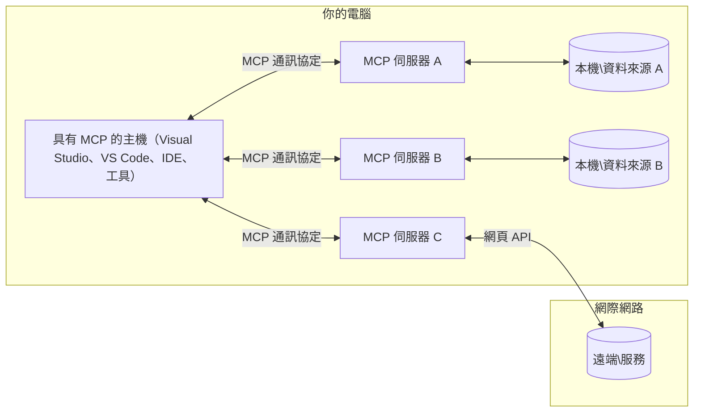

# MCP 核心概念：掌握 AI 整合的模型上下文協定

[](https://youtu.be/earDzWGtE84)

_(點擊上方圖片觀看本課程影片)_

[模型上下文協定 (Model Context Protocol, MCP)](https://github.com/modelcontextprotocol) 是一個強大且標準化的框架，優化大型語言模型（LLM）與外部工具、應用程式及資料來源之間的溝通。  
本指南將引導您了解 MCP 的核心概念。您將學習它的客戶端-伺服器架構、基本組件、通訊機制以及實作最佳實踐。

- **明確用戶同意**：所有資料存取與操作皆需獲得用戶明確許可後方可執行。使用者必須清楚了解將存取哪些資料，以及將進行哪些操作，並具備細緻的權限與授權控制。

- **資料隱私保護**：用戶資料僅在明確同意下暴露，且必須通過強健的存取控制，貫穿整個互動生命週期。實作必須防止未授權資料傳輸，並維持嚴格隱私界限。

- **工具執行安全性**：每次工具呼叫都需用戶明確同意，確保用戶充分理解工具功能、參數及潛在影響。強健的安全邊界必須防止意外、不安全或惡意的工具執行。

- **傳輸層安全性**：所有通訊渠道應使用適當的加密與認證機制。遠端連接應實施安全傳輸協定和妥善的憑證管理。

#### 實作指引：

- **權限管理**：實施細粒度的權限系統，使使用者能掌控哪些伺服器、工具和資源可存取  
- **認證與授權**：使用安全的認證方式（OAuth、API 金鑰）並妥善管理與過期控制令牌  
- **輸入驗證**：依照定義之結構驗證所有參數與資料輸入，防範注入攻擊  
- **稽核日誌**：維護完整的操作日誌以利安全監控與合規性

## 概覽

本課程探討組成模型上下文協定（MCP）生態系的基本架構與組件。您將了解客戶端-伺服器架構、關鍵組件及驅動 MCP 互動的通訊機制。

## 主要學習目標

完成本課程後，您將能：

- 理解 MCP 客戶端-伺服器架構。  
- 分辨主機 (Host)、客戶端 (Client) 與伺服器 (Server) 的角色與責任。  
- 分析 MCP 作為彈性整合層的核心特性。  
- 學習 MCP 生態系中資訊流動方式。  
- 透過 .NET、Java、Python 與 JavaScript 範例獲得實作見解。

## MCP 架構：深入探討

MCP 生態系基於客戶端-伺服器模型構建。此模組化結構讓 AI 應用程式能有效與工具、資料庫、API 及上下文資源互動。以下將架構拆解為核心組件。

MCP 核心遵循客戶端-伺服器架構，主機應用程式可連接至多個伺服器：


- **MCP 主機 (Hosts)**：如 VSCode、Claude Desktop、IDE 或希望透過 MCP 存取資料的 AI 工具  
- **MCP 客戶端 (Clients)**：維持與伺服器一對一連線的協定客戶端
- **MCP 伺服器 (Servers)**：輕量程式，透過標準化模型上下文協定揭露特定功能  
- **本地資料來源**：電腦上的檔案、資料庫與服務，MCP 伺服器可安全存取  
- **遠端服務**：透過網路可存取的外部系統，MCP 伺服器可透過 API 連接  

MCP 協定是一項不斷演進的標準，採用日期式版本管理（YYYY-MM-DD 格式）。現行協定版本為 **2025-11-25**，您可查看最新的[協定規範](https://modelcontextprotocol.io/specification/2025-11-25/)

### 1. 主機 (Hosts)

在模型上下文協定（MCP）中，**主機**是 AI 應用程式，是用戶與協定互動的主要介面。主機藉由為每個伺服器連線建立專屬 MCP 客戶端，協調並管理多個 MCP 伺服器的連線。主機範例包括：

- **AI 應用程式**：Claude Desktop、Visual Studio Code、Claude Code  
- **開發環境**：整合 MCP 的 IDE 與程式碼編輯器  
- **客製化應用**：專為用途設計的 AI 代理與工具  

**主機**是協調 AI 模型互動的應用程式，它們：

- **編排 AI 模型**：執行或與大型語言模型互動以生成回應並協調 AI 工作流程  
- **管理客戶端連接**：為每個 MCP 伺服器連線建立並維護一個 MCP 客戶端  
- **控制用戶介面**：處理對話流程、用戶互動及回應呈現  
- **執行安全控管**：管控權限、安全限制及認證  
- **處理用戶同意**：管理用戶對資料共享與工具執行的同意權限  

### 2. 客戶端 (Clients)

**客戶端**是在主機與 MCP 伺服器間維持專屬一對一連線的重要元件。主機為每個 MCP 伺服器實例化一個 MCP 客戶端，確保通訊通道條理清晰且安全。多個客戶端使主機能同時連接多台伺服器。

**客戶端**是主機應用內的連接器組件。它們：

- **協定通訊**：以 JSON-RPC 2.0 格式向伺服器傳送提示與指令請求  
- **功能協商**：初始化時與伺服器協議支援的功能與協定版本  
- **工具執行管理**：處理模型發起的工具呼叫請求並處理回應  
- **即時更新**：處理伺服器的通知與即時更新  
- **回應處理**：處理並格式化伺服器回應供使用者展示  

### 3. 伺服器 (Servers)

**伺服器**是為 MCP 客戶端提供上下文、工具及功能的程式。伺服器可本地執行（與主機相同機器）或遠端執行（外部平台），負責處理客戶端請求並回應結構化資料。伺服器經由標準化的模型上下文協定揭露特定功能。

**伺服器**是提供上下文及能力的服務。它們：

- **功能註冊**：向客戶端註冊及揭露可用的原始操作（資源、提示、工具）  
- **請求處理**：接收並執行來自客戶端的工具呼叫、資源請求與提示請求  
- **上下文提供**：提供上下文資訊與資料以強化模型回應  
- **狀態管理**：維持會話狀態，必要時處理有狀態的互動  
- **即時通知**：向連接的客戶端通報能力變更與更新  

伺服器可由任何人開發，以專業功能擴充模型能力，支援本地與遠端部署場景。

### 4. 伺服器原始操作 (Server Primitives)

模型上下文協定（MCP）中的伺服器提供三種核心**原始操作**，定義客戶端、主機與語言模型之間豐富互動的基本建構區塊。這些原始操作規範了協定中可用的上下文資訊類型與可執行動作。

MCP 伺服器可揭露以下三種核心原始操作的任意組合：

#### 資源 (Resources)

**資源**是提供 AI 應用上下文資訊的資料來源。它們代表靜態或動態內容，能提升模型理解及決策能力：

- **上下文資料**：提供 AI 模型使用的結構化資訊與上下文  
- **知識庫**：文件倉儲、文章、手冊與研究論文  
- **本地資料來源**：檔案、資料庫與系統本地資訊  
- **外部資料**：API 回應、網路服務與遠端系統資料  
- **動態內容**：根據外部條件實時更新的資料  

資源以 URI 標示，並支援透過 `resources/list` 進行發現，使用 `resources/read` 讀取：

```text
file://documents/project-spec.md
database://production/users/schema
api://weather/current
```

#### 提示 (Prompts)

**提示**是可重複使用的範本，幫助結構化與語言模型的互動。它們提供標準化的互動模式與模板工作流程：

- **基於範本的互動**：預先結構化的訊息與對話起手式  
- **工作流程範本**：常見任務與互動的標準序列  
- **少數示例**：用範例指導模型的範本  
- **系統提示**：定義模型行為與上下文的基礎提示  
- **動態範本**：可參數化的提示，依特定上下文調整  

提示支援變數替換，可透過 `prompts/list` 探索並透過 `prompts/get` 讀取：

```markdown
Generate a {{task_type}} for {{product}} targeting {{audience}} with the following requirements: {{requirements}}
```

#### 工具 (Tools)

**工具**是 AI 模型可調用以執行特定動作的可執行功能。它們是 MCP 生態系的「動詞」，讓模型與外部系統互動：

- **可執行功能**：模型可用特定參數呼叫的離散操作  
- **外部系統整合**：API 呼叫、資料庫查詢、檔案操作、計算  
- **唯一識別**：每個工具具有獨特名稱、說明與參數結構  
- **結構化輸入輸出**：工具接受驗證參數並回傳結構化、類型化回應  
- **行動能力**：使模型執行真實世界的動作並擷取即時資料  

工具以 JSON Schema 定義參數驗證，透過 `tools/list` 探索並由 `tools/call` 呼叫。工具可包含**圖示**作為 UI 呈現的額外元資料。

**工具註釋**：工具支持行為註釋（如 `readOnlyHint`、`destructiveHint`），描述工具是否唯讀或具破壞性，協助客戶端做出知情的工具執行決策。

工具定義範例：

```typescript
server.tool(
  "search_products", 
  {
    query: z.string().describe("Search query for products"),
    category: z.string().optional().describe("Product category filter"),
    max_results: z.number().default(10).describe("Maximum results to return")
  }, 
  async (params) => {
    // 執行搜尋並回傳結構化結果
    return await productService.search(params);
  }
);
```

## 客戶端原始操作 (Client Primitives)

在模型上下文協定（MCP）中，**客戶端**可揭露原始操作，允許伺服器向主機應用請求額外能力。這些客戶端端原始操作使伺服器能實現更豐富、更互動的功能，能存取 AI 模型能力與用戶互動。

### 取樣 (Sampling)

**取樣**允許伺服器從客戶端的 AI 應用請求語言模型補全。此原始操作讓伺服器在不需自身內嵌模型依賴的情況下，存取 LLM 能力：

- **模型非依賴存取**：伺服器請求補全時不必包含 LLM SDK 或管理模型存取  
- **伺服器主導的 AI**：使伺服器能自主使用客戶端模型生成內容  
- **遞迴 LLM 互動**：支援伺服器在處理過程中需要 AI 協助的複雜場景  
- **動態內容生成**：允許伺服器利用主機模型創造上下文回應  
- **支援工具呼叫**：伺服器可帶入 `tools` 與 `toolChoice` 參數，使客戶端模型在取樣過程中調用工具  

取樣透過 `sampling/complete` 方法啟動，伺服器將補全請求傳送給客戶端。

### 根目錄 (Roots)

**根目錄**為客戶端提供標準化方式向伺服器揭露檔案系統邊界，幫助伺服器了解可存取的目錄與檔案：

- **檔案系統邊界**：定義伺服器在檔案系統中可作業的範圍  
- **存取控制**：幫助伺服器確知可存取的目錄與檔案  
- **動態更新**：當根目錄變更時，客戶端可通知伺服器  
- **基於 URI 識別**：根目錄採用 `file://` URI 來標示可存取的目錄與檔案  

根目錄透過 `roots/list` 方法發現，當根目錄變更時，客戶端會發送 `notifications/roots/list_changed` 通知。

### 引導擷取 (Elicitation)

**引導擷取**允許伺服器透過客戶端介面要求用戶提供額外資訊或確認：

- **用戶輸入請求**：伺服器可要求執行工具時所需的額外資訊  
- **確認對話框**：請求用戶同意敏感或具影響力的操作  
- **互動式工作流**：讓伺服器能創建逐步用戶互動  
- **動態參數收集**：在工具執行過程中收集遺漏或選擇性參數  

引導擷取請求使用 `elicitation/request` 方法，透過客戶端介面收集用戶輸入。

**URL 模式引導擷取**：伺服器亦可請求基於 URL 的用戶交互，導引用戶前往外部網頁進行認證、確認或資料輸入。

### 日誌 (Logging)

**日誌**允許伺服器向客戶端發送結構化日誌訊息，支援除錯、監控與營運可見性：

- **除錯支持**：使伺服器能提供詳細執行日誌以利疑難排解  
- **營運監控**：向客戶端發送狀態更新與效能指標  
- **錯誤報告**：提供詳細的錯誤背景與診斷資訊  
- **稽核軌跡**：建立伺服器作業與決策的完整紀錄  

日誌訊息發送至客戶端，提升伺服器作業透明度與有助除錯。

## MCP 中的資訊流

模型上下文協定（MCP）規範主機、客戶端、伺服器與模型之間結構化的資訊流動。理解此資訊流有助於釐清用戶請求如何被處理，以及外部工具與資料如何整合至模型回應。
- **主機啟動連線**  
  主機應用程式（例如 IDE 或聊天介面）建立與 MCP 伺服器的連線，通常透過 STDIO、WebSocket 或其他支援的傳輸方式。

- **能力協商**  
  用戶端（嵌入於主機中）與伺服器交換關於其支援的功能、工具、資源與協議版本的資訊。此步驟確保雙方了解本次會話可用的能力。

- **使用者請求**  
  使用者與主機互動（例如輸入提示或指令）。主機蒐集此輸入並傳送給用戶端進行處理。

- **使用資源或工具**  
  - 用戶端可能會向伺服器請求額外的上下文或資源（例如檔案、資料庫條目或知識庫文章），以豐富模型的理解。  
  - 若模型判斷需要使用工具（例如取得資料、執行計算或呼叫 API），用戶端會向伺服器發送工具調用請求，指定工具名稱及參數。

- **伺服器執行**  
  伺服器接收到資源或工具請求，執行必要操作（例如呼叫函式、查詢資料庫或取得檔案），並將結果以結構化格式回傳給用戶端。

- **回應產生**  
  用戶端將伺服器回應（資源資料、工具輸出等）整合至正在進行的模型互動中。模型利用這些資訊產生完整且具上下文關聯的回應。

- **結果呈現**  
  主機接收用戶端傳來的最終輸出並呈現給使用者，通常包括模型產生的文字以及工具執行或資源查詢的結果。

此流程使 MCP 能透過無縫連接模型與外部工具及資料來源，支援先進、互動及具上下文感知的 AI 應用。

## 協議架構與層次

MCP 由兩個不同的架構層次組成，協同運作以提供完整的通訊框架：

### 資料層

**資料層**以 **JSON-RPC 2.0** 為基礎，實作 MCP 核心協議。此層定義訊息結構、語意及互動模式：

#### 核心元件：

- **JSON-RPC 2.0 協議**：所有通訊採用標準化的 JSON-RPC 2.0 格式，涵蓋方法呼叫、回應及通知  
- **生命週期管理**：處理用戶端與伺服器間的連線初始化、能力協商與會話終止  
- **伺服器原語**：允許伺服器透過工具、資源及提示提供核心功能  
- **用戶端原語**：允許伺服器請求 LLM 取樣、引導使用者輸入及傳送日誌訊息  
- **即時通知**：支援非同步通知以動態更新，無需輪詢

#### 主要特點：

- **協議版本協商**：採用基於日期的版本管理（YYYY-MM-DD）以確保相容性  
- **能力發現**：用戶端及伺服器於初始化階段交換支援功能資訊  
- **有狀態會話**：跨多次互動維持連線狀態以保持上下文連續性

### 傳輸層

**傳輸層**管理 MCP 參與者間的通訊管道、訊息封包及驗證：

#### 支援的傳輸機制：

1. **STDIO 傳輸**：   
   - 使用標準輸入/輸出串流進行直接的程序間通訊  
   - 適合在同一主機上的本地程序，無網路開銷  
   - 常用於本地 MCP 伺服器實作

2. **可串流 HTTP 傳輸**：  
   - 使用 HTTP POST 傳送用戶端至伺服器訊息  
   - 選用 Server-Sent Events (SSE) 實現伺服器向用戶端串流  
   - 支援跨網路的遠端伺服器通訊  
   - 支援標準 HTTP 驗證（承載者令牌、API 金鑰、自訂標頭）  
   - MCP 推薦使用 OAuth 以實現安全的基於令牌驗證

#### 傳輸抽象：

傳輸層對資料層通訊細節進行抽象，實現所有傳輸機制下皆使用相同 JSON-RPC 2.0 訊息格式。此抽象允許應用程式在本地及遠端伺服器間無縫切換。

### 安全考量

MCP 實作必須遵守若干關鍵安全原則，以確保整個協議操作的安全、可信及保密：

- **用戶同意與控制**：任何資料存取或操作執行前，必須獲得使用者明確同意。使用者應有明確控制權，決定共享哪些資料及授權哪些行動，並由直觀的介面輔助審核與批准操作。

- **資料隱私**：用戶資料必須在明確同意下揭露，並受到適當的存取控制保護。MCP 實作須防止未授權資料傳輸，確保所有互動中的隱私。

- **工具安全**：調用任何工具前需取得明確使用者同意。使用者應充分理解每個工具的功能，並強制執行嚴密的安全邊界，防止意外或不安全的工具執行。

遵循這些安全原則，MCP 可確保使用者信任、隱私及安全，在所有協議互動中維持，並同時實現強大 AI 整合。

## 程式碼範例：主要元件

以下提供多種熱門程式語言的示範範例說明如何實作 MCP 伺服器的主要元件與工具。

### .NET 範例：建立簡易 MCP 伺服器及工具

此實用 .NET 範例示範如何實作帶自訂工具的簡易 MCP 伺服器。示範包含如何定義與註冊工具、處理請求，及使用模型上下文協議連結伺服器。

```csharp
using System;
using System.Threading.Tasks;
using ModelContextProtocol.Server;
using ModelContextProtocol.Server.Transport;
using ModelContextProtocol.Server.Tools;

public class WeatherServer
{
    public static async Task Main(string[] args)
    {
        // Create an MCP server
        var server = new McpServer(
            name: "Weather MCP Server",
            version: "1.0.0"
        );
        
        // Register our custom weather tool
        server.AddTool<string, WeatherData>("weatherTool", 
            description: "Gets current weather for a location",
            execute: async (location) => {
                // Call weather API (simplified)
                var weatherData = await GetWeatherDataAsync(location);
                return weatherData;
            });
        
        // Connect the server using stdio transport
        var transport = new StdioServerTransport();
        await server.ConnectAsync(transport);
        
        Console.WriteLine("Weather MCP Server started");
        
        // Keep the server running until process is terminated
        await Task.Delay(-1);
    }
    
    private static async Task<WeatherData> GetWeatherDataAsync(string location)
    {
        // This would normally call a weather API
        // Simplified for demonstration
        await Task.Delay(100); // Simulate API call
        return new WeatherData { 
            Temperature = 72.5,
            Conditions = "Sunny",
            Location = location
        };
    }
}

public class WeatherData
{
    public double Temperature { get; set; }
    public string Conditions { get; set; }
    public string Location { get; set; }
}
```

### Java 範例：MCP 伺服器元件

此範例示範與上述 .NET 範例相同的 MCP 伺服器與工具註冊，但以 Java 實作。

```java
import io.modelcontextprotocol.server.McpServer;
import io.modelcontextprotocol.server.McpToolDefinition;
import io.modelcontextprotocol.server.transport.StdioServerTransport;
import io.modelcontextprotocol.server.tool.ToolExecutionContext;
import io.modelcontextprotocol.server.tool.ToolResponse;

public class WeatherMcpServer {
    public static void main(String[] args) throws Exception {
        // 建立一個 MCP 伺服器
        McpServer server = McpServer.builder()
            .name("Weather MCP Server")
            .version("1.0.0")
            .build();
            
        // 註冊一個天氣工具
        server.registerTool(McpToolDefinition.builder("weatherTool")
            .description("Gets current weather for a location")
            .parameter("location", String.class)
            .execute((ToolExecutionContext ctx) -> {
                String location = ctx.getParameter("location", String.class);
                
                // 取得天氣資料（簡化版）
                WeatherData data = getWeatherData(location);
                
                // 回傳格式化的回應
                return ToolResponse.content(
                    String.format("Temperature: %.1f°F, Conditions: %s, Location: %s", 
                    data.getTemperature(), 
                    data.getConditions(), 
                    data.getLocation())
                );
            })
            .build());
        
        // 使用 stdio 傳輸連接伺服器
        try (StdioServerTransport transport = new StdioServerTransport()) {
            server.connect(transport);
            System.out.println("Weather MCP Server started");
            // 讓伺服器持續運行直到程序結束
            Thread.currentThread().join();
        }
    }
    
    private static WeatherData getWeatherData(String location) {
        // 實作會呼叫天氣 API
        // 為示範目的而簡化
        return new WeatherData(72.5, "Sunny", location);
    }
}

class WeatherData {
    private double temperature;
    private String conditions;
    private String location;
    
    public WeatherData(double temperature, String conditions, String location) {
        this.temperature = temperature;
        this.conditions = conditions;
        this.location = location;
    }
    
    public double getTemperature() {
        return temperature;
    }
    
    public String getConditions() {
        return conditions;
    }
    
    public String getLocation() {
        return location;
    }
}
```

### Python 範例：構建 MCP 伺服器

此範例使用 fastmcp，請先確保安裝：

```python
pip install fastmcp
```
Code Sample:

```python
#!/usr/bin/env python3
import asyncio
from fastmcp import FastMCP
from fastmcp.transports.stdio import serve_stdio

# 建立一個 FastMCP 伺服器
mcp = FastMCP(
    name="Weather MCP Server",
    version="1.0.0"
)

@mcp.tool()
def get_weather(location: str) -> dict:
    """Gets current weather for a location."""
    return {
        "temperature": 72.5,
        "conditions": "Sunny",
        "location": location
    }

# 使用類別的替代方法
class WeatherTools:
    @mcp.tool()
    def forecast(self, location: str, days: int = 1) -> dict:
        """Gets weather forecast for a location for the specified number of days."""
        return {
            "location": location,
            "forecast": [
                {"day": i+1, "temperature": 70 + i, "conditions": "Partly Cloudy"}
                for i in range(days)
            ]
        }

# 註冊類別工具
weather_tools = WeatherTools()

# 啟動伺服器
if __name__ == "__main__":
    asyncio.run(serve_stdio(mcp))
```

### JavaScript 範例：建立 MCP 伺服器

此範例展示 JavaScript 中 MCP 伺服器的建立，以及如何註冊兩個與天氣相關的工具。

```javascript
// 使用官方的模型上下文協議 SDK
import { McpServer } from "@modelcontextprotocol/sdk/server/mcp.js";
import { StdioServerTransport } from "@modelcontextprotocol/sdk/server/stdio.js";
import { z } from "zod"; // 用於參數驗證

// 建立 MCP 伺服器
const server = new McpServer({
  name: "Weather MCP Server",
  version: "1.0.0"
});

// 定義天氣工具
server.tool(
  "weatherTool",
  {
    location: z.string().describe("The location to get weather for")
  },
  async ({ location }) => {
    // 通常會呼叫天氣 API
    // 為展示簡化
    const weatherData = await getWeatherData(location);
    
    return {
      content: [
        { 
          type: "text", 
          text: `Temperature: ${weatherData.temperature}°F, Conditions: ${weatherData.conditions}, Location: ${weatherData.location}` 
        }
      ]
    };
  }
);

// 定義預報工具
server.tool(
  "forecastTool",
  {
    location: z.string(),
    days: z.number().default(3).describe("Number of days for forecast")
  },
  async ({ location, days }) => {
    // 通常會呼叫天氣 API
    // 為展示簡化
    const forecast = await getForecastData(location, days);
    
    return {
      content: [
        { 
          type: "text", 
          text: `${days}-day forecast for ${location}: ${JSON.stringify(forecast)}` 
        }
      ]
    };
  }
);

// 輔助函數
async function getWeatherData(location) {
  // 模擬 API 呼叫
  return {
    temperature: 72.5,
    conditions: "Sunny",
    location: location
  };
}

async function getForecastData(location, days) {
  // 模擬 API 呼叫
  return Array.from({ length: days }, (_, i) => ({
    day: i + 1,
    temperature: 70 + Math.floor(Math.random() * 10),
    conditions: i % 2 === 0 ? "Sunny" : "Partly Cloudy"
  }));
}

// 使用 stdio 傳輸連接伺服器
const transport = new StdioServerTransport();
server.connect(transport).catch(console.error);

console.log("Weather MCP Server started");
```

此 JavaScript 範例示範如何創建 MCP 伺服器，註冊天氣工具，並使用 stdio 傳輸處理來自用戶端的請求。

## 安全與授權

MCP 內建多種安全與授權概念及機制，以管理整個協議的安全性：

1. **工具權限控制**：  
   客戶端可指定模型在會話中可使用哪些工具。這確保僅有明確授權的工具可被存取，降低非預期或不安全操作的風險。權限可依使用者偏好、組織政策或互動情境動態設定。

2. **驗證**：  
   伺服器可能要求驗證才允許存取工具、資源或敏感操作。驗證方式包括 API 金鑰、OAuth 令牌或其他驗證方案。恰當的驗證確保僅可信用戶端及使用者能呼叫伺服器能力。

3. **驗證參數**：  
   所有工具調用均強制參數驗證。每個工具定義其參數的預期類型、格式及限制，伺服器對收到的請求進行相應驗證。此機制防止格式錯誤或惡意輸入影響工具實作，有助維護操作完整性。

4. **頻率限制**：  
   為防止濫用並確保伺服器資源公平使用，MCP 伺服器可實施針對工具呼叫及資源存取的頻率限制。限制可依用戶、會話或全域設定，有助防範服務阻斷攻擊及過度資源耗用。

結合上述機制，MCP 提供安全穩固基礎以整合語言模型與外部工具及資料來源，同時賦予使用者及開發者細緻控制存取與使用權。

## 協議訊息與通訊流程

MCP 通訊使用結構化 **JSON-RPC 2.0** 訊息，促成主機、用戶端與伺服器間清晰且可靠的互動。協議定義不同操作類型的特定訊息模式：

### 核心訊息類型：

#### **初始化訊息**
- **`initialize` 請求**：建立連線並協商協議版本與能力  
- **`initialize` 回應**：確認支援功能與伺服器資訊  
- **`notifications/initialized`**：表明初始化完成，會話已準備好

#### **探索訊息**
- **`tools/list` 請求**：探查伺服器可用工具  
- **`resources/list` 請求**：列出可用資源（資料來源）  
- **`prompts/list` 請求**：取得可用提示模板

#### **執行訊息**  
- **`tools/call` 請求**：以提供參數執行特定工具  
- **`resources/read` 請求**：擷取特定資源內容  
- **`prompts/get` 請求**：擷取帶參數的提示模板

#### **用戶端端訊息**
- **`sampling/complete` 請求**：伺服器請求用戶端進行 LLM 完成  
- **`elicitation/request`**：伺服器透過用戶端介面請求使用者輸入  
- **日誌訊息**：伺服器向用戶端傳送結構化日誌

#### **通知訊息**
- **`notifications/tools/list_changed`**：伺服器通知用戶端工具變更  
- **`notifications/resources/list_changed`**：伺服器通知用戶端資源變更  
- **`notifications/prompts/list_changed`**：伺服器通知用戶端提示變更

### 訊息結構：

所有 MCP 訊息採用 JSON-RPC 2.0 格式：
- **請求訊息**：包含 `id`、`method` 及可選 `params`  
- **回應訊息**：包含 `id` 及 `result` 或 `error`  
- **通知訊息**：包含 `method` 及可選 `params`，無 `id` 且不期待回應

此結構化通訊確保可靠、可追蹤及可擴充互動，支援即時更新、工具串接及強韌錯誤處理等先進場景。

### 工作任務（實驗性）

**工作任務**為實驗性功能，提供持久性執行封裝，允許延後結果檢索與狀態追蹤 MCP 請求：

- **長時間運作**：追蹤昂貴計算、自動化工作流程及批次處理  
- **延遲結果**：輪詢工作狀態，運算完成後取得結果  
- **狀態追蹤**：透過定義的生命週期狀態監控工作進度  
- **多步驟操作**：支援跨多次互動的複雜流程

工作任務包裝標準 MCP 請求，使無法立即完成的操作得以非同步執行。

## 主要重點

- **架構**：MCP 採用用戶端－伺服器架構，主機管理多個與伺服器的用戶端連線  
- **參與者**：生態系包括主機（AI 應用）、用戶端（協議連接器）與伺服器（功能提供者）  
- **傳輸機制**：支援 STDIO（本地）及可串流 HTTP（遠端）並可選 SSE  
- **核心原語**：伺服器暴露工具（可執行函式）、資源（資料來源）與提示（模板）  
- **用戶端原語**：伺服器可請求取樣（支援帶工具呼叫的 LLM 完成）、引導（包括 URL 模式用戶輸入）、根目錄（檔案系統邊界）及日誌  
- **實驗性功能**：工作任務提供長時間運作的持久封裝  
- **協議基礎**：建構於 JSON-RPC 2.0，採用日期版本管理（目前版本：2025-11-25）  
- **即時能力**：支援通知實現動態更新與即時同步  
- **安全優先**：明確使用者同意、資料隱私保護及安全傳輸為核心要求

## 練習

設計一個簡單的 MCP 工具，在您的領域中會有用：

1. 工具名稱為何  
2. 接受哪些參數  
3. 回傳何種輸出  
4. 模型如何使用該工具解決使用者問題


---

## 下一步

下一章節：[第二章：安全](../02-Security/README.md)

---

<!-- CO-OP TRANSLATOR DISCLAIMER START -->
**免責聲明**：  
本文件係使用 AI 翻譯服務 [Co-op Translator](https://github.com/Azure/co-op-translator) 進行翻譯。雖然我們致力於提供準確的翻譯，但請注意自動翻譯可能包含錯誤或不準確之處。原始語言文件應視為權威來源。對於重要資訊，建議尋求專業人工翻譯。我們不對因使用本翻譯而產生之任何誤解或誤釋負責。
<!-- CO-OP TRANSLATOR DISCLAIMER END -->