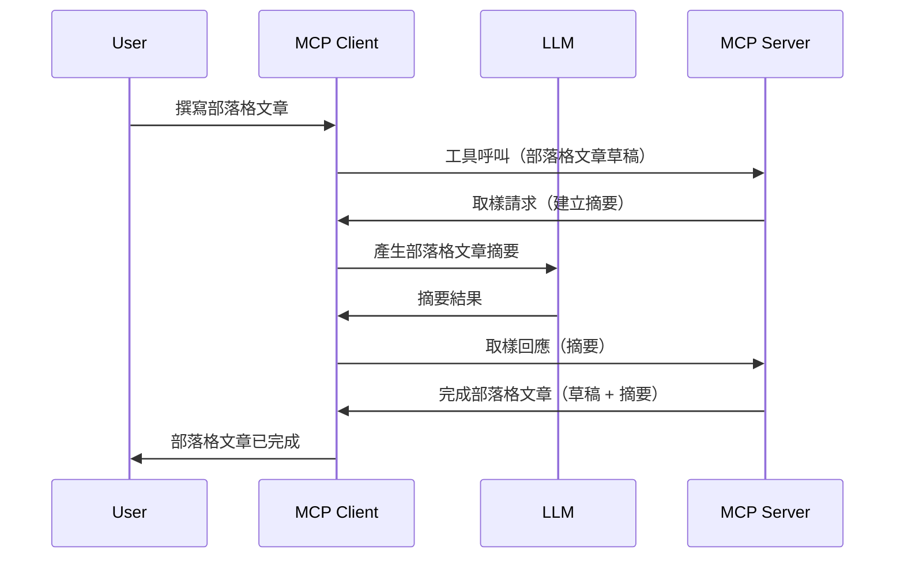

# 抽樣 - 將功能委派給用戶端

有時候，您需要 MCP 用戶端和 MCP 伺服器合作以實現共同目標。可能會遇到伺服器需要用戶端上的大型語言模型(LLM)協助的情況。對於這種情況，您應該使用抽樣（Sampling）。

讓我們探索一些使用案例以及如何建構涉及抽樣的解決方案。

## 概述

本課程將重點說明何時以及在哪裡使用抽樣，以及如何配置它。

## 學習目標

在本章中，我們將：

- 解釋什麼是抽樣以及何時使用。
- 示範如何在 MCP 中配置抽樣。
- 提供抽樣實際應用的範例。

## 什麼是抽樣以及為何使用它？

抽樣是一項進階功能，其運作方式如下：



### 抽樣請求

好的，現在我們對一個可信場景有了宏觀了解，讓我們談談伺服器傳回用戶端的抽樣請求。此類請求在 JSON-RPC 格式中可能長這樣：

```json
{
  "jsonrpc": "2.0",
  "id": 1,
  "method": "sampling/createMessage",
  "params": {
    "messages": [
      {
        "role": "user",
        "content": {
          "type": "text",
          "text": "Create a blog post summary of the following blog post: <BLOG POST>"
        }
      }
    ],
    "modelPreferences": {
      "hints": [
        {
          "name": "claude-3-sonnet"
        }
      ],
      "intelligencePriority": 0.8,
      "speedPriority": 0.5
    },
    "systemPrompt": "You are a helpful assistant.",
    "maxTokens": 100
  }
}
```

這裡有幾個值得注意的地方：

- 在 content -> text 底下的 Prompt，是我們給 LLM 的摘要指令，目標是摘要部落格文章內容。

- **modelPreferences**。這部分即偏好設定，是建議用於 LLM 的配置。用戶可以選擇接受建議或自行更改。在此案例中，包含模型選擇及速度與智能優先權的建議。
- **systemPrompt**，這是您常見的系統提示，賦予 LLM 個性並包含指導說明。
- **maxTokens**，這是另一個屬性，用來建議此任務可使用的最大 token 數量。

### 抽樣回應

此回應是 MCP 用戶端最終傳回 MCP 伺服器的內容，是用戶端呼叫 LLM、等待回應並組成訊息的結果。它在 JSON-RPC 格式中可能長這樣：

```json
{
  "jsonrpc": "2.0",
  "id": 1,
  "result": {
    "role": "assistant",
    "content": {
      "type": "text",
      "text": "Here's your abstract <ABSTRACT>"
    },
    "model": "gpt-5",
    "stopReason": "endTurn"
  }
}
```

請注意回應內容是部落格文章的摘要，就如同我們要求的一樣。同時注意使用的 `model` 並非原本要求的，而是從「claude-3-sonnet」改用「gpt-5」。這用來說明用戶可在使用前改變心意，而您的抽樣請求是建議而非強制。

好了，現在我們理解主流程及有用的任務範例「部落格文章創建 + 摘要」，接著看看要如何實作。

### 訊息類型

抽樣訊息不限單純文字，還可傳送圖片與音訊。以下是 JSON-RPC 的不同表現方式：

<strong>文字</strong>

```json
{
  "type": "text",
  "text": "The message content"
}
```

<strong>圖像內容</strong>

```json
{
  "type": "image",
  "data": "base64-encoded-image-data",
  "mimeType": "image/jpeg"
}
```

<strong>音訊內容</strong>

```json
{
  "type": "audio",
  "data": "base64-encoded-audio-data",
  "mimeType": "audio/wav"
}
```

> 注意：欲了解更多抽樣詳情，請參閱[官方文件](https://modelcontextprotocol.io/specification/2025-11-25/client/sampling)。

## 如何在用戶端配置抽樣

> 注意：若您只建造伺服器端，這裡不需做太多設定。

在用戶端，您需要像這樣指定下列功能：

```json
{
  "capabilities": {
    "sampling": {}
  }
}
```

當您選擇的用戶端初始化並連接此伺服器時，系統會自動載入這個設定。

## 抽樣實例 - 創建部落格文章

讓我們一起編寫一個抽樣伺服器，需要完成以下步驟：

1. 在伺服器上建立一個工具。
2. 該工具應建立一個抽樣請求。
3. 工具等待用戶端的抽樣回應。
4. 然後產生工具的結果。

讓我們逐步查看程式碼：

### -1- 建立工具

**python**

```python
@mcp.tool()
async def create_blog(title: str, content: str, ctx: Context[ServerSession, None]) -> str:
    """Create a blog post and generate a summary"""

```

### -2- 建立抽樣請求

在您的工具中加入以下程式碼：

**python**

```python
post = BlogPost(
        id=len(posts) + 1,
        title=title,
        content=content,
        abstract=""
    )

prompt = f"Create an abstract of the following blog post: title: {title} and draft: {content} "

result = await ctx.session.create_message(
        messages=[
            SamplingMessage(
                role="user",
                content=TextContent(type="text", text=prompt),
            )
        ],
        max_tokens=100,
)

```

### -3- 等待回應並返回結果

**python**

```python
post.abstract = result.content.text

posts.append(post)

# 返回完整的產品
return json.dumps({
    "id": post.title,
    "abstract": post.abstract
})
```

### -4- 完整程式碼

**python**

```python
from starlette.applications import Starlette
from starlette.routing import Mount, Host

from mcp.server.fastmcp import Context, FastMCP

from mcp.server.session import ServerSession
from mcp.types import SamplingMessage, TextContent

import json


from uuid import uuid4
from typing import List
from pydantic import BaseModel


mcp = FastMCP("Blog post generator")

# app = FastAPI()

posts = []

class BlogPost(BaseModel):
    id: int
    title: str
    content: str
    abstract: str

posts: List[BlogPost] = []

@mcp.tool()
async def create_blog(title: str, content: str, ctx: Context[ServerSession, None]) -> str:
    """Create a blog post and generate a summary"""

    post = BlogPost(
        id=len(posts) + 1,
        title=title,
        content=content,
        abstract=""
    )

    prompt = f"Create an abstract of the following blog post: title: {title} and draft: {content} "

    result = await ctx.session.create_message(
        messages=[
            SamplingMessage(
                role="user",
                content=TextContent(type="text", text=prompt),
            )
        ],
        max_tokens=100,
    )

    post.abstract = result.content.text

    posts.append(post)

    # 回傳完整的部落格文章
    return json.dumps({
        "id": post.title,
        "abstract": post.abstract
    })

if __name__ == "__main__":
    print("Starting server...")
    # mcp.run()
    mcp.run(transport="streamable-http")

# 使用以下指令執行應用程式：python server.py
```

### -5- 在 Visual Studio Code 中測試

要在 Visual Studio Code 中測試，請依照以下步驟：

1. 在終端機啟動伺服器
2. 將其新增到 *mcp.json* 中（並確保已啟動），如下範例：

   ```json
   "servers": {
      "blog-server": {
        "type": "http",
        "url": "http://localhost:8000/mcp"
      }
   }
   ```

3. 輸入提示文字：

   ```text
   create a blog post named "Where Python comes from", the content is "Python is actually named after Monty Python Flying Circus"
   ```

4. 允許進行抽樣。首次測試時會跳出額外對話框，您需要接受，接著會看到要求您執行工具的標準對話框。

5. 查看結果。您會在 GitHub Copilot Chat 中看到漂亮呈現的結果，也可以檢視原始的 JSON 回應。

<strong>額外提示</strong>。Visual Studio Code 工具有良好抽樣支援。您可這樣設定所安裝的伺服器的抽樣存取：

1. 到擴充功能部分。
2. 在「MCP SERVERS - INSTALLED」區段，選擇已安裝伺服器的齒輪圖示。
3. 選擇「Configure Model Access」，於此可選擇 GitHub Copilot 在執行抽樣時允許使用的模型。您亦能藉由「Show Sampling requests」檢視最近執行過的所有抽樣請求。

## 作業

在本次作業中，您將建造一個稍有不同的抽樣整合，即產生產品描述的抽樣。您的場景如下：

<strong>場景</strong>：電商後台人員需要協助，產生產品描述耗時過長。因此，您要建構一個解決方案，可以透過呼叫名為 "create_product" 的工具，帶入 "title" 和 "keywords" 作為參數，此工具會產出完整產品資訊，其中 "description" 欄位應由用戶端的 LLM 填寫。

小提示：利用您之前學到的知識，以抽樣請求建構此伺服器及其工具。

## 解答

[解答](./solution/README.md)

## 重要重點

抽樣是一項強大功能，當伺服器需要 LLM 協助時，它能將任務委派給用戶端執行。

## 後續內容

- [第 4 章 - 實務應用](../../04-PracticalImplementation/README.md)

---

<!-- CO-OP TRANSLATOR DISCLAIMER START -->
**免責聲明**：
此文件已使用 AI 翻譯服務 [Co-op Translator](https://github.com/Azure/co-op-translator) 進行翻譯。雖然我們努力追求準確性，但請注意自動翻譯可能包含錯誤或不準確之處。原始文件的母語版本應視為權威來源。對於關鍵資訊，建議採用專業人工翻譯。我們不對因使用此翻譯所產生的任何誤解或誤譯承擔責任。
<!-- CO-OP TRANSLATOR DISCLAIMER END -->