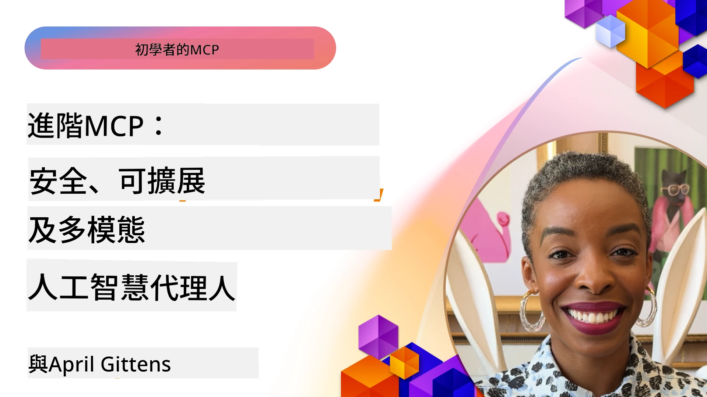

# MCP 進階主題

_(點選上方圖片觀看本課程影片)_

本章涵蓋模型上下文協定（MCP）實作的一系列進階主題，包括多模態整合、可擴展性、安全最佳實務與企業整合。這些主題對於構建強健且可用於生產的 MCP 應用程式至關重要，以滿足現代 AI 系統的需求。

## 概述

本課程探討模型上下文協定實作的進階概念，專注於多模態整合、可擴展性、安全最佳實務和企業整合。這些主題對於建置能夠處理企業環境中複雜需求的生產級 MCP 應用程式十分重要。

## 學習目標

完成本課程後，您將能夠：

- 在 MCP 架構中實作多模態功能
- 設計可擴展的 MCP 架構以應對高需求場景
- 運用符合 MCP 安全原則的安全最佳實務
- 將 MCP 整合至企業 AI 系統與框架
- 優化生產環境中的效能與可靠性

## 課程與示範專案

| 連結 | 標題 | 說明 |
|------|-------|-------------|
| [5.1 Integration with Azure](./mcp-integration/README.md) | 與 Azure 整合 | 學習如何在 Azure 上整合您的 MCP 伺服器 |
| [5.2 Multi modal sample](./mcp-multi-modality/README.md) | MCP 多模態範例  | 音訊、影像與多模態回應範例 |
| [5.3 MCP OAuth2 sample](../../../05-AdvancedTopics/mcp-oauth2-demo) | MCP OAuth2 示範 | 簡易 Spring Boot 應用程式，展示 MCP OAuth2 作為授權與資源伺服器。示範安全的令牌發出、保護端點、Azure Container Apps 部署及 API 管理整合。 |
| [5.4 Root Contexts](./mcp-root-contexts/README.md) | 根上下文  | 深入了解根上下文與如何實作它們 |
| [5.5 Routing](./mcp-routing/README.md) | 路由 | 學習不同類型的路由 |
| [5.6 Sampling](./mcp-sampling/README.md) | 取樣 | 學習如何進行取樣 |
| [5.7 Scaling](./mcp-scaling/README.md) | 擴展  | 了解擴展相關主題 |
| [5.8 Security](./mcp-security/README.md) | 安全  | 保護您的 MCP 伺服器 |
| [5.9 Web Search sample](./web-search-mcp/README.md) | 網路搜尋 MCP | Python MCP 伺服器與用戶端整合 SerpAPI 提供即時網路、新聞、產品搜尋及問答。展示多工具協調、外部 API 整合與強健錯誤處理。 |
| [5.10 Realtime Streaming](./mcp-realtimestreaming/README.md) | 流式傳輸  | 即時資料流在當今以資料驅動的世界越來越重要，企業與應用需即時存取資訊以做出迅速決策。|
| [5.11 Realtime Web Search](./mcp-realtimesearch/README.md) | 網路即時搜尋 | 介紹 MCP 如何透過跨 AI 模型、搜尋引擎與應用提供標準化上下文管理，改造即時網路搜尋。| 
| [5.12  Entra ID Authentication for Model Context Protocol Servers](./mcp-security-entra/README.md) | Entra ID 認證 | Microsoft Entra ID 提供強大雲端身分與存取管理解決方案，確保只有授權使用者與應用程式能與您的 MCP 伺服器互動。|
| [5.13 Microsoft Foundry Agent Integration](./mcp-foundry-agent-integration/README.md) | Microsoft Foundry 整合 | 學習如何將 MCP 伺服器與 Microsoft Foundry 代理整合，實現強大的工具協調與企業 AI 功能，並以標準化外部資料來源連接。|
| [5.14 Context Engineering](./mcp-contextengineering/README.md) | 上下文工程 | MCP 伺服器上下文工程技術的未來機會，包括上下文優化、動態上下文管理與 MCP 架構中有效提示工程策略。|
| [5.15 MCP Custom Transport](./mcp-transport/README.md) | 自訂傳輸 | 學習如何為專用 MCP 通訊情況實作自訂傳輸機制。|
| [5.16 Protocol Features Deep Dive](./mcp-protocol-features/README.md) | 協定功能 | 精通進階協定功能，包括進度通知、請求取消、資源範本及錯誤處理模式。|
| [5.17 Adversarial Multi-Agent Reasoning](./mcp-adversarial-agents/README.md) | 對抗性多代理推理 | 使用兩個對立立場的代理共享單一 MCP 工具組，捕捉錯覺、揭露邊緣案例，透過結構化辯論產出更佳校準的結果。|

> **MCP 規範 2025-11-25 版本新內容**：規範現已實驗性支援 <strong>任務</strong>（具進度追蹤的長時間操作）、<strong>工具註解</strong>（工具行為的安全性元資料）、**URL 模式誘導**（請求用戶端特定 URL 內容）及強化的 <strong>根</strong>（用於工作區上下文管理）。完整細節請參閱 [MCP 仕様變更紀錄](https://spec.modelcontextprotocol.io/)。

## 其他參考資料

欲取得最新 MCP 進階資訊，請參考：
- [MCP 文件](https://modelcontextprotocol.io/)
- [MCP 規範 (2025-11-25)](https://spec.modelcontextprotocol.io/specification/2025-11-25/)
- [GitHub 程式庫](https://github.com/modelcontextprotocol)
- [OWASP MCP 前十大](https://microsoft.github.io/mcp-azure-security-guide/mcp/) - 安全風險及緩解方法
- [MCP 安全峰會工作坊 (Sherpa)](https://azure-samples.github.io/sherpa/) - 實作安全訓練

## 重點摘要

- 多模態 MCP 實作擴展 AI 能力，超越純文字處理
- 可擴展性為企業部署必須，透過水平與垂直擴展來實現
- 全面的安全措施可保護資料並確保正確存取控制
- 與 Azure OpenAI 及 Microsoft AI Foundry 等平台的企業整合提升 MCP 功能
- 進階 MCP 實作受益於優化架構與謹慎的資源管理

## 練習

設計一個符合企業規格的 MCP 實作，針對特定用例：

1. 確認用例的多模態需求
2. 概述保護敏感資料所需的安全控管
3. 設計可因應負載變化的可擴展架構
4. 規劃與企業 AI 系統之整合點
5. 記錄潛在效能瓶頸及對應緩解策略

## 額外資源

- [Azure OpenAI 文件](https://learn.microsoft.com/en-us/azure/ai-services/openai/)
- [Microsoft AI Foundry 文件](https://learn.microsoft.com/en-us/ai-services/)

---

## 下一步

從本模組的課程開始學習：[5.1 MCP Integration](./mcp-integration/README.md)

完成本模組後，繼續學習：[模組 6：社群貢獻](../06-CommunityContributions/README.md)

---

<!-- CO-OP TRANSLATOR DISCLAIMER START -->
**免責聲明**：
此文件已使用 AI 翻譯服務 [Co-op Translator](https://github.com/Azure/co-op-translator) 進行翻譯。雖然我們努力追求準確性，但請注意自動翻譯可能包含錯誤或不準確之處。原始文件的母語版本應視為權威來源。對於關鍵資訊，建議採用專業人工翻譯。我們不對因使用此翻譯所產生的任何誤解或誤譯承擔責任。
<!-- CO-OP TRANSLATOR DISCLAIMER END -->