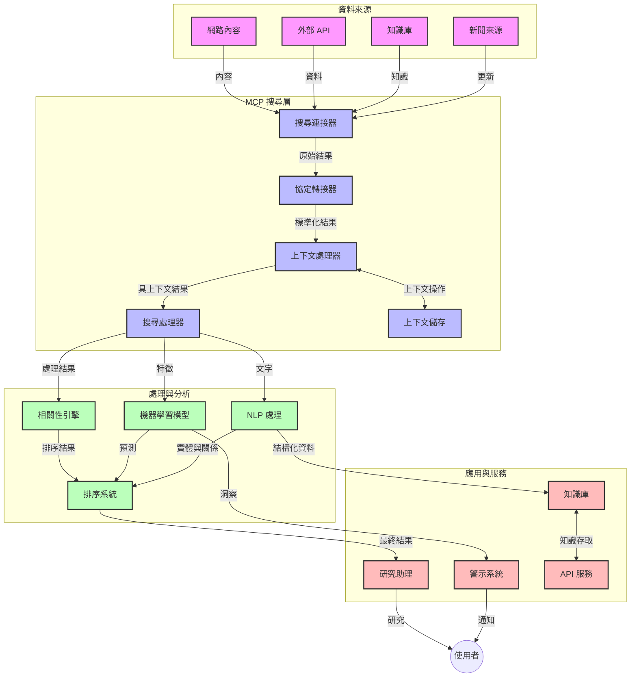
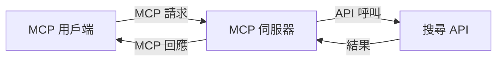
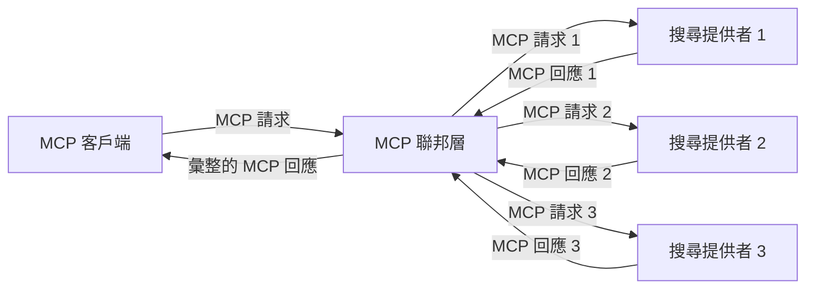
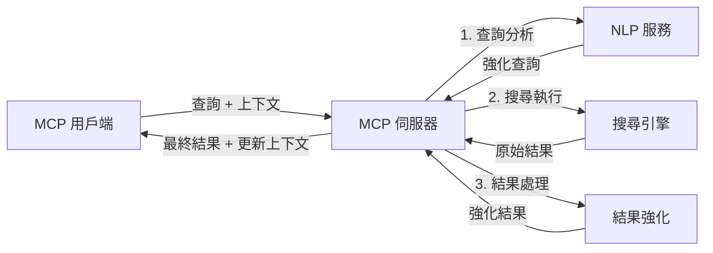

# 模型上下文協議於即時網路搜尋

## 概述

即時網路搜尋在當今資訊驅動的環境中已成為不可或缺，應用程式需要能夠立即取得網路上最新的資訊，以提供相關且及時的回應。模型上下文協議（Model Context Protocol，MCP）在優化這些即時搜尋流程上帶來了重大進展，提升搜尋效率，維持上下文的完整性，並改善整體系統效能。

本模組探討 MCP 如何透過在 AI 模型、搜尋引擎及應用間提供標準化的上下文管理方式，改變即時網路搜尋的運作。

### 您將學習到

在本全面指南中，您將了解：

- MCP 如何建立 AI 模型與即時網路搜尋能力之間的無縫橋接
- 以 MCP 實現高效且可擴展搜尋解決方案的架構範式
- 保持多次查詢及互動中搜尋上下文的技巧
- Python 與 JavaScript 的實作範例，涵蓋各種搜尋場景
- 在 MCP 驅動的搜尋系統中平衡相關性、新穎度與效能的方法

## 即時網路搜尋簡介

即時網路搜尋是一種技術方法，使系統能持續對網路資訊進行查詢、處理及分析，隨著資訊發佈或更新，能夠以極低延遲提供新鮮且相關的資料。不同於傳統基於索引資料、可能已延遲數小時甚至數天的搜尋系統，即時搜尋處理網路上的即時資料，帶來反映線上內容當前狀態的洞察與資訊。

### 即時網路搜尋的核心概念：

- <strong>持續查詢處理</strong>：針對不斷更新的資料來源處理搜尋查詢
- <strong>新穎度優先</strong>：系統設計以優先提示最新資訊
- <strong>相關性平衡</strong>：維持相關性與新穎度的平衡
- <strong>可擴展架構</strong>：系統能因應不定查詢負載與資料量
- <strong>上下文理解</strong>：跨搜尋循環保持使用者上下文對結果意義重大
- <strong>動態查詢重構</strong>：依據上下文及先前結果自適應調整查詢
- <strong>多來源整合</strong>：結合來自多個搜尋提供者與網路來源的結果
- <strong>語義理解</strong>：基於意義處理查詢與內容，而非僅關鍵字
- <strong>即時排序</strong>：隨著新資訊進來持續調整結果排名

### 模型上下文協議與即時網路搜尋

模型上下文協議（MCP）解決即時網路搜尋環境中的若干關鍵挑戰：

1. <strong>搜尋上下文保存</strong>：MCP 標準化跨分散搜尋元件的上下文維護，確保 AI 模型與處理節點能取得相關的查詢歷史與使用者偏好。

2. <strong>高效查詢管理</strong>：透過提供結構化上下文傳遞機制，降低每次搜尋迭代重複上下文的開銷。

3. <strong>互操作性</strong>：MCP 建立搜尋技術與 AI 模型間共享上下文的通用語言，讓架構更具彈性與擴展性。

4. <strong>搜尋優化的上下文</strong>：MCP 實作能優先選擇最相關的上下文元素，以優化效能與準確度。

5. <strong>自適應搜尋處理</strong>：透過適當的 MCP 上下文管理，搜尋系統能依照使用者需求及資訊變化動態調整處理流程。

在新聞聚合、研究助理等現代應用中，MCP 與網路搜尋技術的整合，促進更智慧且具上下文意識的搜尋，隨使用者互動持續提供更相關的結果。

## 學習目標

完成本課程後，您將能夠：

- 了解即時網路搜尋的基本原理及其在現代應用中的挑戰
- 說明模型上下文協議（MCP）如何強化即時網路搜尋能力
- 使用主流框架與 API 實作基於 MCP 的搜尋解決方案
- 設計及部署具可擴展性且高效的 MCP 搜尋架構
- 將 MCP 概念應用於語義搜尋、研究輔助及 AI 擴展瀏覽等多種案例
- 評估 MCP 搜尋技術的最新趨勢與未來創新
- 開發能從使用者互動中學習的上下文感知搜尋系統
- 使用標準化 MCP 協議將網路搜尋能力整合至 AI 助理
- 建立多階段搜尋管線，根據上下文逐步優化結果
- 優化搜尋效能同時保持完整的上下文意識

### 定義與重要性

即時網路搜尋涵蓋持續查詢、擷取及交付網路資料，延遲極低。與傳統定期爬取及建立索引的搜尋引擎不同，即時搜尋旨在即時呈現資訊，能立即存取最新內容。

即時網路搜尋的關鍵特性包括：

- <strong>新鮮度</strong>：優先顯示近期內容及更新
- <strong>持續處理</strong>：不斷監控新資訊
- <strong>查詢調整</strong>：基於上下文與反饋精煉查詢內容
- <strong>即時交付</strong>：盡量減少回應延遲
- <strong>上下文保留</strong>：基於先前查詢建立相關性

### 傳統網路搜尋的挑戰

傳統網路搜尋在應用於即時場景時面臨諸多侷限：

1. <strong>上下文分散</strong>：難以跨多次查詢維持搜尋上下文
2. <strong>資訊新鮮度</strong>：存取並優先最新資訊的困難
3. <strong>整合複雜性</strong>：搜尋系統與應用間的互操作問題
4. <strong>延遲問題</strong>：在完整搜尋與回應時間間取得平衡
5. <strong>相關性調校</strong>：優先新穎度的同時保證準確與相關性

## 理解搜尋用的模型上下文協議（MCP）

### MCP 在搜尋上下文中的意義？

模型上下文協議（MCP）是一種標準化的通訊協議，旨在促進 AI 模型與應用程式之間的高效互動。在即時網路搜尋領域，MCP 提供一個框架來：

- 維持整個查詢序列中的搜尋上下文
- 標準化搜尋查詢與結果的格式
- 最佳化搜尋參數與結果的傳輸
- 強化模型與搜尋引擎之間的通訊

### 核心元件與架構

即時網路搜尋的 MCP 架構包含若干重要元件：

1. <strong>查詢上下文管理器</strong>：管理及維持多次查詢間的搜尋上下文
2. <strong>搜尋處理器</strong>：使用具上下文感知技術處理傳入搜尋請求
3. <strong>協議轉接器</strong>：在不同搜尋 API 間轉換，同時保持上下文
4. <strong>上下文儲存庫</strong>：高效儲存與檢索搜尋歷史及偏好
5. <strong>搜尋連接器</strong>：連結至各種搜尋引擎與網路 API



### MCP 如何改善即時網路搜尋

MCP 通過以下方式解決傳統搜尋挑戰：

- <strong>上下文連續性</strong>：維持整個搜尋會話中多次查詢間的關聯
- <strong>優化傳輸</strong>：透過智慧化上下文管理減少搜尋參數冗餘
- <strong>標準化介面</strong>：提供搜尋元件一致的 API
- <strong>降低延遲</strong>：透過高效上下文處理減少處理開銷
- <strong>提升相關性</strong>：經由維持使用者意圖跨多次查詢提升搜尋精準度

## 整合與實作

即時網路搜尋系統須謹慎設計架構與實作，兼顧效能及上下文完整性。模型上下文協議提供標準化整合 AI 模型與搜尋技術的方法，實現更複雜且具上下文意識的搜尋管線。

### MCP 在搜尋架構整合概述

於即時網路搜尋環境中實施 MCP 時需考量關鍵面向：

1. <strong>搜尋上下文序列化</strong>：MCP 提供高效編碼機制，將關鍵上下文資訊隨同查詢請求傳遞，確保必要上下文在整個處理管線中流轉，包含適用於搜尋相關元數據的標準化序列化格式。

2. <strong>有狀態搜尋處理</strong>：MCP 促成更智慧的有狀態處理，透過一致的上下文表述跨搜尋迭代維護，特別適用於多階段搜尋管線，該流程中上下文優化可提升結果。

3. <strong>查詢擴展與精煉</strong>：MCP 實作能根據累積上下文促成進階查詢擴展與精煉，搜尋會話進展時能造就愈趨相關的結果。

4. <strong>結果快取與排序優先</strong>：依據標準化上下文處理，MCP 助於管理結果快取與優先排序，讓元件根據演化的搜尋上下文調整作業。

5. <strong>搜尋聯邦與聚合</strong>：MCP 以結構化搜尋上下文表達促使跨多後端更複雜的搜尋聯邦，得以更有意義地彙整多元來源結果。

MCP 在多種搜尋技術中的實施創造統一上下文管理方法，減少自訂整合程式碼需求，同時提升系統隨查詢演變維持上下文意義的能力。

### MCP 在各種網路搜尋實作中

以下範例遵循目前 MCP 規範，該規範基於 JSON-RPC 協議並搭配不同傳輸機制。展示如何實作自訂搜尋整合，並與 MCP 協議完全相容。

<details>
<summary>Python 與通用搜尋 API 實作</summary>

```python
import asyncio
import json
import aiohttp
from typing import Dict, Any, Optional, List
from contextlib import asynccontextmanager
from collections.abc import AsyncIterator

# 匯入標準MCP函式庫
from mcp.client.session import ClientSession
from mcp.client.streamable_http import streamablehttp_client
from mcp.types import TextContent, CreateMessageRequestParams, CreateMessageResult
from mcp.server.fastmcp import FastMCP

# 建立一個用於網路搜尋的FastMCP伺服器
search_server = FastMCP("WebSearch")

# 處理網路搜尋操作的類別
class WebSearchHandler:
    def __init__(self, api_endpoint: str, api_key: str):
        self.api_endpoint = api_endpoint
        self.api_key = api_key
        self.session = None
        
    async def initialize(self):
        """Initialize the HTTP session"""
        self.session = aiohttp.ClientSession(
            headers={"Authorization": f"Bearer {self.api_key}"}
        )
    
    async def close(self):
        """Close the HTTP session"""
        if self.session:
            await self.session.close()
            
    async def perform_search(self, query: str, max_results: int = 5, 
                           include_domains: List[str] = None, 
                           exclude_domains: List[str] = None,
                           time_period: str = "any") -> Dict[str, Any]:
        """Perform web search using the search API"""
        # 建構搜尋參數
        search_params = {
            "q": query,
            "limit": max_results,
            "time": time_period
        }
        
        if include_domains:
            search_params["site"] = ",".join(include_domains)
            
        if exclude_domains:
            search_params["exclude_site"] = ",".join(exclude_domains)
        
        # 執行搜尋請求
        try:
            async with self.session.get(
                self.api_endpoint,
                params=search_params
            ) as response:
                if response.status != 200:
                    error_text = await response.text()
                    raise Exception(f"Search API error: {response.status} - {error_text}")
                
                search_data = await response.json()
                
                # 將API特定回應轉換為標準格式
                results = []
                for item in search_data.get("results", []):
                    results.append({
                        "title": item.get("title", ""),
                        "url": item.get("url", ""),
                        "snippet": item.get("snippet", ""),
                        "date": item.get("published_date", ""),
                        "source": item.get("source", "")
                    })
                
                return {
                    "query": query,
                    "totalResults": len(results),
                    "results": results
                }
        except Exception as e:
            print(f"Search API request error: {e}")
            raise

# 初始化搜尋處理器
search_handler = WebSearchHandler(
    api_endpoint="https://api.search-service.example/search",
    api_key="your-api-key-here"
)

# 設定生命週期以管理搜尋處理器
@asyncio.asynccontextmanager
async def app_lifespan(server: FastMCP):
    """Manage application lifecycle"""
    await search_handler.initialize()
    try:
        yield {"search_handler": search_handler}
    finally:
        await search_handler.close()

# 設定伺服器生命週期
search_server = FastMCP("WebSearch", lifespan=app_lifespan)

# 註冊一個網路搜尋工具
@search_server.tool()
async def web_search(query: str, max_results: int = 5, 
                   include_domains: List[str] = None,
                   exclude_domains: List[str] = None,
                   time_period: str = "any") -> Dict[str, Any]:
    """
    Search the web for information
    
    Args:
        query: The search query
        max_results: Maximum number of results to return (default: 5)
        include_domains: List of domains to include in search results
        exclude_domains: List of domains to exclude from search results
        time_period: Time period for results ("day", "week", "month", "any")
        
    Returns:
        Dictionary containing search results
    """
    ctx = search_server.get_context()
    search_handler = ctx.request_context.lifespan_context["search_handler"]
    
    results = await search_handler.perform_search(
        query=query,
        max_results=max_results,
        include_domains=include_domains,
        exclude_domains=exclude_domains,
        time_period=time_period
    )
    
    return results

# 範例客戶端使用方式
async def client_example():
    # 使用可串流HTTP傳輸連接搜尋伺服器
    async with streamablehttp_client("http://localhost:8000/mcp") as (read, write, _):
        async with ClientSession(read, write) as session:
            # 初始化連線
            await session.initialize()
            
            # 呼叫web_search工具
            search_results = await session.call_tool(
                "web_search", 
                {
                    "query": "latest developments in AI and Model Context Protocol",
                    "max_results": 5,
                    "time_period": "day",
                    "include_domains": ["github.com", "microsoft.com"]
                }
            )
            
            print(f"Search results: {search_results}")

# 伺服器執行範例
if __name__ == "__main__":
    # 使用可串流HTTP傳輸執行伺服器
    search_server.run(transport="streamable-http")
```
</details> 

<details>
<summary>JavaScript 與基於瀏覽器的搜尋實作</summary>

```javascript
// 用於網路搜尋的 MCP 伺服器實作
import { McpServer, ResourceTemplate } from '@modelcontextprotocol/sdk/server/mcp.js';
import { StreamableHTTPServerTransport } from '@modelcontextprotocol/sdk/server/streamableHttp.js';
import { z } from 'zod';

// 建立一個用於網路搜尋的 MCP 伺服器
const searchServer = new McpServer({
    name: "BrowserSearch",
    description: "A server that provides web search capabilities"
});

// 搜尋服務類別
class SearchService {
    constructor(searchApiUrl, apiKey) {
        this.searchApiUrl = searchApiUrl;
        this.apiKey = apiKey;
    }

    async performSearch(parameters) {
        const {
            query = '',
            maxResults = 5,
            includeDomains = [],
            excludeDomains = [],
            timePeriod = 'any'
        } = parameters;
        
        // 使用參數構建搜尋 URL
        const url = new URL(this.searchApiUrl);
        url.searchParams.append('q', query);
        url.searchParams.append('limit', maxResults);
        url.searchParams.append('time', timePeriod);
        
        if (includeDomains.length > 0) {
            url.searchParams.append('site', includeDomains.join(','));
        }
        
        if (excludeDomains.length > 0) {
            url.searchParams.append('exclude_site', excludeDomains.join(','));
        }
        
        try {
            const response = await fetch(url.toString(), {
                method: 'GET',
                headers: {
                    'Authorization': `Bearer ${this.apiKey}`,
                    'Content-Type': 'application/json'
                }
            });
            
            if (!response.ok) {
                const errorText = await response.text();
                throw new Error(`Search API error: ${response.status} - ${errorText}`);
            }
            
            const searchData = await response.json();
            
            // 將 API 專用的回應轉換為標準格式
            const results = searchData.results?.map(item => ({
                title: item.title || '',
                url: item.url || '',
                snippet: item.snippet || '',
                date: item.published_date || '',
                source: item.source || ''
            })) || [];
            
            return {
                query,
                totalResults: results.length,
                results
            };
        } catch (error) {
            console.error('Search API request error:', error);
            throw error;
        }
    }
}

// 初始化搜尋服務
const searchService = new SearchService(
    'https://api.search-service.example/search',
    'your-api-key-here'
);

// 設定伺服器的上下文提供者
searchServer.setContextProvider(() => {
    return {
        searchService
    };
});

// 註冊網路搜尋工具
searchServer.tool({
    name: 'web_search',
    description: 'Search the web for information',
    parameters: {
        type: 'object',
        properties: {
            query: {
                type: 'string',
                description: 'The search query'
            },
            maxResults: {
                type: 'integer',
                description: 'Maximum number of results to return',
                default: 5
            },
            includeDomains: {
                type: 'array',
                items: { type: 'string' },
                description: 'List of domains to include in search results'
            },
            excludeDomains: {
                type: 'array',
                items: { type: 'string' },
                description: 'List of domains to exclude from search results'
            },
            timePeriod: {
                type: 'string',
                description: 'Time period for results',
                enum: ['day', 'week', 'month', 'any'],
                default: 'any'
            }
        },
        required: ['query']
    },
    handler: async (params, context) => {
        const { searchService } = context;
        return await searchService.performSearch(params);
    }
});

// 連接搜尋伺服器的範例客戶端程式碼
import { Client } from '@modelcontextprotocol/sdk/client/index.js';
import { StreamableHTTPClientTransport } from '@modelcontextprotocol/sdk/client/streamableHttp.js';

async function connectToSearchServer() {
    // 連接搜尋伺服器
    const transport = new StreamableHTTPClientTransport(
        new URL('http://localhost:8000/mcp')
    );
    
    const client = new Client({
        name: 'search-client',
        version: '1.0.0'
    });
    
    await client.connect(transport);
    
    // 執行搜尋工具
    const searchResults = await client.callTool({
        name: 'web_search',
        arguments: {
            query: 'Model Context Protocol implementation examples',
            maxResults: 10,
            timePeriod: 'week',
            includeDomains: ['github.com', 'docs.microsoft.com']
        }
    });
    
    console.log('Search results:', searchResults);
    
    // 清理工作
    await client.disconnect();
}

// 啟動伺服器
const transport = new StreamableHTTPServerTransport();
await searchServer.connect(transport);
console.log('Search server running at http://localhost:8000/mcp');

// 在獨立程序中或伺服器啟動後執行
// connectToSearchServer().catch(console.error);
```
</details> 

## 程式碼範例免責聲明

> <strong>重要提醒</strong>：下述程式碼範例展示模型上下文協議（MCP）與網路搜尋功能的整合。雖遵循官方 MCP SDK 的模式與結構，但為教學方便有所簡化。
> 
> 範例涵蓋：
> 
> 1. **Python 實作**：FastMCP 伺服器實作，提供網路搜尋工具並連結外部搜尋 API。示範正確的生命週期管理、上下文處理與工具實作，遵循[官方 MCP Python SDK](https://github.com/modelcontextprotocol/python-sdk)範式。伺服器採用推薦的 Streamable HTTP 傳輸，取代舊有 SSE 傳輸用於正式部署。
> 
> 2. **JavaScript 實作**：使用[官方 MCP TypeScript SDK](https://github.com/modelcontextprotocol/typescript-sdk)的 FastMCP 模式，以 TypeScript/JavaScript 開發搜尋伺服器，擁有正確的工具定義和客戶端連線，依循最新建議的會話管理與上下文保存模式。
> 
> 這些範例在正式使用時需補充錯誤處理、認證及特定 API 整合程式碼。示範中使用的搜尋 API 端點（`https://api.search-service.example/search`）為範例佔位，需替換為實際服務端點。
> 
> 欲了解完整實作細節及最新方法，請參閱[官方 MCP 規範](https://spec.modelcontextprotocol.io/)及 SDK 文件。

## 核心概念

### 模型上下文協議（MCP）框架

MCP 基礎上提供 AI 模型、應用與服務間交換上下文的標準化方式。在即時網路搜尋中，此框架對建構連貫多回合搜尋體驗不可或缺。主要元件包括：

1. **用戶端-伺服器架構**：MCP 建立搜尋用戶端（請求者）與搜尋伺服器（提供者）間清晰分離，支援彈性部署模型。

2. **JSON-RPC 通訊**：協議使用 JSON-RPC 交互訊息，兼容網路技術且易於多平台實作。

3. <strong>上下文管理</strong>：MCP 定義結構化方法，維護、更新並利用多次交互間之搜尋上下文。

4. <strong>工具定義</strong>：以標準化工具形式公開搜尋能力，具明確參數及返回值。

5. <strong>串流支援</strong>：協議支援串流結果，對於即時搜尋中結果可能逐步抵達的情況至關重要。

### 網路搜尋整合模式

整合 MCP 與網路搜尋時，常見以下模式：

#### 1. 直接搜尋提供者整合



此模式中，MCP 伺服器直接介接一或多個搜尋 API，將 MCP 請求轉譯為 API 專用呼叫，並將結果格式化為 MCP 回應。

#### 2. 保持上下文的聯邦式搜尋



此模式將搜尋查詢分派至多個 MCP 相容的搜尋提供者，每個可能專長不同內容或搜尋能力，且維持統一上下文。

#### 3. 強化上下文的搜尋鏈



此模式將搜尋過程拆成多階段，於每一步豐富上下文，使結果逐步更具相關性。

### 搜尋上下文元件

在 MCP 基礎網路搜尋中，上下文通常涵蓋：

- <strong>查詢歷史</strong>：會話中先前搜尋查詢
- <strong>使用者偏好</strong>：語言、區域、安全搜尋設定
- <strong>互動歷史</strong>：點擊哪些結果、停留時間
- <strong>搜尋參數</strong>：篩選器、排序方式及其他修飾符
- <strong>領域知識</strong>：與搜尋相關的主題上下文
- <strong>時間上下文</strong>：基於時間的相關性因素
- <strong>來源偏好</strong>：受信賴或偏好的資訊來源

## 使用案例與應用

### 研究與資訊收集

MCP 強化研究工作流程：

- 保存研究會話的上下文
- 支援更複雜且具上下文相關的查詢
- 支援多來源搜尋聯邦
- 促進從搜尋結果中提取知識

### 即時新聞與趨勢監控

使用 MCP 的搜尋在新聞監控有以下優勢：

- 幾近即時地發現新興新聞
- 依上下文過濾相關資訊
- 多來源追蹤主題與實體
- 根據使用者上下文提供個人化新聞提醒

### AI 擴充瀏覽與研究

MCP 為 AI 擴充瀏覽開拓新可能：

- 根據瀏覽器活動提供上下文搜尋建議
- 無縫整合網路搜尋與大型語言模型助理
- 多回合搜尋優化並保持上下文
- 強化事實查核與資訊驗證

## 未來趨勢與創新

### MCP 在網路搜尋的演進

展望未來，我們預期 MCP 將持續演進以解決：
- <strong>多模態搜索</strong>：整合文字、圖片、音訊與影片搜尋並保留上下文
- <strong>去中心化搜索</strong>：支持分散式與聯邦式搜尋生態系統
- <strong>搜索隱私</strong>：具情境意識的隱私保護搜尋機制
- <strong>查詢理解</strong>：自然語言搜尋查詢的深度語義解析

### 技術潛在發展

將塑造 MCP 搜尋未來的新興技術：

1. <strong>神經網路搜尋架構</strong>：專為 MCP 優化的嵌入基搜尋系統
2. <strong>個人化搜尋上下文</strong>：隨時間學習個別用戶搜尋模式
3. <strong>知識圖譜整合</strong>：藉由特定領域知識圖譜強化上下文搜尋
4. <strong>跨模態上下文</strong>：維持不同搜尋模式間的上下文

## 實作練習

### 練習一：設定基本的 MCP 搜尋管線

在本練習中，您將學習如何：
- 配置基本的 MCP 搜尋環境
- 實作用於網路搜尋的上下文處理器
- 測試並驗證搜尋流程中上下文的保留

### 練習二：使用 MCP 搜尋建立研究助理

建立一個完整應用程序，能夠：
- 處理自然語言研究問題
- 執行具情境意識的網路搜尋
- 綜合多方資料來源資訊
- 呈現有組織的研究結果

### 練習三：實作 MCP 多來源搜尋聯邦

進階練習涵蓋：
- 具情境意識的查詢分派到多個搜尋引擎
- 結果排名與彙總
- 搜尋結果的上下文去重
- 處理來源特定的元資料

## 附加資源

- [Model Context Protocol Specification](https://spec.modelcontextprotocol.io/) - 官方 MCP 規範及詳盡協議文件
- [Model Context Protocol Documentation](https://modelcontextprotocol.io/) - 詳細教學與實作指南
- [MCP Python SDK](https://github.com/modelcontextprotocol/python-sdk) - MCP 協定官方 Python 實作
- [MCP TypeScript SDK](https://github.com/modelcontextprotocol/typescript-sdk) - MCP 協定官方 TypeScript 實作
- [MCP Reference Servers](https://github.com/modelcontextprotocol/servers) - MCP 伺服器參考實作
- [Bing Web Search API Documentation](https://learn.microsoft.com/en-us/bing/search-apis/bing-web-search/overview) - 微軟網路搜尋 API
- [Google Custom Search JSON API](https://developers.google.com/custom-search/v1/overview) - Google 可程式化搜尋引擎
- [SerpAPI Documentation](https://serpapi.com/search-api) - 搜尋引擎結果頁 API
- [Meilisearch Documentation](https://www.meilisearch.com/docs) - 開源搜尋引擎
- [Elasticsearch Documentation](https://www.elastic.co/guide/index.html) - 分散式搜尋與分析引擎
- [LangChain Documentation](https://python.langchain.com/docs/get_started/introduction) - 以大型語言模型構建應用

## 學習成果

完成此模組後，您將能：

- 理解即時網路搜尋的基本原理與挑戰
- 說明 Model Context Protocol (MCP) 如何增強即時網路搜尋能力
- 使用熱門框架與 API 實作基於 MCP 的搜尋解決方案
- 設計並部署具擴展性與高效能的 MCP 搜尋架構
- 將 MCP 概念應用於語義搜尋、研究助理及 AI 強化瀏覽等多種使用場景
- 評估 MCP 搜尋技術的最新趨勢與未來創新

### 信任與安全考量

實作基於 MCP 的網路搜尋解決方案時，請遵循 MCP 規範中的重要原則：

1. <strong>用戶同意與控制</strong>：用戶必須明確同意並了解所有資料存取與操作；此原則在可能接觸外部資料來源的網路搜尋中尤為重要。

2. <strong>資料隱私</strong>：妥善處理搜尋查詢與結果，尤其是可能含有敏感資訊的內容。實施適當的存取控制以保護用戶資料。

3. <strong>工具安全</strong>：對搜尋工具實施適切授權與驗證，因其代表著通過任意代碼執行的潛在安全風險。工具行為描述除非來自可信伺服器，否則應視為不可信。

4. <strong>清楚文件說明</strong>：依 MCP 規範的實作指南，提供關於 MCP 搜尋實作能力、限制及安全考量的清楚文件。

5. <strong>完整同意流程</strong>：建立完善的同意與授權流程，在授權使用工具前說明其功能，尤其是與外部網路資源互動的工具。

關於 MCP 安全與信任考量的完整細節，請參考[官方文件](https://modelcontextprotocol.io/specification/2025-11-25/basic/security_best_practices)。

## 接下來的步驟

- [5.12 Entra ID Authentication for Model Context Protocol Servers](../mcp-security-entra/README.md)

---

<!-- CO-OP TRANSLATOR DISCLAIMER START -->
**免責聲明**：
此文件已使用 AI 翻譯服務 [Co-op Translator](https://github.com/Azure/co-op-translator) 進行翻譯。雖然我們努力追求準確性，但請注意自動翻譯可能包含錯誤或不準確之處。原始文件的母語版本應視為權威來源。對於關鍵資訊，建議採用專業人工翻譯。我們不對因使用此翻譯所產生的任何誤解或誤譯承擔責任。
<!-- CO-OP TRANSLATOR DISCLAIMER END -->