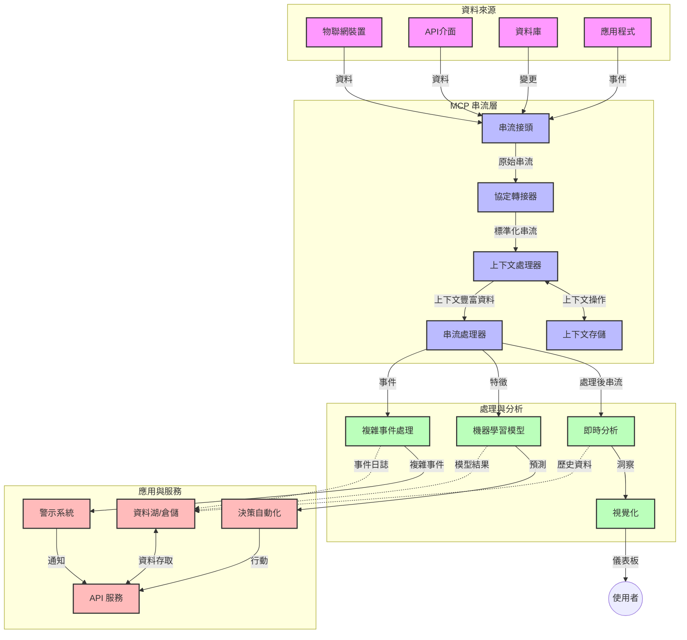

# 實時數據流的模型上下文協議

## 概述

在當前以數據為驅動的世界中，實時數據流已成為關鍵，企業與應用需要即時存取資訊以做出及時決策。模型上下文協議（MCP）在優化這些實時流處理過程方面代表了重大進展，提升了數據處理效率、維持上下文完整性並改善整體系統效能。

本模塊探討 MCP 如何透過為 AI 模型、流平台及應用提供標準化的上下文管理方法，來轉變實時數據流。

## 實時數據流簡介

實時數據流是一種技術範式，使資料能在生成時持續傳輸、處理與分析，讓系統能立即對新資訊做出反應。與處理靜態資料集的傳統批次處理不同，流式處理對移動中的資料進行處理，以極低延遲提供洞見與行動。

### 實時數據流的核心概念：

- <strong>連續數據流</strong>：資料作為連續且無止盡的事件或記錄流被處理。
- <strong>低延遲處理</strong>：系統設計上盡量縮短資料生成與處理的時間差。
- <strong>可擴展性</strong>：流架構必須能應對變動的資料量與速度。
- <strong>容錯性</strong>：系統需具備故障復原能力確保持續流動。
- <strong>有狀態處理</strong>：跨事件維持上下文對有意義的分析至關重要。

### 模型上下文協議與實時流

模型上下文協議（MCP）解決了實時流環境中的多項關鍵挑戰：

1. <strong>上下文連續性</strong>：MCP 標準化了跨分散流組件中上下文的維護方式，確保 AI 模型與處理節點取得相關的歷史及環境上下文。

2. <strong>效率化狀態管理</strong>：透過結構化的上下文傳輸機制，MCP 降低了流管道中狀態管理的負擔。

3. <strong>互操作性</strong>：MCP 形成了多元流技術與 AI 模型間共享上下文的通用語言，促成更靈活和可擴展的架構。

4. <strong>流優化上下文</strong>：MCP 實現可優先考量對實時決策最重要的上下文元素，於效能與準確間達成最佳化。

5. <strong>自適應處理</strong>：透過有效的 MCP 上下文管理，流系統可依據資料中不斷變化的條件與模式動態調整處理流程。

在從物聯網傳感器網絡到金融交易平臺等現代應用中，將 MCP 與流技術結合使處理更智慧且具上下文意識，能實時適當回應複雜且不斷演進的情境。

## 學習目標

本課程結束後，您將能夠：

- 理解實時數據流的基本原理及挑戰
- 說明模型上下文協議（MCP）如何增強實時數據流
- 使用 Kafka 與 Pulsar 等熱門框架實作基於 MCP 的流解決方案
- 設計並部署具容錯性、高效能的 MCP 流架構
- 將 MCP 概念應用於物聯網、金融交易與 AI 驅動的分析案例
- 評估基於 MCP 流技術的新興趨勢與未來創新

### 定義與重要性

實時數據流指的是以最低延遲持續生成、處理及傳送數據。與以組為單位收集處理的批次不同，流數據會隨到達即時增量處理，使得洞見與行動可即刻進行。

實時流的主要特性包括：

- <strong>低延遲</strong>：在毫秒至秒級內完成資料處理與分析
- <strong>持續流動</strong>：來自多來源的不間斷數據流
- <strong>即時處理</strong>：資料一到即刻分析，而非批次積累
- <strong>事件驅動架構</strong>：隨事件發生即時回應

### 傳統數據流的挑戰

傳統流處理面臨多項限制：

1. <strong>上下文流失</strong>：難以維持跨分散系統的上下文連續性
2. <strong>可擴展性問題</strong>：難以擴展以處理大量高速度資料
3. <strong>整合複雜性</strong>：不同系統間互操作性的問題
4. <strong>延遲管理</strong>：在吞吐量與處理時間間配合平衡
5. <strong>資料一致性</strong>：確保流全程資料的準確與完整

## 了解模型上下文協議（MCP）

### 什麼是 MCP？

模型上下文協議（MCP）是一種標準化通訊協議，旨在促進 AI 模型與應用間的高效互動。在實時數據流中，MCP 提供了：

- 在資料管道中保持上下文
- 標準化的資料交換格式
- 優化大型數據集傳輸
- 強化模型間與模型至應用的通訊

### 核心組件與架構

實時流的 MCP 架構包含以下關鍵元件：

1. <strong>上下文處理器</strong>：管理及維持整個流管線的上下文資訊
2. <strong>流處理器</strong>：使用具上下文感知技術處理進入數據流
3. <strong>協議轉接器</strong>：於不同流協議間轉換，同時保持上下文
4. <strong>上下文儲存</strong>：有效率地保存與檢索上下文資訊
5. <strong>流連接器</strong>：連結各類流平台（Kafka、Pulsar、Kinesis 等）



### MCP 如何改善實時數據處理

MCP 克服傳統流挑戰，具體作法包括：

- <strong>上下文完整性</strong>：維護資料點間於整管線的關聯性
- <strong>優化傳輸</strong>：透過聰明的上下文管理減少資料交換冗餘
- <strong>標準化介面</strong>：為流組件提供一致的 API
- <strong>降低延遲</strong>：以有效上下文處理減少處理開銷
- <strong>提升可擴展性</strong>：支持水平擴展同時保護上下文

## 整合與實作

實時數據流系統需謹慎設計架構與實作，以兼顧效能與上下文完整性。模型上下文協議提供將 AI 模型與流技術整合的標準方法，得以架構更複雜具上下文認知的處理流程。

### MCP 在流架構中的整合概述

於實時流環境實作 MCP 涉及多項重要考量：

1. <strong>上下文序列化與傳輸</strong>：MCP 提供有效機制於流資料包中編碼上下文資訊，確保重要上下文隨資料經管線流轉，其中包含為流式傳輸優化的標準序列化格式。

2. <strong>有狀態流處理</strong>：MCP 可維持跨節點上下文一致表示，幫助智慧化的有狀態處理，尤其在分散架構中狀態管理困難時更顯價值。

3. <strong>事件時間與處理時間</strong>：MCP 實現須解決事件發生與處理時間的區分問題，可納入保留事件時間語意的時間上下文。

4. <strong>反壓管理</strong>：標準化上下文處理助於流系統管理反壓，讓元件能通報處理能力並調整資料流。

5. <strong>上下文窗口化與聚合</strong>：MCP 透過結構化的時間與關聯上下文表示，賦能更高階的窗口操作，進行更有意義的事件串聚合。

6. <strong>精確一次處理</strong>：針對需精確一次語意的流系統，MCP 可納入處理元資料，幫助追蹤並驗證分散元件的處理狀態。

跨多種流技術實作 MCP，打造統一上下文管理方法，降低客製整合代碼需求，並提升系統維持有意義上下文的能力。

### MCP 在多種數據流框架中的應用

以下範例遵循以 JSON-RPC 為基礎協議，並配合不同傳輸機制的 MCP 現行規範。代碼示範如何實作自訂傳輸，整合 Kafka 與 Pulsar 並保持完全兼容 MCP 協議。

這些範例旨在展示如何讓流平台與 MCP 整合，實現具上下文意識的實時數據處理。此作法確保程式碼範例反映截至 2025 年 6 月 MCP 規範現況。

MCP 可與包括以下熱門流框架整合：

#### Apache Kafka 整合

```python
import asyncio
import json
from typing import Dict, Any, Optional
from confluent_kafka import Consumer, Producer, KafkaError
from mcp.client import Client, ClientCapabilities
from mcp.core.message import JsonRpcMessage
from mcp.core.transports import Transport

# 自訂的傳輸類別用於橋接 MCP 與 Kafka
class KafkaMCPTransport(Transport):
    def __init__(self, bootstrap_servers: str, input_topic: str, output_topic: str):
        self.bootstrap_servers = bootstrap_servers
        self.input_topic = input_topic
        self.output_topic = output_topic
        self.producer = Producer({'bootstrap.servers': bootstrap_servers})
        self.consumer = Consumer({
            'bootstrap.servers': bootstrap_servers,
            'group.id': 'mcp-client-group',
            'auto.offset.reset': 'earliest'
        })
        self.message_queue = asyncio.Queue()
        self.running = False
        self.consumer_task = None
        
    async def connect(self):
        """Connect to Kafka and start consuming messages"""
        self.consumer.subscribe([self.input_topic])
        self.running = True
        self.consumer_task = asyncio.create_task(self._consume_messages())
        return self
        
    async def _consume_messages(self):
        """Background task to consume messages from Kafka and queue them for processing"""
        while self.running:
            try:
                msg = self.consumer.poll(1.0)
                if msg is None:
                    await asyncio.sleep(0.1)
                    continue
                
                if msg.error():
                    if msg.error().code() == KafkaError._PARTITION_EOF:
                        continue
                    print(f"Consumer error: {msg.error()}")
                    continue
                
                # 將訊息值解析為 JSON-RPC
                try:
                    message_str = msg.value().decode('utf-8')
                    message_data = json.loads(message_str)
                    mcp_message = JsonRpcMessage.from_dict(message_data)
                    await self.message_queue.put(mcp_message)
                except Exception as e:
                    print(f"Error parsing message: {e}")
            except Exception as e:
                print(f"Error in consumer loop: {e}")
                await asyncio.sleep(1)
    
    async def read(self) -> Optional[JsonRpcMessage]:
        """Read the next message from the queue"""
        try:
            message = await self.message_queue.get()
            return message
        except Exception as e:
            print(f"Error reading message: {e}")
            return None
    
    async def write(self, message: JsonRpcMessage) -> None:
        """Write a message to the Kafka output topic"""
        try:
            message_json = json.dumps(message.to_dict())
            self.producer.produce(
                self.output_topic,
                message_json.encode('utf-8'),
                callback=self._delivery_report
            )
            self.producer.poll(0)  # 觸發回呼函式
        except Exception as e:
            print(f"Error writing message: {e}")
    
    def _delivery_report(self, err, msg):
        """Kafka producer delivery callback"""
        if err is not None:
            print(f'Message delivery failed: {err}')
        else:
            print(f'Message delivered to {msg.topic()} [{msg.partition()}]')
    
    async def close(self) -> None:
        """Close the transport"""
        self.running = False
        if self.consumer_task:
            self.consumer_task.cancel()
            try:
                await self.consumer_task
            except asyncio.CancelledError:
                pass
        self.consumer.close()
        self.producer.flush()

# Kafka MCP 傳輸的範例使用方式
async def kafka_mcp_example():
    # 使用 Kafka 傳輸建立 MCP 客戶端
    client = Client(
        {"name": "kafka-mcp-client", "version": "1.0.0"},
        ClientCapabilities({})
    )
    
    # 建立並連接 Kafka 傳輸
    transport = KafkaMCPTransport(
        bootstrap_servers="localhost:9092",
        input_topic="mcp-responses",
        output_topic="mcp-requests"
    )
    
    await client.connect(transport)
    
    try:
        # 初始化 MCP 會話
        await client.initialize()
        
        # 透過 MCP 執行工具的範例
        response = await client.execute_tool(
            "process_data",
            {
                "data": "sample data",
                "metadata": {
                    "source": "sensor-1",
                    "timestamp": "2025-06-12T10:30:00Z"
                }
            }
        )
        
        print(f"Tool execution response: {response}")
        
        # 乾淨關閉
        await client.shutdown()
    finally:
        await transport.close()

# 執行範例
if __name__ == "__main__":
    asyncio.run(kafka_mcp_example())
```

#### Apache Pulsar 實作

```python
import asyncio
import json
import pulsar
from typing import Dict, Any, Optional
from mcp.core.message import JsonRpcMessage
from mcp.core.transports import Transport
from mcp.server import Server, ServerOptions
from mcp.server.tools import Tool, ToolExecutionContext, ToolMetadata

# 建立一個使用 Pulsar 的自訂 MCP 傳輸
class PulsarMCPTransport(Transport):
    def __init__(self, service_url: str, request_topic: str, response_topic: str):
        self.service_url = service_url
        self.request_topic = request_topic
        self.response_topic = response_topic
        self.client = pulsar.Client(service_url)
        self.producer = self.client.create_producer(response_topic)
        self.consumer = self.client.subscribe(
            request_topic,
            "mcp-server-subscription",
            consumer_type=pulsar.ConsumerType.Shared
        )
        self.message_queue = asyncio.Queue()
        self.running = False
        self.consumer_task = None
    
    async def connect(self):
        """Connect to Pulsar and start consuming messages"""
        self.running = True
        self.consumer_task = asyncio.create_task(self._consume_messages())
        return self
    
    async def _consume_messages(self):
        """Background task to consume messages from Pulsar and queue them for processing"""
        while self.running:
            try:
                # 非阻塞接收並設定超時
                msg = self.consumer.receive(timeout_millis=500)
                
                # 處理訊息
                try:
                    message_str = msg.data().decode('utf-8')
                    message_data = json.loads(message_str)
                    mcp_message = JsonRpcMessage.from_dict(message_data)
                    await self.message_queue.put(mcp_message)
                    
                    # 確認訊息
                    self.consumer.acknowledge(msg)
                except Exception as e:
                    print(f"Error processing message: {e}")
                    # 如果出錯則負向確認
                    self.consumer.negative_acknowledge(msg)
            except Exception as e:
                # 處理超時或其他例外狀況
                await asyncio.sleep(0.1)
    
    async def read(self) -> Optional[JsonRpcMessage]:
        """Read the next message from the queue"""
        try:
            message = await self.message_queue.get()
            return message
        except Exception as e:
            print(f"Error reading message: {e}")
            return None
    
    async def write(self, message: JsonRpcMessage) -> None:
        """Write a message to the Pulsar output topic"""
        try:
            message_json = json.dumps(message.to_dict())
            self.producer.send(message_json.encode('utf-8'))
        except Exception as e:
            print(f"Error writing message: {e}")
    
    async def close(self) -> None:
        """Close the transport"""
        self.running = False
        if self.consumer_task:
            self.consumer_task.cancel()
            try:
                await self.consumer_task
            except asyncio.CancelledError:
                pass
        self.consumer.close()
        self.producer.close()
        self.client.close()

# 定義一個處理串流資料的範例 MCP 工具
@Tool(
    name="process_streaming_data",
    description="Process streaming data with context preservation",
    metadata=ToolMetadata(
        required_capabilities=["streaming"]
    )
)
async def process_streaming_data(
    ctx: ToolExecutionContext,
    data: str,
    source: str,
    priority: str = "medium"
) -> Dict[str, Any]:
    """
    Process streaming data while preserving context
    
    Args:
        ctx: Tool execution context
        data: The data to process
        source: The source of the data
        priority: Priority level (low, medium, high)
        
    Returns:
        Dict containing processed results and context information
    """
    # 使用 MCP 上下文的範例處理
    print(f"Processing data from {source} with priority {priority}")
    
    # 從 MCP 存取對話上下文
    conversation_id = ctx.conversation_id if hasattr(ctx, 'conversation_id') else "unknown"
    
    # 回傳包含增強上下文的結果
    return {
        "processed_data": f"Processed: {data}",
        "context": {
            "conversation_id": conversation_id,
            "source": source,
            "priority": priority,
            "processing_timestamp": ctx.get_current_time_iso()
        }
    }

# 使用 Pulsar 傳輸的範例 MCP 伺服器實作
async def run_mcp_server_with_pulsar():
    # 建立 MCP 伺服器
    server = Server(
        {"name": "pulsar-mcp-server", "version": "1.0.0"},
        ServerOptions(
            capabilities={"streaming": True}
        )
    )
    
    # 註冊我們的工具
    server.register_tool(process_streaming_data)
    
    # 建立並連接 Pulsar 傳輸
    transport = PulsarMCPTransport(
        service_url="pulsar://localhost:6650",
        request_topic="mcp-requests",
        response_topic="mcp-responses"
    )
    
    try:
        # 使用 Pulsar 傳輸啟動伺服器
        await server.run(transport)
    finally:
        await transport.close()

# 執行伺服器
if __name__ == "__main__":
    asyncio.run(run_mcp_server_with_pulsar())
```

### 部署最佳實踐

在實作 MCP 實時流時應注意：

1. <strong>設計容錯</strong>：
   - 適當錯誤處理
   - 使用死信隊列處理失敗訊息
   - 設計冪等處理器

2. <strong>效能最佳化</strong>：
   - 配置適當緩衝大小
   - 適時使用批次處理
   - 實作反壓機制

3. <strong>監控觀察</strong>：
   - 追蹤流處理指標
   - 監控上下文傳播
   - 設置異常警報

4. <strong>保障數據安全</strong>：
   - 敏感資料加密
   - 使用認證與授權
   - 實施妥善存取控制


### MCP 在物聯網與邊緣運算中的應用

MCP 強化物聯網流：

- 在處理管線中維持裝置上下文
- 支援高效邊緣至雲端資料流
- 支援物聯網流的實時分析
- 促進具上下文的裝置間通訊

範例：智慧城市感測網絡
```
Sensors → Edge Gateways → MCP Stream Processors → Real-time Analytics → Automated Responses
```

### 金融交易與高頻交易中的角色

MCP 為金融數據流帶來顯著優勢：

- 極低延遲的交易決策處理
- 貫穿處理過程維持交易上下文
- 支援具上下文意識的複雜事件處理
- 確保分散交易系統間數據一致性

### 加強 AI 驅動的數據分析

MCP 開啟串流分析新可能：

- 實時模型訓練與推斷
- 自流數據持續學習
- 上下文感知的特徵擷取
- 多模型推斷流水線並保留上下文

## 未來趨勢與創新

### MCP 在實時環境的演進

展望未來，預期 MCP 將進一步應對：

- <strong>量子運算整合</strong>：為量子基礎流系統作準備
- <strong>原生邊緣運算</strong>：將更多上下文感知處理移至邊緣裝置
- <strong>自動化流管理</strong>：自我優化流管線
- <strong>聯邦流</strong>：在保護隱私的同時分散處理

### 潛在技術進展

塑造 MCP 流未來的新興技術：

1. **AI 優化流協議**：專為 AI 工作負載設計的自訂協議
2. <strong>神經形態運算整合</strong>：仿腦運算用於流處理
3. <strong>無伺服器流</strong>：無需基礎建設管理的事件驅動可擴展流
4. <strong>分散上下文儲存</strong>：全球分散且高度一致的上下文管理

## 實務練習

### 練習 1：建立基礎 MCP 流管線

本練習將教您：

- 配置基礎 MCP 流環境
- 實作流處理上下文控制器
- 測試與驗證上下文保留

### 練習 2：建置實時分析儀表板

建立完整應用程式：

- 使用 MCP 擷取流數據
- 在保留上下文同時處理流
- 即時視覺化結果

### 練習 3：使用 MCP 實作複雜事件處理

高階練習涵蓋：

- 流中模式偵測
- 跨多流的上下文關聯
- 產生具保留上下文的複雜事件

## 附加資源

- [Model Context Protocol Specification](https://modelcontextprotocol.io) - 官方 MCP 規範與文件
- [Apache Kafka Documentation](https://kafka.apache.org/documentation/) - 認識 Kafka 流處理
- [Apache Pulsar](https://pulsar.apache.org/) - 統一訊息與流平台
- [Streaming Systems: The What, Where, When, and How of Large-Scale Data Processing](https://www.oreilly.com/library/view/streaming-systems/9781491983867/) - 全面流架構著作
- [Microsoft Azure Event Hubs](https://learn.microsoft.com/azure/event-hubs/event-hubs-about) - 託管事件流服務
- [MLflow Documentation](https://mlflow.org/docs/latest/index.html) - ML 模型追蹤與部署工具
- [Real-Time Analytics with Apache Storm](https://storm.apache.org/releases/current/index.html) - 實時計算處理框架
- [Flink ML](https://nightlies.apache.org/flink/flink-ml-docs-master/) - Apache Flink 機器學習函式庫
- [LangChain Documentation](https://python.langchain.com/docs/get_started/introduction) - 使用大型語言模型建置應用

## 學習成果

完成本模組後，您將能：

- 理解實時數據流的基本概念及挑戰
- 說明模型上下文協議 (MCP) 如何增強實時數據流
- 使用 Kafka 與 Pulsar 等熱門框架實作基於 MCP 的流解決方案
- 設計並部署具容錯且高效能的 MCP 流架構
- 將 MCP 概念應用於物聯網、金融交易與 AI 驅動分析案例
- 評估 MCP 基礎流技術的新興趨勢與未來創新

## 下一步

- [5.11 Realtime Search](../mcp-realtimesearch/README.md)

---

<!-- CO-OP TRANSLATOR DISCLAIMER START -->
**免責聲明**：
此文件已使用 AI 翻譯服務 [Co-op Translator](https://github.com/Azure/co-op-translator) 進行翻譯。雖然我們努力追求準確性，但請注意自動翻譯可能包含錯誤或不準確之處。原始文件的母語版本應視為權威來源。對於關鍵資訊，建議採用專業人工翻譯。我們不對因使用此翻譯所產生的任何誤解或誤譯承擔責任。
<!-- CO-OP TRANSLATOR DISCLAIMER END -->