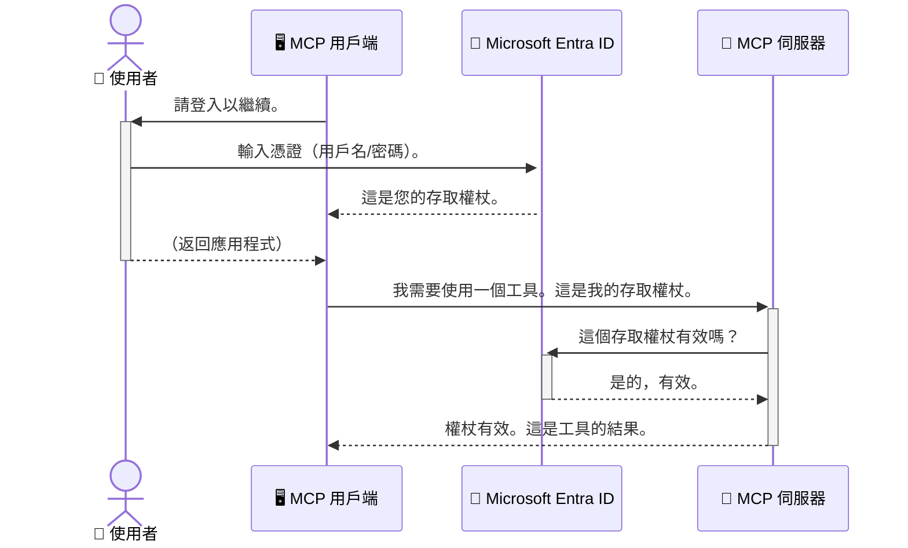

# 保護 AI 工作流程：Model Context Protocol 伺服器的 Entra ID 認證

## 介紹
保護您的 Model Context Protocol（MCP）伺服器就像為您的家門上鎖一樣重要。若讓 MCP 伺服器開放，您的工具和資料將面臨未經授權的存取風險，可能導致安全漏洞。Microsoft Entra ID 提供強大的雲端身分與存取管理解決方案，協助確保只有授權的使用者和應用程式能與您的 MCP 伺服器互動。在本節中，您將學習如何使用 Entra ID 認證來保護您的 AI 工作流程。

## 學習目標
完成本節後，您將能夠：

- 了解保護 MCP 伺服器的重要性。
- 解釋 Microsoft Entra ID 與 OAuth 2.0 認證的基本概念。
- 辨識公開用戶端與機密用戶端的差異。
- 在本地（公開用戶端）和遠端（機密用戶端） MCP 伺服器場景中實作 Entra ID 認證。
- 在開發 AI 工作流程時，應用最佳安全實務。

## 安全與 MCP

就如您不會將家門敞開讓任何人進入，您也不應讓 MCP 伺服器任人存取。保護您的 AI 工作流程是建立強健、可信且安全應用程式的關鍵。本章將介紹如何使用 Microsoft Entra ID 來保護您的 MCP 伺服器，確保只有授權使用者和應用程式能操作您的工具與資料。

## 為何 MCP 伺服器的安全性很重要

想像您的 MCP 伺服器擁有可以傳送電子郵件或存取客戶資料庫的工具。如果伺服器未受保護，任何人都有可能使用該工具，導致未經授權的資料存取、垃圾郵件或其他惡意活動。

透過實作認證，您能確保每一個對伺服器的請求都經過驗證，確認發出請求的使用者或應用程式身分。這是保護 AI 工作流程的首要且關鍵步驟。

## Microsoft Entra ID 簡介

[**Microsoft Entra ID**](https://adoption.microsoft.com/microsoft-security/entra/) 是一項基於雲端的身分與存取管理服務。可以將它想像成您應用程式的通用保全守衛。它負責複雜的驗證（使用者身分確認）和授權（決定使用者可執行的動作）流程。

使用 Entra ID，您可以：

- 讓使用者安全登入。
- 保護 API 與服務。
- 從單一位置管理存取政策。

對 MCP 伺服器而言，Entra ID 是一套強大且廣受信賴的解決方案，能管理誰可以存取您的伺服器功能。

---

## 了解核心原理：Entra ID 認證運作方式

Entra ID 使用如 **OAuth 2.0** 的開放標準處理認證。雖然細節可能複雜，但其核心概念簡單，可以用類比方式理解。

### OAuth 2.0 的簡介：代客鑰匙的比喻

把 OAuth 2.0 想像成您汽車的代客鑰匙服務。當您抵達餐廳時，不會將汽車的主鑰匙交給代客，而是提供一把 <strong>代客鑰匙</strong>，這把鑰匙權限有限 — 它可以發動車輛並鎖門，但無法打開後車箱或手套箱。

在這個類比中：

- <strong>您</strong> 是 <strong>使用者</strong>。
- <strong>您的汽車</strong> 是擁有貴重工具與資料的 **MCP 伺服器**。
- <strong>代客</strong> 是 **Microsoft Entra ID**。
- <strong>泊車服務人員</strong> 是嘗試存取伺服器的 **MCP 用戶端**（應用程式）。
- <strong>代客鑰匙</strong> 是 **存取權杖（Access Token）**。

存取權杖是一串由 MCP 用戶端在您登入後從 Entra ID 獲取的安全文字。用戶端會在每次請求時帶上此權杖，供 MCP 伺服器核驗，確保請求合法且用戶端擁有必要權限，而不需要處理您的帳密（例如密碼）。

### 認證流程

實際運作如下：




### 介紹 Microsoft Authentication Library (MSAL)

在深入程式碼之前，先介紹範例中會看到的重要元件：**Microsoft Authentication Library (MSAL)**。

MSAL 是 Microsoft 開發的程式庫，讓開發者能更輕鬆地處理認證。您不需自行撰寫所有複雜的程式碼來處理安全權杖、管理登入與重新整理會話，MSAL 負責完成這些繁重工作。

建議使用 MSAL 的原因：

- <strong>安全性高：</strong>實作業界標準協定及最佳安全實務，降低程式碼漏洞風險。
- <strong>簡化開發：</strong>將 OAuth 2.0 及 OpenID Connect 複雜性抽象化，幾行程式碼即可添加強健認證。
- **持續維護：**Microsoft 積極更新 MSAL，應對新安全威脅與平台變化。

MSAL 支援多種語言及應用框架，包括 .NET、JavaScript/TypeScript、Python、Java、Go，以及 iOS、Android 行動平台。這意味著您能在整個技術棧中使用一致的認證模式。

欲了解更多 MSAL 資訊，請參考官方 [MSAL 概覽文件](https://learn.microsoft.com/entra/identity-platform/msal-overview)。

---

## 使用 Entra ID 保護您的 MCP 伺服器：步驟指南

現在，我們將逐步說明如何使用 Entra ID 來保護本地 MCP 伺服器（以 `stdio` 通訊），本範例使用的是 <strong>公開用戶端</strong>，適用於執行於使用者電腦的應用程式，例如桌面應用或本地開發伺服器。

### 場景一：保護本地 MCP 伺服器（公開用戶端）

在此場景中，我們查看一個本地運行、透過 `stdio` 通訊的 MCP 伺服器，該伺服器先使用 Entra ID 進行使用者認證，再允許使用其工具。此伺服器有一個工具可從 Microsoft Graph API 擷取使用者個人資料。

#### 1. 在 Entra ID 中設定應用程式

撰寫程式碼前，您需要在 Microsoft Entra ID 中註冊您的應用程式。這可讓 Entra ID 知道您的應用程式資訊，並授予其使用認證服務的權限。

1. 前往 **[Microsoft Entra 入口網站](https://entra.microsoft.com/)**。
2. 移至 <strong>應用程式註冊</strong> 並點選 <strong>新增註冊</strong>。
3. 為您的應用命名（例如「My Local MCP Server」）。
4. 在 <strong>支援的帳戶類型</strong> 選擇 <strong>僅此組織目錄中的帳戶</strong>。
5. 本示範可將 **重新導向 URI** 留空。
6. 點選 <strong>註冊</strong>。

註冊完成後，記下 **應用程式 (用戶端) ID** 和 **目錄 (租用戶) ID**，稍後程式碼會用到。

#### 2. 程式碼說明

以下為處理認證的關鍵程式碼部分。完整範例位於 [mcp-auth-servers GitHub 儲存庫](https://github.com/Azure-Samples/mcp-auth-servers) 的 [Entra ID - Local - WAM](https://github.com/Azure-Samples/mcp-auth-servers/tree/main/src/entra-id-local-wam) 資料夾。

**`AuthenticationService.cs`**

此類別負責與 Entra ID 的互動。

- **`CreateAsync`**：初始化 MSAL（Microsoft Authentication Library）中的 `PublicClientApplication`。並使用您的 `clientId` 和 `tenantId` 進行設定。
- **`WithBroker`**：啟用代理（例如 Windows Web Account Manager），提供更安全與無縫的單一登入體驗。
- **`AcquireTokenAsync`**：核心方法。先嘗試靜默取得權杖（若已有有效登入狀態，使用者無需再次登入）。若無法靜默取得，則以互動式提示使用者登入。

```csharp
// Simplified for clarity
public static async Task<AuthenticationService> CreateAsync(ILogger<AuthenticationService> logger)
{
    var msalClient = PublicClientApplicationBuilder
        .Create(_clientId) // Your Application (client) ID
        .WithAuthority(AadAuthorityAudience.AzureAdMyOrg)
        .WithTenantId(_tenantId) // Your Directory (tenant) ID
        .WithBroker(new BrokerOptions(BrokerOptions.OperatingSystems.Windows))
        .Build();

    // ... cache registration ...

    return new AuthenticationService(logger, msalClient);
}

public async Task<string> AcquireTokenAsync()
{
    try
    {
        // Try silent authentication first
        var accounts = await _msalClient.GetAccountsAsync();
        var account = accounts.FirstOrDefault();

        AuthenticationResult? result = null;

        if (account != null)
        {
            result = await _msalClient.AcquireTokenSilent(_scopes, account).ExecuteAsync();
        }
        else
        {
            // If no account, or silent fails, go interactive
            result = await _msalClient.AcquireTokenInteractive(_scopes).ExecuteAsync();
        }

        return result.AccessToken;
    }
    catch (Exception ex)
    {
        _logger.LogError(ex, "An error occurred while acquiring the token.");
        throw; // Optionally rethrow the exception for higher-level handling
    }
}
```


**`Program.cs`**

此檔案負責設定 MCP 伺服器並整合認證服務。

- **`AddSingleton<AuthenticationService>`**：將 `AuthenticationService` 註冊到依賴注入容器，以供應用程式其他部分（如工具）使用。
- **`GetUserDetailsFromGraph` 工具**：此工具需要 `AuthenticationService` 實例。執行前先呼叫 `authService.AcquireTokenAsync()` 取得有效存取權杖。認證成功後，利用該權杖呼叫 Microsoft Graph API，擷取使用者詳細資料。

```csharp
// Simplified for clarity
[McpServerTool(Name = "GetUserDetailsFromGraph")]
public static async Task<string> GetUserDetailsFromGraph(
    AuthenticationService authService)
{
    try
    {
        // This will trigger the authentication flow
        var accessToken = await authService.AcquireTokenAsync();

        // Use the token to create a GraphServiceClient
        var graphClient = new GraphServiceClient(
            new BaseBearerTokenAuthenticationProvider(new TokenProvider(authService)));

        var user = await graphClient.Me.GetAsync();

        return System.Text.Json.JsonSerializer.Serialize(user);
    }
    catch (Exception ex)
    {
        return $"Error: {ex.Message}";
    }
}
```


#### 3. 系統協同運作方式

1. MCP 用戶端嘗試使用 `GetUserDetailsFromGraph` 工具，工具會先呼叫 `AcquireTokenAsync`。
2. `AcquireTokenAsync` 促使 MSAL 檢查是否有有效權杖。
3. 若未找到權杖，MSAL 透過代理提示使用者以 Entra ID 帳戶登入。
4. 使用者登入後，Entra ID 發行存取權杖。
5. 工具接收權杖並用它向 Microsoft Graph API 發出安全呼叫。
6. 使用者的詳細資料回傳至 MCP 用戶端。

此過程確保只有經過驗證的使用者能使用工具，有效保護您的本地 MCP 伺服器。

### 場景二：保護遠端 MCP 伺服器（機密用戶端）

當 MCP 伺服器運行在遠端機器（如雲端伺服器），並透過 HTTP Streaming 等協定通訊時，其安全需求不同。此時，應使用 <strong>機密用戶端</strong> 與 **授權碼流程（Authorization Code Flow）**。此方法安全性更高，因為應用程式秘密不會暴露給瀏覽器。

本範例使用基於 TypeScript 的 MCP 伺服器，並使用 Express.js 處理 HTTP 請求。

#### 1. 在 Entra ID 中設定應用程式

Entra ID 設定與公開用戶端類似，但有一個重要差異：需建立 <strong>用戶端密鑰</strong>。

1. 前往 **[Microsoft Entra 入口網站](https://entra.microsoft.com/)**。
2. 在您的應用程式註冊中，切換到 <strong>憑證與密鑰</strong> 分頁。
3. 點選 <strong>新增用戶端密鑰</strong>，填寫描述後點選 <strong>新增</strong>。
4. **重要：** 請立即複製密鑰值，之後將無法再次查看。
5. 您還需要設定 **重新導向 URI**：移至 <strong>認證</strong> 分頁，點選 <strong>新增平台</strong>，選擇 **Web**，並填寫您的應用程式重新導向 URI（例：`http://localhost:3001/auth/callback`）。

> **⚠️ 重要安全提醒：** 對於生產環境應用程式，Microsoft 強烈建議使用如 **Managed Identity** 或 **工作負載身分聯盟（Workload Identity Federation）** 等無密鑰認證方式，取代用戶端密鑰。用戶端密鑰存在安全風險，可能洩漏或被攻擊。Managed Identity 提供更安全的方式，無需在程式碼或設定檔中保存憑證。
>
> 關於 Managed Identities 的更多資訊及實作方法，請參閱 [Azure 資源的 Managed Identities 概述](https://learn.microsoft.com/entra/identity/managed-identities-azure-resources/overview)。

#### 2. 程式碼說明

本範例採用基於會話的方式。使用者認證後，伺服器將存取權杖和更新權杖存入會話，並回傳使用者一個會話權杖。後續請求皆使用此會話權杖。完整程式碼位於 [mcp-auth-servers GitHub 儲存庫](https://github.com/Azure-Samples/mcp-auth-servers) 中的 [Entra ID - Confidential client](https://github.com/Azure-Samples/mcp-auth-servers/tree/main/src/entra-id-cca-session) 資料夾。

**`Server.ts`**

此檔案設定 Express 伺服器與 MCP 傳輸層。

- **`requireBearerAuth`**：中介軟體，保護 `/sse` 和 `/message` 端點。檢查請求中的 `Authorization` 標頭是否含有效 Bearer 權杖。
- **`EntraIdServerAuthProvider`**：實作 `McpServerAuthorizationProvider` 介面的自訂類別，負責處理 OAuth 2.0 流程。
- **`/auth/callback`**：此端點處理 Entra ID 認證完成後的重新導向。將授權碼兌換為存取權杖與更新權杖。

```typescript
// 簡化以提高清晰度
const app = express();
const { server } = createServer();
const provider = new EntraIdServerAuthProvider();

// 保護 SSE 端點
app.get("/sse", requireBearerAuth({
  provider,
  requiredScopes: ["User.Read"]
}), async (req, res) => {
  // ... 連接到傳輸 ...
});

// 保護訊息端點
app.post("/message", requireBearerAuth({
  provider,
  requiredScopes: ["User.Read"]
}), async (req, res) => {
  // ... 處理訊息 ...
});

// 處理 OAuth 2.0 回調
app.get("/auth/callback", (req, res) => {
  provider.handleCallback(req.query.code, req.query.state)
    .then(result => {
      // ... 處理成功或失敗 ...
    });
});
```


**`Tools.ts`**

定義 MCP 伺服器提供的工具。`getUserDetails` 工具與前例類似，但從會話取得存取權杖。

```typescript
// 為了清晰起見而簡化
server.setRequestHandler(CallToolRequestSchema, async (request) => {
  const { name } = request.params;
  const context = request.params?.context as { token?: string } | undefined;
  const sessionToken = context?.token;

  if (name === ToolName.GET_USER_DETAILS) {
    if (!sessionToken) {
      throw new AuthenticationError("Authentication token is missing or invalid. Ensure the token is provided in the request context.");
    }

    // 從會話存儲中取得 Entra ID 令牌
    const tokenData = tokenStore.getToken(sessionToken);
    const entraIdToken = tokenData.accessToken;

    const graphClient = Client.init({
      authProvider: (done) => {
        done(null, entraIdToken);
      }
    });

    const user = await graphClient.api('/me').get();

    // ... 返回用戶詳細資訊 ...
  }
});
```


**`auth/EntraIdServerAuthProvider.ts`**

此類別負責：

- 將使用者重新導向至 Entra ID 登入頁面。
- 使用授權碼換取存取權杖。
- 將權杖儲存在 `tokenStore`。
- 在權杖過期時刷新存取權杖。

#### 3. 系統協同運作方式

1. 使用者首次嘗試連接 MCP 伺服器時，`requireBearerAuth` 中介軟體會檢查是否有有效會話，若無，則將使用者重新導向至 Entra ID 登入頁。
3. Entra ID 將使用者重新導向回 `/auth/callback` 端點並附帶授權碼。
4. 伺服器使用該授權碼換取存取權杖和更新權杖，並將它們儲存，同時建立一個會話權杖，該權杖會傳送給客戶端。
5. 客戶端現在可以在所有未來向 MCP 伺服器的請求中，在 `Authorization` 標頭使用此會話權杖。
6. 當呼叫 `getUserDetails` 工具時，它會使用會話權杖查找 Entra ID 存取權杖，然後用該權杖呼叫 Microsoft Graph API。

此流程比公開客戶端流程複雜，但對於面向網際網路的端點是必要的。由於遠端 MCP 伺服器可以透過公網訪問，它們需要更強的安全措施來防止未經授權的存取和潛在攻擊。

## 安全最佳實踐

- **始終使用 HTTPS**：加密客戶端與伺服器之間的通信，保護權杖不被攔截。
- **實施角色基礎存取控制 (RBAC)**：不要只檢查使用者是否已驗證；還要檢查他們被授權執行的操作。您可以在 Entra ID 中定義角色，並在 MCP 伺服器中進行檢查。
- <strong>監控與稽核</strong>：記錄所有驗證事件，便於偵測與回應可疑活動。
- <strong>處理速率限制與節流</strong>：Microsoft Graph 及其他 API 會實作速率限制以防止濫用。在 MCP 伺服器中實作指數退避和重試機制，以優雅地處理 HTTP 429（請求過多）回應。考慮快取常用資料來減少 API 呼叫次數。
- <strong>安全儲存權杖</strong>：安全地儲存存取權杖與更新權杖。對於本地應用程式，使用系統的安全儲存機制；對於伺服器應用程式，考慮使用加密儲存或安全金鑰管理服務，如 Azure Key Vault。
- <strong>權杖過期處理</strong>：存取權杖有有限的存活期限。透過更新權杖自動刷新權杖，維持無縫使用者體驗，無需重新驗證。
- **考慮使用 Azure API 管理**：雖然在 MCP 伺服器中直接實作安全功能可獲得細粒度控制，但如 Azure API 管理等 API Gateway 可以自動處理這些安全問題，包括驗證、授權、速率限制及監控。它們提供一個集中且統一的安全層，置於客戶端和 MCP 伺服器之間。詳細使用 API Gateway 與 MCP 的說明，請參閱我們的 [Azure API Management Your Auth Gateway For MCP Servers](https://techcommunity.microsoft.com/blog/integrationsonazureblog/azure-api-management-your-auth-gateway-for-mcp-servers/4402690)。

## 重要重點

- 保護您的 MCP 伺服器對於保障資料與工具至關重要。
- Microsoft Entra ID 提供健全且可擴展的身份驗證與授權解決方案。
- 本地應用程式使用 <strong>公開客戶端</strong>，遠端伺服器則使用 <strong>機密客戶端</strong>。
- <strong>授權碼流程</strong> 是網頁應用程式中最安全的選項。

## 練習題

1. 思考您可能會建立的 MCP 伺服器，是本地還是遠端伺服器？
2. 根據您的答案，會使用公開客戶端還是機密客戶端？
3. 您的 MCP 伺服器會請求哪些權限以對 Microsoft Graph 執行操作？

## 實作練習

### 練習 1：在 Entra ID 中註冊應用程式
前往 Microsoft Entra 入口網站。  
為您的 MCP 伺服器註冊一個新應用程式。  
記下應用程式 (client) ID 和目錄 (tenant) ID。

### 練習 2：保護本地 MCP 伺服器 (公開客戶端)
- 依範例程式碼整合 MSAL（Microsoft Authentication Library）以進行使用者驗證。
- 呼叫獲取 Microsoft Graph 使用者詳細資料的 MCP 工具，測試驗證流程。

### 練習 3：保護遠端 MCP 伺服器 (機密客戶端)
- 在 Entra ID 中註冊一個機密客戶端，並創建客戶端密鑰。
- 設定您的 Express.js MCP 伺服器以使用授權碼流程。
- 測試受保護端點並確認基於權杖的存取。

### 練習 4：應用安全最佳實踐
- 為您的本地或遠端伺服器啟用 HTTPS。
- 在伺服器邏輯中實作角色基礎存取控制 (RBAC)。
- 新增權杖過期處理與安全權杖儲存。

## 資源

1. **MSAL 概述文件**  
   了解 Microsoft Authentication Library (MSAL) 如何跨平台安全取得權杖：  
   [MSAL Overview on Microsoft Learn](https://learn.microsoft.com/en-gb/entra/msal/overview)

2. **Azure-Samples/mcp-auth-servers GitHub 儲存庫**  
   MCP 伺服器示範身份驗證流程的參考實作：  
   [Azure-Samples/mcp-auth-servers on GitHub](https://github.com/Azure-Samples/mcp-auth-servers)

3. **Azure 資源管理的受管身分概述**  
   了解如何使用系統指派或使用者指派受管身分以消除密碼：  
   [Managed Identities Overview on Microsoft Learn](https://learn.microsoft.com/en-us/entra/identity/managed-identities-azure-resources/)

4. **Azure API 管理：您的 MCP 伺服器身份驗證閘道**  
   深入介紹如何使用 APIM 作為 MCP 伺服器的安全 OAuth2 閘道：  
   [Azure API Management Your Auth Gateway For MCP Servers](https://techcommunity.microsoft.com/blog/integrationsonazureblog/azure-api-management-your-auth-gateway-for-mcp-servers/4402690)

5. **Microsoft Graph 權限參考**  
   完整的委派權限與應用程式權限清單：  
   [Microsoft Graph Permissions Reference](https://learn.microsoft.com/zh-tw/graph/permissions-reference)

## 學習成果
完成本節後，您將能：

- 清楚說明為何身份驗證對 MCP 伺服器及 AI 工作流程至關重要。
- 設定並配置 Entra ID 驗證以支援本地及遠端 MCP 伺服器場景。
- 根據伺服器部署環境選擇合適的客戶端類型（公開或機密）。
- 實作安全編碼實務，包括權杖儲存與基於角色的授權。
- 自信地保護您的 MCP 伺服器及其工具免於未經授權的存取。

## 下一步

- [5.13 Model Context Protocol (MCP) Integration with Microsoft Foundry](../mcp-foundry-agent-integration/README.md)

---

<!-- CO-OP TRANSLATOR DISCLAIMER START -->
**免責聲明**：
此文件已使用 AI 翻譯服務 [Co-op Translator](https://github.com/Azure/co-op-translator) 進行翻譯。雖然我們努力追求準確性，但請注意自動翻譯可能包含錯誤或不準確之處。原始文件的母語版本應視為權威來源。對於關鍵資訊，建議採用專業人工翻譯。我們不對因使用此翻譯所產生的任何誤解或誤譯承擔責任。
<!-- CO-OP TRANSLATOR DISCLAIMER END -->