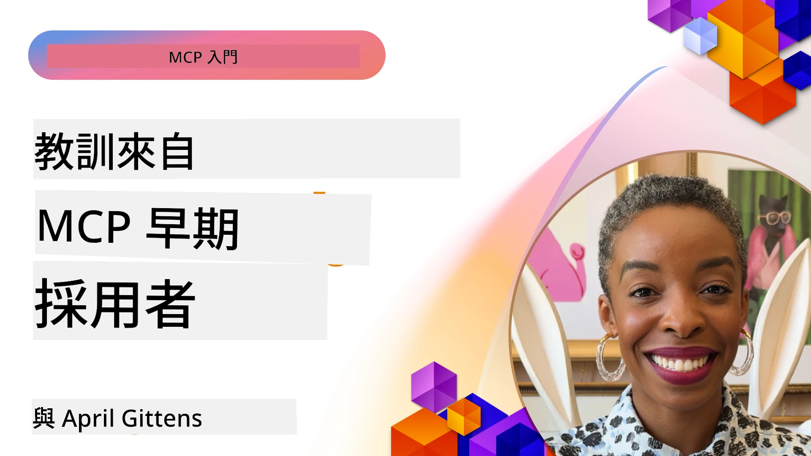

# 🌟 早期採用者的經驗教訓

[](https://youtu.be/jds7dSmNptE)

_(點擊上方圖片觀看本課程影片)_

## 🎯 本模組涵蓋內容

本模組探討真實組織與開發者如何運用模型上下文協議（Model Context Protocol，MCP）解決實際挑戰並推動創新。透過詳盡的案例研究、實作專案與實務範例，您將了解 MCP 如何實現安全且可擴展的 AI 整合，連接語言模型、工具與企業資料。

### 📚 見證 MCP 的實際運用

想看到這些原則如何應用於生產就緒工具嗎？請參考我們的[**10 款正在改變開發者生產力的 Microsoft MCP 伺服器**](microsoft-mcp-servers.md)，展示您今天就能使用的 Microsoft MCP 伺服器。

## 概覽

本課程探討早期採用者如何利用模型上下文協議（MCP）解決跨產業的真實挑戰並推動創新。透過詳盡案例研究與實作專案，您將看到 MCP 如何標準化、安全且可擴展地整合 AI，將大型語言模型、工具與企業資料以統一框架連結。您將實務學習設計與構建 MCP 應用方案，了解經證實的實作範型，並掌握部署 MCP 於生產環境的最佳實務。課程還重點介紹新興趨勢、未來方向與開放原始碼資源，助您保持 MCP 技術及其演進生態系的前沿。

## 學習目標

- 分析不同產業中真實的 MCP 實作案例  
- 設計並建置完整的 MCP 應用程式  
- 探索 MCP 技術的新興趨勢與未來發展方向  
- 將最佳實務應用於實際開發場景

## 真實 MCP 實作案例

### 案例研究 1：企業客戶支援自動化

一家跨國企業建置了基於 MCP 的解決方案，以標準化其客戶支援系統中的 AI 互動。此方案讓他們：

- 為多個大型語言模型（LLM）供應商創建統一介面  
- 在各部門間維持一致的提示管理  
- 實施強健的安全與合規控管  
- 根據特定需求輕鬆切換 AI 模型  

**技術實作：**

```python
# Python MCP 伺服器實作用於客戶支援
import logging
import asyncio
from modelcontextprotocol import create_server, ServerConfig
from modelcontextprotocol.server import MCPServer
from modelcontextprotocol.transports import create_http_transport
from modelcontextprotocol.resources import ResourceDefinition
from modelcontextprotocol.prompts import PromptDefinition
from modelcontextprotocol.tool import ToolDefinition

# 配置日誌記錄
logging.basicConfig(level=logging.INFO)

async def main():
    # 建立伺服器配置
    config = ServerConfig(
        name="Enterprise Customer Support Server",
        version="1.0.0",
        description="MCP server for handling customer support inquiries"
    )
    
    # 初始化 MCP 伺服器
    server = create_server(config)
    
    # 註冊知識庫資源
    server.resources.register(
        ResourceDefinition(
            name="customer_kb",
            description="Customer knowledge base documentation"
        ),
        lambda params: get_customer_documentation(params)
    )
    
    # 註冊提示模板
    server.prompts.register(
        PromptDefinition(
            name="support_template",
            description="Templates for customer support responses"
        ),
        lambda params: get_support_templates(params)
    )
    
    # 註冊支援工具
    server.tools.register(
        ToolDefinition(
            name="ticketing",
            description="Create and update support tickets"
        ),
        handle_ticketing_operations
    )
    
    # 使用 HTTP 傳輸啟動伺服器
    transport = create_http_transport(port=8080)
    await server.run(transport)

if __name__ == "__main__":
    asyncio.run(main())
```
  
**成果：** 降低模型成本 30%，提升回應一致性 45%，並強化全球營運的合規性。

### 案例研究 2：醫療診斷助理

一家醫療服務提供者開發 MCP 基礎設施，整合多種專業醫療 AI 模型，同時確保敏感病患資料受到保護：

- 無縫切換一般醫學模型與專業模型  
- 嚴格的隱私控管與稽核軌跡  
- 與現有電子病歷（EHR）系統整合  
- 為醫療術語維持一致的提示工程  

**技術實作：**

```csharp
// C# MCP host application implementation in healthcare application
using Microsoft.Extensions.DependencyInjection;
using ModelContextProtocol.SDK.Client;
using ModelContextProtocol.SDK.Security;
using ModelContextProtocol.SDK.Resources;

public class DiagnosticAssistant
{
    private readonly MCPHostClient _mcpClient;
    private readonly PatientContext _patientContext;
    
    public DiagnosticAssistant(PatientContext patientContext)
    {
        _patientContext = patientContext;
        
        // Configure MCP client with healthcare-specific settings
        var clientOptions = new ClientOptions
        {
            Name = "Healthcare Diagnostic Assistant",
            Version = "1.0.0",
            Security = new SecurityOptions
            {
                Encryption = EncryptionLevel.Medical,
                AuditEnabled = true
            }
        };
        
        _mcpClient = new MCPHostClientBuilder()
            .WithOptions(clientOptions)
            .WithTransport(new HttpTransport("https://healthcare-mcp.example.org"))
            .WithAuthentication(new HIPAACompliantAuthProvider())
            .Build();
    }
    
    public async Task<DiagnosticSuggestion> GetDiagnosticAssistance(
        string symptoms, string patientHistory)
    {
        // Create request with appropriate resources and tool access
        var resourceRequest = new ResourceRequest
        {
            Name = "patient_records",
            Parameters = new Dictionary<string, object>
            {
                ["patientId"] = _patientContext.PatientId,
                ["requestingProvider"] = _patientContext.ProviderId
            }
        };
        
        // Request diagnostic assistance using appropriate prompt
        var response = await _mcpClient.SendPromptRequestAsync(
            promptName: "diagnostic_assistance",
            parameters: new Dictionary<string, object>
            {
                ["symptoms"] = symptoms,
                patientHistory = patientHistory,
                relevantGuidelines = _patientContext.GetRelevantGuidelines()
            });
            
        return DiagnosticSuggestion.FromMCPResponse(response);
    }
}
```
  
**成果：** 為醫師提供更優診斷建議，同時完全遵守 HIPAA 規範，並大幅減少系統間上下文切換。

### 案例研究 3：金融服務風險分析

一家金融機構運用 MCP 標準化不同部門間的風險分析流程：

- 為信用風險、詐欺偵測及投資風險模型建立統一介面  
- 實施嚴格存取控管與模型版本控制  
- 確保所有 AI 建議可稽核  
- 跨系統維持一致的資料格式  

**技術實作：**

```java
// 用於金融風險評估的 Java MCP 伺服器
import org.mcp.server.*;
import org.mcp.security.*;

public class FinancialRiskMCPServer {
    public static void main(String[] args) {
        // 創建具備金融合規功能的 MCP 伺服器
        MCPServer server = new MCPServerBuilder()
            .withModelProviders(
                new ModelProvider("risk-assessment-primary", new AzureOpenAIProvider()),
                new ModelProvider("risk-assessment-audit", new LocalLlamaProvider())
            )
            .withPromptTemplateDirectory("./compliance/templates")
            .withAccessControls(new SOCCompliantAccessControl())
            .withDataEncryption(EncryptionStandard.FINANCIAL_GRADE)
            .withVersionControl(true)
            .withAuditLogging(new DatabaseAuditLogger())
            .build();
            
        server.addRequestValidator(new FinancialDataValidator());
        server.addResponseFilter(new PII_RedactionFilter());
        
        server.start(9000);
        
        System.out.println("Financial Risk MCP Server running on port 9000");
    }
}
```
  
**成果：** 加強法規遵循，模型部署週期縮短 40%，並提升部門間風險評估一致性。

### 案例研究 4：Microsoft Playwright MCP 伺服器用於瀏覽器自動化

微軟開發了[Playwright MCP 伺服器](https://github.com/microsoft/playwright-mcp)，透過模型上下文協議實現安全、標準化的瀏覽器自動化。這個生產就緒的伺服器允許 AI 代理和大型語言模型以受控、可稽核且可擴展的方式與瀏覽器互動——可用於自動化網頁測試、資料擷取與端到端流程。

> **🎯 生產就緒工具**  
>  
> 本案例展示您今天就能使用的真實 MCP 伺服器！詳情請參閱我們 [**Microsoft MCP 伺服器指南**](microsoft-mcp-servers.md#8--playwright-mcp-server)。

**主要功能：**  
- 將瀏覽器自動化功能（導航、填表、擷圖等）封裝為 MCP 工具  
- 實施嚴格存取控管與沙箱機制防止未授權操作  
- 提供所有瀏覽器互動的詳細審計日誌  
- 支援與 Azure OpenAI 及其他 LLM 供應商整合以驅動代理自動化  
- 支援 GitHub Copilot 的程式碼代理具備網頁瀏覽功能  

**技術實作：**

```typescript
// TypeScript：在 MCP 伺服器中註冊 Playwright 瀏覽器自動化工具
import { createServer, ToolDefinition } from 'modelcontextprotocol';
import { launch } from 'playwright';

const server = createServer({
  name: 'Playwright MCP Server',
  version: '1.0.0',
  description: 'MCP server for browser automation using Playwright'
});

// 註冊一個用於導航至 URL 並擷取截圖的工具
server.tools.register(
  new ToolDefinition({
    name: 'navigate_and_screenshot',
    description: 'Navigate to a URL and capture a screenshot',
    parameters: {
      url: { type: 'string', description: 'The URL to visit' }
    }
  }),
  async ({ url }) => {
    const browser = await launch();
    const page = await browser.newPage();
    await page.goto(url);
    const screenshot = await page.screenshot();
    await browser.close();
    return { screenshot };
  }
);

// 啟動 MCP 伺服器
server.listen(8080);
```
  
**成果：**

- 為 AI 代理與大型語言模型啟用安全程式化瀏覽器自動化  
- 降低人工測試負擔，提升網路應用測試覆蓋率  
- 提供企業環境中瀏覽器工具整合的可重複、可擴充框架  
- 支援 GitHub Copilot 網頁瀏覽功能  

**參考資料：**

- [Playwright MCP 伺服器 GitHub 倉庫](https://github.com/microsoft/playwright-mcp)  
- [Microsoft AI 及自動化解決方案](https://azure.microsoft.com/en-us/products/ai-services/)

### 案例研究 5：Azure MCP – 企業級模型上下文協議即服務

Azure MCP 伺服器 ([https://aka.ms/azmcp](https://aka.ms/azmcp)) 是微軟提供的企業級 MCP 管理服務，設計為可擴展、安全且符合規範的 MCP 伺服器雲端平台。Azure MCP 使組織能快速部署、管理並整合 MCP 與 Azure AI、資料及安全服務，降低營運成本、加速 AI 採用。

> **🎯 生產就緒工具**  
>  
> 這是一個您今天即可使用的真實 MCP 伺服器！詳見[**Microsoft MCP 伺服器指南**](microsoft-mcp-servers.md)。

- 完全託管的 MCP 伺服器託管，內建擴展、監控與安全功能  
- 原生整合 Azure OpenAI、Azure AI Search 等 Azure 服務  
- 企業身份驗證與授權透過 Microsoft Entra ID  
- 支援自訂工具、提示範本與資源連結  
- 遵循企業安全與法規要求  

**技術實作：**

```yaml
# Example: Azure MCP server deployment configuration (YAML)
apiVersion: mcp.microsoft.com/v1
kind: McpServer
metadata:
  name: enterprise-mcp-server
spec:
  modelProviders:
    - name: azure-openai
      type: AzureOpenAI
      endpoint: https://<your-openai-resource>.openai.azure.com/
      apiKeySecret: <your-azure-keyvault-secret>
  tools:
    - name: document_search
      type: AzureAISearch
      endpoint: https://<your-search-resource>.search.windows.net/
      apiKeySecret: <your-azure-keyvault-secret>
  authentication:
    type: EntraID
    tenantId: <your-tenant-id>
  monitoring:
    enabled: true
    logAnalyticsWorkspace: <your-log-analytics-id>
```
  
**成果：**  
- 透過即用且合規的 MCP 伺服器平台，縮短企業 AI 專案的價值實現時間  
- 簡化大型語言模型、工具與企業資料源的整合  
- 強化 MCP 工作負載的安全性、可觀察性與營運效率  
- 透過 Azure SDK 最佳實踐與現代驗證模式提升程式碼品質  

**參考資料：**  
- [Azure MCP 文件](https://aka.ms/azmcp)  
- [Azure MCP 伺服器 GitHub 倉庫](https://github.com/Azure/azure-mcp)  
- [Azure AI 服務](https://azure.microsoft.com/en-us/products/ai-services/)  
- [Microsoft MCP 中心](https://mcp.azure.com)

## 案例研究 6：NLWeb  
MCP（模型上下文協議）是一種新興協議，讓聊天機器人與 AI 助手能與工具互動。每個 NLWeb 實例同時也是一個 MCP 伺服器，支援一個核心方法 ask，可用自然語言向網站提問。回傳回應利用 schema.org，此為描述網路資料的廣泛詞彙。簡言之，MCP 對 NLWeb 如同 HTTP 對 HTML。NLWeb 結合協議、Schema.org 格式與範例程式碼，幫助網站迅速創建此類端點，服務端點促進人類對話介面，也便利機器間自然代理互動。

NLWeb 有兩大組件：  
- 一個簡單協議，可用自然語言與網站互動，回傳答案格式利用 json 與 schema.org。詳見 REST API 文檔。  
- (1) 的簡易實作，針對可抽象為項目清單（產品、食譜、景點、評論等）的網站。結合 UI 元件，為網站內容快速提供對話介面。詳見 Life of a chat query 文檔說明其運作原理。

**參考資料：**  
- [Azure MCP 文件](https://aka.ms/azmcp)  
- [NLWeb](https://github.com/microsoft/NlWeb)

### 案例研究 7：Microsoft Foundry MCP 伺服器 – 企業 AI 代理整合

Microsoft Foundry MCP 伺服器展示 MCP 如何用於企業環境中協調管理 AI 代理與工作流程。結合 MCP 與 Microsoft Foundry，企業可標準化代理互動，利用 Foundry 的流程管理，並確保安全、可擴展部署。

> **🎯 生產就緒工具**  
>  
> 這是您今天即可使用的真實 MCP 伺服器！詳見[**Microsoft MCP 伺服器指南**](microsoft-mcp-servers.md#9--microsoft-foundry-mcp-server)。

**主要功能：**  
- 全面存取 Azure AI 生態系，包括模型目錄與部署管理  
- 透過 Azure AI Search 為 RAG 應用提供知識索引  
- AI 模型效能與品質保證的評估工具  
- 整合 Microsoft Foundry 目錄與實驗室的前沿研究模型  
- 針對生產場景提供代理管理與評估能力  

**成果：**  
- 快速原型與強健監控 AI 代理工作流程  
- 與 Azure AI 服務無縫整合，支援先進應用  
- 建構、部署與監控代理管道的統一介面  
- 提升企業的安全、合規與營運效率  
- 在維持複雜代理流程控制之餘，加速 AI 採用  

**參考資料：**  
- [Microsoft Foundry MCP 伺服器 GitHub 倉庫](https://github.com/azure-ai-foundry/mcp-foundry)  
- [Microsoft Foundry 部落格：Azure AI 代理與 MCP 整合](https://devblogs.microsoft.com/foundry/integrating-azure-ai-agents-mcp/)

### 案例研究 8：Foundry MCP Playground – 實驗與原型製作

Foundry MCP Playground 提供一個即用環境，方便實驗 MCP 伺服器與 Microsoft Foundry 整合。開發者能快速原型、測試與評估 AI 模型及代理工作流程，使用 Microsoft Foundry 目錄與實驗室資源。Playground 簡化設定、提供範例專案並支援協同開發，讓您輕鬆探索最佳實務與新場景，降低進入門檻並促進 MCP 及 Microsoft Foundry 社群創新與貢獻。

**參考資料：**

- [Foundry MCP Playground GitHub 倉庫](https://github.com/azure-ai-foundry/foundry-mcp-playground)

### 案例研究 9：Microsoft Learn Docs MCP 伺服器 – AI 驅動的文件存取

Microsoft Learn Docs MCP 伺服器是一個雲端託管服務，讓 AI 助手可透過模型上下文協議，實時存取官方 Microsoft 文件。此生產就緒伺服器連接全面的 Microsoft Learn 生態系，支援跨所有官方 Microsoft 資源的語意搜尋。

> **🎯 生產就緒工具**  
>  
> 這是您今天即可使用的真實 MCP 伺服器！詳見[**Microsoft MCP 伺服器指南**](microsoft-mcp-servers.md#1--microsoft-learn-docs-mcp-server)。

**主要功能：**  
- 實時存取官方 Microsoft 文件、Azure 文件及 Microsoft 365 文件  
- 先進的語意搜尋能力，理解上下文和意圖  
- 隨 Microsoft Learn 內容發布即時更新資訊  
- 完整涵蓋 Microsoft Learn、Azure 文件與 Microsoft 365 資源  
- 回傳多達 10 筆高品質內容區塊，附帶文章標題及 URL  

**重要性：**  
- 解決 Microsoft 技術「AI 知識過時」問題  
- 確保 AI 助手能存取最新的 .NET、C#、Azure 及 Microsoft 365 功能  
- 提供權威且第一手資訊，提升程式碼生成準確度  
- 對於開發快速演進 Microsoft 技術的開發者至關重要  

**成果：**  
- 大幅提升 AI 生成 Microsoft 技術程式碼的準確性  
- 減少尋找最新文件與最佳實務的時間  
- 透過上下文感知文件檢索提升開發者生產力  
- 無需離開 IDE 即可無縫整合至開發工作流程  

**參考資料：**  
- [Microsoft Learn Docs MCP 伺服器 GitHub 倉庫](https://github.com/MicrosoftDocs/mcp)  
- [Microsoft Learn 文件](https://learn.microsoft.com/)

## 實作專案

### 專案 1：建立多供應商 MCP 伺服器

**目標：** 建立一個 MCP 伺服器，能根據特定條件將請求路由到多個 AI 模型供應商。

**需求：**

- 支援至少三個不同模型供應商（例如 OpenAI、Anthropic、本地模型）  
- 根據請求元資料實作路由機制  
- 建立管理供應商憑證的設定系統  
- 加入快取以優化效能與成本  
- 建置簡易的用量監控儀表板  

**實作步驟：**

1. 建立基本 MCP 伺服器基礎架構  
2. 為每個 AI 模型服務實作供應商介面  
3. 根據請求屬性建立路由邏輯  
4. 增加頻繁請求的快取機制  
5. 開發監控儀表板  
6. 測試各種請求模式  

**技術棧：** 可選 Python（.NET/Java/Python 擇一），Redis 作為快取，簡單網頁框架作為儀表板。

### 專案 2：企業提示管理系統

**目標：** 開發基於 MCP 的系統，用於管理、版本控制並部署組織內的提示範本。

**需求：**
- 建立一個集中管理的提示範本庫
- 實施版本控制和審核工作流程
- 建立帶有範例輸入的範本測試功能
- 開發基於角色的存取控制
- 創建用於範本檢索和部署的 API

**實作步驟：**

1. 設計範本儲存的資料庫架構
2. 創建範本 CRUD 操作的核心 API
3. 實施版本控制系統
4. 建立審核工作流程
5. 開發測試框架
6. 創建簡易的管理網頁介面
7. 與 MCP 伺服器整合

**技術：** 自選後端框架、SQL 或 NoSQL 資料庫，以及用於管理介面的前端框架。

### 專案三：基於 MCP 的內容生成平台

**目標：** 建立一個使用 MCP 提供不同內容類型一致結果的內容生成平台。

**需求：**

- 支援多種內容格式（博客文章、社群媒體、行銷文案）
- 實作具有自訂選項的基於範本的生成
- 建立內容審核與反饋系統
- 追蹤內容績效指標
- 支援內容版本管理與迭代

**實作步驟：**

1. 設置 MCP 用戶端基礎建設
2. 創建不同內容類型的範本
3. 建構內容生成管線
4. 實作審核系統
5. 開發績效指標追蹤系統
6. 建立範本管理與內容生成的使用者介面

**技術：** 優選的程式語言、網頁框架和資料庫系統。

## MCP 技術未來方向

### 新興趨勢

1. **多模態 MCP**
   - 擴展 MCP 以標準化與影像、音訊及視訊模型的互動
   - 發展跨模態推理能力
   - 制定不同模態的標準化提示格式

2. **聯邦 MCP 基礎建設**
   - 分散式 MCP 網路，可在組織間共享資源
   - 安全模型共享的標準化協定
   - 隱私保護計算技術

3. **MCP 市場**
   - 共享及貨幣化 MCP 範本和插件的生態系
   - 品質保證與認證流程
   - 與模型市場的整合

4. **邊緣計算用 MCP**
   - 適應資源受限的邊緣裝置的 MCP 標準
   - 針對低頻寬環境優化協定
   - 為物聯網生態系專門開發的 MCP 實作

5. <strong>監管架構</strong>
   - 針對法規合規的 MCP 擴充開發
   - 標準化的稽核追蹤與可解釋性介面
   - 與新興 AI 治理框架整合

### 微軟的 MCP 解決方案

微軟與 Azure 推出了多個開源庫，協助開發者在不同情境實作 MCP：

#### Microsoft 組織

1. [playwright-mcp](https://github.com/microsoft/playwright-mcp) - 用於瀏覽器自動化與測試的 Playwright MCP 伺服器
2. [files-mcp-server](https://github.com/microsoft/files-mcp-server) - 一個用於本地測試及社群貢獻的 OneDrive MCP 伺服器實作
3. [NLWeb](https://github.com/microsoft/NlWeb) - NLWeb 是一系列開放協定及相關開源工具，重點在建立 AI 網路的基礎層

#### Azure-Samples 組織

1. [mcp](https://github.com/Azure-Samples/mcp) - 連結多語言在 Azure 上建構及整合 MCP 伺服器的範例、工具與資源
2. [mcp-auth-servers](https://github.com/Azure-Samples/mcp-auth-servers) - 體現 Model Context Protocol 規範的驗證參考 MCP 伺服器
3. [remote-mcp-functions](https://github.com/Azure-Samples/remote-mcp-functions) - Azure Functions 中遠端 MCP 伺服器的起始頁及語言專屬庫連結
4. [remote-mcp-functions-python](https://github.com/Azure-Samples/remote-mcp-functions-python) - 用 Python 在 Azure Functions 快速建立並部署自訂遠端 MCP 伺服器的模板
5. [remote-mcp-functions-dotnet](https://github.com/Azure-Samples/remote-mcp-functions-dotnet) - 用 .NET/C# 在 Azure Functions 快速建立並部署自訂遠端 MCP 伺服器的模板
6. [remote-mcp-functions-typescript](https://github.com/Azure-Samples/remote-mcp-functions-typescript) - 用 TypeScript 在 Azure Functions 快速建立並部署自訂遠端 MCP 伺服器的模板
7. [remote-mcp-apim-functions-python](https://github.com/Azure-Samples/remote-mcp-apim-functions-python) - 使用 Python 的 Azure API Management 跨接遠端 MCP 伺服器
8. [AI-Gateway](https://github.com/Azure-Samples/AI-Gateway) - APIM ❤️ AI 實驗專案，具備 MCP 功能，整合 Azure OpenAI 與 AI Foundry

這些庫涵蓋了 Model Context Protocol 在多種程式語言與 Azure 服務中的多樣化應用，從基礎伺服器實作到認證、雲端部署與企業整合方案皆有。

#### MCP 資源目錄

官方 Microsoft MCP 倉庫中的 [MCP Resources 目錄](https://github.com/microsoft/mcp/tree/main/Resources) 收錄了精選的範例資源、提示範本及工具定義，供 MCP 伺服器使用。該目錄協助開發者快速起步，提供可重用的組件與最佳實踐範例，包括：

- **提示範本：** 針對常見 AI 任務及場景的即用型提示範本，可適用於個人 MCP 伺服器實作
- **工具定義：** 標準化工具整合與調用的範例工具架構及元資料
- **資源範例：** 範例的資源定義，用以連接資料來源、API 與 MCP 框架中的外部服務
- **參考實作：** 展示如何在實際 MCP 專案中架構與組織資源、提示與工具的實用範例

這些資源有助於加速開發、促進標準化，並確保構建與部署基於 MCP 之解決方案的最佳實踐。

#### MCP 資源目錄

- [MCP 資源（範例提示、工具與資源定義）](https://github.com/microsoft/mcp/tree/main/Resources)

### 研究方向

- MCP 框架內的高效提示優化技術
- 多租戶 MCP 部署的安全模型
- 各種 MCP 實作的效能基準測試
- MCP 伺服器的形式化驗證方法

## 結論

Model Context Protocol (MCP) 正在快速塑造產業中標準化、安全且可互操的 AI 集成未來。透過本課的案例研究與實作專案，您已見識到如微軟與 Azure 等先驅如何運用 MCP 解決實際挑戰，加速 AI 採用，同時保證合規、安全與擴展性。MCP 的模組化設計使組織能在統一且可稽核的框架下，充分連接大型語言模型、工具與企業數據。隨著 MCP 的持續演進，持續參與社群、探索開源資源並運用最佳實務，將是打造健全且具未來性的 AI 解決方案的關鍵。

## 附加資源

- [MCP Foundry GitHub 倉庫](https://github.com/azure-ai-foundry/mcp-foundry)
- [Foundry MCP Playground](https://github.com/azure-ai-foundry/foundry-mcp-playground)
- [整合 Azure AI 代理與 MCP（微軟 Foundry 部落格）](https://devblogs.microsoft.com/foundry/integrating-azure-ai-agents-mcp/)
- [MCP GitHub 倉庫（微軟）](https://github.com/microsoft/mcp)
- [MCP 資源目錄（範例提示、工具與資源定義）](https://github.com/microsoft/mcp/tree/main/Resources)
- [MCP 社群與文件](https://modelcontextprotocol.io/introduction)
- [MCP 規範（2025-11-25）](https://spec.modelcontextprotocol.io/specification/2025-11-25/)
- [Azure MCP 文件](https://aka.ms/azmcp)
- [OWASP MCP 前十項](https://microsoft.github.io/mcp-azure-security-guide/mcp/) - 安全最佳實務
- [Playwright MCP 伺服器 GitHub 倉庫](https://github.com/microsoft/playwright-mcp)
- [Files MCP 伺服器（OneDrive）](https://github.com/microsoft/files-mcp-server)
- [Azure-Samples MCP](https://github.com/Azure-Samples/mcp)
- [MCP 認證伺服器（Azure-Samples）](https://github.com/Azure-Samples/mcp-auth-servers)
- [遠端 MCP 函數（Azure-Samples）](https://github.com/Azure-Samples/remote-mcp-functions)
- [遠端 MCP 函數 Python（Azure-Samples）](https://github.com/Azure-Samples/remote-mcp-functions-python)
- [遠端 MCP 函數 .NET（Azure-Samples）](https://github.com/Azure-Samples/remote-mcp-functions-dotnet)
- [遠端 MCP 函數 TypeScript（Azure-Samples）](https://github.com/Azure-Samples/remote-mcp-functions-typescript)
- [遠端 MCP APIM 函數 Python（Azure-Samples）](https://github.com/Azure-Samples/remote-mcp-apim-functions-python)
- [AI-Gateway（Azure-Samples）](https://github.com/Azure-Samples/AI-Gateway)
- [微軟 AI 與自動化解決方案](https://azure.microsoft.com/en-us/products/ai-services/)

## 練習題

1. 分析其中一個案例研究，並提出另一種實作方案。
2. 選擇一個專案構想並撰寫詳細技術規格。
3. 研究案例中未涵蓋的產業，並概述 MCP 如何解決其特定挑戰。
4. 探索一項未來方向，並構思一個支援該方向的新 MCP 擴充概念。

## 下一步

繼續探索：[Microsoft MCP 伺服器](./microsoft-mcp-servers.md)

繼續閱讀：[第8單元：最佳實務](../08-BestPractices/README.md)

---

<!-- CO-OP TRANSLATOR DISCLAIMER START -->
**免責聲明**：
此文件已使用 AI 翻譯服務 [Co-op Translator](https://github.com/Azure/co-op-translator) 進行翻譯。雖然我們努力追求準確性，但請注意自動翻譯可能包含錯誤或不準確之處。原始文件的母語版本應視為權威來源。對於關鍵資訊，建議採用專業人工翻譯。我們不對因使用此翻譯所產生的任何誤解或誤譯承擔責任。
<!-- CO-OP TRANSLATOR DISCLAIMER END -->