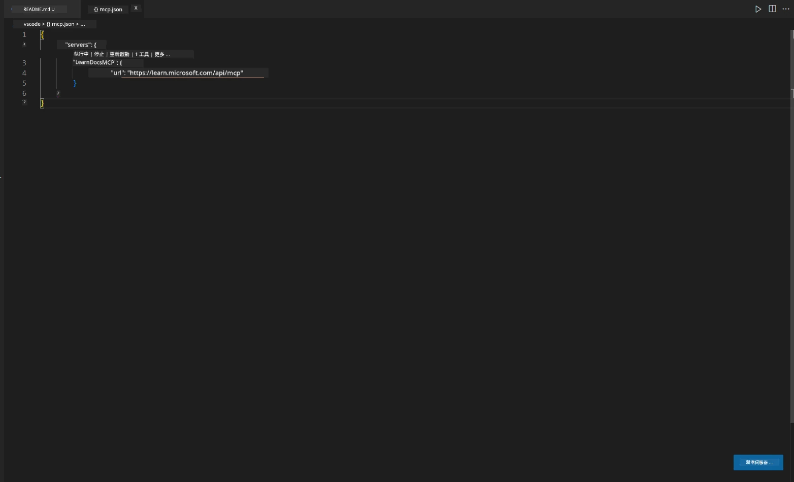
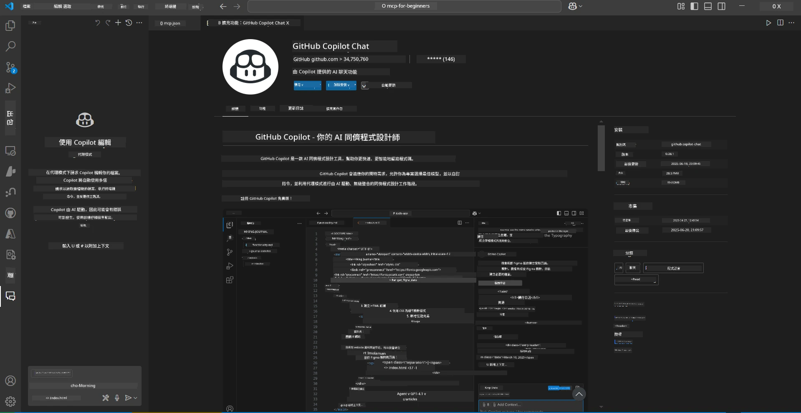
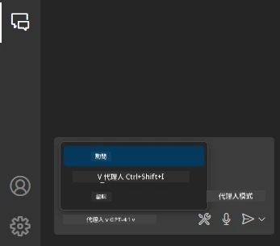
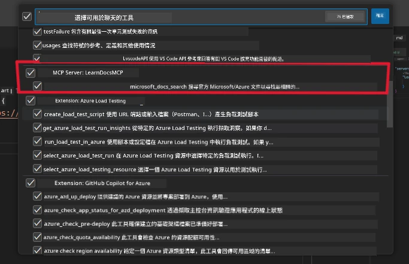
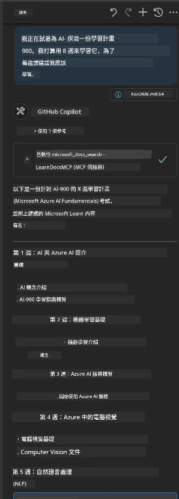
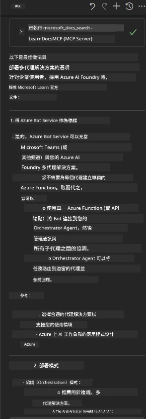

# 情境 3：在 VS Code 中使用 MCP 伺服器的編輯器內文件

## 概觀

在此情境中，您將學習如何使用 MCP 伺服器，將 Microsoft Learn 文件直接帶入您的 Visual Studio Code 環境。您不必不停地切換瀏覽器分頁來搜尋文件，而是可以直接在編輯器內存取、搜尋並參考官方文件。這種方法精簡了您的工作流程，讓您保持專注，並能與 GitHub Copilot 等工具無縫整合。

- 在 VS Code 內搜尋並閱讀文件，不用離開您的程式編輯環境。
- 直接參考文件並在 README 或課程檔案中插入連結。
- 結合 GitHub Copilot 與 MCP，打造無縫的 AI 助力文件工作流程。

## 學習目標

完成本章節後，您將了解如何在 VS Code 中設定與使用 MCP 伺服器，以強化您的文件和開發工作流程。您將能夠：

- 配置工作區以使用 MCP 伺服器進行文件查詢。
- 從 VS Code 內直接搜尋並插入文件內容。
- 結合 GitHub Copilot 與 MCP 的力量，實現更高效的 AI 增強工作流程。

這些技能將幫助您保持專注、提升文件品質，並作為開發者或技術撰寫者，提高工作效率。

## 解決方案

為實現編輯器內文件存取，您將透過一系列步驟將 MCP 伺服器整合到 VS Code 和 GitHub Copilot 中。此解決方案非常適合想在編輯器內同時使用文件和 Copilot 且保持專注的課程作者、文件撰寫者與開發者。

- 在撰寫課程或專案文件時，快速新增參考連結至 README。
- 使用 Copilot 生成程式碼，並用 MCP 立即找到並引用相關文件內容。
- 保持在編輯器內的專注，提高生產力。

### 逐步指南

開始請依照以下步驟操作。您可以從資源資料夾新增截圖來視覺輔助說明過程。

1. **新增 MCP 設定：**  
   在您的專案根目錄下，建立 `.vscode/mcp.json` 檔案並添加以下設定：
   ```json
   {
     "servers": {
       "LearnDocsMCP": {
         "url": "https://learn.microsoft.com/api/mcp"
       }
     }
   }
   ```
  
   此設定會告訴 VS Code 如何連接至 [`Microsoft Learn Docs MCP 伺服器`](https://github.com/MicrosoftDocs/mcp)。
   
   
    
2. **打開 GitHub Copilot Chat 面板：**  
   如果您尚未安裝 GitHub Copilot 擴充套件，請先在 VS Code 的擴充套件檢視中安裝。您可以直接從 [Visual Studio Code Marketplace](https://marketplace.visualstudio.com/items?itemName=GitHub.copilot-chat) 下載。接著，從側邊欄開啟 Copilot Chat 面板。

   

3. **啟用代理模式並確認工具：**  
   在 Copilot Chat 面板中，啟用代理模式。

   

   啟用代理模式後，確認 MCP 伺服器列為可用工具之一。此動作確保 Copilot 代理可以存取文件伺服器，取得相關資訊。
   
   
4. **開始新對話並提示代理：**  
   在 Copilot Chat 面板開啟新對話。您現在可向代理提出文件查詢。代理會使用 MCP 伺服器，直接在編輯器內擷取並顯示相關 Microsoft Learn 文件。

   - *「我正在撰寫主題 X 的學習計畫，計劃學習 8 週，請針對每週建議應該學習的內容。」*

   

5. **即時查詢：**

   > 讓我們以 Microsoft Foundry Discord 中 [#get-help](https://discord.gg/D6cRhjHWSC) 頻道的一則實時查詢為例（[查看原始訊息](https://discord.com/channels/1113626258182504448/1385498306720829572)）：
   
   *「我正在尋找如何部署一個多代理解決方案，這些 AI 代理是在 Azure AI Foundry 上開發的。我發現沒有直接的部署方法，比如 Copilot Studio 頻道。那麼，對企業用戶來說，有哪些不同的部署方式能讓他們互動完成任務？  
   有許多文章／部落格提到可以使用 Azure Bot 服務作為 MS Teams 與 Azure AI Foundry 代理之間的橋樑，請問如果我用 Azure Bot 透過 Azure Function 連接到 Azure AI Foundry 的 Orchestrator Agent 進行協調，這樣可行嗎？還是我需要為多代理解決方案中每個 AI 代理建立 Azure Function，在 Bot framework 做協調？任何其他建議都非常歡迎。」*

   

   代理會回覆相關文件連結及摘要，您可以直接插入到您的 markdown 檔案中，或用作程式碼中的參考。

### 範例查詢

以下是您可以嘗試的範例查詢，展示 MCP 伺服器和 Copilot 如何協同、即時提供情境感知的文件與參考，且無須離開 VS Code：

- 「示範如何使用 Azure Functions 的觸發器。」
- 「插入 Azure Key Vault 官方文件的連結。」
- 「Azure 資源安全的最佳實務是什麼？」
- 「找到 Azure AI 服務的快速入門教學。」

這些查詢將展示 MCP 伺服器和 Copilot 如何協同合作，提供快速且情境敏感的文件與參考，讓您留在 VS Code 中便能完成工作。

---

---

<!-- CO-OP TRANSLATOR DISCLAIMER START -->
**免責聲明**：
此文件已使用 AI 翻譯服務 [Co-op Translator](https://github.com/Azure/co-op-translator) 進行翻譯。雖然我們努力追求準確性，但請注意自動翻譯可能包含錯誤或不準確之處。原始文件的母語版本應視為權威來源。對於關鍵資訊，建議採用專業人工翻譯。我們不對因使用此翻譯所產生的任何誤解或誤譯承擔責任。
<!-- CO-OP TRANSLATOR DISCLAIMER END -->