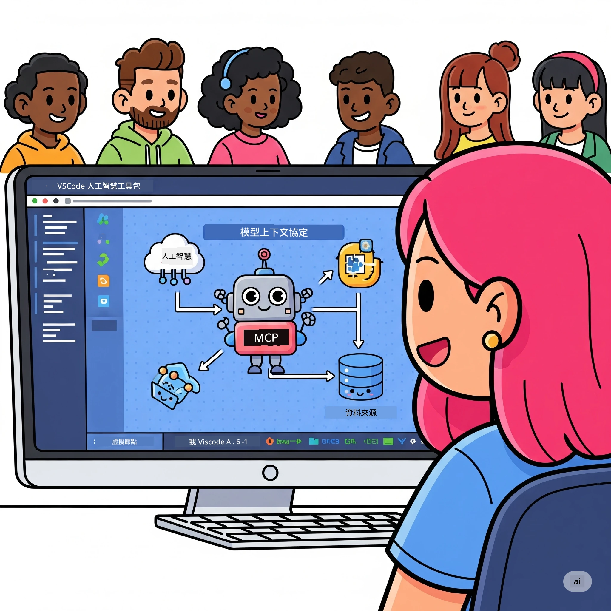
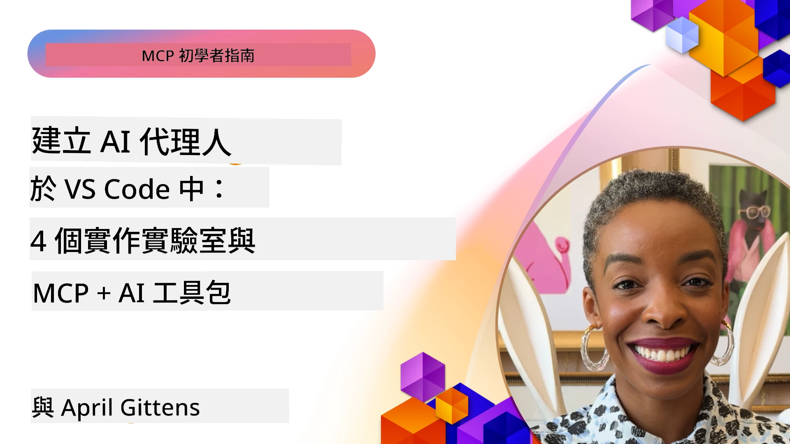

# 簡化 AI 工作流程：使用 Microsoft Foundry Toolkit 建立 MCP 伺服器

## 🎯 概覽

_（點擊上方圖片觀看本課程的影片）_

歡迎來到 **Model Context Protocol (MCP) 工作坊**！本全面實作工作坊結合兩項前沿技術，徹底改變 AI 應用開發：

- **🔗 Model Context Protocol (MCP)**：無縫接軌 AI 工具的開放標準
- **🛠️ Microsoft Foundry Toolkit VS Code 延伸功能**：Microsoft 強大的 AI 開發擴充套件

### 🎓 你將學到什麼

結束本工作坊後，你將精通建立結合 AI 模型與現實世界工具和服務的智慧應用。從自動化測試到自訂 API 整合，你將獲得解決複雜商業挑戰的實務技能。

## 🏗️ 技術棧

### 🔌 Model Context Protocol (MCP)

MCP 是 AI 領域的 **「USB-C 標準」** — 將 AI 模型與外部工具及資料源連接的通用標準。

**✨ 主要特色：**

- 🔄 <strong>標準化整合</strong>：AI 工具連接的通用介面
- 🏛️ <strong>彈性架構</strong>：支援本地與遠端伺服器，透過 stdio/SSE 傳輸
- 🧰 <strong>豐富生態系</strong>：工具、提示和資源整合於一協議中
- 🔒 <strong>企業級安全</strong>：內建安全與可靠性機制

**🎯 MCP 的重要性：**
就像 USB-C 消弭了線材混亂，MCP 消除了 AI 整合的複雜度。一個協議，無限可能。

### 🤖 Microsoft Foundry Toolkit VS Code 延伸功能

Microsoft 旗艦 AI 開發擴充套件，將 VS Code 轉變為 AI 強大平台。

**🚀 核心能力：**

- 📦 <strong>模型目錄</strong>：存取 Azure AI、GitHub、Hugging Face、Ollama 等模型
- ⚡ <strong>本地推論</strong>：ONNX 最佳化的 CPU/GPU/NPU 執行
- 🏗️ <strong>代理建構器</strong>：視覺化的 AI 代理開發，整合 MCP
- 🎭 <strong>多模態支援</strong>：文字、視覺與結構化輸出

**💡 開發優勢：**

- 零設定模型部署
- 視覺化提示工程
- 即時測試遊樂場
- 無縫 MCP 伺服器整合

## 📚 學習旅程

### [🚀 模組 1：Microsoft Foundry Toolkit 基礎](./lab1/README.md)

<strong>時長</strong>：15 分鐘

- 🛠️ 安裝與設定 Microsoft Foundry Toolkit for VS Code
- 🗂️ 探索模型目錄（超過 100 種模型，涵蓋 GitHub、ONNX、OpenAI、Anthropic、Google）
- 🎮 精通交互式遊樂場，即時測試模型
- 🤖 使用代理建構器打造首個 AI 代理
- 📊 利用內建指標評估模型效能（F1、相關性、相似度、一致性）
- ⚡ 學習批次處理及多模態支援功能

**🎯 學習成果**：建立功能完善的 AI 代理，全面理解 Microsoft Foundry Toolkit 功能

### [🌐 模組 2：結合 Microsoft Foundry Toolkit 的 MCP 基礎](./lab2/README.md)

<strong>時長</strong>：20 分鐘

- 🧠 深入 MCP 架構與概念
- 🌐 探索 Microsoft MCP 伺服器生態系
- 🤖 使用 Playwright MCP 伺服器打造瀏覽器自動化代理
- 🔧 在 Microsoft Foundry Toolkit 代理建構器中整合 MCP 伺服器
- 📊 配置與測試代理中的 MCP 工具
- 🚀 匯出並佈署 MCP 強化的代理於生產環境

**🎯 學習成果**：佈署具外部工具能力的 AI 代理

### [🔧 模組 3：Microsoft Foundry Toolkit 進階 MCP 開發](./lab3/README.md)

<strong>時長</strong>：20 分鐘

- 💻 使用 Microsoft Foundry Toolkit 建立自訂 MCP 伺服器
- 🐍 配置並使用最新 MCP Python SDK（v1.9.3）
- 🔍 設定並使用 MCP Inspector 進行除錯
- 🛠️ 建立具專業除錯流程的天氣 MCP 伺服器
- 🧪 在代理建構器與 Inspector 環境中除錯 MCP 伺服器

**🎯 學習成果**：使用現代工具開發與除錯自訂 MCP 伺服器

### [🐙 模組 4：實務 MCP 開發 - 自訂 GitHub Clone 伺服器](./lab4/README.md)

<strong>時長</strong>：30 分鐘

- 🏗️ 建立真實世界的 GitHub Clone MCP 伺服器，適用於開發流程
- 🔄 執行智慧型程式庫克隆，包含驗證與錯誤處理
- 📁 創建智慧目錄管理及 VS Code 整合功能
- 🤖 使用 GitHub Copilot 代理模式與自訂 MCP 工具
- 🛡️ 應用生產級可靠性與跨平台相容性

**🎯 學習成果**：佈署簡化實務開發流程的生產級 MCP 伺服器

## 💡 現實應用與影響

### 🏢 企業應用場景

#### 🔄 DevOps 自動化

以智慧自動化改造開發流程：

- <strong>智慧程式庫管理</strong>：AI 主導的碼審與合併決策
- **智能 CI/CD**：基於程式碼變更的自動管道優化
- <strong>議題分類</strong>：自動缺陷分類與指派

#### 🧪 品質保證革新

以 AI 自動化提升測試：

- <strong>智慧測試生成</strong>：自動建立完整測試套件
- <strong>視覺回歸測試</strong>：AI 驅動的 UI 變更偵測
- <strong>性能監控</strong>：主動問題識別與解決

#### 📊 資料管線智慧化

打造更智慧的資料處理流程：

- **自適應 ETL 流程**：自我優化的資料轉換
- <strong>異常偵測</strong>：即時資料品質監控
- <strong>智慧路由</strong>：智能資料流管理

#### 🎧 客戶體驗提升

創造卓越客戶互動：

- <strong>情境感知支援</strong>：AI 代理可存取客戶歷史
- <strong>主動問題解決</strong>：預測型客戶服務
- <strong>多通路整合</strong>：跨平台統一 AI 體驗

## 🛠️ 前置需求與設定

### 💻 系統需求

| 組件 | 需求 | 備註 |
|-----------|-------------|-------|
| <strong>作業系統</strong> | Windows 10+、macOS 10.15+、Linux | 任一現代作業系統 |
| **Visual Studio Code** | 最新穩定版 | 用於 Microsoft Foundry Toolkit |
| **Node.js** | v18.0+ 與 npm | 用於 MCP 伺服器開發 |
| **Python** | 3.10+ | 可選，用於 Python MCP 伺服器 |
| <strong>記憶體</strong> | 最少 8GB RAM | 本地模型建議 16GB |

### 🔧 開發環境

#### 推薦的 VS Code 擴充套件

- **Microsoft Foundry Toolkit** (ms-windows-ai-studio.windows-ai-studio)
- **Python** (ms-python.python)
- **Python 除錯器** (ms-python.debugpy)
- **GitHub Copilot** (GitHub.copilot) - 非必須但有幫助

#### 可選工具

- **uv**：現代 Python 套件管理工具
- **MCP Inspector**：MCP 伺服器視覺化除錯工具
- **Playwright**：網頁自動化示範範例用

## 🎖️ 學習成果與認證路徑

### 🏆 技能掌握檢核表

完成本工作坊後，你將掌握：

#### 🎯 核心能力

- [ ] **MCP 協議精通**：深入理解架構與實作模式
- [ ] **Microsoft Foundry Toolkit 熟練**：快速開發的高階使用技巧
- [ ] <strong>自訂伺服器開發</strong>：構建、佈署及維護生產 MCP 伺服器
- [ ] <strong>工具整合卓越</strong>：無縫串接 AI 與既有開發流程
- [ ] <strong>問題解決應用</strong>：運用所學技能解決實際商業挑戰

#### 🔧 技術技能

- [ ] 設定與配置 VS Code 的 Microsoft Foundry Toolkit
- [ ] 設計與實作自訂 MCP 伺服器
- [ ] 將 GitHub 模型整合到 MCP 架構
- [ ] 建立 Playwright 的自動化測試流程
- [ ] 部署 AI 代理於生產環境
- [ ] 除錯並優化 MCP 伺服器效能

#### 🚀 進階能力

- [ ] 架構企業級 AI 整合方案
- [ ] 實施 AI 應用的安全最佳實踐
- [ ] 設計可擴展 MCP 伺服器架構
- [ ] 創建特定領域的自訂工具鏈
- [ ] 指導他人進行 AI 原生開發

## 📖 額外資源

- [MCP 規範 (2025-11-25)](https://spec.modelcontextprotocol.io/specification/2025-11-25/)
- [Microsoft Foundry Toolkit GitHub 倉庫](https://github.com/microsoft/vscode-ai-toolkit)
- [MCP 範例伺服器集合](https://github.com/modelcontextprotocol/servers)
- [最佳實踐指南](https://modelcontextprotocol.io/docs/best-practices)
- [OWASP MCP 十大安全守則](https://microsoft.github.io/mcp-azure-security-guide/mcp/) - 安全最佳實踐

---

**🚀 準備好革新你的 AI 開發流程了嗎？**

讓我們一起透過 MCP 與 Microsoft Foundry Toolkit 共創智慧應用的未來！

## 下一步

繼續閱讀: [模組 11：MCP 伺服器實作實驗室](../11-MCPServerHandsOnLabs/README.md)

---

<!-- CO-OP TRANSLATOR DISCLAIMER START -->
**免責聲明**：
此文件已使用 AI 翻譯服務 [Co-op Translator](https://github.com/Azure/co-op-translator) 進行翻譯。雖然我們努力追求準確性，但請注意自動翻譯可能包含錯誤或不準確之處。原始文件的母語版本應視為權威來源。對於關鍵資訊，建議採用專業人工翻譯。我們不對因使用此翻譯所產生的任何誤解或誤譯承擔責任。
<!-- CO-OP TRANSLATOR DISCLAIMER END -->