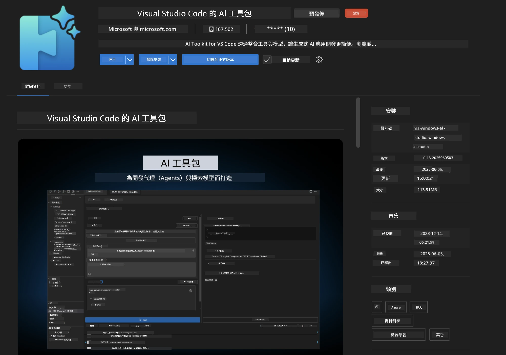
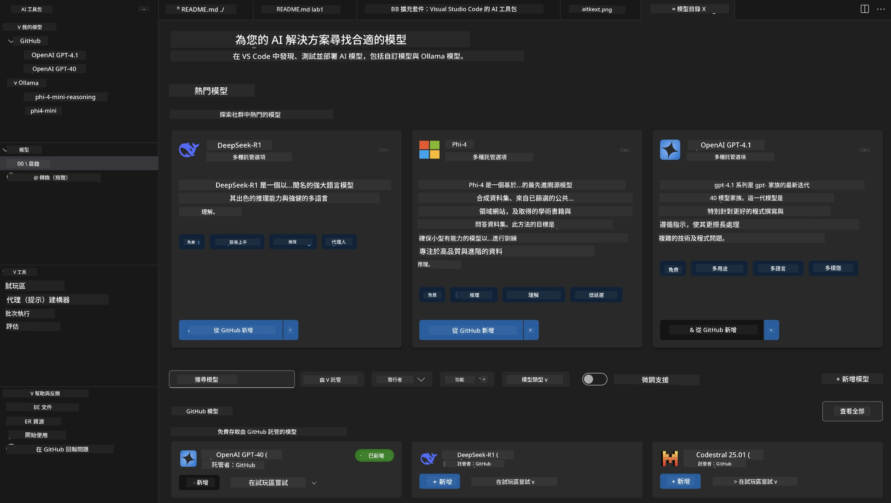
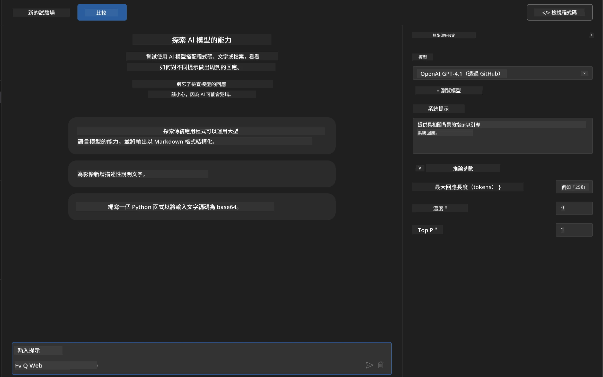
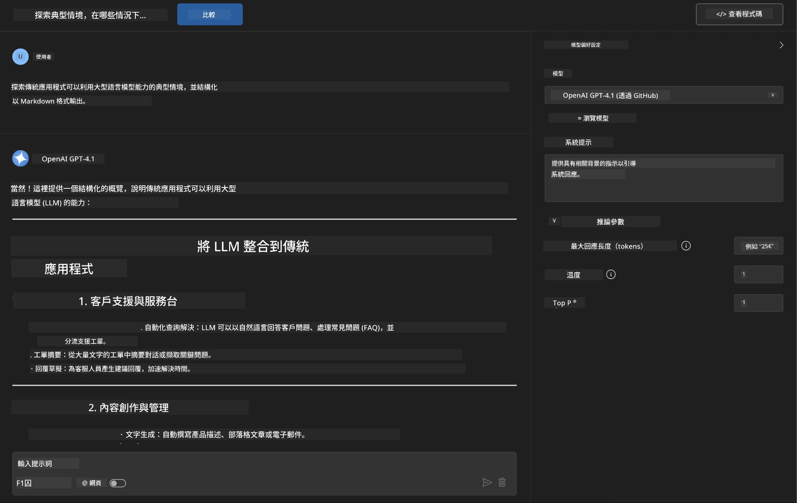
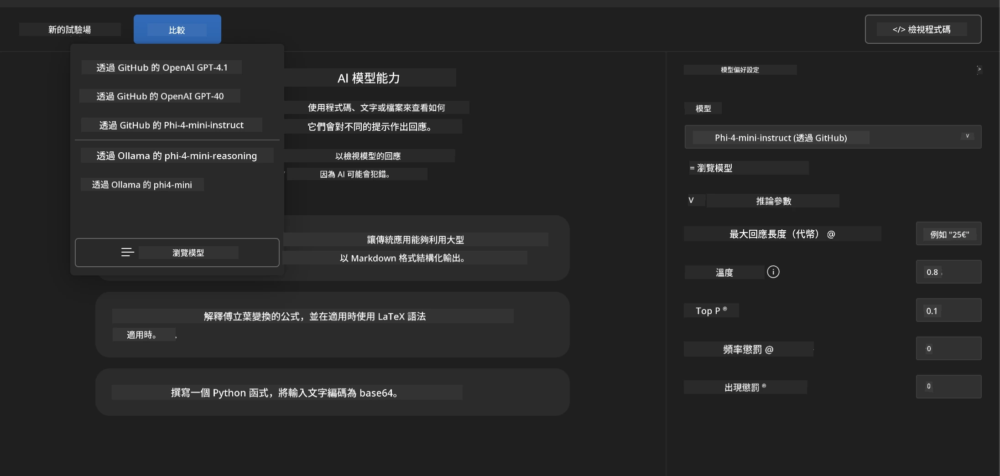
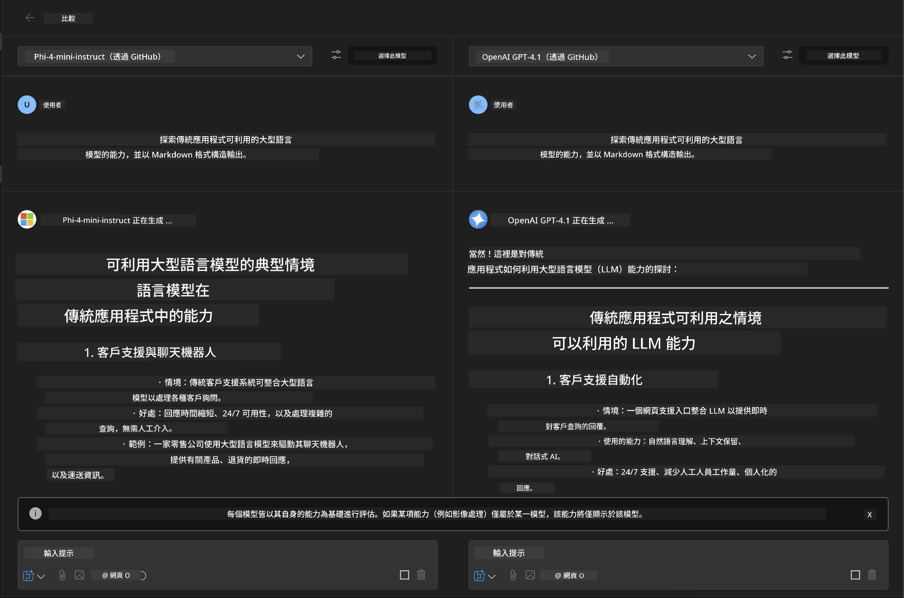
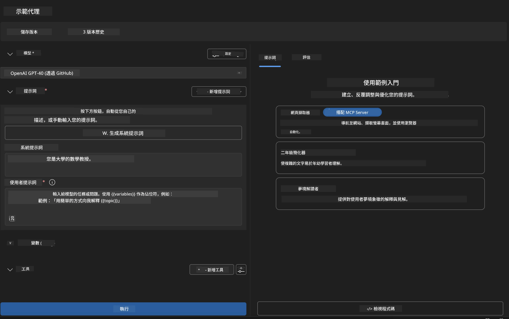
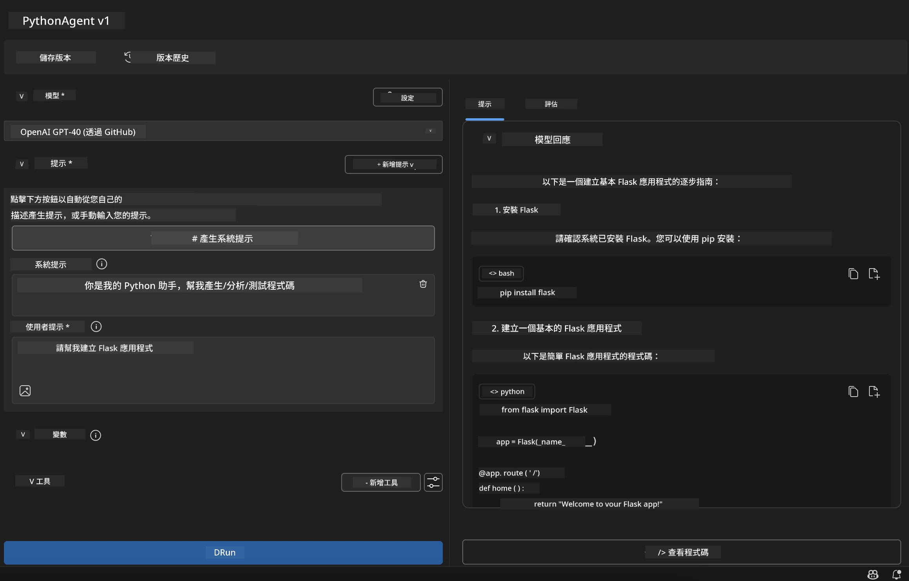

# 🚀 模組 1：Microsoft Foundry Toolkit 基礎

[]()
[]()
[]()

## 📋 學習目標

完成本模組後，您將能夠：
- ✅ 安裝並設定 Microsoft Foundry Toolkit 擴充套件於 VS Code
- ✅ 瀏覽模型目錄並了解不同的模型來源
- ✅ 使用 Playground 進行模型測試與實驗
- ✅ 使用 Agent Builder 創建自訂 AI 代理
- ✅ 比較不同供應商的模型效能
- ✅ 應用提示工程的最佳實務

## 🧠 Microsoft Foundry Toolkit 介紹

**Microsoft Foundry Toolkit 擴充套件 for VS Code** 是微軟的旗艦擴充套件，將 VS Code 轉變為完整的 AI 開發環境。它橋接 AI 研究與實務應用開發的鴻溝，讓各種技術水平的開發者都能輕鬆使用生成式 AI。

### 🌟 主要功能

| 功能 | 說明 | 使用案例 |
|---------|-------------|----------|
| **🗂️ 模型目錄** | 存取 100+ 來自 GitHub、ONNX、OpenAI、Anthropic、Google 的模型 | 模型探索與選擇 |
| **🔌 BYOM 支援** | 整合您自己的模型（本地或遠端） | 自訂模型部署 |
| **🎮 互動遊樂場** | 具有聊天介面即時測試模型 | 快速原型設計與測試 |
| **📎 多模態支援** | 處理文字、圖片與附件 | 複雜 AI 應用 |
| **⚡ 批次處理** | 同時執行多個提示詞 | 高效測試流程 |
| **📊 模型評估** | 內建指標（F1、相關性、相似度、一致性） | 效能評估 |

### 🎯 為什麼 Microsoft Foundry Toolkit 很重要

- **🚀 加速開發**：從構想到原型僅需幾分鐘
- **🔄 整合工作流程**：單一介面支援多個 AI 供應商
- **🧪 簡易實驗**：無複雜設定即可比較模型
- **📈 生產就緒**：優雅轉換從原型到部署

## 🛠️ 先決條件與設置

### 📦 安裝 Microsoft Foundry Toolkit 擴充套件

**步驟 1：存取擴充套件市集**
1. 開啟 Visual Studio Code
2. 前往擴充套件頁面（`Ctrl+Shift+X` 或 `Cmd+Shift+X`）
3. 搜尋「Microsoft Foundry Toolkit」

**步驟 2：選擇版本**
- **🟢 正式版**：建議用於生產環境
- **🔶 預覽版**：搶先體驗最新功能

**步驟 3：安裝並啟用**



### ✅ 驗證檢查清單
- [ ] VS Code 側邊欄出現 Microsoft Foundry Toolkit 圖示
- [ ] 擴充套件已啟用且處於運行狀態
- [ ] 輸出面板中無安裝錯誤

## 🧪 實作練習 1：探索 GitHub 模型

**🎯 目標**：熟練使用模型目錄並測試您的第一個 AI 模型

### 📊 步驟 1：瀏覽模型目錄

模型目錄是您進入 AI 生態系的入口。它彙整來自多個供應商的模型，便於發現與比較。

**🔍 導覽指南：**

點擊 Microsoft Foundry Toolkit 側邊欄的 **MODELS - Catalog**



**💡 專家秘訣**：尋找具有與您的使用案例相符特定功能的模型（例如，程式碼生成、創意寫作、分析）。

**⚠️ 注意**：GitHub 托管的模型（即 GitHub 模型）免費使用，但請注意請求與令牌的速率限制。如果您要存取非 GitHub 模型（亦即由 Azure AI 或其他端點托管的外部模型），您需要提供相對應的 API 金鑰或驗證資訊。

### 🚀 步驟 2：新增並設定您的第一個模型

**模型選擇策略：**
- **GPT-4.1**：適合複雜推理與分析
- **Phi-4-mini**：輕量且快速回應，適合簡單任務

**🔧 設定流程：**
1. 從目錄選擇 **OpenAI GPT-4.1**
2. 點擊 <strong>加入我的模型</strong>，將模型註冊使用
3. 選擇 **在 Playground 試用**，進入測試環境
4. 等候模型初始化（首次設定可能需要一些時間）



**⚙️ 了解模型參數：**
- **Temperature**：控制創造力（0 = 決定性，1 = 創意）
- **Max Tokens**：最大回應長度
- **Top-p**：核取樣以多樣化回應

### 🎯 步驟 3：掌握 Playground 介面

Playground 是您的 AI 實驗室。以下是最大化其潛力的方法：

**🎨 提示工程最佳實務：**
1. <strong>具體說明</strong>：清楚且詳盡的指示效果更佳
2. <strong>提供背景</strong>：包含相關背景資訊
3. <strong>使用範例</strong>：藉由範例告訴模型您的需求
4. <strong>反覆優化</strong>：根據初始結果逐步調整提示詞

**🧪 測試場景：**
```markdown
# Example 1: Code Generation
"Write a Python function that calculates the factorial of a number using recursion. Include error handling and docstrings."

# Example 2: Creative Writing
"Write a professional email to a client explaining a project delay, maintaining a positive tone while being transparent about challenges."

# Example 3: Data Analysis
"Analyze this sales data and provide insights: [paste your data]. Focus on trends, anomalies, and actionable recommendations."
```



### 🏆 挑戰練習：模型效能比較

**🎯 目標**：使用相同提示詞比較不同模型以理解其優勢

**📋 操作指示：**
1. 新增 **Phi-4-mini** 至工作區
2. 針對 GPT-4.1 與 Phi-4-mini 使用相同提示詞



3. 比較回應質量、速度與準確度
4. 將結果記錄於結果區



**💡 關鍵洞察：**
- 何時使用 LLM vs SLM
- 成本與效能權衡
- 不同模型的專長能力

## 🤖 實作練習 2：使用 Agent Builder 建立自訂代理

**🎯 目標**：打造專門針對特定任務與工作流程的 AI 代理

### 🏗️ 步驟 1：認識 Agent Builder

Agent Builder 是 Microsoft Foundry Toolkit 的核心特色。它讓您能打造結合大型語言模型威力與自訂指令、特定參數以及專業知識的專用 AI 助手。

**🧠 代理架構組件：**
- <strong>核心模型</strong>：基礎大型語言模型（GPT-4、Groks、Phi 等）
- <strong>系統提示</strong>：定義代理人格與行為
- <strong>參數</strong>：優化效能的細部設定
- <strong>工具整合</strong>：連結外部 API 與 MCP 服務
- <strong>記憶</strong>：對話上下文與會話持續性



### ⚙️ 步驟 2：深入代理設定

**🎨 建立有效系統提示：**
```markdown
# Template Structure:
## Role Definition
You are a [specific role] with expertise in [domain].

## Capabilities
- List specific abilities
- Define scope of knowledge
- Clarify limitations

## Behavior Guidelines
- Response style (formal, casual, technical)
- Output format preferences
- Error handling approach

## Examples
Provide 2-3 examples of ideal interactions
```

*當然，您也可使用產生系統提示功能，讓 AI 協助您生成與優化提示詞*

**🔧 參數優化：**
| 參數 | 建議範圍 | 使用案例 |
|-----------|------------------|----------|
| **Temperature** | 0.1-0.3 | 技術性／事實性回應 |
| **Temperature** | 0.7-0.9 | 創意／腦力激盪任務 |
| **Max Tokens** | 500-1000 | 簡潔回應 |
| **Max Tokens** | 2000-4000 | 詳細說明 |

### 🐍 步驟 3：實務練習 - Python 程式設計代理

**🎯 任務**：建立專業的 Python 程式助理

**📋 設定步驟：**

1. <strong>選擇模型</strong>：挑選 **Claude 3.5 Sonnet**（適合程式編寫）

2. <strong>系統提示設計</strong>：
```markdown
# Python Programming Expert Agent

## Role
You are a senior Python developer with 10+ years of experience. You excel at writing clean, efficient, and well-documented Python code.

## Capabilities
- Write production-ready Python code
- Debug complex issues
- Explain code concepts clearly
- Suggest best practices and optimizations
- Provide complete working examples

## Response Format
- Always include docstrings
- Add inline comments for complex logic
- Suggest testing approaches
- Mention relevant libraries when applicable

## Code Quality Standards
- Follow PEP 8 style guidelines
- Use type hints where appropriate
- Handle exceptions gracefully
- Write readable, maintainable code
```

3. <strong>參數設定</strong>：
   - Temperature：0.2（穩定且可靠的程式碼）
   - Max Tokens：2000（詳細解說）
   - Top-p：0.9（創意與穩定的平衡）



### 🧪 步驟 4：測試您的 Python 代理

**測試情境：**
1. <strong>基本功能</strong>：「建立一個尋找質數的函式」
2. <strong>複雜演算法</strong>：「實作二元搜尋樹並包含插入、刪除與搜尋方法」
3. <strong>實務問題</strong>：「建立一個能處理速率限制與重試的網頁爬蟲」
4. <strong>除錯</strong>：「修正以下程式碼 [貼上有錯誤的程式]」

**🏆 成功標準：**
- ✅ 程式碼可正常執行無錯誤
- ✅ 包括適當說明文件
- ✅ 遵循 Python 最佳實踐
- ✅ 提供清晰解釋
- ✅ 建議改進方案

## 🎓 模組 1 總結與後續步驟

### 📊 知識檢核

檢測您是否理解：
- [ ] 能否解釋目錄中不同模型的差異？
- [ ] 是否成功建立並測試自訂代理？
- [ ] 是否了解如何為不同使用情境優化參數？
- [ ] 是否能設計有效的系統提示？

### 📚 延伸資源

- **Microsoft Foundry Toolkit 文件**：[官方 Microsoft 文件](https://github.com/microsoft/vscode-ai-toolkit)
- <strong>提示工程指南</strong>：[最佳實務](https://platform.openai.com/docs/guides/prompt-engineering)
- **Microsoft Foundry Toolkit 中的模型**：[模型開發中](https://github.com/microsoft/vscode-ai-toolkit/blob/main/doc/models.md)

<strong>🎉 恭喜！</strong>您已掌握 Microsoft Foundry Toolkit 的基礎，準備好構建更進階的 AI 應用！

### 🔜 繼續下一模組

準備挑戰更進階功能？繼續前往 **[模組 2：使用 Microsoft Foundry Toolkit 的 MCP 基礎](../lab2/README.md)**，您將學習如何：
- 使用模型上下文協定 (MCP) 連接您的代理到外部工具
- 使用 Playwright 建立瀏覽器自動化代理
- 將 MCP 伺服器整合至您的 Microsoft Foundry Toolkit 代理
- 使用外部資料和能力強化您的代理

---

<!-- CO-OP TRANSLATOR DISCLAIMER START -->
**免責聲明**：
此文件已使用 AI 翻譯服務 [Co-op Translator](https://github.com/Azure/co-op-translator) 進行翻譯。雖然我們努力追求準確性，但請注意自動翻譯可能包含錯誤或不準確之處。原始文件的母語版本應視為權威來源。對於關鍵資訊，建議採用專業人工翻譯。我們不對因使用此翻譯所產生的任何誤解或誤譯承擔責任。
<!-- CO-OP TRANSLATOR DISCLAIMER END -->