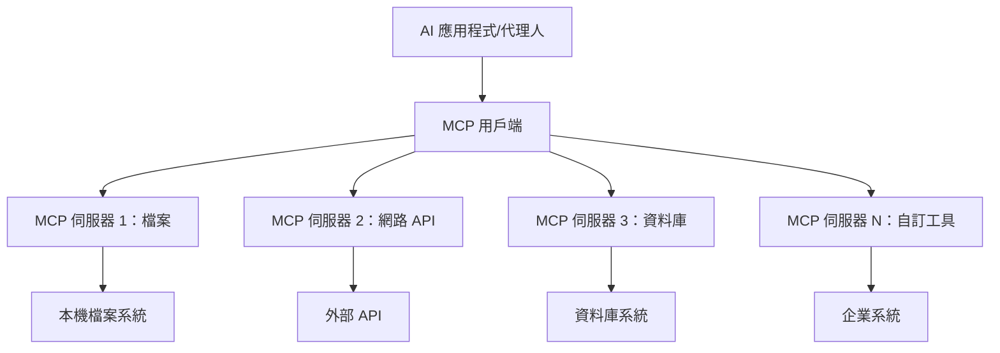
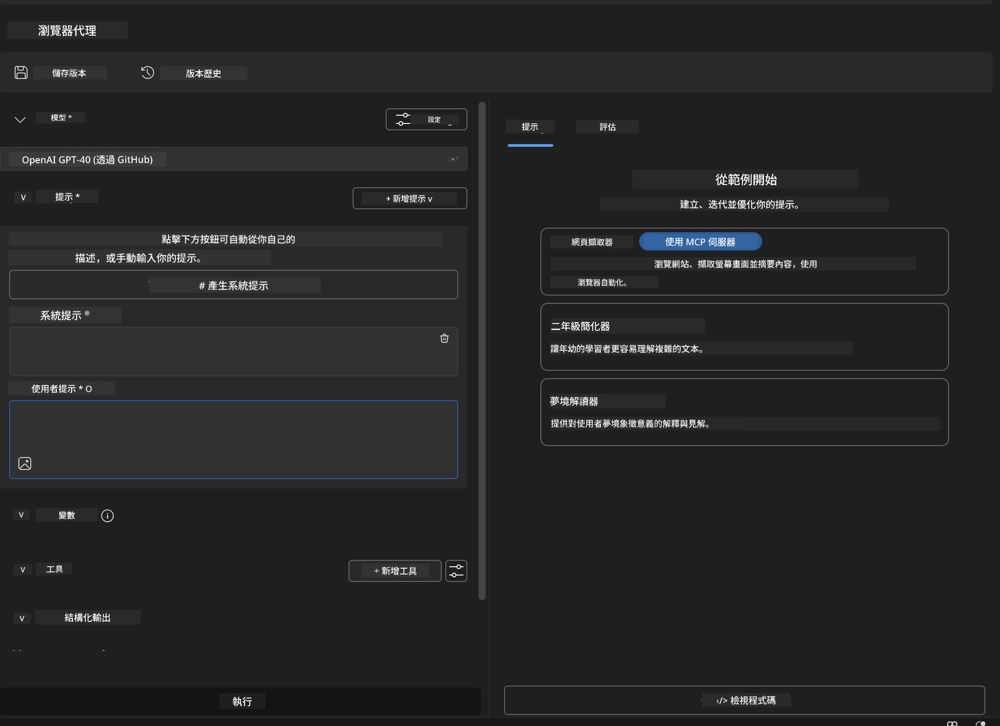
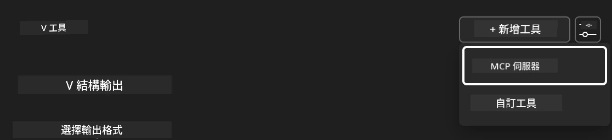
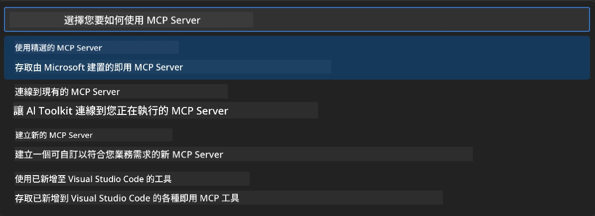
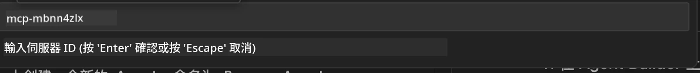
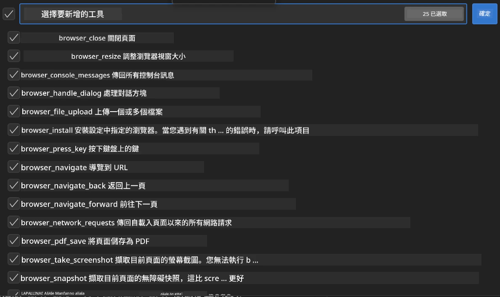
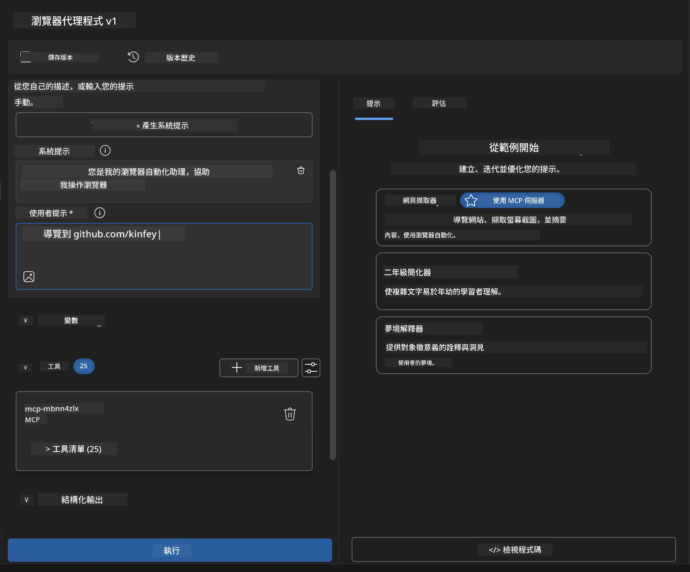
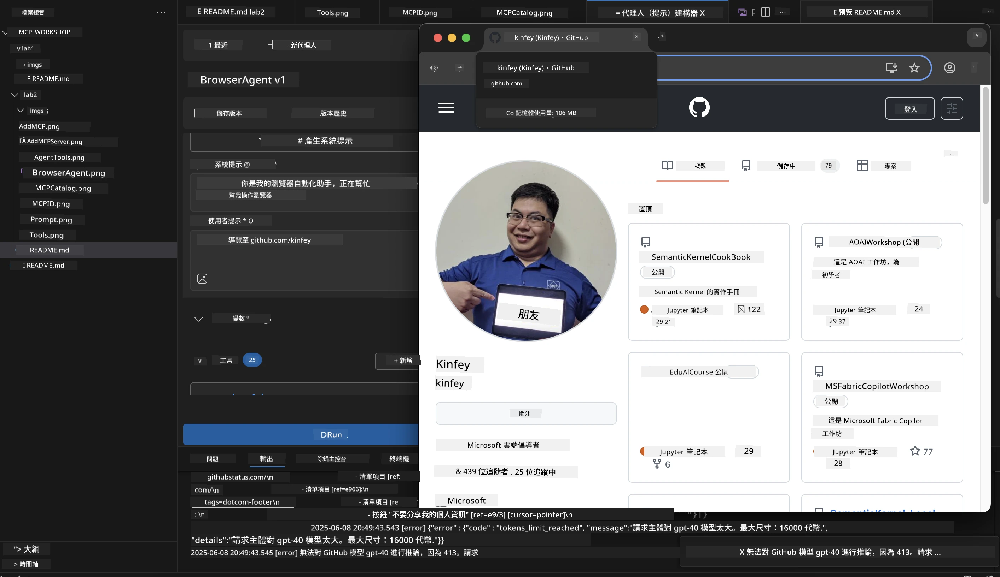
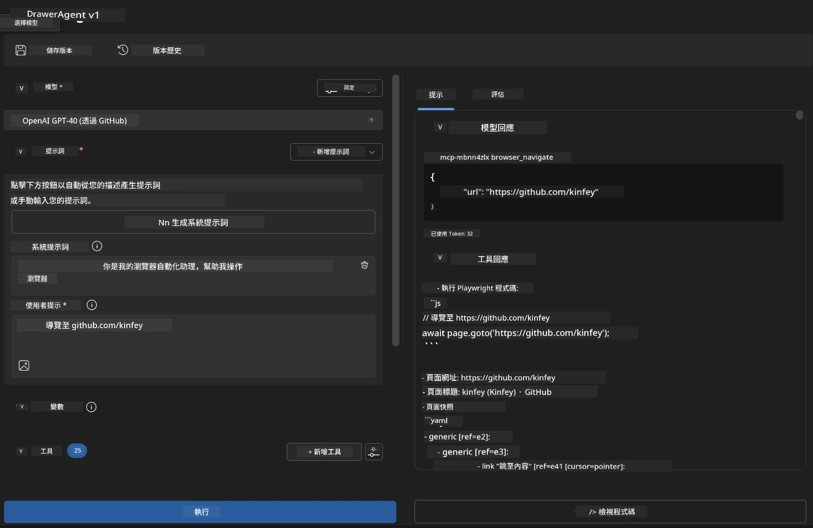
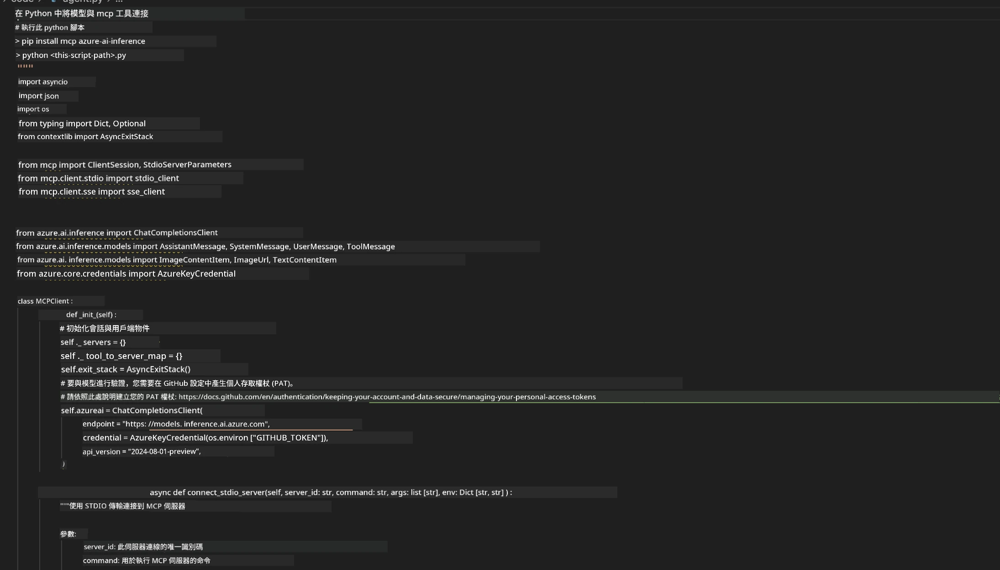

# 🌐 模組 2：使用 Microsoft Foundry Toolkit 的 MCP 基礎知識

[]()
[]()
[]()

## 📋 學習目標

完成本模組後，您將能夠：
- ✅ 了解模型上下文協議（MCP）的架構與優勢
- ✅ 探索 Microsoft 的 MCP 伺服器生態系統
- ✅ 將 MCP 伺服器整合至 Microsoft Foundry Toolkit Agent Builder
- ✅ 使用 Playwright MCP 建立功能完整的瀏覽器自動化代理
- ✅ 在代理中設定和測試 MCP 工具
- ✅ 匯出並部署以 MCP 為核心的代理以投入生產使用

## 🎯 延伸模組 1

在模組 1 中，我們掌握了 Microsoft Foundry Toolkit 的基本知識，並建立了第一個 Python 代理。現在，我們將透過革命性的 **模型上下文協議（MCP）** 來 <strong>強化</strong> 你的代理，連接外部工具和服務。

可以將此視為從簡易計算機升級成完整電腦——讓你的 AI 代理擁有：
- 🌐 瀏覽及互動網站
- 📁 存取及操作檔案
- 🔧 整合企業系統
- 📊 從 API 處理即時資料

## 🧠 了解模型上下文協議（MCP）

### 🔍 什麼是 MCP？

模型上下文協議（MCP）是 AI 應用的 **「USB-C」** — 一個革命性的開放標準，連接大型語言模型（LLM）與外部工具、資料來源和服務。就像 USB-C 消除連接線混亂，提供一個通用連接器，MCP 以統一協議消除 AI 整合的複雜性。

### 🎯 MCP 解決的問題

**MCP 之前：**
- 🔧 每個工具各自客製整合
- 🔄 廠商鎖定，使用專有解決方案  
- 🔒 隨意連接導致安全漏洞
- ⏱️ 基本整合需數月開發

**採用 MCP 後：**
- ⚡ 即插即用的工具整合
- 🔄 廠商中立架構
- 🛡️ 內建安全最佳實踐
- 🚀 新功能加入數分鐘完成

### 🏗️ MCP 架構深度解析

MCP 採用 **客戶端-伺服器架構**，打造安全且可擴充的生態系：



**🔧 核心元件：**

| 元件 | 角色 | 範例 |
|-----------|------|----------|
| **MCP 主機** | 消費 MCP 服務的應用程式 | Claude Desktop、VS Code、Microsoft Foundry Toolkit |
| **MCP 用戶端** | 協議處理器（與伺服器一對一） | 內建於主機應用程式中 |
| **MCP 伺服器** | 以標準協議提供功能 | Playwright、Files、Azure、GitHub |
| <strong>傳輸層</strong> | 通訊方式 | stdio、HTTP、WebSockets |


## 🏢 Microsoft 的 MCP 伺服器生態系

Microsoft 領導 MCP 生態系，提供一整套企業級伺服器以解決實際業務需求。

### 🌟 Microsoft MCP 伺服器特色

#### 1. ☁️ Azure MCP 伺服器
**🔗 倉庫**: [azure/azure-mcp](https://github.com/azure/azure-mcp)
**🎯 目的**: 結合 AI 的全方位 Azure 資源管理

**✨ 主要功能：**
- 宣告式基礎架構佈建
- 即時資源監控
- 成本優化建議
- 安全合規檢查

**🚀 使用案例：**
- AI 輔助基礎架構即代碼
- 自動化資源擴縮
- 雲端成本優化
- DevOps 工作流程自動化

#### 2. 📊 Microsoft Dataverse MCP
**📚 文件**: [Microsoft Dataverse Integration](https://go.microsoft.com/fwlink/?linkid=2320176)
**🎯 目的**: 以自然語言操作業務資料庫

**✨ 主要功能：**
- 自然語言資料庫查詢
- 業務上下文理解
- 自訂提示範本
- 企業資料治理

**🚀 使用案例：**
- 商業智慧報告
- 客戶資料分析
- 銷售管道洞察
- 合規數據查詢

#### 3. 🌐 Playwright MCP 伺服器
**🔗 倉庫**: [microsoft/playwright-mcp](https://github.com/microsoft/playwright-mcp)
**🎯 目的**: 瀏覽器自動化與網頁互動能力

**✨ 主要功能：**
- 跨瀏覽器自動化（Chrome、Firefox、Safari）
- 智能元素偵測
- 螢幕截圖及 PDF 產生
- 網路流量監控

**🚀 使用案例：**
- 自動化測試工作流程
- 網頁爬取與資料萃取
- UI/UX 監控
- 競爭分析自動化

#### 4. 📁 Files MCP 伺服器
**🔗 倉庫**: [microsoft/files-mcp-server](https://github.com/microsoft/files-mcp-server)
**🎯 目的**: 智慧型檔案系統操作

**✨ 主要功能：**
- 宣告式檔案管理
- 內容同步
- 版本控制整合
- 元資料擷取

**🚀 使用案例：**
- 文件管理
- 程式碼倉庫組織
- 內容發佈工作流程
- 資料管線檔案處理

#### 5. 📝 MarkItDown MCP 伺服器
**🔗 倉庫**: [microsoft/markitdown](https://github.com/microsoft/markitdown)
**🎯 目的**: 進階 Markdown 處理及操作

**✨ 主要功能：**
- 豐富的 Markdown 解析
- 格式轉換（MD ↔ HTML ↔ PDF）
- 內容結構分析
- 範本處理

**🚀 使用案例：**
- 技術文件工作流程
- 內容管理系統
- 報告產生
- 知識庫自動化

#### 6. 📈 Clarity MCP 伺服器
**📦 套件**: [@microsoft/clarity-mcp-server](https://www.npmjs.com/package/@microsoft/clarity-mcp-server)
**🎯 目的**: 網站分析及使用者行為洞察

**✨ 主要功能：**
- 熱點圖數據分析
- 使用者會話錄製
- 效能指標
- 轉換漏斗分析

**🚀 使用案例：**
- 網站優化
- 使用者體驗研究
- A/B 測試分析
- 商業智慧儀表板

### 🌍 社群生態系

除了 Microsoft 的伺服器，MCP 生態系還包括：
- **🐙 GitHub MCP**：倉庫管理與程式碼分析
- **🗄️ 資料庫 MCP**：PostgreSQL、MySQL、MongoDB 整合
- **☁️ 雲端服務 MCP**：AWS、GCP、Digital Ocean 工具
- **📧 通訊 MCP**：Slack、Teams、電子郵件整合

## 🛠️ 實作實驗室：製作瀏覽器自動化代理

**🎯 專案目標**：建立一個使用 Playwright MCP 伺服器的智慧型瀏覽器自動化代理，能導航網站、萃取資訊並執行複雜網頁互動。

### 🚀 階段 1：代理基礎設定

#### 步驟 1：初始化代理
1. **打開 Microsoft Foundry Toolkit Agent Builder**
2. <strong>建立新代理</strong>，配置如下：
   - <strong>名稱</strong>：`BrowserAgent`
   - <strong>模型</strong>：選擇 GPT-4o 




### 🔧 階段 2：MCP 整合流程

#### 步驟 3：新增 MCP 伺服器整合
1. **前往 Agent Builder 的工具區**
2. **點擊「Add Tool」** 開啟整合選單
3. **選擇「MCP Server」** 可用選項



**🔍 理解工具種類：**
- <strong>內建工具</strong>：預先設定的 Microsoft Foundry Toolkit 功能
- **MCP 伺服器**：外部服務整合
- **自訂 API**：您自己的服務端點
- <strong>函式呼叫</strong>：直接使用模型函式

#### 步驟 4：選擇 MCP 伺服器
1. **選擇「MCP Server」** 選項繼續


2. **瀏覽 MCP 目錄** 探索可用整合



### 🎮 階段 3：Playwright MCP 設定

#### 步驟 5：選擇並設定 Playwright
1. **點擊「Use Featured MCP Servers」** 存取 Microsoft 驗證的伺服器
2. **從特色清單中選擇「Playwright」**
3. **接受預設 MCP ID** 或依環境自訂



#### 步驟 6：啟用 Playwright 功能
**🔑 關鍵步驟**：選取所有可用的 Playwright 方法以獲得最大功能



**🛠️ 必要的 Playwright 工具：**
- <strong>導航</strong>：`goto`、`goBack`、`goForward`、`reload`
- <strong>互動</strong>：`click`、`fill`、`press`、`hover`、`drag`
- <strong>提取</strong>：`textContent`、`innerHTML`、`getAttribute`
- <strong>驗證</strong>：`isVisible`、`isEnabled`、`waitForSelector`
- <strong>截取</strong>：`screenshot`、`pdf`、`video`
- <strong>網路</strong>：`setExtraHTTPHeaders`、`route`、`waitForResponse`

#### 步驟 7：驗證整合成功
**✅ 成功指標：**
- 所有工具於 Agent Builder 介面顯示
- 整合面板無錯誤訊息
- Playwright 伺服器狀態顯示「Connected」


**🔧 常見問題排除：**
- <strong>連線失敗</strong>：檢查網路連線及防火牆設定
- <strong>工具缺失</strong>：確保設置時已選擇所有功能
- <strong>權限錯誤</strong>：確認 VS Code 有必要的系統權限

### 🎯 階段 4：進階提示工程

#### 步驟 8：設計智慧系統提示
建立能充分運用 Playwright 功能的複雜提示：

```markdown
# Web Automation Expert System Prompt

## Core Identity
You are an advanced web automation specialist with deep expertise in browser automation, web scraping, and user experience analysis. You have access to Playwright tools for comprehensive browser control.

## Capabilities & Approach
### Navigation Strategy
- Always start with screenshots to understand page layout
- Use semantic selectors (text content, labels) when possible
- Implement wait strategies for dynamic content
- Handle single-page applications (SPAs) effectively

### Error Handling
- Retry failed operations with exponential backoff
- Provide clear error descriptions and solutions
- Suggest alternative approaches when primary methods fail
- Always capture diagnostic screenshots on errors

### Data Extraction
- Extract structured data in JSON format when possible
- Provide confidence scores for extracted information
- Validate data completeness and accuracy
- Handle pagination and infinite scroll scenarios

### Reporting
- Include step-by-step execution logs
- Provide before/after screenshots for verification
- Suggest optimizations and alternative approaches
- Document any limitations or edge cases encountered

## Ethical Guidelines
- Respect robots.txt and rate limiting
- Avoid overloading target servers
- Only extract publicly available information
- Follow website terms of service
```

#### 步驟 9：建立動態用戶提示
設計展示各種功能的提示語：

**🌐 網頁分析範例：**
```markdown
Navigate to github.com/kinfey and provide a comprehensive analysis including:
1. Repository structure and organization
2. Recent activity and contribution patterns  
3. Documentation quality assessment
4. Technology stack identification
5. Community engagement metrics
6. Notable projects and their purposes

Include screenshots at key steps and provide actionable insights.
```



### 🚀 階段 5：執行與測試

#### 步驟 10：執行第一個自動化操作
1. **點擊「Run」** 啟動自動化序列
2. **監控即時執行：**
   - Chrome 瀏覽器自動啟動
   - 代理瀏覽目標網站
   - 每步驟截圖
   - 分析結果即時串流



#### 步驟 11：分析結果與洞察
在 Agent Builder 介面檢視完整報告：



### 🌟 階段 6：進階功能與部署

#### 步驟 12：匯出與生產部署
Agent Builder 支援多種部署方式：



## 🎓 模組 2 總結與後續步驟

### 🏆 成就解鎖：MCP 整合高手

**✅ 精通技能：**
- [ ] 了解 MCP 架構與優勢
- [ ] 掌握 Microsoft MCP 伺服器生態系
- [ ] 整合 Playwright MCP 與 Microsoft Foundry Toolkit
- [ ] 建構高級瀏覽器自動化代理
- [ ] 進階網頁自動化提示工程

### 📚 其他資源

- **🔗 MCP 規範**：[官方協議文件](https://modelcontextprotocol.io/)
- **🛠️ Playwright API**：[完整方法參考](https://playwright.dev/docs/api/class-playwright)
- **🏢 Microsoft MCP 伺服器**：[企業整合指南](https://github.com/microsoft/mcp-servers)
- **🌍 社群示例**：[MCP 伺服器畫廊](https://github.com/modelcontextprotocol/servers)

**🎉 恭喜！** 您已成功掌握 MCP 整合，現在可以構建具備外部工具能力的生產級 AI 代理！


### 🔜 繼續至下一模組

準備將 MCP 技能提升至新境界？請前往 **[模組 3：進階 MCP 開發與 Microsoft Foundry Toolkit](../lab3/README.md)**，您將學習如何：
- 建立自訂 MCP 伺服器
- 設定並使用最新 MCP Python SDK
- 安裝 MCP Inspector 進行除錯
- 精通進階 MCP 伺服器開發工作流程
- 從零打造氣象 MCP 伺服器

---

<!-- CO-OP TRANSLATOR DISCLAIMER START -->
**免責聲明**：
此文件已使用 AI 翻譯服務 [Co-op Translator](https://github.com/Azure/co-op-translator) 進行翻譯。雖然我們努力追求準確性，但請注意自動翻譯可能包含錯誤或不準確之處。原始文件的母語版本應視為權威來源。對於關鍵資訊，建議採用專業人工翻譯。我們不對因使用此翻譯所產生的任何誤解或誤譯承擔責任。
<!-- CO-OP TRANSLATOR DISCLAIMER END -->