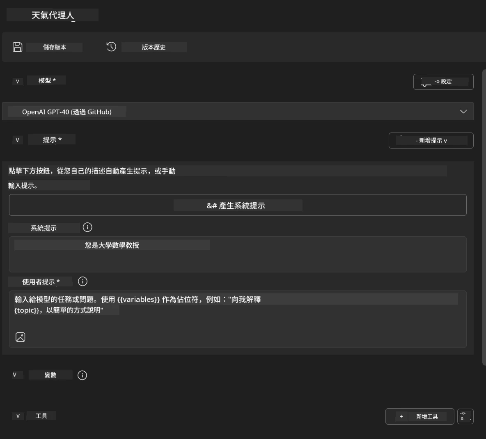
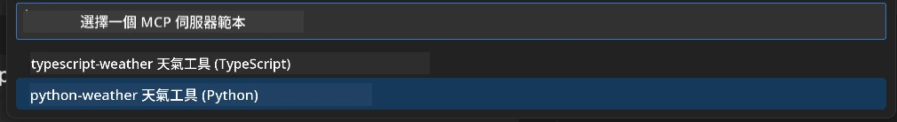
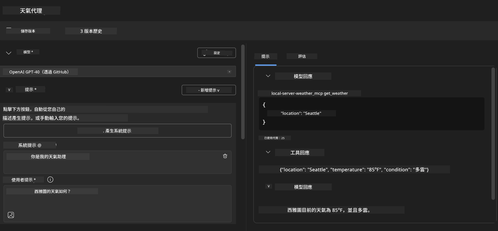
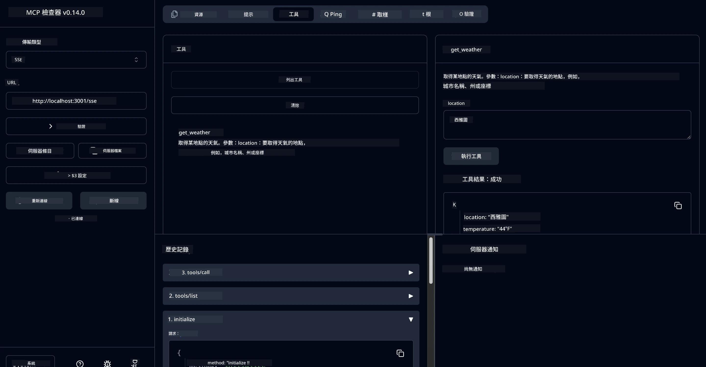

# 🔧 模組 3：使用 Microsoft Foundry Toolkit 進階 MCP 開發


## 🎯 學習目標

完成此實驗後，您將能夠：

- ✅ 使用 Microsoft Foundry Toolkit 創建自訂 MCP 伺服器
- ✅ 配置並使用最新的 MCP Python SDK（v1.9.3）
- ✅ 設定並使用 MCP Inspector 進行除錯
- ✅ 在 Agent Builder 與 Inspector 環境中除錯 MCP 伺服器
- ✅ 了解進階 MCP 伺服器開發工作流程

## 📋 先決條件

- 完成實驗 2（MCP 基礎）
- VS Code 並安裝 Microsoft Foundry Toolkit 擴充套件
- Python 3.10+ 環境
- 用於 Inspector 設定的 Node.js 與 npm

## 🏗️ 您將建置的內容

在本實驗中，您將建立一個 **Weather MCP Server** 示範：

- 自訂 MCP 伺服器實作
- 整合 Microsoft Foundry Toolkit Agent Builder
- 專業除錯工作流程
- 現代 MCP SDK 使用範例

---

## 🔧 核心元件概述

### 🐍 MCP Python SDK
Model Context Protocol Python SDK 提供建立自訂 MCP 伺服器的基礎。您將使用具強化除錯功能的 1.9.3 版本。

### 🔍 MCP Inspector
一款功能強大的除錯工具，提供：

- 即時伺服器監控
- 工具執行視覺化
- 網路請求/回應檢視
- 互動測試環境

---

## 📖 逐步實作

### 步驟 1：在 Agent Builder 中建立 WeatherAgent

1. **透過 Microsoft Foundry Toolkit 擴充套件在 VS Code 中啟動 Agent Builder**
2. **建立一個新代理，設定如下：**
   - 代理名稱：`WeatherAgent`



### 步驟 2：初始化 MCP 伺服器專案

1. **在 Agent Builder 中導覽至工具 → 新增工具**
2. **從可用選項中選擇「MCP Server」**
3. **選擇「建立新 MCP Server」**
4. **選擇 `python-weather` 範本**
5. **命名您的伺服器：** `weather_mcp`



### 步驟 3：開啟並檢視專案

1. **在 VS Code 中開啟產生的專案**
2. **檢查專案結構：**
   ```
   weather_mcp/
   ├── src/
   │   ├── __init__.py
   │   └── server.py
   ├── inspector/
   │   ├── package.json
   │   └── package-lock.json
   ├── .vscode/
   │   ├── launch.json
   │   └── tasks.json
   ├── pyproject.toml
   └── README.md
   ```

### 步驟 4：升級到最新 MCP SDK

> **🔍 為何升級？** 我們想使用最新 MCP SDK（v1.9.3）及 Inspector 服務（0.14.0）， 以獲得強化功能與更佳的除錯能力。

#### 4a. 更新 Python 相依套件

**編輯 `pyproject.toml`：** 更新 [./code/weather_mcp/pyproject.toml](../../../../10-StreamliningAIWorkflowsBuildingAnMCPServerWithAIToolkit/lab3/code/weather_mcp/pyproject.toml)


#### 4b. 更新 Inspector 設定

**編輯 `inspector/package.json`：** 更新 [./code/weather_mcp/inspector/package.json](../../../../10-StreamliningAIWorkflowsBuildingAnMCPServerWithAIToolkit/lab3/code/weather_mcp/inspector/package.json)

#### 4c. 更新 Inspector 相依套件

**編輯 `inspector/package-lock.json`：** 更新 [./code/weather_mcp/inspector/package-lock.json](../../../../10-StreamliningAIWorkflowsBuildingAnMCPServerWithAIToolkit/lab3/code/weather_mcp/inspector/package-lock.json)

> **📝 注意：** 此檔包含大量相依定義，以下為主要架構 - 完整內容確保相依正確解析。

> **⚡ 完整的相依鎖定檔：** 完整 package-lock.json 有約 3000 行相依定義。上述展示了關鍵結構 - 請使用提供的檔案以確保完整正確。

### 步驟 5：配置 VS Code 除錯

*注意：請複製指定路徑的檔案以覆蓋本機對應檔。*

#### 5a. 更新啟動設定

**編輯 `.vscode/launch.json`：**

```json
{
  "version": "0.2.0",
  "configurations": [
    {
      "name": "Attach to Local MCP",
      "type": "debugpy",
      "request": "attach",
      "connect": {
        "host": "localhost",
        "port": 5678
      },
      "presentation": {
        "hidden": true
      },
      "internalConsoleOptions": "neverOpen",
      "postDebugTask": "Terminate All Tasks"
    },
    {
      "name": "Launch Inspector (Edge)",
      "type": "msedge",
      "request": "launch",
      "url": "http://localhost:6274?timeout=60000&serverUrl=http://localhost:3001/sse#tools",
      "cascadeTerminateToConfigurations": [
        "Attach to Local MCP"
      ],
      "presentation": {
        "hidden": true
      },
      "internalConsoleOptions": "neverOpen"
    },
    {
      "name": "Launch Inspector (Chrome)",
      "type": "chrome",
      "request": "launch",
      "url": "http://localhost:6274?timeout=60000&serverUrl=http://localhost:3001/sse#tools",
      "cascadeTerminateToConfigurations": [
        "Attach to Local MCP"
      ],
      "presentation": {
        "hidden": true
      },
      "internalConsoleOptions": "neverOpen"
    }
  ],
  "compounds": [
    {
      "name": "Debug in Agent Builder",
      "configurations": [
        "Attach to Local MCP"
      ],
      "preLaunchTask": "Open Agent Builder",
    },
    {
      "name": "Debug in Inspector (Edge)",
      "configurations": [
        "Launch Inspector (Edge)",
        "Attach to Local MCP"
      ],
      "preLaunchTask": "Start MCP Inspector",
      "stopAll": true
    },
    {
      "name": "Debug in Inspector (Chrome)",
      "configurations": [
        "Launch Inspector (Chrome)",
        "Attach to Local MCP"
      ],
      "preLaunchTask": "Start MCP Inspector",
      "stopAll": true
    }
  ]
}
```

**編輯 `.vscode/tasks.json`：**

```
{
  "version": "2.0.0",
  "tasks": [
    {
      "label": "Start MCP Server",
      "type": "shell",
      "command": "python -m debugpy --listen 127.0.0.1:5678 src/__init__.py sse",
      "isBackground": true,
      "options": {
        "cwd": "${workspaceFolder}",
        "env": {
          "PORT": "3001"
        }
      },
      "problemMatcher": {
        "pattern": [
          {
            "regexp": "^.*$",
            "file": 0,
            "location": 1,
            "message": 2
          }
        ],
        "background": {
          "activeOnStart": true,
          "beginsPattern": ".*",
          "endsPattern": "Application startup complete|running"
        }
      }
    },
    {
      "label": "Start MCP Inspector",
      "type": "shell",
      "command": "npm run dev:inspector",
      "isBackground": true,
      "options": {
        "cwd": "${workspaceFolder}/inspector",
        "env": {
          "CLIENT_PORT": "6274",
          "SERVER_PORT": "6277",
        }
      },
      "problemMatcher": {
        "pattern": [
          {
            "regexp": "^.*$",
            "file": 0,
            "location": 1,
            "message": 2
          }
        ],
        "background": {
          "activeOnStart": true,
          "beginsPattern": "Starting MCP inspector",
          "endsPattern": "Proxy server listening on port"
        }
      },
      "dependsOn": [
        "Start MCP Server"
      ]
    },
    {
      "label": "Open Agent Builder",
      "type": "shell",
      "command": "echo ${input:openAgentBuilder}",
      "presentation": {
        "reveal": "never"
      },
      "dependsOn": [
        "Start MCP Server"
      ],
    },
    {
      "label": "Terminate All Tasks",
      "command": "echo ${input:terminate}",
      "type": "shell",
      "problemMatcher": []
    }
  ],
  "inputs": [
    {
      "id": "openAgentBuilder",
      "type": "command",
      "command": "ai-mlstudio.agentBuilder",
      "args": {
        "initialMCPs": [ "local-server-weather_mcp" ],
        "triggeredFrom": "vsc-tasks"
      }
    },
    {
      "id": "terminate",
      "type": "command",
      "command": "workbench.action.tasks.terminate",
      "args": "terminateAll"
    }
  ]
}
```


---

## 🚀 執行並測試您的 MCP 伺服器

### 步驟 6：安裝相依套件

完成設定變更後，執行下列指令：

**安裝 Python 相依套件：**
```bash
uv sync
```

**安裝 Inspector 相依套件：**
```bash
cd inspector
npm install
```

### 步驟 7：使用 Agent Builder 除錯

1. **按下 F5** 或使用 **「在 Agent Builder 中除錯」** 設定
2. <strong>從除錯面板選擇複合配置</strong>
3. **等待伺服器啟動及 Agent Builder 開啟**
4. **使用自然語言查詢測試您的 weather MCP 伺服器**

輸入提示如下

SYSTEM_PROMPT

```
You are my weather assistant
```

USER_PROMPT

```
How's the weather like in Seattle
```



### 步驟 8：使用 MCP Inspector 除錯

1. **使用「在 Inspector 中除錯」配置（Edge 或 Chrome）**
2. **開啟 Inspector 介面：`http://localhost:6274`**
3. **探索互動式測試環境：**
   - 查看可用工具
   - 測試工具執行
   - 監控網路請求
   - 除錯伺服器回應



---

## 🎯 主要學習成果

完成此實驗，您已：

- [x] **使用 Microsoft Foundry Toolkit 範本建立自訂 MCP 伺服器**
- [x] **升級至最新 MCP SDK**（v1.9.3）以增強功能
- [x] **為 Agent Builder 和 Inspector 配置專業除錯工作流程**
- [x] **設定 MCP Inspector** 進行互動式伺服器測試
- [x] **掌握 VS Code MCP 開發除錯配置**

## 🔧 探索的進階功能

| 功能 | 描述 | 使用案例 |
|---------|-------------|----------|
| **MCP Python SDK v1.9.3** | 最新協定實作 | 現代伺服器開發 |
| **MCP Inspector 0.14.0** | 互動式除錯工具 | 即時伺服器測試 |
| **VS Code 除錯** | 一體化開發環境 | 專業除錯工作流程 |
| **Agent Builder 整合** | 直接 Microsoft Foundry Toolkit 連結 | 端對端代理測試 |

## 📚 其他資源

- [MCP Python SDK 文件](https://modelcontextprotocol.io/docs/sdk/python)
- [Microsoft Foundry Toolkit 擴充套件指南](https://code.visualstudio.com/docs/ai/ai-toolkit)
- [VS Code 除錯文件](https://code.visualstudio.com/docs/editor/debugging)
- [Model Context Protocol 規格](https://modelcontextprotocol.io/docs/concepts/architecture)

---

**🎉 恭喜！** 您已成功完成實驗 3，現在能透過專業開發工作流程，建立、除錯並部署自訂 MCP 伺服器。

### 🔜 繼續下一模組

準備將您的 MCP 技能套用到真實開發工作流程了嗎？繼續至 **[模組 4：實務 MCP 開發 - 自訂 GitHub 克隆伺服器](../lab4/README.md)**，您將：

- 建置生產等級 MCP 伺服器，自動化 GitHub 儲存庫操作
- 實作 MCP 的 GitHub 儲存庫克隆功能
- 將自訂 MCP 伺服器與 VS Code 及 GitHub Copilot 代理模式整合
- 在生產環境中測試與部署自訂 MCP 伺服器
- 學習實務工作流程自動化技巧

---

<!-- CO-OP TRANSLATOR DISCLAIMER START -->
**免責聲明**：
此文件已使用 AI 翻譯服務 [Co-op Translator](https://github.com/Azure/co-op-translator) 進行翻譯。雖然我們努力追求準確性，但請注意自動翻譯可能包含錯誤或不準確之處。原始文件的母語版本應視為權威來源。對於關鍵資訊，建議採用專業人工翻譯。我們不對因使用此翻譯所產生的任何誤解或誤譯承擔責任。
<!-- CO-OP TRANSLATOR DISCLAIMER END -->