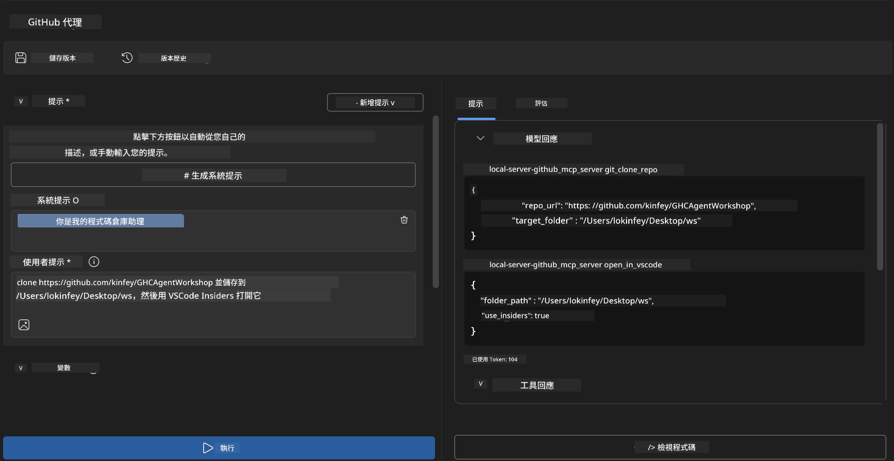
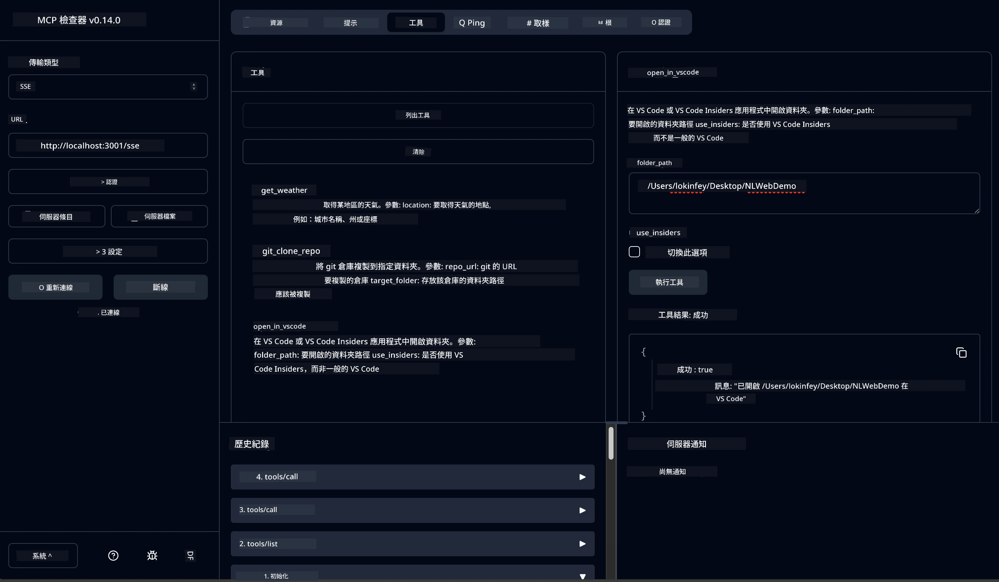

# 🐙 模組 4：實戰 MCP 開發 - 自訂 GitHub 複製伺服器


> **⚡ 快速開始：** 打造一個生產就緒的 MCP 伺服器，自動化 GitHub 倉庫複製與 VS Code 整合，只需 30 分鐘！

## 🎯 學習目標

完成本實作後，您將能夠：

- ✅ 建立用於現實開發工作流程的自訂 MCP 伺服器
- ✅ 實作透過 MCP 的 GitHub 倉庫複製功能
- ✅ 將自訂 MCP 伺服器與 VS Code 及 Agent Builder 整合
- ✅ 使用 GitHub Copilot Agent 模式搭配自訂 MCP 工具
- ✅ 在生產環境中測試與部署自訂 MCP 伺服器

## 📋 前置條件

- 完成實驗室 1-3（MCP 基礎與進階開發）
- GitHub Copilot 訂閱（[有免費註冊](https://github.com/github-copilot/signup)）
- 安裝含 Microsoft Foundry Toolkit 及 GitHub Copilot 擴充功能的 VS Code
- 安裝並配置 Git CLI

## 🏗️ 專案概述

### <strong>現實開發挑戰</strong>
開發者經常使用 GitHub 複製倉庫並在 VS Code 或 VS Code Insiders 中開啟。這是一個手動流程，包括：
1. 開啟終端機/命令提示字元
2. 切換至目標目錄
3. 執行 `git clone` 指令
4. 在複製的目錄中開啟 VS Code

**我們的 MCP 解決方案將這一切簡化為一條智慧指令！**

### <strong>您將打造的內容</strong>
一個 **GitHub Clone MCP 伺服器**（`git_mcp_server`），提供：

| 功能 | 描述 | 益處 |
|---------|-------------|---------|
| 🔄 <strong>智慧型倉庫複製</strong> | 驗證並複製 GitHub 倉庫 | 自動錯誤檢查 |
| 📁 <strong>智能目錄管理</strong> | 安全檢查及建立目錄 | 防止覆寫 |
| 🚀 **跨平台 VS Code 整合** | 在 VS Code/Insiders 開啟專案 | 流暢工作流程切換 |
| 🛡️ <strong>強健的錯誤處理</strong> | 處理網路、權限及路徑問題 | 生產就緒的可靠性 |

---

## 📖 步驟實作指南

### 第 1 步：在 Agent Builder 建立 GitHub 代理

1. 透過 Microsoft Foundry Toolkit 擴充功能 **啟動 Agent Builder**
2. <strong>建立新代理</strong>，配置如下：
   ```
   Agent Name: GitHubAgent
   ```

3. **初始化自訂 MCP 伺服器：**
   - 前往 <strong>工具</strong> → <strong>新增工具</strong> → **MCP 伺服器**
   - 選擇 **「建立新的 MCP 伺服器」**
   - 選擇 **Python 範本** 以獲得最大彈性
   - **伺服器名稱：** `git_mcp_server`

### 第 2 步：配置 GitHub Copilot Agent 模式

1. 在 VS Code 中打開 GitHub Copilot（Ctrl/Cmd + Shift + P → 「GitHub Copilot: Open」）
2. 在 Copilot 介面選擇代理模型
3. 選擇增強推理能力的 Claude 3.7 模型
4. 啟用 MCP 整合以可存取工具

> **💡 專家提示：** Claude 3.7 具有更佳的開發工作流程與錯誤處理理解能力。

### 第 3 步：實作核心 MCP 伺服器功能

**使用以下詳細提示與 GitHub Copilot Agent 模式：**

```
Create two MCP tools with the following comprehensive requirements:

🔧 TOOL A: clone_repository
Requirements:
- Clone any GitHub repository to a specified local folder
- Return the absolute path of the successfully cloned project
- Implement comprehensive validation:
  ✓ Check if target directory already exists (return error if exists)
  ✓ Validate GitHub URL format (https://github.com/user/repo)
  ✓ Verify git command availability (prompt installation if missing)
  ✓ Handle network connectivity issues
  ✓ Provide clear error messages for all failure scenarios

🚀 TOOL B: open_in_vscode
Requirements:
- Open specified folder in VS Code or VS Code Insiders
- Cross-platform compatibility (Windows/Linux/macOS)
- Use direct application launch (not terminal commands)
- Auto-detect available VS Code installations
- Handle cases where VS Code is not installed
- Provide user-friendly error messages

Additional Requirements:
- Follow MCP 1.9.3 best practices
- Include proper type hints and documentation
- Implement logging for debugging purposes
- Add input validation for all parameters
- Include comprehensive error handling
```

### 第 4 步：測試您的 MCP 伺服器

#### 4a. 在 Agent Builder 中測試

1. **啟動 Agent Builder 的調試配置**
2. **以此系統提示設定您的代理：**

```
SYSTEM_PROMPT:
You are my intelligent coding repository assistant. You help developers efficiently clone GitHub repositories and set up their development environment. Always provide clear feedback about operations and handle errors gracefully.
```

3. **使用真實用戶場景進行測試：**

```
USER_PROMPT EXAMPLES:

Scenario : Basic Clone and Open
"Clone {Your GitHub Repo link such as https://github.com/kinfey/GHCAgentWorkshop
 } and save to {The global path you specify}, then open it with VS Code Insiders"
```



**預期結果：**
- ✅ 成功複製並確認路徑
- ✅ 自動啟動 VS Code
- ✅ 不合法場景顯示明確錯誤訊息
- ✅ 適當處理邊緣案例

#### 4b. 在 MCP Inspector 測試




---


**🎉 恭喜！** 您已成功建立一個實用且生產就緒的 MCP 伺服器，解決現實開發工作流程問題。您的自訂 GitHub 複製伺服器展示了 MCP 自動化與增強開發者生產力的強大能力。

### 🏆 解鎖成就：
- ✅ **MCP 開發者** — 建立自訂 MCP 伺服器
- ✅ <strong>工作流程自動化者</strong> — 精簡開發流程  
- ✅ <strong>整合專家</strong> — 連結多種開發工具
- ✅ <strong>生產準備</strong> — 建置可部署解決方案

---

## 🎓 工作坊結業：您的 Model Context Protocol 之旅

**親愛的工作坊參與者，**

恭喜您完成 Model Context Protocol 工作坊所有四個模組！您已從理解 Microsoft Foundry Toolkit 基礎概念，進階到打造能解決現實開發挑戰的生產就緒 MCP 伺服器。

### 🚀 您的學習路徑回顧：

**[模組 1](../lab1/README.md)**：探索 Microsoft Foundry Toolkit 基礎、模型測試與建立您的第一個 AI 代理。

**[模組 2](../lab2/README.md)**：學習 MCP 架構、整合 Playwright MCP，打造您的第一個瀏覽器自動化代理。

**[模組 3](../lab3/README.md)**：進階自訂 MCP 伺服器開發，建立天氣 MCP 伺服器與熟練調試工具。

**[模組 4](../lab4/README.md)**：現在您已運用所學打造實用的 GitHub 倉庫工作流程自動化工具。

### 🌟 您的精通領域：

- ✅ **Microsoft Foundry Toolkit 生態系**：模型、代理與整合模式
- ✅ **MCP 架構**：用戶端-伺服器設計、傳輸協定與安全性
- ✅ <strong>開發者工具</strong>：從 Playground 到 Inspector 及生產部署
- ✅ <strong>自訂開發</strong>：建立、測試與部署您的 MCP 伺服器
- ✅ <strong>實務應用</strong>：以 AI 解決現實工作流程挑戰

### 🔮 您的下一步：

1. **打造您自己的 MCP 伺服器**：應用這些技能自動化您的獨特流程
2. **加入 MCP 社群**：分享您的作品並學習他人
3. <strong>探索進階整合</strong>：連接 MCP 伺服器至企業系統
4. <strong>貢獻開源</strong>：協助提升 MCP 工具與文件

請記住，這僅是開始。Model Context Protocol 生態系快速演進，您已準備好站在 AI 驅動開發工具的最前沿。

**感謝您的參與與學習熱忱！**

希望本工作坊帶給您靈感，改變您建構與互動 AI 工具的開發旅程。

**祝編碼愉快！**

---

## 下一步

恭喜您完成模組 10 所有實驗室！

- 返回： [模組 10 總覽](../README.md)
- 繼續： [模組 11：MCP 伺服器實作實驗室](../../11-MCPServerHandsOnLabs/README.md)

---

<!-- CO-OP TRANSLATOR DISCLAIMER START -->
**免責聲明**：
此文件已使用 AI 翻譯服務 [Co-op Translator](https://github.com/Azure/co-op-translator) 進行翻譯。雖然我們努力追求準確性，但請注意自動翻譯可能包含錯誤或不準確之處。原始文件的母語版本應視為權威來源。對於關鍵資訊，建議採用專業人工翻譯。我們不對因使用此翻譯所產生的任何誤解或誤譯承擔責任。
<!-- CO-OP TRANSLATOR DISCLAIMER END -->