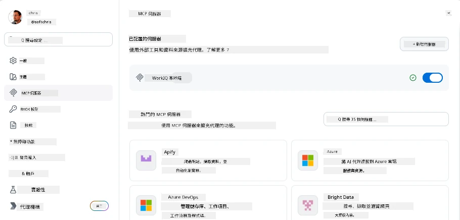
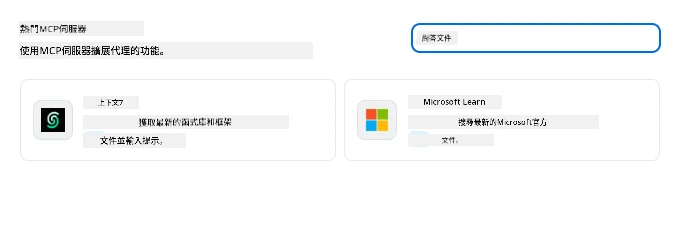
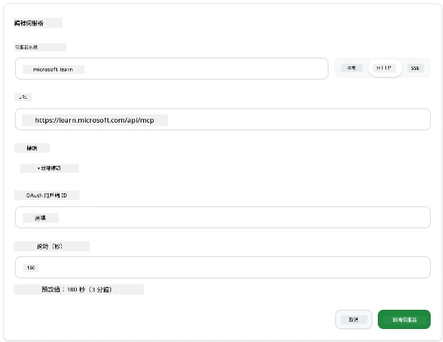
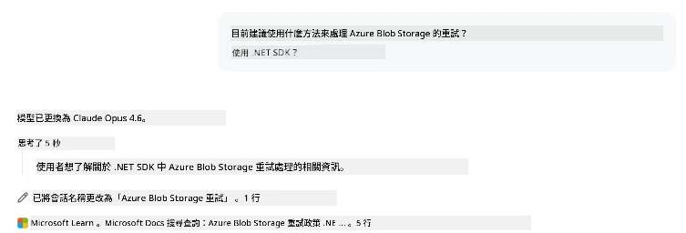
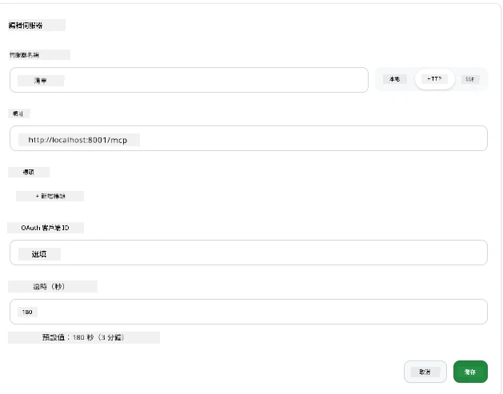
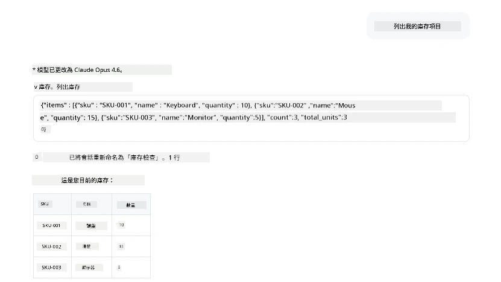
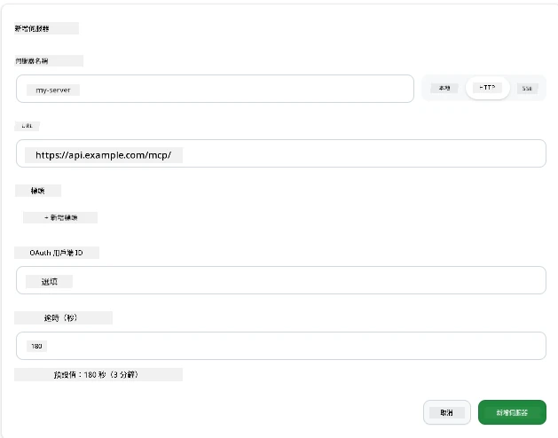
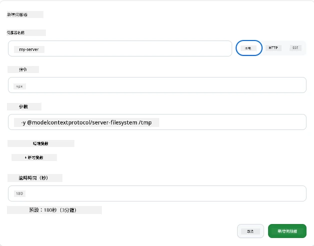

# 在 GitHub Copilot App 中使用 MCP 伺服器

到目前為止，你已經知道 MCP 是如何運作的。你已經建立了伺服器、定義了工具和資源，並連接了用戶端。我們還沒做的是換個角度看：不是你在建立伺服器，而是作為一個 AI 驅動應用的使用者，支援 MCP 的應用程式以消費者的身分會是什麼樣子？

[GitHub Copilot App](https://github.com/github/app) 是一個桌面應用程式，可以使用 MCP 伺服器。透過連接 MCP 伺服器，你解鎖了一個新層次：Copilot 現在可以存取你的文件、呼叫你的內部 API、查詢資料庫，或與你包裝在伺服器中的任何服務對話。該應用成為主機，你的 MCP 伺服器成為它的工具。

本課程將帶你完整體驗這個流程——從找到 MCP 設定面板、連接一個真實的文件伺服器，再到連接你自己客製化的伺服器。

## 學習目標

完成本課程後，你將能：

- 找到並瀏覽 Copilot App 設定中的 MCP 伺服器面板。
- 連接一個託管的文件伺服器並在會話中使用它。
- 註冊一台自訂伺服器，並驗證 Copilot 是否能呼叫它的工具。
- 設定伺服器的呼叫方式，提供環境變數或自訂標頭（如果是 HTTP ）。

## Copilot App 作為 MCP 主機

基本理念如下：<strong>Copilot 的代理人很聰明，但他們只知道你告訴他們的事。</strong>預設情況下，代理人能讀取你的工作區檔案並執行終端機指令，但無法查詢你的資料庫、查看行事曆，或在沒有協助下呼叫自訂 API。這就是 MCP 伺服器的作用。它們充當 Copilot 與你的系統——資料庫、版本控制、API、設計工具——之間的橋樑，讓代理人能取得完成工作的資訊和行動。

讓我們先找到管理此應用 MCP 伺服器的設定。

## 步驟 1：尋找 MCP 設定面板

打開 Copilot App，於左下角找到齒輪圖示並點擊它。


確認選取「MCP Servers」，你應該會看到已設定的伺服器顯示在頂端，下方有熱門伺服器市集，頂端也有一個「Add Server」按鈕，如下圖：



這是你的控制中心。你可在此新增、移除、啟用或停用伺服器。變更會在新的會話中生效；如果你已開啟會話，變更後需重新啟動新會話。

## 步驟 2：連接文件伺服器

我們立即來做點實用的事。Microsoft Docs MCP 伺服器讓 Copilot 可存取官方的 Microsoft 文件，包括 Azure、.NET、TypeScript 等。代理人不再只能依賴訓練資料（有截止日期），而是在查詢時拉取最新文件。

添加方式如下：

1. 在熱門伺服器欄輸入 **learn**，選擇「Microsoft Learn」伺服器。

   

   點擊後，你會看到一個填好名稱、傳輸類型及 URL 的表單，只需點擊「Add Server」。

2. 點「Add Server」，會連接伺服器需耗費幾秒鐘。

   

   加入後，它會顯示在頂端的已設定伺服器區域。接著我們來嘗試看看。

3. 關閉對話框並選擇快速聊天。

4. 輸入以下提示以觸發 Microsoft Learn 伺服器上的工具。

   ```text
   What's the current recommended approach for handling Azure Blob Storage 
   retries using the .NET SDK?
   ```

   

你應該會看到它參考了我們剛加入的 MCP 伺服器。

## 步驟 3：連接自訂 stdio 伺服器

預設伺服器方便使用，但真正的威力是在於連接你自己的伺服器。假設你已建立（或取得）一個伺服器，可公開你的內部 API 或公司知識庫。這裡我們將使用一個負責公司庫存管理的 MCP 伺服器。

1. 點齒輪，選擇「MCP servers」。

2. 點「Add Server」後選擇「+ Add Custom server」，填入以下資料：

   - 名稱：`Inventory Server`
   - 右側選擇傳輸方式，**http**

   點「Add Server」，它會出現在你的已設定伺服器列表中。

   

4. 測試時可輸入如下提示：

    ```
    list inventory
    ```

   

   你應該會看到你的自訂伺服器返回的庫存項目清單。

很好，現在你應該對於在 Copilot App 中加入外部及自訂的 MCP 伺服器有不錯的理解。接下來，讓我們來談談如何處理機密與環境變數。

## 步驟 4：進階設定

到目前為止，你已看到如何在 MCP 伺服器中只提供名稱和 URL。但如果伺服器需要 API 金鑰或其他值呢？依據傳輸類型，我們可以供應所需資訊。

- **http 或 SSE 傳輸**：可設定所需的標頭。

   例如，認證時可以指定 Authorization 標頭。值可以是靜態字串。若使用 OAuth，則可提供 OAuth 用戶端 ID。

   

- **stdio 傳輸**：可設定環境變數。

   可指定任何數量你啟動伺服器時需要傳入的環境變數。

   

## 總結

Copilot App 將 MCP 伺服器視為代理人能力的第一級擴充。你已完整體驗了從加入 MCP 伺服器到在會話中使用它們的流程。你現在可以連接公共伺服器、內部 API 和自訂工具，賦予代理人存取他們執行任務所需資訊與行動的能力，以實現自主工作。

## 📚 其他資源

### 官方文件

- [GitHub Copilot App](https://github.com/github/app)
- [MCP Specification](https://modelcontextprotocol.io/specification/2025-03-26) - Model Context Protocol 規範

### 社群

- [MCP Community Discord](https://discord.com/invite/ByRwuEEgH4) - 即時討論群
- [GitHub Discussions](https://github.com/microsoft/MCP-Server-and-PostgreSQL-Sample-Retail/discussions) - 問答與分享
- [Stack Overflow](https://stackoverflow.com/questions/tagged/model-context-protocol) - 技術問題討論

---

<!-- CO-OP TRANSLATOR DISCLAIMER START -->
**免責聲明**：
此文件已使用 AI 翻譯服務 [Co-op Translator](https://github.com/Azure/co-op-translator) 進行翻譯。雖然我們努力追求準確性，但請注意自動翻譯可能包含錯誤或不準確之處。原始文件的母語版本應視為權威來源。對於關鍵資訊，建議採用專業人工翻譯。我們不對因使用此翻譯所產生的任何誤解或誤譯承擔責任。
<!-- CO-OP TRANSLATOR DISCLAIMER END -->