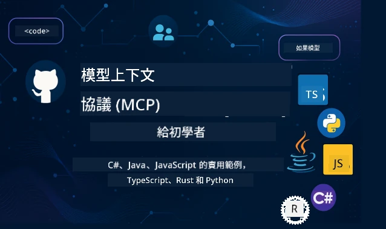

 

[](https://GitHub.com/microsoft/mcp-for-beginners/graphs/contributors)
[](https://GitHub.com/microsoft/mcp-for-beginners/issues)
[](https://GitHub.com/microsoft/mcp-for-beginners/pulls)
[](http://makeapullrequest.com)

[](https://GitHub.com/microsoft/mcp-for-beginners/watchers)
[](https://GitHub.com/microsoft/mcp-for-beginners/fork)
[](https://GitHub.com/microsoft/mcp-for-beginners/stargazers)


[](https://discord.gg/nTYy5BXMWG)

按照以下步驟開始使用這些資源：
1. **Fork 此存放庫**：點擊 [](https://GitHub.com/microsoft/mcp-for-beginners/fork)
2. **Clone 此存放庫**：   `git clone https://github.com/microsoft/mcp-for-beginners.git`
3. <strong>加入</strong> [](https://discord.gg/nTYy5BXMWG)


### 🌐 多語言支援

#### 透過 GitHub Action 支援 (自動且持續更新)

<!-- CO-OP TRANSLATOR LANGUAGES TABLE START -->
[阿拉伯語](../ar/README.md) | [孟加拉語](../bn/README.md) | [保加利亞語](../bg/README.md) | [緬甸語](../my/README.md) | [中文（簡體）](../zh-CN/README.md) | [中文（繁體，香港）](../zh-HK/README.md) | [中文（繁體，澳門）](../zh-MO/README.md) | [中文（繁體，台灣）](./README.md) | [克羅埃西亞語](../hr/README.md) | [捷克語](../cs/README.md) | [丹麥語](../da/README.md) | [荷蘭語](../nl/README.md) | [愛沙尼亞語](../et/README.md) | [芬蘭語](../fi/README.md) | [法語](../fr/README.md) | [德語](../de/README.md) | [希臘語](../el/README.md) | [希伯來語](../he/README.md) | [印地語](../hi/README.md) | [匈牙利語](../hu/README.md) | [印尼語](../id/README.md) | [義大利語](../it/README.md) | [日語](../ja/README.md) | [坎納達語](../kn/README.md) | [高棉語](../km/README.md) | [韓語](../ko/README.md) | [立陶宛語](../lt/README.md) | [馬來語](../ms/README.md) | [馬拉雅拉姆語](../ml/README.md) | [馬拉地語](../mr/README.md) | [尼泊爾語](../ne/README.md) | [奈及利亞皮欽語](../pcm/README.md) | [挪威語](../no/README.md) | [波斯語 (法爾西語)](../fa/README.md) | [波蘭語](../pl/README.md) | [葡萄牙語（巴西）](../pt-BR/README.md) | [葡萄牙語（葡萄牙）](../pt-PT/README.md) | [旁遮普語 (古木基文)](../pa/README.md) | [羅馬尼亞語](../ro/README.md) | [俄語](../ru/README.md) | [塞爾維亞語（西里爾字母）](../sr/README.md) | [斯洛伐克語](../sk/README.md) | [斯洛文尼亞語](../sl/README.md) | [西班牙語](../es/README.md) | [斯瓦希里語](../sw/README.md) | [瑞典語](../sv/README.md) | [他加祿語 (菲律賓語)](../tl/README.md) | [泰米爾語](../ta/README.md) | [泰盧固語](../te/README.md) | [泰語](../th/README.md) | [土耳其語](../tr/README.md) | [烏克蘭語](../uk/README.md) | [烏爾都語](../ur/README.md) | [越南語](../vi/README.md)

> **偏好本地 Clone？**
>
> 此存放庫包含超過 50 種語言的翻譯，會大幅增加下載大小。若想不下載翻譯檔，請使用 sparse checkout：
>
> **Bash / macOS / Linux:**
> ```bash
> git clone --filter=blob:none --sparse https://github.com/microsoft/mcp-for-beginners.git
> cd mcp-for-beginners
> git sparse-checkout set --no-cone '/*' '!translations' '!translated_images'
> ```
>
> **CMD (Windows):**
> ```cmd
> git clone --filter=blob:none --sparse https://github.com/microsoft/mcp-for-beginners.git
> cd mcp-for-beginners
> git sparse-checkout set --no-cone "/*" "!translations" "!translated_images"
> ```
>
> 這樣可以更快速下載，提供你完成課程所需的一切。
<!-- CO-OP TRANSLATOR LANGUAGES TABLE END -->

# 🚀 模型上下文協定（MCP）初學者課程

## **使用 C#、Java、JavaScript、Rust、Python 和 TypeScript 的實作範例學習 MCP**

## 🧠 模型上下文協定課程總覽
歡迎展開你的模型上下文協定旅程！如果你曾好奇 AI 應用如何與不同工具和服務溝通，你即將發現這個優雅的解決方案，它正改變開發者打造智能系統的方式。

把 MCP 想像成 AI 應用的通用翻譯器——就像 USB 埠可以讓你連接任何裝置到你的電腦，MCP 讓 AI 模型能以標準化方式連結任何工具或服務。不論你是在打造第一個聊天機器人，或是處理複雜的 AI 工作流程，理解 MCP 都會賦予你建立更強大、更靈活應用的能力。

此課程精心設計，耐心陪伴你的學習旅程。我們會從你已熟悉的簡單概念開始，透過你喜愛的程式語言，逐步帶領你實作練習。每個步驟都有清楚的說明、實務範例，以及大量鼓勵。

完成這段旅程後，你將有信心建立自己的 MCP 伺服器，整合它們與熱門 AI 平台，並了解這項技術如何改變 AI 開發的未來。讓我們一同開始這場令人興奮的冒險吧！

### 官方文件與規範

本課程依照 **MCP 規範 2025-11-25**（最新穩定版）設計。MCP 規範採用日期版本（YYYY-MM-DD 格式），以確保協議版本清楚可追蹤。

這些資源會隨著你理解力提升越來越有價值，但不用急著立刻閱讀全部。先從你最感興趣的部分開始！
- 📘 [MCP 文件](https://modelcontextprotocol.io/) – 這是你逐步教學和使用指南的首選資源。文件以初學者為出發點，提供清楚的範例，讓你可按自己的節奏跟著學。
- 📜 [MCP 規範](https://modelcontextprotocol.io/specification/2025-11-25) – 將此視為你的完整參考手冊。隨著課程進行，你會經常回來查閱細節，探索進階功能。
- 📜 [MCP 規範版本](https://modelcontextprotocol.io/specification/versioning) – 其中含有協議版本歷史以及 MCP 如何使用日期版本（YYYY-MM-DD 格式）的說明。
- 🧑‍💻 [MCP GitHub 存放庫](https://github.com/modelcontextprotocol) – 裡頭有多種程式語言的 SDK、工具與程式碼範例。像是寶庫，能提供你實務範例與即用元件。
- 🌐 [MCP 社群](https://github.com/orgs/modelcontextprotocol/discussions) – 加入同好和資深開發者的討論。這是個支持性的社群，歡迎提問並自由分享知識。
  
## 學習目標

完成課程後，你會對新技能充滿自信與興奮。以下是你將達成的目標：

• **了解 MCP 基礎**：你將明白模型上下文協定是什麼，並透過類比與範例了解為什麼它正在革新 AI 應用間的溝通方式。

• **建立你的第一個 MCP 伺服器**：你會用偏好的程式語言建立可運作的 MCP 伺服器，從簡單範例開始，逐步提升技術。

• **連結 AI 模型與真實工具**：學會如何串接 AI 模型與實際服務，讓應用具有強大新功能。

• <strong>實作安全防護最佳實務</strong>：理解如何確保 MCP 實作安全，保護你的應用與使用者。

• <strong>自信部署</strong>：了解如何將 MCP 專案從開發階段推向生產環境，並掌握有效的部署策略。

• **加入 MCP 社群**：成為不斷壯大的開發者社群一員，共同打造 AI 應用的未來。

## 基本背景

在深入 MCP 細節前，先確保你對一些基礎概念感到自在。別擔心，就算你不是專家，我們會逐步解釋你需要知道的一切！

### 理解協議（基礎）

把協議想成對話的規則。當你打電話給朋友，雙方都知道要說「你好」開場，輪流說話，結束時說「再見」。電腦程式也需要像這樣的規則，才能有效溝通。

MCP 是一種協議——一組約定好的規則，幫助 AI 模型與應用程式與工具和服務間進行有效「對話」。就如同會話規則使人類交流更順暢，MCP 讓 AI 應用溝通更可靠且強大。

### 客戶端-伺服器關係（程式如何協作）

你每天都使用客戶端-伺服器關係！當你用網頁瀏覽器（客戶端）拜訪網站，是連接到送出頁面內容的網頁伺服器。瀏覽器知道怎麼請求，伺服器知道怎麼回應。

MCP 中也有類似關係：AI 模型擔任客戶端，請求資訊或操作；而 MCP 伺服器提供這些能力。就像有個幫手（伺服器）隨時幫 AI 執行特定任務。

### 為什麼標準化重要（讓一切能一起運作）

想像每家車廠使用不同形狀的加油槍，你就得為每輛車準備不同轉接頭！標準化就是大家同意共用方案，讓東西能無縫銜接。

MCP 提供的是 AI 應用的這種標準化。不是每個 AI 模型都寫特別程式去串接每種工具，MCP 創造出通用溝通方式。如此一來，開發者能一次打造工具，讓各種 AI 系統都能使用。

## 🧭 你的學習路徑概觀

你的 MCP 旅程經過細心設計，逐步建立你的信心和技能。每一階段介紹新概念，同時加深既有知識。

### 🌱 基礎階段：理解基礎（模組 0-2）

冒險從這裡開始！我們利用熟悉的類比和簡單範例介紹 MCP 概念。你會了解 MCP 是什麼、為何存在，以及如何融入 AI 開發的大環境。

• **模組 0 - MCP 簡介**：從探索 MCP 是什麼開始，並說明它為何對現代 AI 應用如此重要。你會看到真實世界中 MCP 的應用範例，了解它解決了開發者遇到的常見問題。

• **模組 1 - 核心概念詳解**：這裡你將學到 MCP 的基本組成。透過許多類比和視覺化範例，確保這些概念自然且容易理解。

• **模組 2 - MCP 中的安全性**：安全聽起來可能令人生畏，但我們會展示 MCP 內建的安全機制，並教你最佳實務，從一開始就保護你的應用。

### 🔨 實作階段：建立你的第一份實作（模組 3）
現在真正的樂趣開始了！您將親自體驗構建實際的 MCP 伺服器和客戶端。別擔心——我們會從簡單開始，並引導您完成每一步驟。

本模組包含多個實作指南，讓您可以使用偏好的程式語言練習。您將建立第一個伺服器、建置客戶端以連接伺服器，甚至整合流行的開發工具如 VS Code。

每個指南都包含完整的程式碼範例、除錯技巧，並解釋我們特定設計選擇的原因。到了這個階段結束時，您將擁有實作良好的 MCP 系統，值得驕傲！

### 🚀 成長階段：進階概念與實務應用（模組 4-5）

掌握基礎後，您準備探索更進階的 MCP 功能。我們將涵蓋實務實作策略、除錯技術及多模態 AI 整合等進階主題。

您也將學習如何將 MCP 實作擴展到生產用途，並整合雲端平台如 Azure。這些模組讓您準備好建立能應對真實需求的 MCP 解決方案。

### 🌟 精通階段：社群與專精（模組 6-11）

最後階段聚焦於加入 MCP 社群以及在您最感興趣的領域專精。您將學習如何貢獻開源 MCP 專案、實作進階身份驗證模式，以及建構包含資料庫整合的完整解決方案。

模組 11 尤為重要——這是一條完整的 13 實驗室實作路徑，教您如何建立具備 PostgreSQL 整合的生產就緒 MCP 伺服器。就像一個結業專案，將您所學全部匯聚！

### 📚 完整課程結構

| 模組 | 主題 | 說明 | 連結 |
|--------|-------|-------------|------|
| **模組 0-3：基礎** | | | |
| 00 | MCP 簡介 | Model Context Protocol 及其在 AI 流程中的重要性概述 | [閱讀更多](./00-Introduction/README.md) |
| 01 | 核心概念說明 | 深入探討 MCP 核心概念 | [閱讀更多](./01-CoreConcepts/README.md) |
| 02 | MCP 安全性 | 安全威脅與最佳實務 | [閱讀更多](./02-Security/README.md) |
| 03 | MCP 入門 | 環境設定、基礎伺服器/客戶端、整合 | [閱讀更多](./03-GettingStarted/README.md) |
| **模組 3：建立第一個伺服器與客戶端** | | | |
| 3.1 | 第一個伺服器 | 建立您的第一個 MCP 伺服器 | [指南](./03-GettingStarted/01-first-server/README.md) |
| 3.2 | 第一個客戶端 | 開發基本的 MCP 客戶端 | [指南](./03-GettingStarted/02-client/README.md) |
| 3.3 | 帶有 LLM 的客戶端 | 整合大型語言模型 | [指南](./03-GettingStarted/03-llm-client/README.md) |
| 3.4 | VS Code 整合 | 在 VS Code 中使用 MCP 伺服器 | [指南](./03-GettingStarted/04-vscode/README.md) |
| 3.5 | stdio 伺服器 | 使用 stdio 傳輸建立伺服器 | [指南](./03-GettingStarted/05-stdio-server/README.md) |
| 3.6 | HTTP 串流 | 在 MCP 中實作 HTTP 串流 | [指南](./03-GettingStarted/06-http-streaming/README.md) |
| 3.7 | Microsoft Foundry 工具包 | 使用 Microsoft Foundry 工具包搭配 MCP | [指南](./03-GettingStarted/07-aitk/README.md) |
| 3.8 | 測試 | 測試您的 MCP 伺服器實作 | [指南](./03-GettingStarted/08-testing/README.md) |
| 3.9 | 部署 | 將 MCP 伺服器部署到生產環境 | [指南](./03-GettingStarted/09-deployment/README.md) |
| 3.10 | 進階伺服器使用 | 使用進階伺服器以搭配進階功能與優化架構 | [指南](./03-GettingStarted/10-advanced/README.md) |
| 3.11 | 簡易身份驗證 | 從頭示範身份驗證與角色權限控制（RBAC） | [指南](./03-GettingStarted/11-simple-auth/README.md) |
| 3.12 | MCP 主機 | 設定 Claude Desktop、Cursor、Cline 及其他 MCP 主機 | [指南](./03-GettingStarted/12-mcp-hosts/README.md) |
| 3.13 | MCP 檢查器 | 使用 Inspector 工具除錯和測試 MCP 伺服器 | [指南](./03-GettingStarted/13-mcp-inspector/README.md) |
| 3.14 | 取樣 | 使用取樣與客戶端協作 | [指南](./03-GettingStarted/14-sampling/README.md) |
| 3.15 | MCP 應用程式 | 建立 MCP 應用程式 | [指南](./03-GettingStarted/15-mcp-apps/README.md) |
| **模組 4-5：實務與進階** | | | |
| 04 | 實務實作 | SDK、除錯、測試、可重用提示模板 | [閱讀更多](./04-PracticalImplementation/README.md) |
| 4.1 | 分頁 | 使用基於游標的分頁處理大量結果集 | [指南](./04-PracticalImplementation/pagination/README.md) |
| 05 | MCP 進階主題 | 多模態 AI、擴充、企業應用 | [閱讀更多](./05-AdvancedTopics/README.md) |
| 5.1 | Azure 整合 | MCP 與 Azure 整合 | [指南](./05-AdvancedTopics/mcp-integration/README.md) |
| 5.2 | 多模態 | 多種模態作業 | [指南](./05-AdvancedTopics/mcp-multi-modality/README.md) |
| 5.3 | OAuth2 範例 | 實作 OAuth2 身份驗證 | [指南](./05-AdvancedTopics/mcp-oauth2-demo/README.md) |
| 5.4 | 根上下文 | 理解並實作根上下文 | [指南](./05-AdvancedTopics/mcp-root-contexts/README.md) |
| 5.5 | 路由 | MCP 路由策略 | [指南](./05-AdvancedTopics/mcp-routing/README.md) |
| 5.6 | 取樣 | MCP 中的取樣技術 | [指南](./05-AdvancedTopics/mcp-sampling/README.md) |
| 5.7 | 擴充 | 擴展 MCP 實作 | [指南](./05-AdvancedTopics/mcp-scaling/README.md) |
| 5.8 | 安全 | 進階安全考量 | [指南](./05-AdvancedTopics/mcp-security/README.md) |
| 5.9 | 網頁搜尋 | 實作網頁搜尋功能 | [指南](./05-AdvancedTopics/web-search-mcp/README.md) |
| 5.10 | 即時串流 | 建立即時串流功能 | [指南](./05-AdvancedTopics/mcp-realtimestreaming/README.md) |
| 5.11 | 即時搜尋 | 實作即時搜尋 | [指南](./05-AdvancedTopics/mcp-realtimesearch/README.md) |
| 5.12 | Entra ID 身份驗證 | 使用 Microsoft Entra ID 進行身份驗證 | [指南](./05-AdvancedTopics/mcp-security-entra/README.md) |
| 5.13 | Foundry 整合 | 與 Microsoft Foundry 整合 | [指南](./05-AdvancedTopics/mcp-foundry-agent-integration/README.md) |
| 5.14 | 上下文工程 | 有效上下文工程技術 | [指南](./05-AdvancedTopics/mcp-contextengineering/README.md) |
| 5.15 | MCP 自訂傳輸 | 自訂傳輸實作 | [指南](./05-AdvancedTopics/mcp-transport/README.md) |
| 5.16 | 協定功能 | 進度通知、取消、資源模板 | [指南](./05-AdvancedTopics/mcp-protocol-features/README.md) |
| 5.17 | 對抗多智能體推理 | 兩個智能體使用共享 MCP 工具針鋒相對，由評審智能體評估 | [指南](./05-AdvancedTopics/mcp-adversarial-agents/README.md) |
| **模組 6-10：社群與最佳實務** | | | |
| 06 | 社群貢獻 | 如何為 MCP 生態系統做出貢獻 | [指南](./06-CommunityContributions/README.md) |
| 07 | 早期採用心得 | 真實世界實作分享 | [指南](./07-LessonsfromEarlyAdoption/README.md) |
| 08 | MCP 最佳實務 | 性能、容錯、韌性 | [指南](./08-BestPractices/README.md) |
| 09 | MCP 案例研究 | 實務實作範例 | [指南](./09-CaseStudy/README.md) |
| 10 | 實作工作坊 | 使用 Microsoft Foundry 工具包建立 MCP 伺服器 | [實驗室](./10-StreamliningAIWorkflowsBuildingAnMCPServerWithAIToolkit/README.md) |
| **模組 11：MCP 伺服器實作實驗室** | | | |
| 11 | MCP 伺服器資料庫整合 | 包含 13 個實驗室的 PostgreSQL 整合完整實作路徑 | [實驗室](./11-MCPServerHandsOnLabs/README.md) |
| 11.1 | 簡介 | MCP 與資料庫整合概述及零售分析案例 | [實驗室 00](./11-MCPServerHandsOnLabs/00-Introduction/README.md) |
| 11.2 | 核心架構 | 理解 MCP 伺服器架構、資料庫層與安全模式 | [實驗室 01](./11-MCPServerHandsOnLabs/01-Architecture/README.md) |
| 11.3 | 安全與多租戶 | 列級安全、身份驗證與多租戶資料存取 | [實驗室 02](./11-MCPServerHandsOnLabs/02-Security/README.md) |
| 11.4 | 環境建置 | 建置開發環境、Docker、Azure 資源 | [實驗室 03](./11-MCPServerHandsOnLabs/03-Setup/README.md) |
| 11.5 | 資料庫設計 | PostgreSQL 設定、零售資料模型設計與範例資料 | [實驗室 04](./11-MCPServerHandsOnLabs/04-Database/README.md) |
| 11.6 | MCP 伺服器實作 | 建立具資料庫整合的 FastMCP 伺服器 | [實驗室 05](./11-MCPServerHandsOnLabs/05-MCP-Server/README.md) |
| 11.7 | 工具開發 | 建立資料庫查詢工具與結構資訊探查 | [實驗室 06](./11-MCPServerHandsOnLabs/06-Tools/README.md) |
| 11.8 | 語義搜尋 | 使用 Azure OpenAI 與 pgvector 實作向量嵌入 | [實驗室 07](./11-MCPServerHandsOnLabs/07-Semantic-Search/README.md) |
| 11.9 | 測試與除錯 | 測試策略、除錯工具與驗證方法 | [實驗室 08](./11-MCPServerHandsOnLabs/08-Testing/README.md) |
| 11.10 | VS Code 整合 | 配置 VS Code 的 MCP 整合及 AI 聊天功能 | [實驗室 09](./11-MCPServerHandsOnLabs/09-VS-Code/README.md) |
| 11.11 | 部署策略 | Docker 部署、Azure Container Apps 及擴充考量 | [實驗室 10](./11-MCPServerHandsOnLabs/10-Deployment/README.md) |
| 11.12 | 監控 | 應用洞察、日誌記錄與性能監控 | [實驗室 11](./11-MCPServerHandsOnLabs/11-Monitoring/README.md) |
| 11.13 | 最佳實務 | 性能優化、安全強化與生產環境技巧 | [實驗室 12](./11-MCPServerHandsOnLabs/12-Best-Practices/README.md) |
| **模組 12：MCP 工具鏈** | | | |
| 12.1 | 工具 | Copilot App 中的 MCP 使用 | [指南](./12-tooling/README.md) |

### 💻 範例程式專案

學習 MCP 最令人興奮的部分之一，就是看到您的程式能力逐步成長。我們設計的程式範例如同從簡單開始，隨著您的理解加深，逐漸變得更複雜。以下是我們如何介紹概念——使用易懂但展現真實 MCP 原則的程式碼，讓您不僅了解程式做了什麼，還理解為何這樣結構，以及它如何融入更大型的 MCP 應用。

#### 基礎 MCP 計算器範例

| 語言 | 說明 | 連結 |
|----------|-------------|------|
| C# | MCP 伺服器範例 | [檢視程式碼](./03-GettingStarted/samples/csharp/README.md) |
| Java | MCP 計算器 | [檢視程式碼](./03-GettingStarted/samples/java/calculator/README.md) |
| JavaScript | MCP 範例展示 | [檢視程式碼](./03-GettingStarted/samples/javascript/README.md) |
| Python | MCP 伺服器 | [檢視程式碼](../../03-GettingStarted/samples/python/mcp_calculator_server.py) |
| TypeScript | MCP 範例 | [檢視程式碼](./03-GettingStarted/samples/typescript/README.md) |
| Rust | MCP 範例 | [檢視程式碼](./03-GettingStarted/samples/rust/README.md) |

#### 進階 MCP 實作

| 語言 | 說明 | 連結 |
|----------|-------------|------|
| C# | 進階範例 | [檢視程式碼](./04-PracticalImplementation/samples/csharp/README.md) |
| Java 與 Spring | Container App 範例 | [查看程式碼](./04-PracticalImplementation/samples/java/containerapp/README.md) |
| JavaScript | 進階範例 | [查看程式碼](./04-PracticalImplementation/samples/javascript/README.md) |
| Python | 複雜實作 | [查看程式碼](./04-PracticalImplementation/samples/python/README.md) |
| TypeScript | Container 範例 | [查看程式碼](./04-PracticalImplementation/samples/typescript/README.md) |


## 🎯 學習 MCP 的先決條件

為了讓您最大限度地受益於本課程，您應該具備：

- 至少精通以下其中一種程式語言的基礎知識：C#、Java、JavaScript、Python 或 TypeScript
- 理解用戶端-伺服器模型與 API
- 熟悉 REST 與 HTTP 概念
- （選擇性）具備 AI/ML 概念背景

- 加入我們的社群討論以獲得支援

## 📚 學習指南與資源

此存放庫包含多種資源，幫助您有效導航與學習：

### 學習指南

提供一份完整的 [學習指南](./study_guide.md)，幫助您有效掌握本存放庫內容。此視覺課程地圖顯示所有主題之間的聯繫，並指導您如何有效使用範例專案。對於喜歡透過視覺化方式了解整體架構的學習者而言特別有幫助。

指南包括：
- 顯示所有涵蓋主題的視覺課程地圖
- 詳細說明每個存放庫區段
- 如何使用範例專案的指引
- 適合不同技能層級的推薦學習路徑
- 補充您學習之旅的附加資源

### 更新日誌

我們維護一份詳細的 [更新日誌](./changelog.md)，追蹤課程資料的所有重大更新，讓您掌握最新版的改進與新增內容。
- 新增內容
- 結構調整
- 功能優化
- 文件更新

## 🛠️ 如何有效利用本課程

本指南中的每課包括：

1. 清晰解釋 MCP 概念  
2. 多語言即時程式碼範例  
3. 實作 MCP 應用的練習題  
4. 進階學習者的額外資源

### 與 C# 一起學 MCP - 教學系列
讓我們一起了解 Model Context Protocol (MCP) —— 一個前沿框架，旨在標準化 AI 模型與客戶端應用程式之間的互動。透過這個適合初學者的系列課程，我們將介紹 MCP 並引導您創建第一個 MCP 伺服器。
#### C#: [https://aka.ms/letslearnmcp-csharp](https://aka.ms/letslearnmcp-csharp)
#### Java: [https://aka.ms/letslearnmcp-java](https://aka.ms/letslearnmcp-java)
#### JavaScript: [https://aka.ms/letslearnmcp-javascript](https://aka.ms/letslearnmcp-javascript)
#### Python: [https://aka.ms/letslearnmcp-python](https://aka.ms/letslearnmcp-python)

## 🎓 您的 MCP 旅程開始了

恭喜！您已踏出擴展程式設計能力並融入 AI 開發最前沿的第一步。

### 您已經完成的部分

透過閱讀本序言，您已開始建立 MCP 知識基礎。您理解 MCP 是什麼、為何重要，以及本課程將如何支持您的學習之路。這已是重要的成就，且是您在此關鍵技術領域成為專家的起點。

### 未來的探險

隨著您逐步完成各模組，請記得每位專家都曾是初學者。現在看似複雜的概念，隨著練習與應用將變得輕鬆自然。每一步小小的進展都將造就強大能力，伴您整個開發生涯。

### 您的支援網絡

您加入的是一個熱愛 MCP 並熱衷協助他人成功的學習及專家社群。無論是遇到程式挑戰時需要幫助，或是分享突破的喜悅，社群都在這裡支持您。

若您遇到瓶頸或有任何關於 AI 應用建置的問題，歡迎加入與其他學習者和資深開發者的討論。這是一個支援性社群，歡迎提出問題並自由分享知識。

[](https://discord.gg/nTYy5BXMWG)

如果您有產品回饋或建置錯誤，請造訪：

[](https://aka.ms/foundry/forum)

### 準備開始了嗎？

您的 MCP 冒險從現在開始！請從 Module 0 開始，親身體驗您的第一個 MCP 操作，或者探索範例專案，看看您將會建立什麼。記住——每位專家都從您現在的起點開始，只要有耐心與練習，您將會驚訝於自己能達成的成就。

歡迎來到 Model Context Protocol 開發世界。讓我們一起創造非凡！

## 🤝 對學習社群的貢獻

本課程因像您這樣的學習者貢獻而日益強大！無論是修正錯字、提出更清晰的說明，或新增範例，您的貢獻都幫助其他初學者成功。

感謝 Microsoft Valued Professional [Shivam Goyal](https://www.linkedin.com/in/shivam2003/) 貢獻程式碼範例。

貢獻流程設計為歡迎且支持。大多數貢獻需簽署貢獻者授權協議（CLA），但自動工具會順利引導您完成流程。

## 📜 開源學習

整個課程以 MIT [LICENSE](../../LICENSE) 授權釋出，表示您可自由使用、修改及分享它。此舉支持我們希望讓全世界開發者皆能取得 MCP 知識的使命。
## 🤝 貢獻指引

本專案歡迎您的貢獻與建議。大多數貢獻需要您同意一份貢獻者授權協議（CLA），聲明您擁有並確實授權我們使用您的貢獻。詳細內容請見 <https://cla.opensource.microsoft.com>。

當您提交拉取請求（pull request）時，CLA 機器人會自動判斷您是否需提供 CLA，並適當標示 PR（例如狀態檢查、評論）。請依照機器人指示操作。整個生態系統中，您只需完成一次此程序。

本專案已採用 [Microsoft 開源行為準則](https://opensource.microsoft.com/codeofconduct/)。
詳情請參閱 [行為準則 FAQ](https://opensource.microsoft.com/codeofconduct/faq/) 或聯繫 [opencode@microsoft.com](mailto:opencode@microsoft.com) 以提出問題或回饋。

---

*準備好開啟您的 MCP 之旅了嗎？從 [Module 00 - MCP 簡介](./00-Introduction/README.md) 開始，踏入 Model Context Protocol 開發的世界吧！*


## 🎒 其他課程
我們團隊還製作了其他課程！歡迎查看：

<!-- CO-OP TRANSLATOR OTHER COURSES START -->
### LangChain
[](https://aka.ms/langchain4j-for-beginners)
[](https://aka.ms/langchainjs-for-beginners?WT.mc_id=m365-94501-dwahlin)
[](https://github.com/microsoft/langchain-for-beginners?WT.mc_id=m365-94501-dwahlin)
---

### Azure / Edge / MCP / Agents
[](https://github.com/microsoft/AZD-for-beginners?WT.mc_id=academic-105485-koreyst)
[](https://github.com/microsoft/edgeai-for-beginners?WT.mc_id=academic-105485-koreyst)
[](https://github.com/microsoft/mcp-for-beginners?WT.mc_id=academic-105485-koreyst)
[](https://github.com/microsoft/ai-agents-for-beginners?WT.mc_id=academic-105485-koreyst)

---
 
### 生成式 AI 系列
[](https://github.com/microsoft/generative-ai-for-beginners?WT.mc_id=academic-105485-koreyst)
[-9333EA?style=for-the-badge&labelColor=E5E7EB&color=9333EA)](https://github.com/microsoft/Generative-AI-for-beginners-dotnet?WT.mc_id=academic-105485-koreyst)
[-C084FC?style=for-the-badge&labelColor=E5E7EB&color=C084FC)](https://github.com/microsoft/generative-ai-for-beginners-java?WT.mc_id=academic-105485-koreyst)
[-E879F9?style=for-the-badge&labelColor=E5E7EB&color=E879F9)](https://github.com/microsoft/generative-ai-with-javascript?WT.mc_id=academic-105485-koreyst)

---
 
### 核心學習
[](https://aka.ms/ml-beginners?WT.mc_id=academic-105485-koreyst)
[](https://aka.ms/datascience-beginners?WT.mc_id=academic-105485-koreyst)
[](https://aka.ms/ai-beginners?WT.mc_id=academic-105485-koreyst)
[](https://github.com/microsoft/Security-101?WT.mc_id=academic-96948-sayoung)
[](https://aka.ms/webdev-beginners?WT.mc_id=academic-105485-koreyst)
[](https://aka.ms/iot-beginners?WT.mc_id=academic-105485-koreyst)
[](https://github.com/microsoft/xr-development-for-beginners?WT.mc_id=academic-105485-koreyst)

---
 
### Copilot 系列
[](https://aka.ms/GitHubCopilotAI?WT.mc_id=academic-105485-koreyst)
[](https://github.com/microsoft/mastering-github-copilot-for-dotnet-csharp-developers?WT.mc_id=academic-105485-koreyst)
[](https://github.com/microsoft/CopilotAdventures?WT.mc_id=academic-105485-koreyst)
<!-- CO-OP TRANSLATOR OTHER COURSES END -->

---

<!-- CO-OP TRANSLATOR DISCLAIMER START -->
**免責聲明**：
此文件已使用 AI 翻譯服務 [Co-op Translator](https://github.com/Azure/co-op-translator) 進行翻譯。雖然我們努力追求準確性，但請注意自動翻譯可能包含錯誤或不準確之處。原始文件的母語版本應視為權威來源。對於關鍵資訊，建議採用專業人工翻譯。我們不對因使用此翻譯所產生的任何誤解或誤譯承擔責任。
<!-- CO-OP TRANSLATOR DISCLAIMER END -->