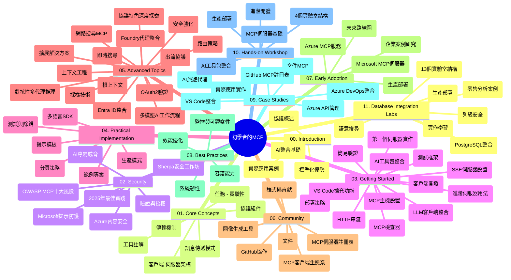

# Model Context Protocol (MCP) 新手指南 - 學習手冊

本學習手冊提供「Model Context Protocol (MCP) 新手指南」課程的倉儲結構與內容概覽。請使用本手冊有效導覽倉儲，充分利用可用資源。

## 倉儲總覽

Model Context Protocol (MCP) 是一套標準化框架，促進 AI 模型與客戶端應用間的互動。最初由 Anthropic 創建，現由更廣泛的 MCP 社群通過官方 GitHub 組織維護。本倉儲提供完善課程內容，搭配 C#、Java、JavaScript、Python、TypeScript 的實作範例，專為 AI 開發者、系統架構師與軟體工程師設計。

## 課程視覺地圖

## 倉儲結構

倉儲組織為十一大章節，分別聚焦 MCP 不同面向：

1. **介紹 (00-Introduction/)**
   - Model Context Protocol 概述
   - AI 管線中標準化重要性
   - 實務應用案例與效益

2. **核心概念 (01-CoreConcepts/)**
   - 客戶端-伺服器架構
   - 關鍵協定元件
   - MCP 中訊息傳遞模式

3. **安全性 (02-Security/)**
   - MCP 系統安全威脅
   - 實作安全最佳實踐
   - 認證與授權策略
   - <strong>全面安全文件</strong>：
     - MCP 2025 年安全最佳實踐
     - Azure 內容安全實作指南
     - MCP 安全控管與技術
     - MCP 最佳實踐快速參考
   - <strong>重要安全主題</strong>：
     - 提示注入及工具中毒攻擊
     - 會話綁架與代客代理問題
     - Token 穿透漏洞
     - 過度權限與存取控制
     - AI 元件供應鏈安全
     - 微軟提示盾整合

4. **快速上手 (03-GettingStarted/)**
   - 環境設置與配置
   - 建立基礎 MCP 伺服器與客戶端
   - 整合既有應用
   - 包含各單元：
     - 首次伺服器實作
     - 客戶端開發
     - LLM 客戶端整合
     - VS Code 擴充
     - 伺服器推送事件 (SSE) 伺服器
     - 進階伺服器用法
     - HTTP 串流
     - AI 工具包整合
     - 測試策略
     - 部署指南

5. **實務實作 (04-PracticalImplementation/)**
   - 跨語言 SDK 使用
   - 除錯、測試與驗證技巧
   - 製作可重複使用提示模板與工作流程
   - 範例專案與實作展示

6. **進階主題 (05-AdvancedTopics/)**
   - 上下文工程技術
   - Foundry 代理整合
   - 多模態 AI 工作流程
   - OAuth2 認證示範
   - 即時搜尋功能
   - 即時串流
   - Root Contexts 實作
   - 路由策略
   - 取樣技術
   - 擴展方法
   - 安全性考量
   - Entra ID 安全整合
   - 網路搜尋整合
   - 對抗型多代理推理（辯論模式）

7. **社群貢獻 (06-CommunityContributions/)**
   - 如何貢獻程式碼與文件
   - 透過 GitHub 協作
   - 社群驅動的增強與回饋
   - 使用多元 MCP 客戶端（Claude Desktop、Cline、VSCode）
   - 使用熱門 MCP 伺服器含影像生成功能

8. **早期採用經驗 (07-LessonsfromEarlyAdoption/)**
   - 真實實作與成功案例
   - 建構與部署 MCP 解決方案
   - 趨勢與未來路線圖
   - **微軟 MCP 伺服器指南**：詳細介紹 10 個量產就緒微軟 MCP 伺服器，包括：
     - Microsoft Learn Docs MCP 伺服器
     - Azure MCP 伺服器（超過 15 種專用連接器）
     - GitHub MCP 伺服器
     - Azure DevOps MCP 伺服器
     - MarkItDown MCP 伺服器
     - SQL Server MCP 伺服器
     - Playwright MCP 伺服器
     - Dev Box MCP 伺服器
     - Microsoft Foundry MCP 伺服器
     - Microsoft 365 Agents Toolkit MCP 伺服器

9. **最佳實踐 (08-BestPractices/)**
   - 效能調校與優化
   - 設計容錯 MCP 系統
   - 測試與韌性策略

10. **案例研究 (09-CaseStudy/)**
    - <strong>七個完整案例研究</strong> 示範 MCP 在多元場景的活用：
    - **Azure AI 旅遊代理**：Azure OpenAI 與 AI Search 的多代理協調
    - **Azure DevOps 整合**：使用 YouTube 數據自動化流程
    - <strong>即時文檔擷取</strong>：Python 控制台客戶端搭配 HTTP 串流
    - <strong>互動式學習計畫產生器</strong>：Chainlit 網頁應用結合對話式 AI
    - <strong>編輯器內文檔</strong>：VS Code 與 GitHub Copilot 工作流程整合
    - **Azure API 管理**：企業級 API 整合與 MCP 伺服器建立
    - **GitHub MCP Registry**：生態系發展與代理集成平台
    - 實作範例涵蓋企業整合、開發者生產力及生態系開發

11. **實務工作坊 (10-StreamliningAIWorkflowsBuildingAnMCPServerWithAIToolkit/)**
    - 綜合 MCP 與 AI 工具包的實務工作坊
    - 建構連結 AI 模型與現實工具的智能應用
    - 實務模組涵蓋基本概念、自訂伺服器開發、產線部署策略
    - <strong>實驗結構</strong>：
      - 實驗 1：MCP 伺服器基礎
      - 實驗 2：進階 MCP 伺服器開發
      - 實驗 3：AI 工具包整合
      - 實驗 4：產線部署與擴展
    - 實驗式學習，逐步指導方案

12. **MCP 伺服器資料庫整合實驗 (11-MCPServerHandsOnLabs/)**
    - **13 個實驗組成的完整學習路徑**，建置具生產力的 MCP 伺服器與 PostgreSQL 整合
    - <strong>真實零售分析實作</strong>，基於 Zava Retail 用例
    - <strong>企業級模式</strong> 包含 Row Level Security (RLS)、語意搜尋、多租戶資料存取
    - <strong>完整實驗結構</strong>：
      - **實驗 00-03：基礎** - 介紹、架構、安全性、環境設置
      - **實驗 04-06：伺服器建立** - 資料庫設計、MCP 伺服器實作、工具開發
      - **實驗 07-09：進階功能** - 語意搜尋、測試與除錯、VS Code 整合
      - **實驗 10-12：產線與最佳實踐** - 部署、監控、優化
    - <strong>涵蓋技術</strong>：FastMCP 框架、PostgreSQL、Azure OpenAI、Azure Container Apps、Application Insights
    - <strong>學習成果</strong>：量產級 MCP 伺服器、資料庫整合模式、AI 驅動分析、企業安全

## 附加資源

倉儲包含輔助資源：

- **Images 目錄**：課程使用的圖表與插圖
- <strong>翻譯</strong>：文件多語言支援及自動翻譯
- **官方 MCP 資源**：
  - [MCP 文件](https://modelcontextprotocol.io/)
  - [MCP 規範](https://spec.modelcontextprotocol.io/)
  - [MCP GitHub 倉儲](https://github.com/modelcontextprotocol)

## 如何使用本倉儲

1. <strong>循序學習</strong>：依章節順序（00 至 11）逐步學習。
2. <strong>語言專注</strong>：針對特定程式語言，探索對應的範例目錄。
3. <strong>實務起步</strong>：先從「快速上手」章節設置環境與建置第一個 MCP 伺服器與客戶端。
4. <strong>進階探索</strong>：熟悉基礎後，深入進階主題擴展知識。
5. <strong>社群互動</strong>：加入 MCP 社群，透過 GitHub 討論與 Discord 頻道交流專家與其他開發者。

## MCP 客戶端與工具

課程涵蓋多款 MCP 客戶端與工具：

1. <strong>官方客戶端</strong>：
   - Visual Studio Code
   - Visual Studio Code 的 MCP
   - Claude Desktop
   - VSCode 內的 Claude
   - Claude API

2. <strong>社群客戶端</strong>：
   - Cline（終端機）
   - Cursor（程式碼編輯器）
   - ChatMCP
   - Windsurf

3. **MCP 管理工具**：
   - MCP CLI
   - MCP Manager
   - MCP Linker
   - MCP Router

## 熱門 MCP 伺服器

倉儲介紹多款 MCP 伺服器，包括：

1. **官方微軟 MCP 伺服器**：
   - Microsoft Learn Docs MCP 伺服器
   - Azure MCP 伺服器（15+ 專用連接器）
   - GitHub MCP 伺服器
   - Azure DevOps MCP 伺服器
   - MarkItDown MCP 伺服器
   - SQL Server MCP 伺服器
   - Playwright MCP 伺服器
   - Dev Box MCP 伺服器
   - Microsoft Foundry MCP 伺服器
   - Microsoft 365 Agents Toolkit MCP 伺服器

2. <strong>官方參考伺服器</strong>：
   - 檔案系統
   - Fetch
   - 記憶體
   - 序列化思考

3. <strong>影像生成</strong>：
   - Azure OpenAI DALL-E 3
   - Stable Diffusion WebUI
   - Replicate

4. <strong>開發工具</strong>：
   - Git MCP
   - 終端控制
   - 程式碼助理

5. <strong>專用伺服器</strong>：
   - Salesforce
   - Microsoft Teams
   - Jira 與 Confluence

## 貢獻

本倉儲歡迎社群貢獻。請參閱社群貢獻章節，瞭解如何有效參與 MCP 生態系。

----

*本學習手冊最後更新於 2026 年 2 月 5 日，依據最新 MCP 規範 2025-11-25，並反映當時倉儲內容。倉儲內容可能於該日期後更新。*

---

<!-- CO-OP TRANSLATOR DISCLAIMER START -->
**免責聲明**：
此文件已使用 AI 翻譯服務 [Co-op Translator](https://github.com/Azure/co-op-translator) 進行翻譯。雖然我們努力追求準確性，但請注意自動翻譯可能包含錯誤或不準確之處。原始文件的母語版本應視為權威來源。對於關鍵資訊，建議採用專業人工翻譯。我們不對因使用此翻譯所產生的任何誤解或誤譯承擔責任。
<!-- CO-OP TRANSLATOR DISCLAIMER END -->