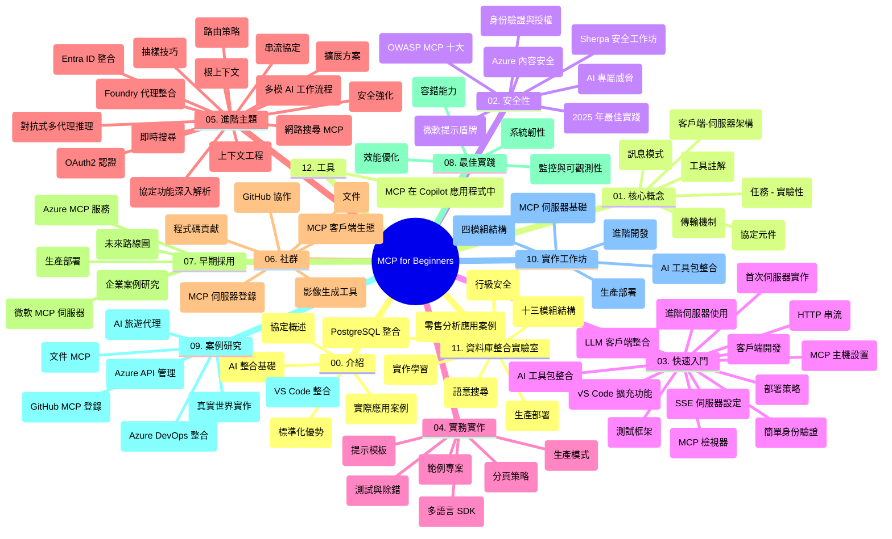

# Model Context Protocol (MCP) 初學者指南 - 學習手冊

本學習手冊提供「Model Context Protocol (MCP) 初學者指南」課程的存放庫結構與內容概述。請使用此手冊來有效地瀏覽存放庫，並充分利用可用資源。

## 存放庫概覽

Model Context Protocol (MCP) 是 AI 模型與用戶端應用程式互動的標準化框架。最初由 Anthropic 創建，現由更廣泛的 MCP 社群通過官方 GitHub 組織維護。此存放庫提供全面性的課程，附有 C#、Java、JavaScript、Python 和 TypeScript 的實作程式碼範例，專為 AI 開發者、系統架構師與軟體工程師設計。

## 視覺化課程地圖

## 存放庫結構

存放庫分為十二個主要章節，各聚焦 MCP 的不同面向：

1. **簡介 (00-Introduction/)**
   - Model Context Protocol 概述
   - AI 管線中標準化的重要性
   - 實際應用案例與效益

2. **核心概念 (01-CoreConcepts/)**
   - 客戶端-伺服器架構
   - 主要協定元件
   - MCP 中的訊息通信模式

3. **安全性 (02-Security/)**
   - MCP 系統中的安全威脅
   - 安全實作最佳實踐
   - 身份驗證與授權策略
   - <strong>全面安全文件</strong>：
     - MCP 2025 安全最佳實踐
     - Azure 內容安全實作指南
     - MCP 安全控制與技術
     - MCP 最佳實踐快速參考
   - <strong>關鍵安全主題</strong>：
     - Prompt 注入與工具中毒攻擊
     - 會話劫持與代理混淆問題
     - Token 轉發漏洞
     - 過度權限與存取控制
     - AI 零組件供應鏈安全
     - Microsoft Prompt Shields 整合

4. **入門 (03-GettingStarted/)**
   - 環境設定與配置
   - 建立基本 MCP 伺服器與客戶端
   - 與現有應用整合
   - 包含章節：
     - 首個伺服器實作
     - 客戶端開發
     - LLM 客戶端整合
     - VS Code 整合
     - Server-Sent Events (SSE) 伺服器
     - 進階伺服器使用
     - HTTP 串流
     - AI 工具包整合
     - 測試策略
     - 部署指導

5. **實作演練 (04-PracticalImplementation/)**
   - 跨語言 SDK 使用
   - 除錯、測試與驗證技巧
   - 製作可重用的 Prompt 範本與工作流程
   - 範例專案與實作示範

6. **進階主題 (05-AdvancedTopics/)**
   - 上下文工程技術
   - Foundry 智能代理整合
   - 多模態 AI 工作流程
   - OAuth2 驗證範例
   - 即時搜尋功能
   - 即時串流
   - Root Contexts 實作
   - 路由策略
   - 取樣技術
   - 擴充方法
   - 安全考量
   - Entra ID 安全整合
   - 網路搜尋整合
   - 對抗式多代理推理（辯論模式）

7. **社群貢獻 (06-CommunityContributions/)**
   - 如何貢獻程式碼與文件
   - 透過 GitHub 合作
   - 社群主導的強化與回饋
   - 使用多種 MCP 客戶端（Claude Desktop、Cline、VSCode）
   - 支援多個流行 MCP 伺服器，包括圖像生成

8. **早期採用經驗 (07-LessonsfromEarlyAdoption/)**
   - 實務案例與成功故事
   - 基於 MCP 的解決方案建構與部署
   - 趨勢與未來路線圖
   - **Microsoft MCP 伺服器指南**：涵蓋 10 款生產就緒 Microsoft MCP 伺服器，包括：
     - Microsoft Learn Docs MCP 伺服器
     - Azure MCP 伺服器（含 15+ 專用連接器）
     - GitHub MCP 伺服器
     - Azure DevOps MCP 伺服器
     - MarkItDown MCP 伺服器
     - SQL Server MCP 伺服器
     - Playwright MCP 伺服器
     - Dev Box MCP 伺服器
     - Microsoft Foundry MCP 伺服器
     - Microsoft 365 Agents Toolkit MCP 伺服器

9. **最佳實務 (08-BestPractices/)**
   - 效能調校與優化
   - 設計容錯 MCP 系統
   - 測試與韌性策略

10. **案例研究 (09-CaseStudy/)**
    - <strong>七個全面案例研究</strong> 展示 MCP 在多元場景的應用：
    - **Azure AI 旅遊代理**：多代理協同 Azure OpenAI 與 AI 搜尋
    - **Azure DevOps 整合**：使用 YouTube 數據自動化工作流程
    - <strong>即時文件檢索</strong>：Python 控制台客戶端搭配 HTTP 串流
    - <strong>互動式學習計劃產生器</strong>：Chainlit Web App 與對話式 AI
    - <strong>編輯器內文件</strong>：VS Code 與 GitHub Copilot 工作流程整合
    - **Azure API 管理**：企業 API 整合與 MCP 伺服器建置
    - **GitHub MCP 註冊中心**：生態系發展與代理式整合平台
    - 實作範例涵蓋企業整合、開發者生產力及生態系發展

11. **實務工作坊 (10-StreamliningAIWorkflowsBuildingAnMCPServerWithAIToolkit/)**
    - 結合 MCP 與 AI 工具包的完整實務工作坊
    - 建構智能應用，連結 AI 模型與真實工具
    - 實務模塊涵蓋基礎、客製伺服器開發與生產部署策略
    - <strong>實驗室結構</strong>：
      - Lab 1：MCP 伺服器基礎
      - Lab 2：進階 MCP 伺服器開發
      - Lab 3：AI 工具包整合
      - Lab 4：生產部署與擴展
    - 以實驗室方式逐步引導學習

12. **MCP 伺服器資料庫整合實驗室 (11-MCPServerHandsOnLabs/)**
    - **完整的 13 個實驗室學習路徑**，打造具 PostgreSQL 整合的生產就緒 MCP 伺服器
    - <strong>真實零售分析案例</strong>：Zava 零售使用情境實作
    - <strong>企業級模式</strong>：含列級安全（RLS）、語義搜尋、多租戶存取
    - <strong>完整實驗室架構</strong>：
      - **Lab 00-03：基礎** - 介紹、架構、安全、環境設定
      - **Lab 04-06：建置 MCP 伺服器** - 資料庫設計、MCP 伺服器實作、工具開發
      - **Lab 07-09：進階功能** - 語義搜尋、測試與除錯、VS Code 整合
      - **Lab 10-12：生產與最佳實務** - 部署、監控、優化
    - <strong>涵蓋技術</strong>：FastMCP 框架、PostgreSQL、Azure OpenAI、Azure Container Apps、Application Insights
    - <strong>學習成果</strong>：生產就緒 MCP 伺服器、資料庫整合模式、AI 驅動分析、企業安全

13. **工具 (12-tooling/)**
    - 學習在 Copilot 應用與其他工具中使用 MCP

## 附加資源

本存放庫包含支援資源：

- **Images 資料夾**：包含課程中使用的圖表與示意圖
- <strong>多語言翻譯</strong>：文件自動翻譯與多語支持
- **官方 MCP 資源**：
  - [MCP 文件](https://modelcontextprotocol.io/)
  - [MCP 規範](https://spec.modelcontextprotocol.io/)
  - [MCP GitHub 存放庫](https://github.com/modelcontextprotocol)

## 如何使用此存放庫

1. <strong>依序學習</strong>：依循章節順序（00 至 11）進行結構化學習。
2. <strong>語言專注</strong>：若關注特定程式語言，瀏覽相關語言的範例目錄。
3. <strong>實作入門</strong>：從「入門」章節開始，設定環境並建置首個 MCP 伺服器與客戶端。
4. <strong>進階探索</strong>：熟悉基礎後，深入進階主題以擴充知識。
5. <strong>社群參與</strong>：加入 GitHub 討論與 Discord 頻道，連結專家及開發者社群。

## MCP 客戶端與工具

課程涵蓋多種 MCP 客戶端與工具：

1. <strong>官方客戶端</strong>：
   - Visual Studio Code
   - Visual Studio Code 中的 MCP
   - Claude Desktop
   - VSCode 中的 Claude
   - Claude API

2. <strong>社群客戶端</strong>：
   - Cline（終端機介面）
   - Cursor（程式碼編輯器）
   - ChatMCP
   - Windsurf

3. **MCP 管理工具**：
   - MCP CLI
   - MCP Manager
   - MCP Linker
   - MCP Router

## 熱門 MCP 伺服器

介紹各式 MCP 伺服器，包括：

1. **官方 Microsoft MCP 伺服器**：
   - Microsoft Learn Docs MCP 伺服器
   - Azure MCP 伺服器（含 15+ 專用連接器）
   - GitHub MCP 伺服器
   - Azure DevOps MCP 伺服器
   - MarkItDown MCP 伺服器
   - SQL Server MCP 伺服器
   - Playwright MCP 伺服器
   - Dev Box MCP 伺服器
   - Microsoft Foundry MCP 伺服器
   - Microsoft 365 Agents Toolkit MCP 伺服器

2. <strong>官方參考伺服器</strong>：
   - Filesystem
   - Fetch
   - Memory
   - Sequential Thinking

3. <strong>圖像生成</strong>：
   - Azure OpenAI DALL-E 3
   - Stable Diffusion WebUI
   - Replicate

4. <strong>開發工具</strong>：
   - Git MCP
   - 終端機控制
   - 程式碼助理

5. <strong>專用伺服器</strong>：
   - Salesforce
   - Microsoft Teams
   - Jira 與 Confluence

## 貢獻

本存放庫歡迎社群貢獻。請參見社群貢獻章節，了解如何有效參與 MCP 生態系統的建構。

----

*此學習手冊最後更新於 2026 年 2 月 5 日，反映 MCP 規範 2025-11-25 的最新狀態，並提供當時的存放庫概覽。存放庫內容可能於該日期之後更新。*

---

<!-- CO-OP TRANSLATOR DISCLAIMER START -->
**免責聲明**：
此文件已使用 AI 翻譯服務 [Co-op Translator](https://github.com/Azure/co-op-translator) 進行翻譯。雖然我們努力追求準確性，但請注意自動翻譯可能包含錯誤或不準確之處。原始文件的母語版本應視為權威來源。對於關鍵資訊，建議採用專業人工翻譯。我們不對因使用此翻譯所產生的任何誤解或誤譯承擔責任。
<!-- CO-OP TRANSLATOR DISCLAIMER END -->